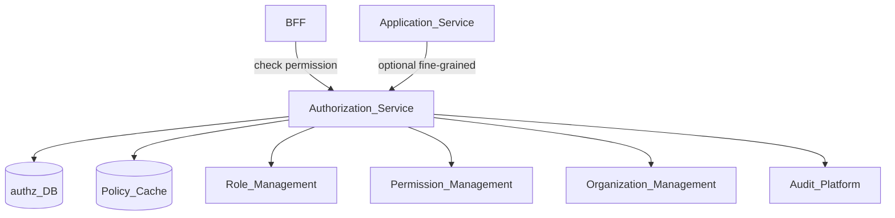
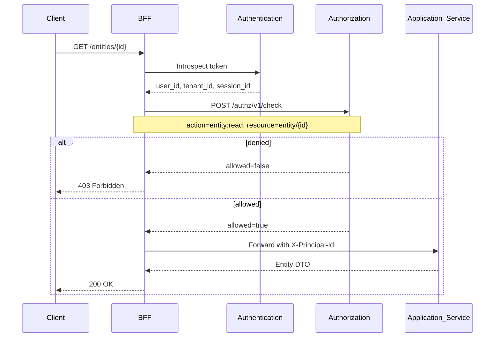
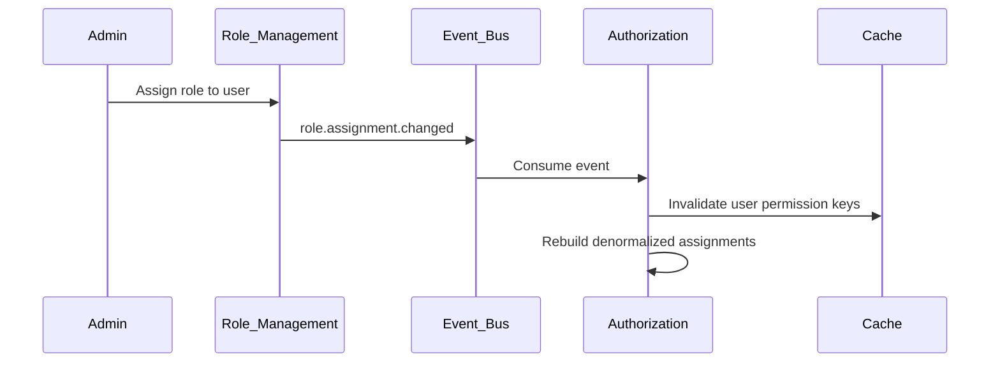

# Authorization

> **Volume:** 2 | **Chapter ID:** v2-03 | **Status:** reviewed

## Purpose

The **Authorization** platform service answers a single question for every request: *may this principal perform this action on this resource?* It centralizes permission evaluation so applications never hard-code role checks or duplicate policy logic. The **BFF** calls Authorization after Authentication validates the token; application services receive a pre-authorized context or a denial.

## Architecture



Authorization evaluates policies. It does not assign roles (see [Role Management](05-role-management.md)) or define permission catalogs (see [Permission Management](06-permission-management.md)).

## Responsibilities

### In Scope

- Permission evaluation: `subject + action + resource` → allow/deny
- Role-to-permission resolution with inheritance
- Organization-scoped and tenant-scoped access boundaries
- Resource-level policies (owner, team, organization hierarchy)
- Batch permission checks for BFF aggregation endpoints
- Policy caching with invalidation on role or permission change
- Audit logging of denied and sensitive allowed operations
- Service principal authorization for machine clients

### Out of Scope

- Identity verification and token issuance ([Authentication](02-authentication.md))
- Role and permission CRUD administration (dedicated management services)
- UI menu visibility logic (BFF composes from permission list)
- Business rule evaluation ([Rule Engine](20-rule-engine.md))

## API Design

### Base Path

`/authz/v1`

Internal service-to-service APIs. The BFF is the primary caller; browser clients never call Authorization directly.

### Core Endpoints

| Method | Path | Description |
|--------|------|-------------|
| POST | /check | Single permission evaluation |
| POST | /check/batch | Evaluate multiple permissions in one call |
| GET | /permissions/me | List effective permissions for current principal |
| GET | /permissions/me/resources/{resourceType} | Permissions scoped to resource type |
| POST | /policies | Create resource-level policy (admin) |
| GET | /policies/{id} | Get policy definition |
| PUT | /policies/{id} | Update policy |
| DELETE | /policies/{id} | Remove policy |
| POST | /simulate | Dry-run policy change impact (admin) |

### Check Request

```json
{
  "tenantId": "tenant-uuid",
  "subjectId": "user-uuid",
  "subjectType": "user",
  "action": "entity:update",
  "resource": {
    "type": "entity",
    "id": "entity-uuid",
    "organizationId": "org-uuid",
    "ownerId": "user-uuid"
  },
  "context": {
    "ipAddress": "203.0.113.1",
    "clientId": "web-app"
  }
}
```

### Check Response

```json
{
  "allowed": true,
  "reason": "role:editor",
  "matchedPolicyId": "policy-uuid",
  "obligations": []
}
```

Denials return `allowed: false` with `reason` codes such as `no_matching_permission`, `organization_boundary`, or `resource_policy_deny`. Never leak existence of resources the caller cannot see.

### Permission Naming Convention

Use `resource:action` format aligned with [Permission Management](06-permission-management.md):

```text
entity:read
entity:create
entity:update
entity:delete
report:export
admin:users:manage
```

Follow [API Standards](../Volume-1-Foundation/18-api-standards.md).

## Database Design

| Table | Key Columns | Purpose |
|-------|-------------|---------|
| `authz_policies` | `policy_id`, `tenant_id`, `resource_type`, `effect`, `conditions_json` | Resource and attribute-based rules |
| `authz_policy_bindings` | `policy_id`, `subject_id`, `subject_type` | Attach policy to role, user, or group |
| `authz_role_assignments` | `user_id`, `role_id`, `organization_id`, `scope` | Effective role grants (synced from Role Management) |
| `authz_permission_cache` | `cache_key`, `result_json`, `expires_at` | Evaluated permission cache entries |
| `authz_denial_log` | `subject_id`, `action`, `resource_id`, `reason`, `created_at` | Security monitoring for denied access |
| `authz_audit_log` | `event_type`, `actor_id`, `metadata_json`, `created_at` | Policy change audit trail |

Role and permission master data lives in Role Management and Permission Management. Authorization maintains denormalized read models updated via events for fast evaluation.

## Folder Structure

```text
services/authorization/
├── api/              # REST controllers
├── domain/
│   ├── evaluator/    # Policy evaluation engine
│   ├── resolver/     # Role → permission resolution
│   └── scope/        # Tenant and organization boundaries
├── persistence/
├── sync/             # Event handlers from Role/Permission Management
├── mappers/
├── events/           # authz.denied, authz.policy.changed
└── tests/
```

## Sequence Diagrams

### BFF Request Authorization



### Permission Cache Invalidation



## Extension Points

- **Attribute providers** — resolve dynamic attributes (department, cost center) for ABAC conditions
- **Custom policy effects** — `obligation` hooks (e.g., require MFA step-up for sensitive actions)
- **Organization hierarchy resolver** — plug in tree depth and inheritance rules per tenant
- **Deny overrides** — explicit deny policies take precedence over allow (configurable)

## Integration

- **Depends on:** Role Management, Permission Management, Organization Management, Authentication (subject context), Audit Platform
- **Events published:** `authz.denied`, `authz.policy.created`, `authz.policy.updated`
- **Events consumed:** `role.assignment.changed`, `permission.catalog.updated`, `organization.restructured`, `user.deactivated`
- **Consumers:** BFF (primary), Application services (fine-grained resource checks), Audit Platform

## Best Practices

1. Default deny — no implicit permissions without explicit grant
2. BFF checks permissions before calling backend; services re-check for defense in depth on sensitive operations
3. Use batch `/check/batch` when UI screens need many permission flags
4. Cache evaluation results with short TTL; invalidate on role change events
5. Log denials at WARN level with correlation ID; never log full policy internals to clients
6. Keep permission names stable; version breaking permission renames with migration scripts

## Anti-Patterns

| Anti-Pattern | Why It Fails | Preferred Approach |
|--------------|--------------|-------------------|
| `if (user.role === "admin")` in app code | Bypassed paths, inconsistent enforcement | Authorization `/check` API |
| Storing permissions only in JWT | Cannot revoke until token expires | Per-request evaluation with cache |
| Duplicating role logic in BFF and services | Drift between layers | Shared permission catalog + Authz service |
| Exposing full policy engine to applications | Tight coupling, security risk | Simple check API with opaque policies |
| Skipping org scope on multi-tenant data | Cross-tenant or cross-branch leakage | Always pass `organizationId` in resource |

## Related Chapters

- [Previous: Authentication](02-authentication.md)
- [Next: User Management](04-user-management.md)
- [Role Management](05-role-management.md)
- [Permission Management](06-permission-management.md)
- [EPB Glossary](../docs/GLOSSARY.md)

---

*Enterprise Platform Blueprint — Volume 2*
