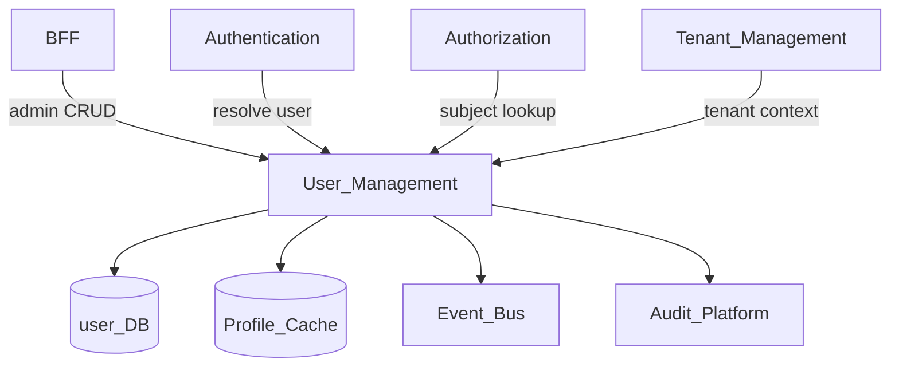
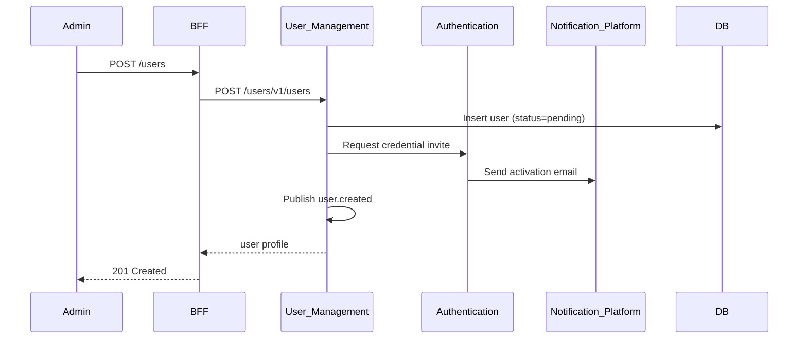
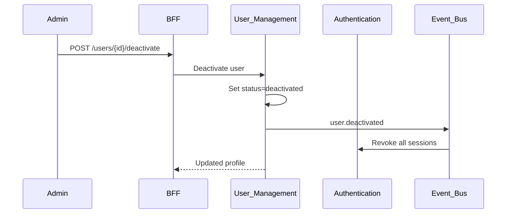

# User Management

> **Volume:** 2 | **Chapter ID:** v2-04 | **Status:** reviewed

## Purpose

The **User Management** platform service owns the canonical user profile and lifecycle for every human principal on EPB. It stores identity attributes, contact details, preferences, and account status — but never credentials (see [Authentication](02-authentication.md)). Applications reference `user_id` from this service; they do not maintain parallel user tables.

## Architecture



Each platform service owns its data store. No other service accesses the user database directly.

## Responsibilities

### In Scope

- User profile CRUD: display name, email, phone, locale, timezone, avatar reference
- Account lifecycle: `pending`, `active`, `suspended`, `deactivated`, `deleted`
- Username and email uniqueness within tenant scope
- User search, filtering, and pagination for admin UIs
- External identity linking (OIDC subject, SAML name ID) as metadata only
- User preference storage (notification channels, UI defaults)
- Bulk import/export hooks for tenant onboarding
- Publishing user lifecycle events for downstream sync

### Out of Scope

- Password hashes, sessions, MFA devices ([Authentication](02-authentication.md))
- Role assignment ([Role Management](05-role-management.md))
- Permission evaluation ([Authorization](03-authorization.md))
- Organization membership graph ([Organization Management](08-organization-management.md))
- Login UI and self-registration flows (frontend/BFF)

## API Design

### Base Path

`/users/v1`

Admin endpoints require elevated permissions. Self-service endpoints operate on the authenticated principal only.

### Core Endpoints

| Method | Path | Description |
|--------|------|-------------|
| GET | /users | List users with filters (`status`, `email`, `organizationId`) |
| GET | /users/{userId} | Get user profile |
| POST | /users | Create user (provisions profile; Auth creates credentials separately) |
| PUT | /users/{userId} | Full profile update |
| PATCH | /users/{userId} | Partial update (e.g., locale, phone) |
| POST | /users/{userId}/deactivate | Set status to deactivated |
| POST | /users/{userId}/reactivate | Restore active status |
| DELETE | /users/{userId} | Soft delete after retention window |
| GET | /users/me | Current user profile (BFF-forwarded identity) |
| PATCH | /users/me/preferences | Update own preferences |
| GET | /users/{userId}/external-identities | List linked IdP identities |
| POST | /users/resolve | Resolve user by email or username (internal) |

### Create User Request

```json
{
  "tenantId": "tenant-uuid",
  "email": "user@example.com",
  "displayName": "Alex Rivera",
  "locale": "en-US",
  "timezone": "America/Chicago",
  "sendInvite": true
}
```

Follow [API Standards](../Volume-1-Foundation/18-api-standards.md) and [Error Handling](../Volume-1-Foundation/19-error-handling.md).

## Database Design

All tables include `tenant_id`. Email uniqueness enforced per tenant via composite unique index.

| Table | Key Columns | Purpose |
|-------|-------------|---------|
| `users` | `user_id`, `email`, `display_name`, `status`, `locale`, `timezone` | Primary profile |
| `user_preferences` | `user_id`, `preference_key`, `preference_value` | Key-value preferences |
| `user_external_identities` | `user_id`, `provider`, `external_subject`, `linked_at` | IdP linkage metadata |
| `user_contact_methods` | `user_id`, `type`, `value`, `verified`, `primary` | Phone, alternate email |
| `user_audit` | `user_id`, `action`, `actor_id`, `changes_json`, `created_at` | Profile change history |

Indexes: `(tenant_id, email)` unique; `(tenant_id, status)` for admin lists; `(tenant_id, display_name)` for search.

## Folder Structure

```text
services/user-management/
├── api/              # REST controllers
├── domain/
│   ├── lifecycle/    # Status transitions, validation rules
│   ├── profiles/     # Profile assembly and updates
│   └── search/       # Filter and pagination logic
├── persistence/      # Entities, repositories
├── mappers/          # DTO ↔ domain ↔ entity
├── events/           # user.created, user.deactivated publishers
└── tests/
```

## Sequence Diagrams

### User Provisioning



### Account Deactivation



## Extension Points

- **Custom profile fields** — tenant-defined attributes via [Metadata Engine](68-metadata-engine.md)
- **Provisioning adapters** — SCIM or HR-system sync via [Integration Framework](31-integration-framework.md)
- **Invite templates** — tenant-level email content via [Template Engine](16-template-engine.md)

## Integration

- **Depends on:** Tenant Management, Configuration Service, Audit Platform
- **Events published:** `user.created`, `user.updated`, `user.deactivated`, `user.deleted`
- **Events consumed:** `tenant.provisioned` (seed admin user), `auth.password.changed` (update `last_password_change_at`)
- **Consumers:** Authentication, Authorization, Organization Management, Notification Platform

## Best Practices

1. Create user profile before credentials — Authentication references `user_id`
2. Soft delete only; hard purge via governed retention job
3. Never expose deactivated users in public directory search
4. Cache read-heavy profile lookups; invalidate on `user.updated`
5. Use correlation IDs across provisioning and invite flows

## Anti-Patterns

| Anti-Pattern | Why It Fails | Preferred Approach |
|--------------|--------------|-------------------|
| Storing passwords in user tables | Violates separation of concerns; audit risk | Authentication service only |
| Per-application user tables | Identity drift, sync nightmares | Single User Management source |
| Embedding roles in user records | Couples identity to authorization | Role Management assignments |
| Hard delete on deactivation | Breaks audit trails and foreign keys | Soft delete with retention policy |
| Global email uniqueness | Blocks legitimate multi-tenant use | Uniqueness scoped to `tenant_id` |

## Related Chapters

- [Previous: Authorization](03-authorization.md)
- [Next: Role Management](05-role-management.md)
- [Authentication](02-authentication.md)
- [Organization Management](08-organization-management.md)
- [EPB Glossary](../docs/GLOSSARY.md)

---

*Enterprise Platform Blueprint — Volume 2*
