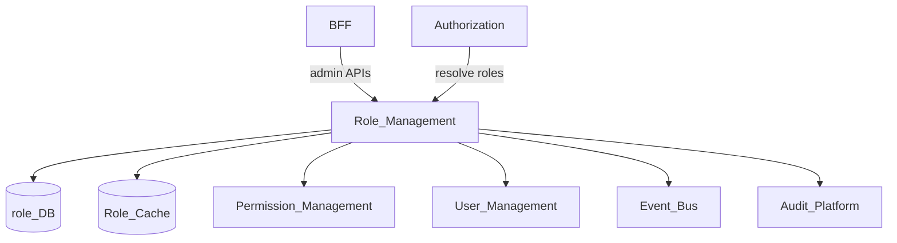
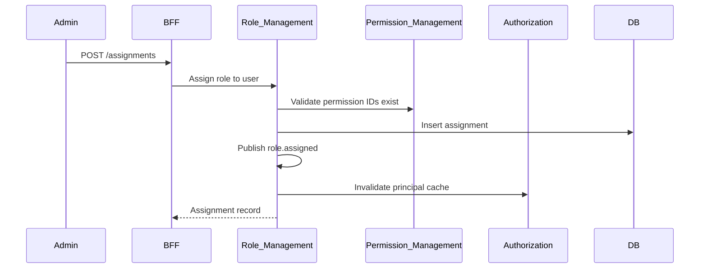
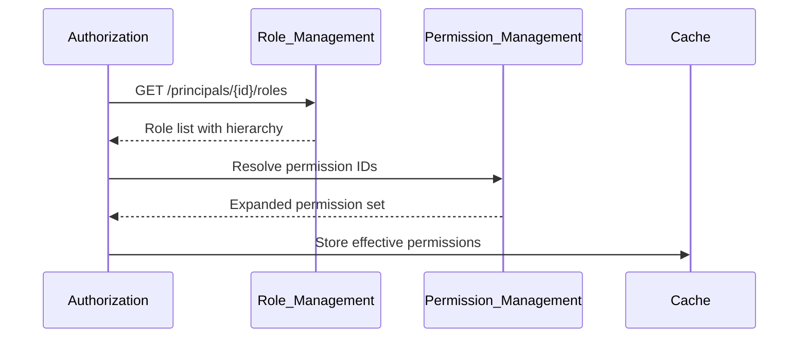

# Role Management

> **Volume:** 2 | **Chapter ID:** v2-05 | **Status:** reviewed

## Purpose

The **Role Management** platform service defines named role collections and assigns them to principals. Roles group permissions for administration convenience — they are not evaluated directly at runtime (see [Authorization](03-authorization.md)). Every tenant gets a baseline role catalog; applications extend it with domain-specific roles without duplicating assignment logic.

## Architecture



Role definitions and assignments live here. Permission catalogs live in [Permission Management](06-permission-management.md).

## Responsibilities

### In Scope

- Role CRUD: name, description, type (`system`, `tenant`, `application`)
- Role hierarchy: parent inherits child permissions (configurable depth limit)
- Role-to-permission mapping (references permission IDs from Permission Management)
- Principal-to-role assignment: users, service principals, groups
- Scoped assignments: tenant-wide, organization-scoped, resource-scoped
- System roles seeded at tenant provisioning (e.g., `tenant-admin`, `viewer`)
- Assignment effective dates and temporary grants
- Cache invalidation signals on role or assignment change

### Out of Scope

- Permission definition and registration ([Permission Management](06-permission-management.md))
- Runtime allow/deny evaluation ([Authorization](03-authorization.md))
- User profile data ([User Management](04-user-management.md))
- Business rule logic ([Rule Engine](20-rule-engine.md))

## API Design

### Base Path

`/roles/v1`

### Role Administration

| Method | Path | Description |
|--------|------|-------------|
| GET | /roles | List roles with filters (`type`, `applicationId`) |
| GET | /roles/{roleId} | Get role with permission IDs |
| POST | /roles | Create custom role |
| PUT | /roles/{roleId} | Update role metadata |
| DELETE | /roles/{roleId} | Delete non-system role (blocked if assigned) |
| PUT | /roles/{roleId}/permissions | Replace permission set |
| POST | /roles/{roleId}/permissions | Add permissions |
| DELETE | /roles/{roleId}/permissions/{permissionId} | Remove permission |

### Assignment Endpoints

| Method | Path | Description |
|--------|------|-------------|
| GET | /assignments | List assignments with filters |
| POST | /assignments | Assign role to principal |
| DELETE | /assignments/{assignmentId} | Revoke assignment |
| GET | /principals/{principalId}/roles | Effective roles for principal |
| GET | /roles/{roleId}/members | Principals holding this role |

### Assign Role Request

```json
{
  "tenantId": "tenant-uuid",
  "roleId": "role-uuid",
  "principalId": "user-uuid",
  "principalType": "user",
  "scope": {
    "type": "organization",
    "organizationId": "org-uuid"
  },
  "effectiveFrom": "2026-01-01T00:00:00Z",
  "effectiveUntil": null
}
```

Follow [API Standards](../Volume-1-Foundation/18-api-standards.md).

## Database Design

| Table | Key Columns | Purpose |
|-------|-------------|---------|
| `roles` | `role_id`, `tenant_id`, `name`, `type`, `parent_role_id`, `application_id` | Role definitions |
| `role_permissions` | `role_id`, `permission_id` | Many-to-many mapping |
| `role_assignments` | `assignment_id`, `role_id`, `principal_id`, `principal_type`, `scope_json` | Active grants |
| `role_assignment_history` | `assignment_id`, `action`, `actor_id`, `created_at` | Immutable assignment audit |
| `system_role_templates` | `template_key`, `permission_ids_json` | Platform seed catalog |

Indexes: `(tenant_id, name)` unique for custom roles; `(principal_id, tenant_id)` on assignments; partial index on `effective_until IS NULL` for active grants.

## Folder Structure

```text
services/role-management/
├── api/
├── domain/
│   ├── roles/           # CRUD, hierarchy validation
│   ├── assignments/       # Grant and revoke logic
│   └── inheritance/     # Permission expansion for cache warm
├── persistence/
├── mappers/
├── events/              # role.assigned, role.revoked
└── tests/
```

## Sequence Diagrams

### Role Assignment



### Effective Permission Resolution (cache warm)



## Extension Points

- **Application role packs** — register default roles via service manifest at deploy time
- **Dynamic membership** — group-to-role rules via Organization Management events
- **Approval workflow** — sensitive role grants routed through [Workflow Engine](19-workflow-engine.md)

## Integration

- **Depends on:** Permission Management, User Management, Tenant Management, Audit Platform
- **Events published:** `role.created`, `role.updated`, `role.deleted`, `role.assigned`, `role.revoked`
- **Events consumed:** `tenant.provisioned` (seed system roles), `user.deactivated` (revoke assignments)
- **Consumers:** Authorization (cache invalidation), Audit Platform

## Best Practices

1. Keep roles coarse-grained; use permissions for fine control
2. Limit hierarchy depth (platform default: 3 levels) to prevent resolution loops
3. Block deletion of roles with active assignments
4. Use organization scope for delegated admin instead of duplicate tenant roles
5. Version role changes — assignment history is immutable

## Anti-Patterns

| Anti-Pattern | Why It Fails | Preferred Approach |
|--------------|--------------|-------------------|
| Hard-coded role names in application code | Breaks tenant customization | Permission checks via Authorization |
| One role per user | Unmanageable at scale | Multiple scoped assignments |
| Storing permissions inside role JSON blobs | No catalog governance | Permission Management IDs |
| Embedding roles in JWT | Stale until token expiry | Per-request Authorization check |
| Duplicating role tables per service | Drift and audit gaps | Central Role Management |

## Related Chapters

- [Previous: User Management](04-user-management.md)
- [Next: Permission Management](06-permission-management.md)
- [Authorization](03-authorization.md)
- [Organization Management](08-organization-management.md)
- [EPB Glossary](../docs/GLOSSARY.md)

---

*Enterprise Platform Blueprint — Volume 2*
