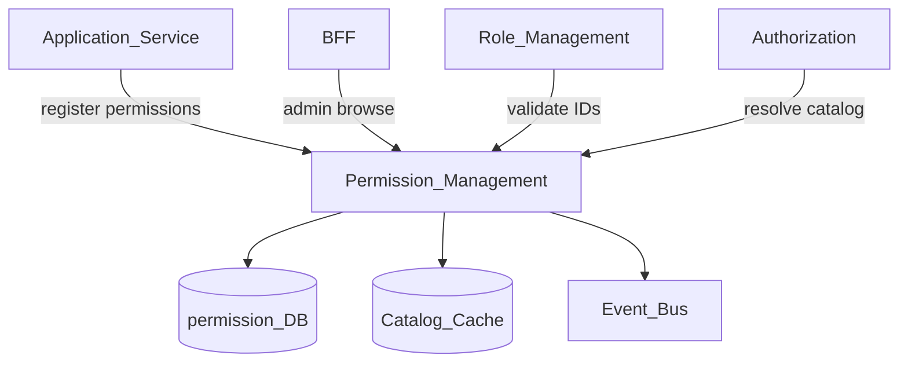
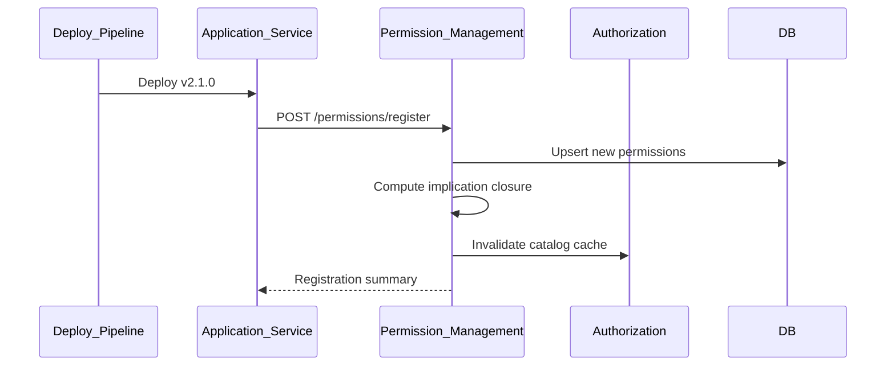
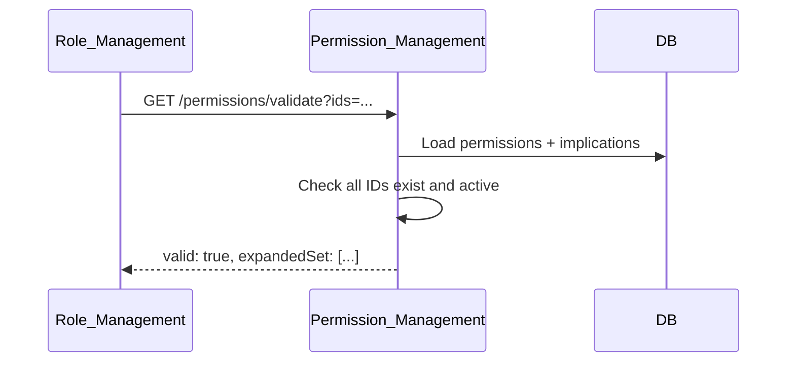

# Permission Management

> **Volume:** 2 | **Chapter ID:** v2-06 | **Status:** reviewed

## Purpose

The **Permission Management** platform service maintains the canonical catalog of actions principals may perform on resources. Every application service registers its permission vocabulary at deploy time; roles reference permission IDs rather than inventing ad hoc strings. Authorization evaluates grants — this service defines what can be granted.

## Architecture



Permissions are immutable once published to production tenants. Deprecation marks permissions inactive; removal requires migration.

## Responsibilities

### In Scope

- Permission registration from application manifests
- Hierarchical permission namespaces: `{resourceType}:{action}` (e.g., `entity:read`)
- Permission metadata: description, risk level, category, owning service
- Platform-wide and application-scoped permission partitions
- Permission dependency declarations (e.g., `entity:update` requires `entity:read`)
- Catalog versioning and deprecation lifecycle
- Export of effective permission tree for admin UIs
- Validation that role permission sets are internally consistent

### Out of Scope

- Runtime allow/deny decisions ([Authorization](03-authorization.md))
- Role and assignment administration ([Role Management](05-role-management.md))
- API route protection logic (BFF maps routes to permission checks)
- Business rule conditions ([Rule Engine](20-rule-engine.md))

## API Design

### Base Path

`/permissions/v1`

### Catalog Endpoints

| Method | Path | Description |
|--------|------|-------------|
| GET | /permissions | List permissions with filters (`service`, `category`, `status`) |
| GET | /permissions/{permissionId} | Get permission detail |
| POST | /permissions/register | Register batch from service manifest (internal) |
| POST | /permissions/{permissionId}/deprecate | Mark deprecated with replacement ID |
| GET | /permissions/tree | Hierarchical catalog for UI pickers |
| GET | /permissions/validate | Validate permission ID set (internal) |

### Registration Manifest

```json
{
  "serviceName": "resource-service",
  "serviceVersion": "2.1.0",
  "permissions": [
    {
      "key": "entity:read",
      "displayName": "View entities",
      "category": "entity",
      "riskLevel": "low",
      "implies": []
    },
    {
      "key": "entity:update",
      "displayName": "Edit entities",
      "category": "entity",
      "riskLevel": "medium",
      "implies": ["entity:read"]
    }
  ]
}
```

Follow [API Standards](../Volume-1-Foundation/18-api-standards.md).

## Database Design

| Table | Key Columns | Purpose |
|-------|-------------|---------|
| `permissions` | `permission_id`, `key`, `service_name`, `category`, `risk_level`, `status` | Canonical catalog |
| `permission_implications` | `permission_id`, `implies_permission_id` | Dependency graph |
| `permission_versions` | `permission_id`, `version`, `manifest_hash`, `registered_at` | Registration audit |
| `service_permission_manifests` | `service_name`, `version`, `manifest_json`, `applied_at` | Deploy-time snapshots |

Indexes: `(key, service_name)` unique; `(service_name, status)` for service teardown; graph traversal index on implications.

### Implication Closure

When a role grants `entity:update`, the implication graph automatically includes `entity:read` at evaluation time. Permission Management precomputes transitive closure on registration so Authorization never walks the graph per request. Circular implications are rejected at registration with a descriptive error.

## Folder Structure

```text
services/permission-management/
├── api/
├── domain/
│   ├── catalog/       # Registration, deduplication
│   ├── hierarchy/     # Tree assembly, namespace rules
│   └── validation/    # Implication closure checks
├── persistence/
├── events/            # permission.registered, permission.deprecated
└── tests/
```

## Sequence Diagrams

### Service Deploy Registration



### Role Permission Validation



## Extension Points

- **Custom risk classifications** — tenant overlays via Configuration Service
- **Permission bundles** — curated sets for industry templates at tenant provisioning
- **Localization** — display names via [Localization Platform](33-localization-platform.md)

## Integration

- **Depends on:** Configuration Service, Audit Platform
- **Events published:** `permission.registered`, `permission.deprecated`
- **Events consumed:** `service.deployed` (trigger manifest pull), `tenant.provisioned` (baseline catalog)
- **Consumers:** Role Management, Authorization, BFF (menu composition)

## Best Practices

1. Register permissions at deploy time, not at runtime
2. Use consistent `{resource}:{action}` naming across all services
3. Declare implications to prevent incoherent role grants
4. Never delete permissions — deprecate with migration path
5. Document risk level; high-risk permissions trigger approval workflows
6. Publish a service teardown checklist — deprecate all permissions before decommissioning a microservice
7. Keep the catalog UI synchronized by exporting the tree API to admin consoles

## Anti-Patterns

| Anti-Pattern | Why It Fails | Preferred Approach |
|--------------|--------------|-------------------|
| Stringly-typed permissions in code only | No admin visibility, typos slip through | Register in Permission Management |
| Wildcard permissions (`*:*`) | Over-privilege, audit useless | Explicit granular permissions |
| Per-tenant permission key drift | Authorization breaks across tenants | Service-owned stable keys |
| Runtime permission invention | Catalog and UI out of sync | Manifest registration |
| Skipping implication graph | Roles missing required read access | Declare `implies` relationships |

## Related Chapters

- [Previous: Role Management](05-role-management.md)
- [Next: Tenant Management](07-tenant-management.md)
- [Authorization](03-authorization.md)
- [Role Management](05-role-management.md)
- [EPB Glossary](../docs/GLOSSARY.md)

---

*Enterprise Platform Blueprint — Volume 2*
