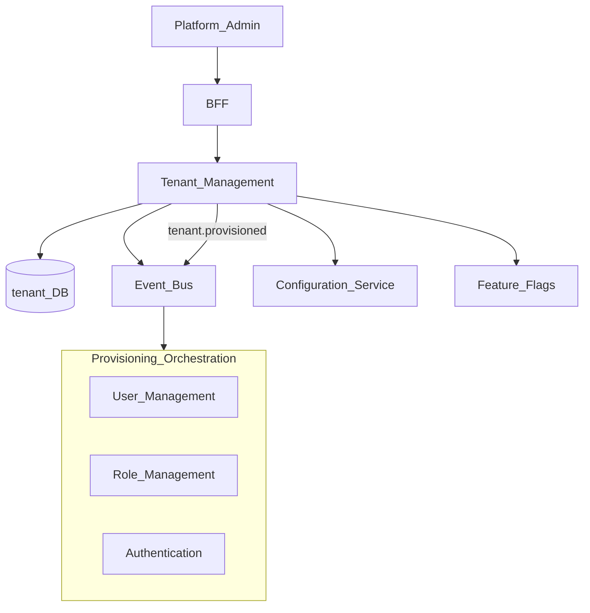
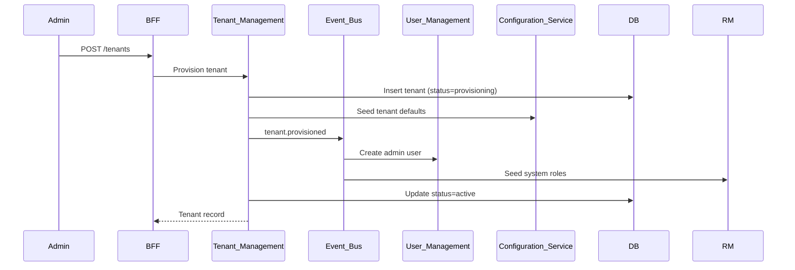
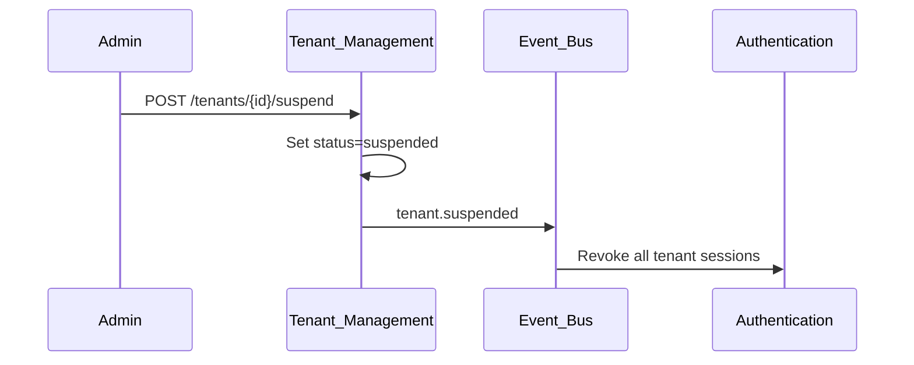

# Tenant Management

> **Volume:** 2 | **Chapter ID:** v2-07 | **Status:** reviewed

## Purpose

The **Tenant Management** platform service governs the top-level isolation boundary in multi-tenant EPB deployments. A **tenant** is an isolated customer or organizational partition — every other platform service scopes data by `tenant_id` derived from here. Tenant provisioning, suspension, and feature entitlements start in this service.

## Architecture



Tenant Management orchestrates lifecycle events; downstream services react asynchronously.

## Responsibilities

### In Scope

- Tenant CRUD: name, slug, status, subscription tier, region
- Tenant lifecycle: `provisioning`, `active`, `suspended`, `decommissioned`
- Feature entitlement mapping (which platform modules are enabled)
- Data residency and region assignment
- Tenant-level quotas: users, storage, API rate limits (metadata for enforcement)
- Custom domain and branding configuration references
- Tenant suspension (blocks login, preserves data)
- Decommission workflow with export window and purge scheduling

### Out of Scope

- Organization hierarchy within a tenant ([Organization Management](08-organization-management.md))
- User profiles ([User Management](04-user-management.md))
- Runtime request routing (infrastructure/API gateway)
- Billing and invoicing (external system; tenant stores subscription reference only)

## API Design

### Base Path

`/tenants/v1`

Platform-admin APIs. Tenant admins access subset via scoped BFF routes.

### Core Endpoints

| Method | Path | Description |
|--------|------|-------------|
| GET | /tenants | List tenants (platform admin) |
| GET | /tenants/{tenantId} | Get tenant detail |
| POST | /tenants | Provision new tenant |
| PATCH | /tenants/{tenantId} | Update metadata, tier, region |
| POST | /tenants/{tenantId}/suspend | Suspend tenant access |
| POST | /tenants/{tenantId}/reactivate | Restore active status |
| POST | /tenants/{tenantId}/decommission | Start decommission workflow |
| GET | /tenants/{tenantId}/entitlements | List enabled features |
| PUT | /tenants/{tenantId}/entitlements | Update feature entitlements |
| GET | /tenants/resolve | Resolve tenant by slug or domain (internal) |

### Provision Tenant Request

```json
{
  "name": "Acme Corporation",
  "slug": "acme",
  "tier": "enterprise",
  "region": "eu-west-1",
  "adminEmail": "admin@acme.example",
  "entitlements": ["workflow", "reporting", "integrations"],
  "dataResidency": "EU"
}
```

Follow [API Standards](../Volume-1-Foundation/18-api-standards.md).

## Database Design

| Table | Key Columns | Purpose |
|-------|-------------|---------|
| `tenants` | `tenant_id`, `slug`, `name`, `status`, `tier`, `region` | Primary tenant record |
| `tenant_entitlements` | `tenant_id`, `feature_key`, `enabled`, `limits_json` | Feature flags and quotas |
| `tenant_domains` | `tenant_id`, `domain`, `verified`, `primary` | Custom domain mapping |
| `tenant_lifecycle_events` | `tenant_id`, `event_type`, `actor_id`, `created_at` | Provisioning audit |
| `tenant_decommission_jobs` | `tenant_id`, `phase`, `export_url`, `purge_scheduled_at` | Offboarding state |

Indexes: `(slug)` unique globally; `(status)` for admin dashboards; `(region, status)` for ops routing.

## Folder Structure

```text
services/tenant-management/
├── api/
├── domain/
│   ├── provisioning/   # Multi-step provision orchestration
│   ├── lifecycle/      # Suspend, reactivate, decommission
│   └── entitlements/   # Feature and quota management
├── persistence/
├── events/             # tenant.provisioned, tenant.suspended
└── tests/
```

## Sequence Diagrams

### Tenant Provisioning



### Tenant Suspension



## Extension Points

- **Provisioning hooks** — custom steps via [Integration Framework](31-integration-framework.md)
- **Tier templates** — entitlement presets per subscription tier
- **Branding assets** — logo and theme URLs stored as configuration references

## Integration

- **Depends on:** Configuration Service, Feature Flags, Audit Platform
- **Events published:** `tenant.provisioned`, `tenant.updated`, `tenant.suspended`, `tenant.reactivated`, `tenant.decommissioned`
- **Events consumed:** None (origin service for tenant lifecycle)
- **Consumers:** All platform services (tenant context), Authentication, User Management

## Best Practices

1. Treat `tenant_id` as immutable once issued — never recycle IDs
2. Propagate suspension immediately via events, not polling
3. Enforce slug uniqueness globally for routing
4. Decommission requires export window before purge
5. Store quotas as metadata; enforcement happens at consuming services

## Anti-Patterns

| Anti-Pattern | Why It Fails | Preferred Approach |
|--------------|--------------|-------------------|
| Shared database without tenant_id | Cross-tenant data leak | Mandatory tenant column on all tables |
| Synchronous provision of all services | Timeouts, partial failure states | Event-driven provisioning |
| Hard delete on cancellation | Legal hold and recovery impossible | Decommission workflow with retention |
| Tenant logic in every service | Inconsistent suspension behavior | Central lifecycle events |
| Embedding entitlements in JWT | Stale feature access | Check Feature Flags or entitlements API |

## Related Chapters

- [Previous: Permission Management](06-permission-management.md)
- [Next: Organization Management](08-organization-management.md)
- [Configuration Service](09-configuration-service.md)
- [Feature Flags](10-feature-flags.md)
- [EPB Glossary](../docs/GLOSSARY.md)

---

*Enterprise Platform Blueprint — Volume 2*
