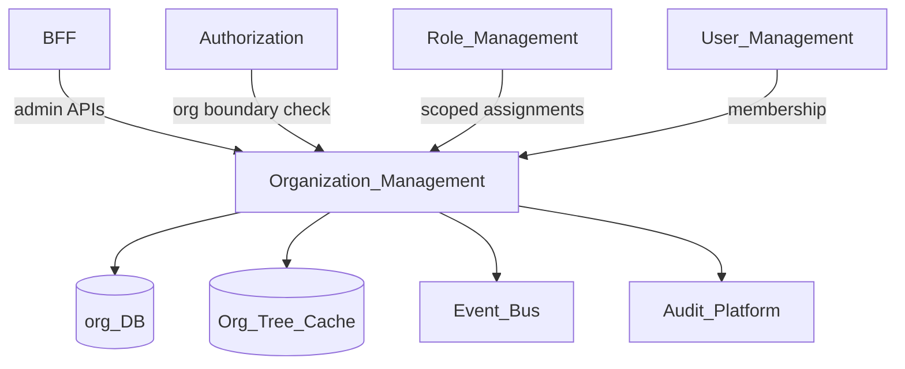
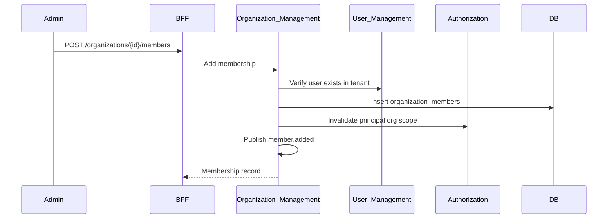
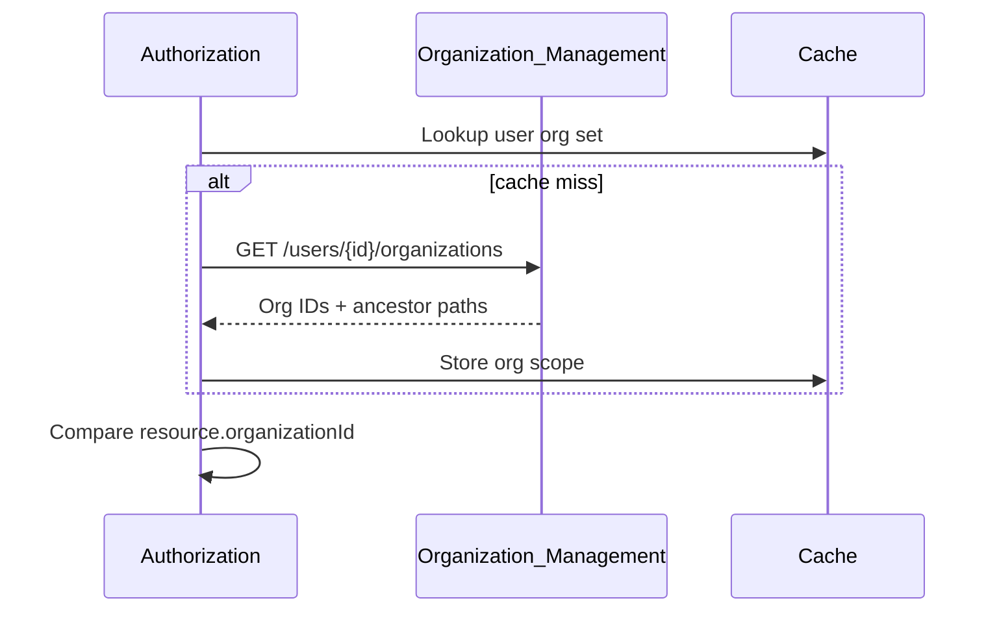

# Organization Management

> **Volume:** 2 | **Chapter ID:** v2-08 | **Status:** reviewed

## Purpose

The **Organization Management** platform service models the internal structure within a tenant: divisions, departments, teams, and sites. Organization nodes form a hierarchy used for data scoping, delegated administration, and authorization boundaries. Users belong to organizations; resources attach to organization nodes for access control.

## Architecture



Organization structure is tenant-scoped. Cross-tenant organization access is never permitted.

## Responsibilities

### In Scope

- Organization unit CRUD: name, code, type, parent reference
- Hierarchical tree with configurable depth and cycle prevention
- User-to-organization membership (primary and secondary affiliations)
- Organization metadata: address, timezone, cost center code
- Move and reparent nodes with descendant path updates
- Organization-scoped role assignment boundaries for Authorization
- Tree export for admin UIs and BFF menu scoping
- Soft delete with orphan policy (block or cascade to children)

### Out of Scope

- Tenant lifecycle ([Tenant Management](07-tenant-management.md))
- Permission evaluation ([Authorization](03-authorization.md))
- External corporate directory sync logic (adapter via Integration Framework)
- Geographic map rendering (frontend)

## API Design

### Base Path

`/organizations/v1`

### Organization Endpoints

| Method | Path | Description |
|--------|------|-------------|
| GET | /organizations | List roots or children (`parentId` filter) |
| GET | /organizations/tree | Full tree for tenant (depth-limited) |
| GET | /organizations/{orgId} | Get organization detail |
| POST | /organizations | Create organization unit |
| PUT | /organizations/{orgId} | Update metadata |
| POST | /organizations/{orgId}/move | Reparent node |
| DELETE | /organizations/{orgId} | Soft delete (policy enforced) |
| GET | /organizations/{orgId}/ancestors | Breadcrumb path to root |
| GET | /organizations/{orgId}/descendants | Subtree listing |

### Membership Endpoints

| Method | Path | Description |
|--------|------|-------------|
| GET | /organizations/{orgId}/members | List member users |
| POST | /organizations/{orgId}/members | Add user membership |
| DELETE | /organizations/{orgId}/members/{userId} | Remove membership |
| GET | /users/{userId}/organizations | User's organization affiliations |
| PUT | /users/{userId}/organizations/primary | Set primary organization |

### Create Organization Request

```json
{
  "tenantId": "tenant-uuid",
  "parentId": "parent-org-uuid",
  "name": "Regional Operations",
  "code": "REG-OPS",
  "type": "division",
  "timezone": "Europe/Berlin"
}
```

Follow [API Standards](../Volume-1-Foundation/18-api-standards.md).

## Database Design

| Table | Key Columns | Purpose |
|-------|-------------|---------|
| `organizations` | `org_id`, `tenant_id`, `parent_id`, `name`, `code`, `type`, `path` | Hierarchy nodes |
| `organization_members` | `org_id`, `user_id`, `is_primary`, `joined_at` | User affiliations |
| `organization_metadata` | `org_id`, `key`, `value` | Extensible attributes |
| `organization_audit` | `org_id`, `action`, `actor_id`, `changes_json` | Structural change log |

Indexes: `(tenant_id, code)` unique; `(tenant_id, parent_id)` for tree queries; materialized `path` column (e.g., `/root/child/grandchild`) for ancestor/descendant lookups.

## Folder Structure

```text
services/organization-management/
├── api/
├── domain/
│   ├── tree/          # Hierarchy validation, reparenting
│   ├── membership/    # User affiliation rules
│   └── paths/         # Materialized path maintenance
├── persistence/
├── events/            # organization.created, member.added
└── tests/
```

## Sequence Diagrams

### Add User to Organization



### Authorization Org Boundary Check



## Extension Points

- **Directory sync adapters** — HR or LDAP import via [Integration Framework](31-integration-framework.md)
- **Custom org types** — tenant-defined type catalog via Configuration Service
- **Metadata fields** — extended attributes via [Metadata Engine](68-metadata-engine.md)

## Integration

- **Depends on:** Tenant Management, User Management, Audit Platform
- **Events published:** `organization.created`, `organization.moved`, `organization.deleted`, `organization.member.added`, `organization.member.removed`
- **Events consumed:** `tenant.provisioned` (create root org), `user.deactivated` (remove memberships)
- **Consumers:** Authorization, Role Management, BFF

## Best Practices

1. Maintain materialized path for efficient subtree queries
2. Block cycles on reparent operations
3. Every user should have exactly one primary organization
4. Invalidate authorization cache on structural changes
5. Use organization code as stable business key; UUID for references

## Anti-Patterns

| Anti-Pattern | Why It Fails | Preferred Approach |
|--------------|--------------|-------------------|
| Flat org list without hierarchy | Cannot scope data or delegate admin | Tree with parent references |
| Hard-coded org IDs in applications | Breaks across tenants | Resolve by code or API |
| Duplicating org tree per service | Structural drift | Organization Management source |
| Deep trees without depth limit | Query performance collapse | Configurable max depth |
| Deleting org with active members | Orphaned users and resources | Block or force-transfer policy |

## Related Chapters

- [Previous: Tenant Management](07-tenant-management.md)
- [Next: Configuration Service](09-configuration-service.md)
- [Authorization](03-authorization.md)
- [Role Management](05-role-management.md)
- [EPB Glossary](../docs/GLOSSARY.md)

---

*Enterprise Platform Blueprint — Volume 2*
