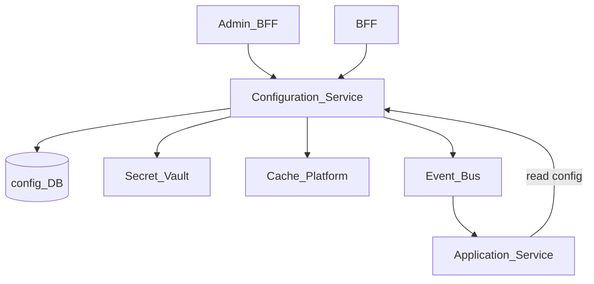
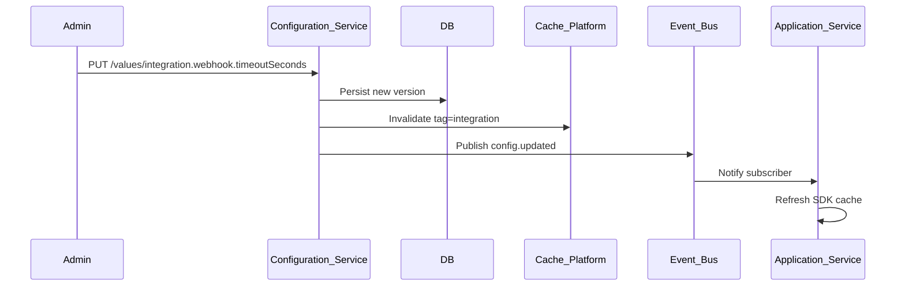
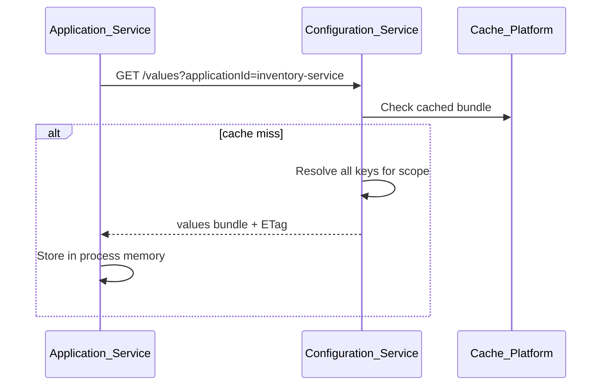

# Configuration Service

> **Volume:** 2 | **Chapter ID:** v2-09 | **Status:** reviewed

## Purpose

The **Configuration Service** is the single source of truth for runtime settings that govern platform and application behavior across tenants. It stores key-value pairs, structured JSON documents, and environment-scoped overrides with versioning, encryption for secrets, and push-based change notification. Applications read configuration through APIs or SDK caches — they never store tenant settings in local config files or duplicate settings in application databases.

Configuration values differ from [Feature Flags](10-feature-flags.md): configuration holds data (URLs, limits, formats); feature flags hold boolean rollout state.

## Architecture



Sensitive values (API keys, connection strings) are stored encrypted and never returned in plaintext to unauthorized callers. Non-secret values are cache-friendly with tag-based invalidation.

## Responsibilities

### In Scope

- Hierarchical configuration: platform → tenant → organization → application
- Key registration with type validation (string, number, boolean, JSON, secret)
- Scoped overrides with inheritance resolution (child scope wins)
- Configuration versioning and rollback to prior snapshot
- Secret encryption at rest and masked responses in APIs
- Change audit trail with actor and reason
- Event publication on config change for cache invalidation
- Bulk read API for service startup and SDK warm-cache
- Schema validation for structured JSON configuration documents

### Out of Scope

- Feature toggle evaluation ([Feature Flags](10-feature-flags.md))
- Infrastructure secrets managed by deployment tooling (Kubernetes secrets, cloud parameter stores for cluster config)
- Application business entity data
- UI for configuration editing (admin console is separate; this service is API-only)

## API Design

### Base Path

`/config/v1`

### Key Management

| Method | Path | Description |
|--------|------|-------------|
| GET | /keys | List registered configuration keys |
| POST | /keys | Register new key with schema and default |
| GET | /keys/{key} | Get key metadata and default value |
| PATCH | /keys/{key} | Update key schema or default |

### Value Operations

| Method | Path | Description |
|--------|------|-------------|
| GET | /values | Bulk resolve values for scope |
| GET | /values/{key} | Get resolved value for key and scope |
| PUT | /values/{key} | Set value at scope (tenant, org, app) |
| DELETE | /values/{key} | Remove override (revert to inherited) |
| GET | /values/{key}/history | Version history for key at scope |
| POST | /values/{key}/rollback | Rollback to specific version |

### Bulk Resolve Request

```json
{
  "tenantId": "tenant-uuid",
  "organizationId": "org-uuid",
  "applicationId": "inventory-service",
  "keys": [
    "integration.webhook.timeoutSeconds",
    "ui.dateFormat",
    "integration.partner.apiKey"
  ],
  "includeSecrets": false
}
```

### Bulk Resolve Response

```json
{
  "resolvedAt": "2026-08-01T10:00:00Z",
  "values": {
    "integration.webhook.timeoutSeconds": 30,
    "ui.dateFormat": "YYYY-MM-DD",
    "integration.partner.apiKey": "***masked***"
  },
  "sources": {
    "integration.webhook.timeoutSeconds": "tenant",
    "ui.dateFormat": "platform",
    "integration.partner.apiKey": "tenant"
  }
}
```

### Scope Resolution Order

```text
application override → organization override → tenant override → platform default
```

Follow [API Standards](../Volume-1-Foundation/18-api-standards.md).

## Database Design

| Table | Key Columns | Purpose |
|-------|-------------|---------|
| `config_keys` | `key`, `value_type`, `schema_json`, `default_value`, `is_secret` | Key registry |
| `config_values` | `key`, `scope_type`, `scope_id`, `value_json`, `version` | Scoped values |
| `config_value_history` | `key`, `scope_id`, `version`, `value_json`, `changed_by` | Rollback snapshots |
| `config_tags` | `key`, `tag` | Cache invalidation grouping |
| `config_audit_log` | `key`, `scope_id`, `action`, `actor_id`, `created_at` | Change audit |

Scope types: `platform`, `tenant`, `organization`, `application`.

Indexes: `(scope_type, scope_id, key)` unique on values; `(tag)` for bulk invalidation.

Secrets: `value_json` stores vault reference ID; actual secret in external vault or encrypted column.

## Folder Structure

```text
services/configuration-service/
├── api/
├── domain/
│   ├── keys/         # Registration and schema validation
│   ├── resolve/      # Inheritance chain resolution
│   ├── secrets/      # Vault adapter, masking
│   └── version/      # History and rollback
├── persistence/
├── adapters/
│   ├── vault/
│   └── cache/        # Cache Platform client
├── sdk/              # Client with local cache + event subscription
├── mappers/
├── events/           # config.updated, config.rolled_back
└── tests/
```

## Sequence Diagrams

### Configuration Change Propagation



### Startup Bulk Load



## Extension Points

- **Custom value types** — encrypted JSON, file reference, URL with health check
- **Validation hooks** — pre-commit callback for complex cross-key constraints
- **Import/export** — tenant configuration bundle for migration between environments
- **Read replicas** — SDK supports eventually-consistent local cache with max staleness TTL

## Integration

- **Depends on:** Cache Platform, Event Bus, Audit Platform, Secret Vault
- **Events published:** `config.key.registered`, `config.updated`, `config.rolled_back`
- **Events consumed:** `tenant.provisioned` (seed tenant defaults), `application.deployed` (register app keys)
- **Used by:** All platform services and applications

## Best Practices

1. Namespace keys by domain: `integration.partner.timeout`, not `timeout`
2. Register keys before setting values — unregistered keys reject writes
3. Never log secret values; use masked responses in APIs
4. Subscribe to `config.updated` events; do not poll aggressively
5. Use bulk resolve at startup; single-key reads for hot-path overrides only
6. Document default values in key registration schema

## Anti-Patterns

| Anti-Pattern | Why It Fails | Preferred Approach |
|--------------|--------------|-------------------|
| Tenant settings in app database | No central visibility, drift across services | Configuration Service |
| Environment variables for tenant config | Requires redeploy per tenant change | Scoped API values |
| Storing secrets in plaintext columns | Compliance and breach risk | Vault reference + encryption |
| Polling config every second | Unnecessary load | Event-driven cache invalidation |
| Using config for feature rollout | Wrong abstraction | Feature Flags service |

## Related Chapters

- [Previous: Organization Management](08-organization-management.md)
- [Next: Feature Flags](10-feature-flags.md)
- [Feature Flags](10-feature-flags.md)
- [EPB Glossary](../docs/GLOSSARY.md)

---

*Enterprise Platform Blueprint — Volume 2*
