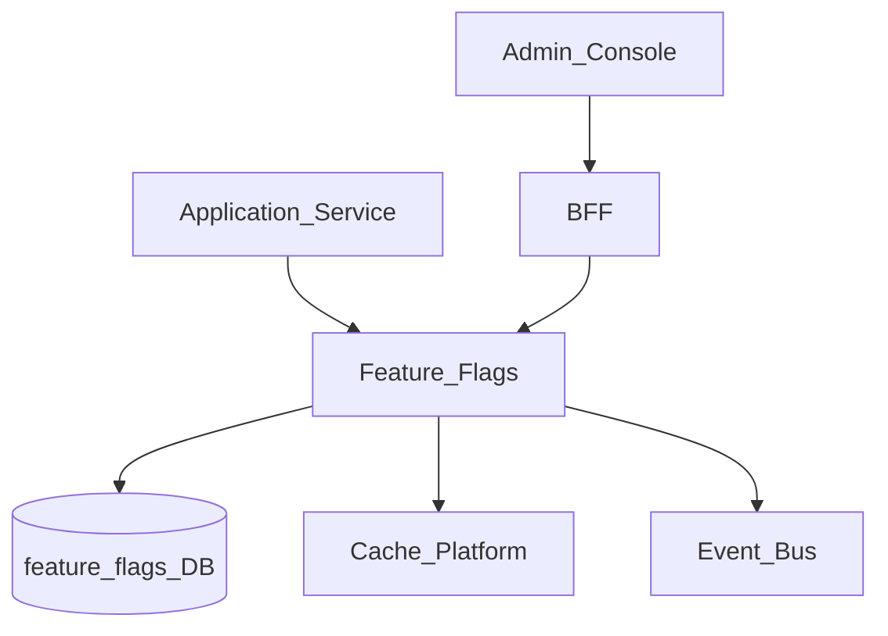
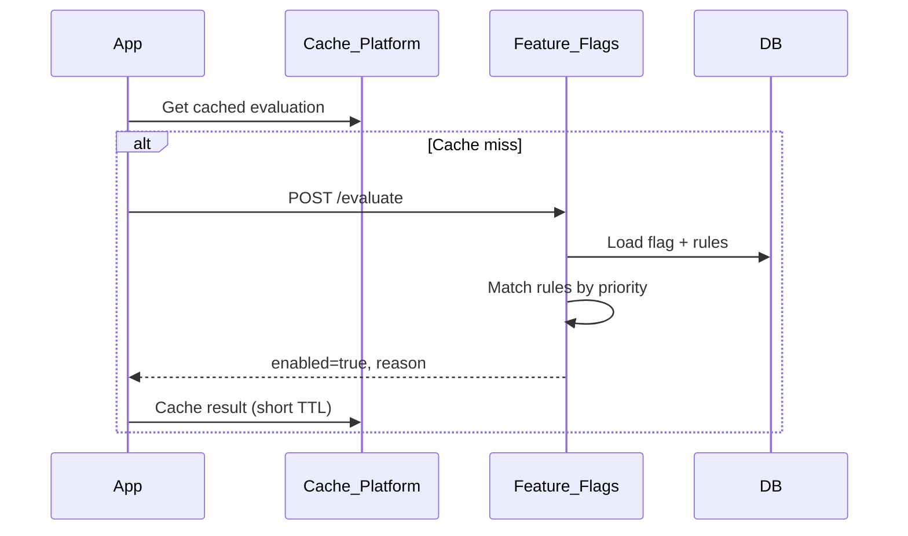
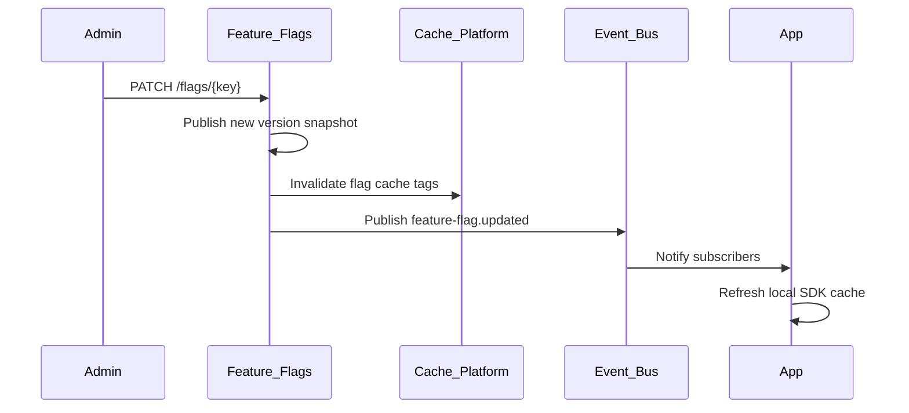

# Feature Flags

> **Volume:** 2 | **Chapter ID:** v2-10 | **Status:** reviewed

## Purpose

The **Feature Flags** platform service enables runtime toggling of capabilities without deployment. Teams roll out features gradually, run A/B experiments, and kill-switch broken functionality per tenant, organization, or user cohort. Applications check flag state via API or SDK — they never hardcode `if (newFeature)` behind compile-time constants alone.

## Architecture



Feature Flags owns flag definitions, targeting rules, and evaluation. Applications own feature behavior behind the flag.

## Responsibilities

### In Scope

- Flag registration with default state (on/off)
- Targeting rules: tenant, organization, user, percentage rollout
- Flag evaluation API with context attributes
- Bulk evaluation for BFF aggregation
- Flag lifecycle: draft, active, archived
- Change history and audit integration
- Cache-friendly reads with event-driven invalidation
- Kill switch with instant global off

### Out of Scope

- Configuration values unrelated to feature toggles ([Configuration Service](09-configuration-service.md))
- Permission-based authorization ([Authorization](03-authorization.md))
- Experiment analytics and conversion tracking (may integrate externally)
- UI for end users

## API Design

### Base Path

`/feature-flags/v1`

### Flag Management (admin)

| Method | Path | Description |
|--------|------|-------------|
| POST | /flags | Create flag |
| GET | /flags | List flags |
| GET | /flags/{flagKey} | Get flag definition |
| PATCH | /flags/{flagKey} | Update default or rules |
| DELETE | /flags/{flagKey} | Archive flag |
| POST | /flags/{flagKey}/kill | Emergency global disable |

### Evaluation (runtime)

| Method | Path | Description |
|--------|------|-------------|
| POST | /evaluate | Evaluate single flag |
| POST | /evaluate/batch | Evaluate multiple flags |
| GET | /evaluate/{flagKey} | Quick evaluate with query params |

### Create Flag Request

```json
{
  "flagKey": "new-dashboard-widgets",
  "name": "New Dashboard Widgets",
  "description": "Enables redesigned widget library",
  "defaultEnabled": false,
  "flagType": "release",
  "rules": [
    {
      "priority": 1,
      "conditions": { "tenantId": "tenant-uuid" },
      "enabled": true
    },
    {
      "priority": 2,
      "conditions": { "percentage": 10, "attribute": "userId" },
      "enabled": true
    }
  ]
}
```

Flag types: `release` (gradual rollout), `experiment` (A/B), `operational` (kill switch), `permission` (deprecated — use Authorization).

### Evaluate Request

```json
{
  "flagKey": "new-dashboard-widgets",
  "context": {
    "tenantId": "tenant-uuid",
    "organizationId": "org-uuid",
    "userId": "user-uuid",
    "attributes": {
      "plan": "enterprise",
      "region": "us-east"
    }
  }
}
```

### Evaluate Response

```json
{
  "flagKey": "new-dashboard-widgets",
  "enabled": true,
  "reason": "rule_match",
  "matchedRulePriority": 1,
  "evaluatedAt": "2026-08-01T10:00:00Z"
}
```

Evaluation is deterministic: same context always yields same result for a given flag version.

## Database Design

| Table | Key Columns | Purpose |
|-------|-------------|---------|
| `feature_flags` | `flag_key`, `name`, `default_enabled`, `flag_type`, `status` | Flag definitions |
| `feature_flag_rules` | `rule_id`, `flag_key`, `priority`, `conditions_json`, `enabled` | Targeting rules |
| `feature_flag_versions` | `flag_key`, `version`, `snapshot_json`, `published_at` | Published snapshots |
| `feature_flag_eval_log` | `flag_key`, `context_hash`, `result`, `evaluated_at` | Optional sampling log |
| `feature_flag_changes` | `flag_key`, `changed_by`, `change_json`, `changed_at` | Change audit |

Unique: `flag_key` globally (prefix with app namespace: `inventory.new-ui`).

## Folder Structure

```text
services/feature-flags/
├── api/
├── domain/
│   ├── flags/        # CRUD, lifecycle
│   ├── evaluate/     # Rule matching engine
│   ├── rollout/      # Percentage hashing
│   └── publish/      # Version snapshots
├── persistence/
├── adapters/
│   └── cache/        # Cache Platform client
├── sdk/              # Client library with local cache
├── mappers/
├── events/
└── tests/
```

## Sequence Diagrams

### Flag Evaluation with Cache



### Flag Update Propagation



## Extension Points

- **Custom condition attributes** — any key in evaluation context
- **Percentage rollout algorithms** — consistent hash on `userId`
- **Experiment variants** — return variant label instead of boolean
- **Admin UI hooks** — BFF exposes management for tenant admins

## Integration

- **Depends on:** Cache Platform, Event Bus, Audit Platform, Configuration Service
- **Events published:** `feature-flag.created`, `feature-flag.updated`, `feature-flag.killed`
- **Events consumed:** `tenant.provisioned` (seed default flags)
- **Used by:** All applications for gradual rollout and kill switches

## Best Practices

1. Namespace flag keys by application (`billing.new-invoice-ui`)
2. Default new flags to `false` in production
3. Remove flags after full rollout — avoid permanent technical debt
4. Kill switch path bypasses cache for instant effect
5. Do not use flags for security decisions — use Authorization

## Anti-Patterns

| Anti-Pattern | Why It Fails | Preferred Approach |
|--------------|--------------|-------------------|
| Feature flags in config files | Requires deploy to toggle | Feature Flags API |
| Flags for permissions | Inconsistent with auth model | Authorization roles |
| Non-deterministic percentage rollout | User sees flickering UX | Consistent hash on stable ID |
| Never removing old flags | Code clutter, evaluation overhead | Archive and delete after rollout |

## Related Chapters

- [Previous: Configuration Service](09-configuration-service.md)
- [Next: Logging Platform](11-logging-platform.md)
- [Configuration Service](09-configuration-service.md)
- [EPB Glossary](../docs/GLOSSARY.md)

---

*Enterprise Platform Blueprint — Volume 2*
