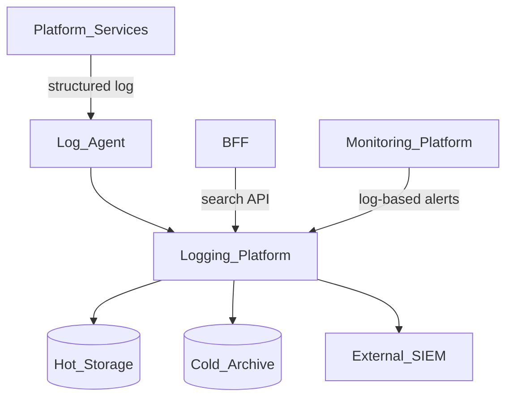
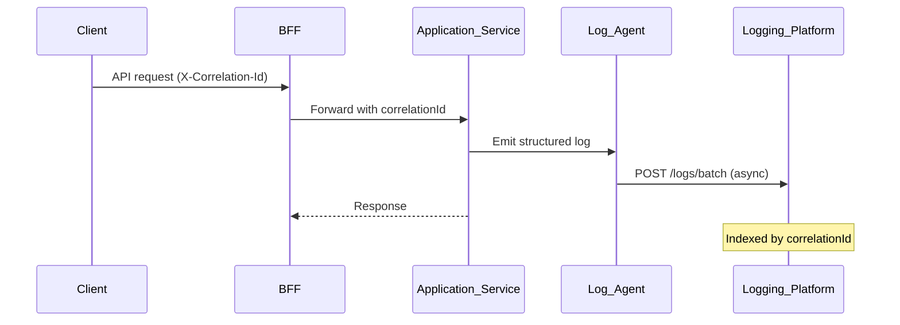
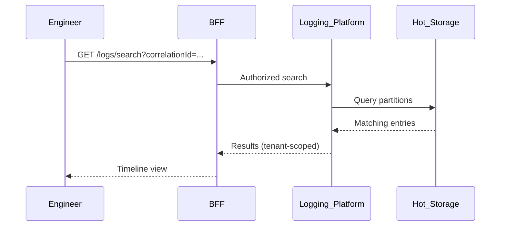

# Logging Platform

> **Volume:** 2 | **Chapter ID:** v2-11 | **Status:** reviewed

## Purpose

The **Logging Platform** provides centralized structured log ingestion, retention, and search for operational diagnostics across EPB. Unlike [Audit Platform](12-audit-platform.md) (compliance-grade immutable trails), logging targets engineers debugging failures, tracing request flows, and monitoring application health. Every service emits logs through a shared SDK and schema — not ad hoc `printf` formats.

## Architecture



Logs flow asynchronously. Application request paths never block on log persistence failure beyond local buffer limits.

## Responsibilities

### In Scope

- Structured log ingestion (HTTP API and agent-sidecar protocol)
- Enforced log schema: timestamp, level, service, tenantId, correlationId, message, fields
- Log levels: `trace`, `debug`, `info`, `warn`, `error`, `fatal`
- Correlation and trace ID propagation standards
- Full-text and field-filtered search with tenant isolation
- Retention tiers: hot (7–30 days), warm, cold archive
- Log export for incident response
- PII redaction rules at ingestion
- Rate limiting and sampling for high-volume `debug`/`trace` streams

### Out of Scope

- Compliance audit trails with before/after snapshots ([Audit Platform](12-audit-platform.md))
- Metrics and time-series aggregation ([Monitoring Platform](13-monitoring-platform.md))
- Distributed trace span storage (integrates with external APM; exports trace IDs)
- Application business event publishing ([Event Bus](30-event-bus.md))

## API Design

### Base Path

`/logging/v1`

Ingestion endpoints are internal. Search endpoints require admin or support role.

### Ingestion

| Method | Path | Description |
|--------|------|-------------|
| POST | /logs | Ingest single log entry |
| POST | /logs/batch | Ingest up to 500 entries |
| POST | /logs/agent/register | Register log agent heartbeat |

### Query

| Method | Path | Description |
|--------|------|-------------|
| GET | /logs/search | Search with filters and time range |
| GET | /logs/{logId} | Get single entry |
| GET | /logs/context/{correlationId} | All logs for correlation ID |
| POST | /logs/export | Async export job |
| GET | /logs/fields | Discover indexed field names per service |

### Log Entry Schema

```json
{
  "timestamp": "2026-08-01T12:00:00.000Z",
  "level": "error",
  "service": "resource-service",
  "tenantId": "tenant-uuid",
  "correlationId": "corr-uuid",
  "traceId": "trace-uuid",
  "message": "Failed to persist entity",
  "fields": {
    "entityId": "entity-uuid",
    "durationMs": 342,
    "errorCode": "DB_TIMEOUT"
  }
}
```

Follow [API Standards](../Volume-1-Foundation/18-api-standards.md).

## Database Design

Log storage uses time-partitioned tables or columnar store (implementation choice). Metadata catalog in relational DB.

| Table / Index | Key Columns | Purpose |
|---------------|-------------|---------|
| `log_entries` (partitioned) | `log_id`, `timestamp`, `tenant_id`, `service`, `level`, `correlation_id`, `body_json` | Primary log store |
| `log_field_index` | `tenant_id`, `service`, `field_name`, `field_type` | Searchable field catalog |
| `log_retention_policies` | `tenant_id`, `tier`, `retention_days` | Per-tenant retention |
| `log_export_jobs` | `job_id`, `tenant_id`, `query_json`, `status`, `download_url` | Export tracking |
| `log_ingest_quotas` | `tenant_id`, `bytes_per_day`, `entries_per_day` | Rate governance |

Indexes: `(tenant_id, timestamp DESC)`; `(correlation_id)`; `(tenant_id, service, level, timestamp)` for filtered search.

## Folder Structure

```text
services/logging-platform/
├── api/              # Ingest and search controllers
├── domain/
│   ├── ingestion/    # Validation, redaction, sampling
│   ├── search/       # Query parsing, tenant isolation
│   └── retention/    # Tier rotation jobs
├── storage/          # Hot/cold adapters
├── agents/           # Sidecar protocol spec
└── tests/
```

## Sequence Diagrams

### Request Correlated Logging



### Incident Search



## Extension Points

- **SIEM forwarders** — Splunk, Elastic, Datadog via adapter
- **Custom redaction rules** — tenant regex patterns via Configuration Service
- **Log pipelines** — transform and enrich before storage

## Integration

- **Depends on:** Configuration Service, Tenant Management
- **Events published:** `logging.quota.exceeded`, `logging.export.completed`
- **Events consumed:** `tenant.provisioned` (default retention policy)
- **Consumers:** Monitoring Platform (log-based alerts), support tooling via BFF

## Best Practices

1. Always include `correlationId` — propagate from BFF through all services
2. Use structured `fields`; avoid parsing message strings
3. Never log secrets, tokens, or full PII
4. Default production level to `info`; enable `debug` per-service via feature flag
5. Sample high-volume trace logs; never drop `error`/`fatal`

## Anti-Patterns

| Anti-Pattern | Why It Fails | Preferred Approach |
|--------------|--------------|-------------------|
| Unstructured text logs | Unsearchable, no tenant isolation | Platform log schema |
| Logging as audit trail | Mutable, incomplete for compliance | Audit Platform for compliance |
| Synchronous log writes in request path | Latency spikes on backend failure | Async agent ingestion |
| Per-service log formats | Cross-service correlation impossible | Shared SDK and schema |
| Logging credentials on error | Security incident from log access | Redaction at ingestion |

## Related Chapters

- [Previous: Feature Flags](10-feature-flags.md)
- [Next: Audit Platform](12-audit-platform.md)
- [Monitoring Platform](13-monitoring-platform.md)
- [Health Checks](14-health-checks.md)
- [EPB Glossary](../docs/GLOSSARY.md)

---

*Enterprise Platform Blueprint — Volume 2*
