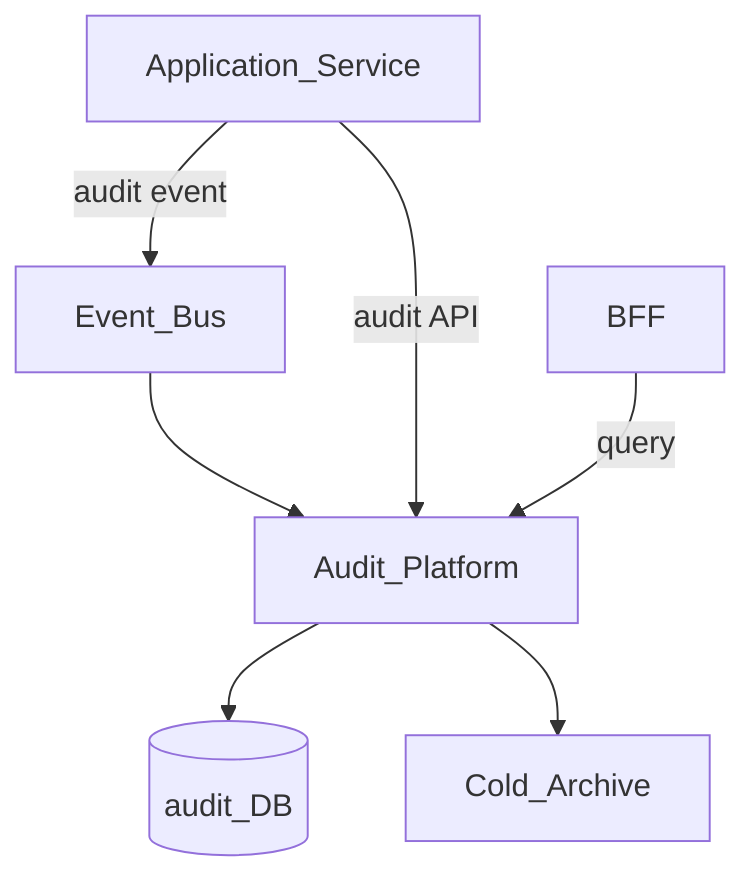
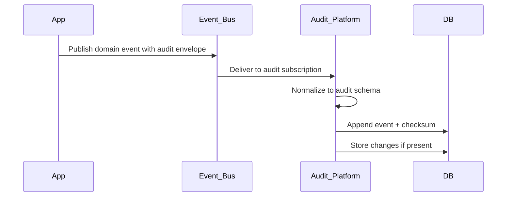
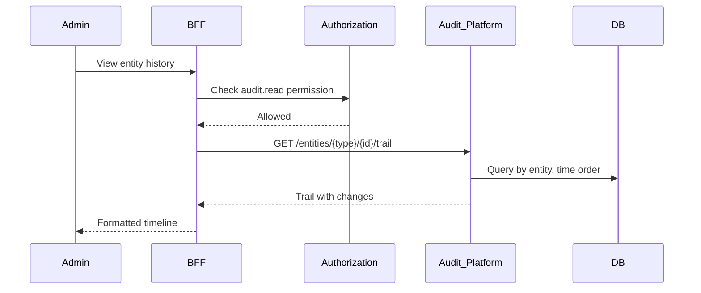

# Audit Platform

> **Volume:** 2 | **Chapter ID:** v2-12 | **Status:** reviewed

## Purpose

The **Audit Platform** captures an immutable trail of who did what, when, and to which entity across every EPB service. Compliance, security investigations, and operational forensics require a centralized audit store — not scattered log lines or per-service audit tables. Services publish audit events or call the API; the platform enforces retention, immutability, and query access controls.

## Architecture



Audit records are append-only. No service updates or deletes audit entries except via governed retention jobs.

## Responsibilities

### In Scope

- Structured audit event ingestion (API and Event Bus)
- Immutable storage with tamper-evident checksums
- Entity-centric audit trails (all changes to a resource)
- Actor-centric trails (all actions by a user)
- Before/after snapshots for data changes
- Tenant and organization scoping on queries
- Retention policies and cold archive export
- Compliance report generation hooks

### Out of Scope

- Application debug logging ([Logging Platform](11-logging-platform.md))
- Real-time security alerting ([Monitoring Platform](13-monitoring-platform.md))
- Business workflow approval history ([Workflow Engine](19-workflow-engine.md))
- Performance metrics and traces

## API Design

### Base Path

`/audit/v1`

### Ingestion (internal)

| Method | Path | Description |
|--------|------|-------------|
| POST | /events | Record single audit event |
| POST | /events/batch | Record up to 100 events |

### Query (authorized admin/compliance)

| Method | Path | Description |
|--------|------|-------------|
| GET | /events | Search events with filters |
| GET | /events/{eventId} | Get single event |
| GET | /entities/{entityType}/{entityId}/trail | Entity audit trail |
| GET | /actors/{actorId}/trail | Actor activity trail |
| POST | /export | Request audit export job |

### Record Event Request

```json
{
  "tenantId": "tenant-uuid",
  "organizationId": "org-uuid",
  "actorId": "user-uuid",
  "actorType": "user",
  "action": "entity.updated",
  "entityType": "resource",
  "entityId": "entity-uuid",
  "correlationId": "corr-uuid",
  "sourceService": "resource-service",
  "outcome": "success",
  "changes": {
    "before": { "status": "pending", "name": "Alpha" },
    "after": { "status": "active", "name": "Alpha" }
  },
  "metadata": {
    "ipAddress": "10.0.0.1",
    "clientId": "web-app"
  }
}
```

Action naming: `{entityType}.{verb}` (e.g., `user.login`, `config.updated`, `permission.granted`).

Outcomes: `success`, `failure`, `denied`.

### Query Filters

| Parameter | Description |
|-----------|-------------|
| `tenantId` | Required tenant scope |
| `actorId` | Filter by user or service principal |
| `entityType` / `entityId` | Filter by target entity |
| `action` | Exact or prefix match |
| `from` / `to` | Time range (ISO 8601) |
| `outcome` | success, failure, denied |

## Database Design

Hot storage in PostgreSQL; aged records move to cold archive (object storage).

| Table | Key Columns | Purpose |
|-------|-------------|---------|
| `audit_events` | `event_id`, `tenant_id`, `actor_id`, `action`, `entity_type`, `entity_id`, `occurred_at` | Primary audit log |
| `audit_event_changes` | `event_id`, `before_json`, `after_json` | Field-level diffs |
| `audit_event_metadata` | `event_id`, `metadata_json` | IP, client, correlation |
| `audit_checksums` | `event_id`, `checksum`, `previous_checksum` | Tamper-evident chain per tenant |
| `audit_retention_policies` | `tenant_id`, `hot_days`, `archive_days`, `purge_days` | Lifecycle rules |
| `audit_export_jobs` | `job_id`, `filter_json`, `status`, `file_id` | Compliance exports |

Indexes: `(tenant_id, entity_type, entity_id, occurred_at)`; `(tenant_id, actor_id, occurred_at)`. Partition by month on `occurred_at`.

## Folder Structure

```text
services/audit/
├── api/
├── domain/
│   ├── ingest/       # Validate, checksum chain
│   ├── query/        # Search, trails
│   ├── retention/    # Archive and purge jobs
│   └── export/       # Compliance export
├── persistence/
├── adapters/
│   ├── archive/      # Cold storage upload
│   └── event-bus/    # Subscriber for audit.* events
├── mappers/
├── events/           # audit.export.completed
└── tests/
```

## Sequence Diagrams

### Event Ingestion via Event Bus



### Entity Trail Query



## Extension Points

- **Event normalizers** — map domain events to audit schema automatically
- **Sensitive field redaction** — mask PII in `changes` before storage
- **Custom retention** — per action type retention overrides
- **SIEM export** — stream to external security tools via Integration Framework

## Integration

- **Depends on:** Event Bus, File Management (exports), Authorization
- **Events published:** `audit.event.recorded`, `audit.export.completed`
- **Events consumed:** Optional subscription to all `*.created`, `*.updated`, `*.deleted` with audit envelope
- **Used by:** Every platform and application service

## Best Practices

1. Audit at the service boundary — after authorization, before persistence
2. Include `correlationId` to link audit to request logs
3. Never audit secrets or full credential values in `changes`
4. Use `denied` outcome for authorization failures (security monitoring)
5. Immutable storage — corrections are new events, never updates

## Anti-Patterns

| Anti-Pattern | Why It Fails | Preferred Approach |
|--------------|--------------|-------------------|
| Audit table per service | Incomplete trails, query fragmentation | Central Audit Platform |
| Logging as audit | Logs rotate, lack structure, no entity trail | Structured audit events |
| Updating audit records | Compliance violation, trust loss | Append-only with checksum chain |
| Auditing after async side effects | Missing failed attempt records | Audit at decision point |

## Related Chapters

- [Previous: Logging Platform](11-logging-platform.md)
- [Next: Monitoring Platform](13-monitoring-platform.md)
- [Logging Platform](11-logging-platform.md)
- [EPB Glossary](../docs/GLOSSARY.md)

---

*Enterprise Platform Blueprint — Volume 2*
