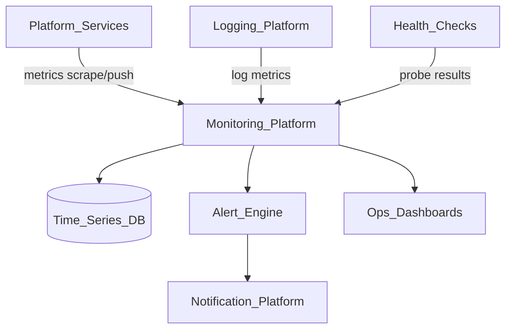
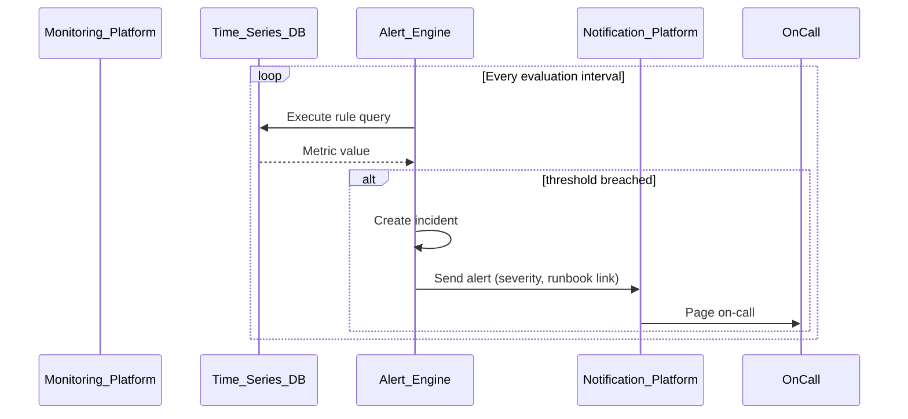
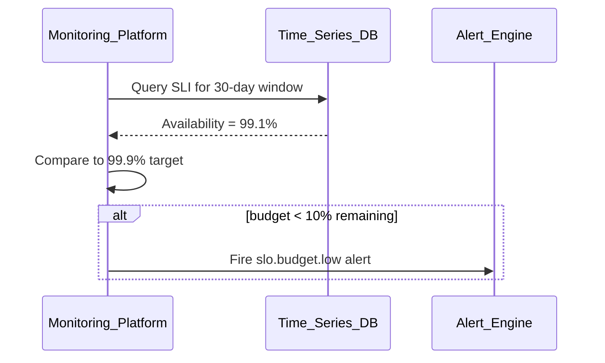

# Monitoring Platform

> **Volume:** 2 | **Chapter ID:** v2-13 | **Status:** reviewed

## Purpose

The **Monitoring Platform** collects, stores, and alerts on operational metrics and signals across EPB. It answers: *is the platform healthy, and where is it degrading?* Application services emit counters, gauges, and histograms through a standard instrumentation SDK. Dashboards and alert rules live here — distinct from business analytics ([Dashboard Engine](22-dashboard-engine.md)).

## Architecture



Metrics are tenant-aware where applicable; infrastructure metrics are platform-scoped.

## Responsibilities

### In Scope

- Metric ingestion: Prometheus-compatible scrape and push endpoints
- Standard metric naming: `{service}_{subsystem}_{name}_{unit}`
- Histogram and percentile computation (p50, p95, p99)
- Service-level objective (SLO) tracking and error budget burn alerts
- Alert rule definition: threshold, rate, anomaly detection
- Alert routing to on-call channels via Notification Platform
- Ops dashboards for platform and service health
- Metric retention and downsampling policies
- Synthetic probe result ingestion from [Health Checks](14-health-checks.md)

### Out of Scope

- Business KPI dashboards ([Dashboard Engine](22-dashboard-engine.md))
- Debug log search ([Logging Platform](11-logging-platform.md))
- Compliance audit records ([Audit Platform](12-audit-platform.md))
- Full distributed tracing UI (integrates with external APM)

## API Design

### Base Path

`/monitoring/v1`

### Metrics

| Method | Path | Description |
|--------|------|-------------|
| POST | /metrics/push | Push metric batch (internal) |
| GET | /metrics/query | PromQL-compatible instant query |
| GET | /metrics/query_range | Range query for charts |
| GET | /metrics/labels | Discover label values |

### Alerts

| Method | Path | Description |
|--------|------|-------------|
| GET | /alerts/rules | List alert rules |
| POST | /alerts/rules | Create alert rule |
| PUT | /alerts/rules/{ruleId} | Update rule |
| DELETE | /alerts/rules/{ruleId} | Delete rule |
| GET | /alerts/incidents | Active and recent incidents |
| POST | /alerts/incidents/{id}/acknowledge | Acknowledge incident |

### SLOs

| Method | Path | Description |
|--------|------|-------------|
| GET | /slos | List SLO definitions |
| POST | /slos | Define SLO (target, window, SLI query) |
| GET | /slos/{sloId}/status | Current error budget |

### Push Metric Example

```json
{
  "service": "resource-service",
  "tenantId": "tenant-uuid",
  "metrics": [
    {
      "name": "http_request_duration_seconds",
      "type": "histogram",
      "labels": { "method": "GET", "status": "200", "route": "/entities" },
      "buckets": { "0.1": 450, "0.5": 480, "1.0": 495 },
      "sum": 142.5,
      "count": 500
    }
  ]
}
```

Follow [API Standards](../Volume-1-Foundation/18-api-standards.md).

## Database Design

Time-series data in dedicated TSDB. Configuration in relational tables.

| Table | Key Columns | Purpose |
|-------|-------------|---------|
| `metric_series_metadata` | `series_id`, `name`, `labels_hash`, `service` | Series catalog |
| `alert_rules` | `rule_id`, `name`, `query`, `threshold`, `severity`, `channels` | Alert definitions |
| `alert_incidents` | `incident_id`, `rule_id`, `status`, `fired_at`, `resolved_at` | Incident lifecycle |
| `slos` | `slo_id`, `service`, `target`, `window_days`, `sli_query` | SLO definitions |
| `slo_snapshots` | `slo_id`, `date`, `error_budget_remaining` | Daily budget tracking |

TSDB retention: raw 15 days, 5-minute aggregates 90 days, hourly aggregates 1 year.

## Folder Structure

```text
services/monitoring-platform/
├── api/
├── domain/
│   ├── ingestion/     # Validate, normalize metric names
│   ├── alerts/        # Rule evaluation engine
│   └── slo/           # Error budget computation
├── storage/           # TSDB adapter
├── dashboards/        # Ops dashboard definitions
└── tests/
```

## Sequence Diagrams

### Alert Firing



### SLO Error Budget Burn



## Extension Points

- **External TSDB** — Grafana Mimir, VictoriaMetrics via adapter
- **Custom alert channels** — webhook adapters beyond Notification Platform
- **Tenant usage metrics** — billing integration hooks

## Integration

- **Depends on:** Logging Platform, Health Checks, Notification Platform, Configuration Service
- **Events published:** `alert.fired`, `alert.resolved`, `slo.budget.exceeded`
- **Events consumed:** `health.check.failed` (synthetic probe metrics)
- **Consumers:** Platform ops team, capacity planning tooling

## Best Practices

1. Use consistent metric labels — avoid high-cardinality labels (user IDs)
2. Define SLOs per critical user journey, not per endpoint only
3. Every alert must link to a runbook
4. Prefer rate-of-change alerts over static thresholds for traffic-dependent metrics
5. Separate platform ops dashboards from tenant business dashboards

## Anti-Patterns

| Anti-Pattern | Why It Fails | Preferred Approach |
|--------------|--------------|-------------------|
| Alerting on every error log | Noise drowns signal | SLO-based alerting |
| High-cardinality metric labels | TSDB explosion, slow queries | Bounded label sets |
| Per-service custom monitoring stacks | No unified incident view | Monitoring Platform |
| Business KPIs in ops TSDB | Wrong retention and access model | Dashboard Engine |
| Missing alert acknowledgment | Repeated pages, alert fatigue | Incident lifecycle API |

## Related Chapters

- [Previous: Audit Platform](12-audit-platform.md)
- [Next: Health Checks](14-health-checks.md)
- [Logging Platform](11-logging-platform.md)
- [Notification Platform](15-notification-platform.md)
- [EPB Glossary](../docs/GLOSSARY.md)

---

*Enterprise Platform Blueprint — Volume 2*
