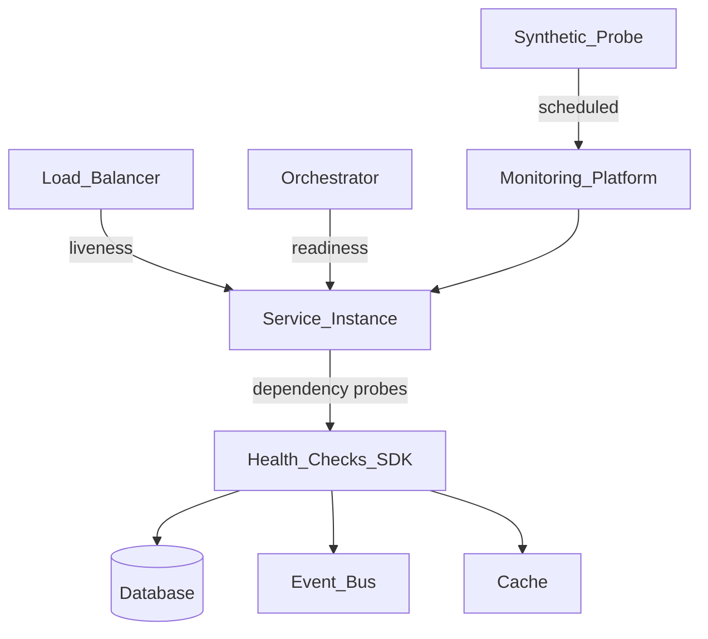
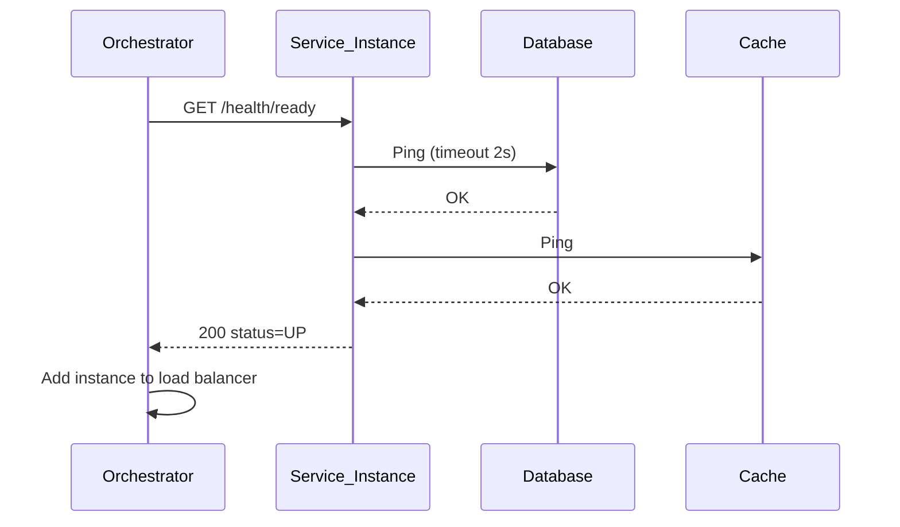
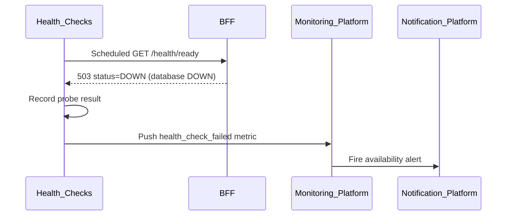

# Health Checks

> **Volume:** 2 | **Chapter ID:** v2-14 | **Status:** reviewed

## Purpose

The **Health Checks** platform service standardizes how EPB services report readiness, liveness, and dependency status. Load balancers, orchestrators, and the [Monitoring Platform](13-monitoring-platform.md) consume these endpoints to route traffic and detect failures. A unified health contract prevents every team from inventing incompatible `/health` responses.

## Architecture



Each service embeds the health SDK. The Health Checks service aggregates platform-wide synthetic probes and publishes probe definitions.

## Responsibilities

### In Scope

- Standard health endpoint contract: `/health/live`, `/health/ready`, `/health/startup`
- Dependency check registry per service (database, cache, queue, external API)
- Health status enumeration: `UP`, `DOWN`, `DEGRADED`, `UNKNOWN`
- Response schema with per-dependency detail and latency
- Synthetic probe scheduling for critical user journeys
- Platform health dashboard aggregation
- Graceful shutdown signaling (drain mode)
- Health check result export to Monitoring Platform

### Out of Scope

- Deep application logic validation (belongs in integration tests)
- Business transaction monitoring ([Monitoring Platform](13-monitoring-platform.md))
- Auto-remediation and failover (infrastructure/orchestrator responsibility)
- Log and trace collection ([Logging Platform](11-logging-platform.md))

## API Design

### Per-Service Endpoints (embedded in every service)

| Method | Path | Description |
|--------|------|-------------|
| GET | /health/live | Process is running (no dependency checks) |
| GET | /health/ready | Ready to accept traffic (all required deps UP) |
| GET | /health/startup | Initial boot complete (for slow-start services) |
| GET | /health | Combined detail view (internal/diagnostic) |

### Health Checks Platform API

Base path: `/health-checks/v1`

| Method | Path | Description |
|--------|------|-------------|
| GET | /probes | List synthetic probe definitions |
| POST | /probes | Register synthetic probe |
| GET | /probes/{probeId}/results | Recent probe results |
| GET | /platform/status | Aggregated platform health summary |
| GET | /services/{serviceName}/status | Service fleet health |

### Health Response Schema

```json
{
  "status": "UP",
  "service": "resource-service",
  "version": "2.1.0",
  "uptimeSeconds": 86400,
  "checks": [
    {
      "name": "database",
      "status": "UP",
      "latencyMs": 3,
      "required": true
    },
    {
      "name": "event-bus",
      "status": "DEGRADED",
      "latencyMs": 250,
      "required": false,
      "message": "Elevated publish latency"
    }
  ]
}
```

`ready` returns HTTP 503 when any `required: true` check is `DOWN`.

Follow [API Standards](../Volume-1-Foundation/18-api-standards.md).

## Database Design

| Table | Key Columns | Purpose |
|-------|-------------|---------|
| `synthetic_probes` | `probe_id`, `name`, `target_url`, `interval_seconds`, `timeout_ms` | Probe definitions |
| `probe_results` | `probe_id`, `status`, `latency_ms`, `checked_at`, `details_json` | Historical results |
| `service_health_registry` | `service_name`, `health_url`, `registered_at` | Fleet catalog |
| `dependency_check_templates` | `dependency_type`, `probe_logic`, `default_timeout_ms` | SDK templates |

Indexes: `(probe_id, checked_at DESC)` for result history; TTL on `probe_results` per retention policy.

## Folder Structure

```text
libraries/health-checks/     # Shared SDK embedded in all services
├── checks/
│   ├── database.ts
│   ├── cache.ts
│   └── http.ts
└── endpoints/               # Standard route handlers

services/health-checks/      # Synthetic probe orchestrator
├── api/
├── domain/
│   ├── probes/              # Schedule and execute probes
│   └── aggregation/         # Platform status rollup
├── persistence/
└── tests/
```

## Sequence Diagrams

### Readiness Gate



### Synthetic Probe Failure



## Extension Points

- **Custom dependency checks** — register probe functions in service SDK
- **Tenant-scoped probes** — validate multi-tenant routing for critical paths
- **Degraded mode** — optional dependencies marked `required: false`

## Integration

- **Depends on:** Monitoring Platform, Configuration Service
- **Events published:** `health.probe.failed`, `health.probe.recovered`
- **Events consumed:** `service.deployed` (register health URL)
- **Consumers:** Load balancers, orchestrators, Monitoring Platform, status pages

## Best Practices

1. Keep liveness checks trivial — only verify process responsiveness
2. Readiness must include all dependencies needed for correct request handling
3. Set aggressive timeouts on dependency probes (1–3 seconds)
4. Return structured JSON — never plain `OK` text
5. During deploy, support startup probe for slow initialization

## Anti-Patterns

| Anti-Pattern | Why It Fails | Preferred Approach |
|--------------|--------------|-------------------|
| Single `/health` doing everything | LB cannot distinguish crash vs dependency failure | Separate live/ready endpoints |
| Checking optional deps as required | Unnecessary traffic drain | `required` flag per dependency |
| No timeout on dependency probes | Hung health check blocks orchestrator | Configurable timeout per check |
| Health endpoint behind auth | Load balancer cannot probe | Unauthenticated live/ready only |
| Silencing degraded dependencies | Slow failures undetected | Report DEGRADED with metrics |

## Related Chapters

- [Previous: Monitoring Platform](13-monitoring-platform.md)
- [Next: Notification Platform](15-notification-platform.md)
- [Logging Platform](11-logging-platform.md)
- [EPB Glossary](../docs/GLOSSARY.md)

---

*Enterprise Platform Blueprint — Volume 2*
