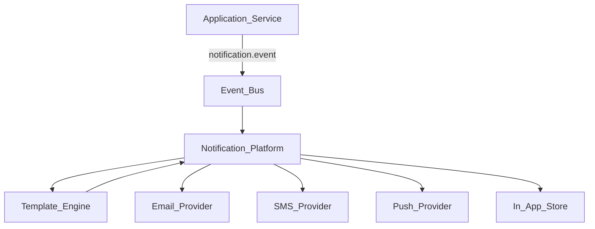

# Notification Platform

> **Volume:** 2 | **Chapter ID:** v2-15 | **Status:** reviewed

## Purpose

Centralized notification service supporting Email, SMS, WhatsApp, Push, and In-App channels. Business logic publishes events; the platform prepares and delivers the final message.

## Architecture



### Message Resolution Chain

```text
Platform Default Template
        ↓
Optional Customer Override
        ↓
Final Message
```

## Responsibilities

### In Scope

- Receive notification events from any application
- Resolve templates (platform default + tenant override)
- Route to correct channel provider
- Track delivery status
- Retry failed deliveries
- Store in-app notifications

### Out of Scope

- Deciding *when* to notify (application business logic)
- Template content authoring UI (may be separate admin tool)
- Marketing campaign management

## API Design

### Base Path

`/notifications/v1`

| Method | Path | Description |
|--------|------|-------------|
| POST | /events | Publish notification event |
| GET | /in-app | List in-app notifications for user |
| PATCH | /in-app/{id}/read | Mark as read |
| GET | /deliveries/{id} | Delivery status |

### Event Payload

```json
{
  "eventType": "order.shipped",
  "tenantId": "tenant-uuid",
  "recipientId": "user-uuid",
  "channels": ["email", "push"],
  "variables": {
    "orderNumber": "ORD-12345",
    "trackingUrl": "https://..."
  }
}
```

## Database Design

| Table | Purpose |
|-------|---------|
| notification_events | Incoming events |
| notification_deliveries | Per-channel delivery records |
| in_app_notifications | User notification inbox |
| channel_configs | Tenant channel credentials (encrypted) |

## Sequence Diagram

See [Notification Flow](../Sequence-Diagrams/notification-flow.md).

## Extension Points

- Custom channel adapters (plugin interface)
- Tenant template overrides per event type
- Delivery preference rules per user

## Integration

- **Depends on:** Template Engine, Event Bus, Configuration Service
- **Events published:** `notification.sent`, `notification.failed`
- **Events consumed:** Any `*.notify` domain events

## Best Practices

1. Applications never send email/SMS directly — always publish events
2. Idempotent event processing (dedupe by event ID)
3. Respect user channel preferences and opt-outs
4. Never log message content containing PII in plain text

## Anti-Patterns

| Anti-Pattern | Preferred Approach |
|--------------|-------------------|
| App sends SMTP directly | Publish notification event |
| Hardcoded email templates in app code | Template Engine |
| Synchronous notification in request path | Async via event bus |

## Related Chapters

- [Template Engine](16-template-engine.md)
- [Event Bus](30-event-bus.md)
- [EPB Glossary](../docs/GLOSSARY.md)

---

*Enterprise Platform Blueprint — Volume 2*
