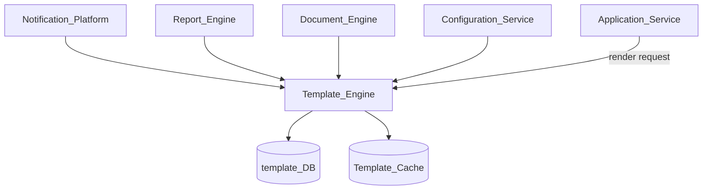
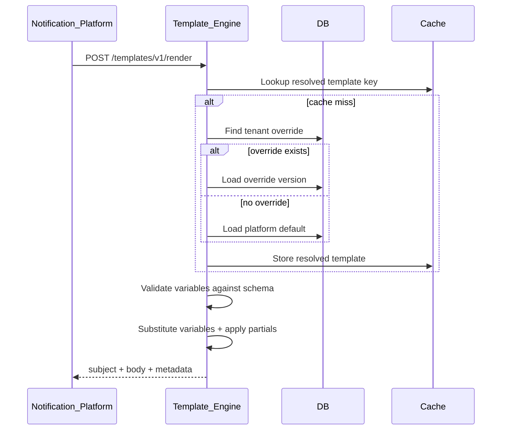
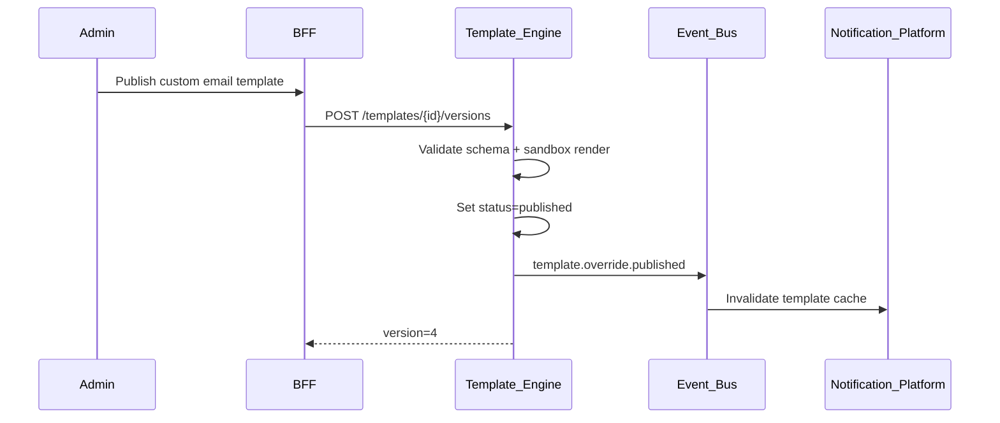

# Template Engine

> **Volume:** 2 | **Chapter ID:** v2-16 | **Status:** reviewed

## Purpose

The **Template Engine** platform service renders structured content from versioned templates with variable substitution. It powers notifications, reports, documents, and any channel that needs consistent, tenant-customizable messaging. Applications supply event type and variables; the engine resolves the correct template and returns the final rendered output.

## Architecture



### Message Resolution Chain

Every rendered message follows this precedence (from platform design):

```text
Platform Default Template
        ↓
Optional Tenant Override
        ↓
Final Message
```

Tenant overrides cannot remove required variables or bypass platform safety rules.

## Responsibilities

### In Scope

- Template CRUD with versioning and lifecycle (draft, published, archived)
- Variable schema definition and validation per template
- Render API: merge variables into template body (text, HTML, JSON payloads)
- Locale-aware template selection with fallback chain
- Platform default templates shipped with EPB
- Tenant override templates per event type and channel
- Preview and test-render without delivery
- Template inheritance and partials (headers, footers, legal blocks)

### Out of Scope

- Message delivery ([Notification Platform](15-notification-platform.md))
- Deciding when to send a message (application business logic)
- WYSIWYG authoring UI (may be separate admin tool or Volume 3 guide)
- PDF layout engine specifics ([Document Engine](24-document-engine.md) consumes rendered HTML)

## API Design

### Base Path

`/templates/v1`

### Core Endpoints

| Method | Path | Description |
|--------|------|-------------|
| GET | /templates | List templates (filter by eventType, channel, locale) |
| GET | /templates/{id} | Get template metadata and current version |
| POST | /templates | Create template (platform or tenant scope) |
| PUT | /templates/{id} | Update metadata |
| POST | /templates/{id}/versions | Publish new version |
| GET | /templates/{id}/versions/{version} | Get specific version content |
| POST | /render | Render template with variables |
| POST | /render/preview | Test render without persisting |
| GET | /defaults/{eventType} | Get platform default for event type |
| PUT | /overrides/{eventType} | Set tenant override for event type |
| DELETE | /overrides/{eventType} | Remove tenant override (revert to default) |

### Render Request

```json
{
  "tenantId": "tenant-uuid",
  "eventType": "entity.approved",
  "channel": "email",
  "locale": "en-US",
  "variables": {
    "entityName": "Resource-42",
    "approverName": "Alex Chen",
    "actionUrl": "https://app.example/entities/42"
  },
  "format": "html"
}
```

### Render Response

```json
{
  "subject": "Resource Resource-42 has been approved",
  "body": "<html>...</html>",
  "plainText": "Resource Resource-42 has been approved by Alex Chen.",
  "templateId": "tpl-uuid",
  "templateVersion": 3,
  "resolvedFrom": "tenant_override"
}
```

`resolvedFrom` values: `platform_default`, `tenant_override`, `locale_fallback`.

### Variable Schema

Each template version defines required and optional variables:

```json
{
  "variables": {
    "entityName": { "type": "string", "required": true },
    "actionUrl": { "type": "url", "required": true },
    "notes": { "type": "string", "required": false, "maxLength": 500 }
  }
}
```

Render fails with `422` if required variables are missing or invalid.

Follow [API Standards](../Volume-1-Foundation/18-api-standards.md).

## Database Design

| Table | Key Columns | Purpose |
|-------|-------------|---------|
| `tpl_templates` | `template_id`, `tenant_id`, `event_type`, `channel`, `status` | Template registry |
| `tpl_versions` | `template_id`, `version`, `subject`, `body`, `schema_json`, `locale` | Immutable version content |
| `tpl_overrides` | `tenant_id`, `event_type`, `channel`, `template_id` | Tenant override mapping |
| `tpl_partials` | `partial_key`, `tenant_id`, `body`, `locale` | Reusable fragments |
| `tpl_render_log` | `request_id`, `template_id`, `duration_ms`, `resolved_from` | Performance and audit (no PII body) |
| `tpl_audit_log` | `event_type`, `actor_id`, `template_id`, `created_at` | Change history |

Platform defaults use `tenant_id = 'platform'`. Tenant overrides reference either platform template IDs or tenant-owned templates.

## Folder Structure

```text
services/template-engine/
├── api/
├── domain/
│   ├── resolver/     # Default → override resolution
│   ├── renderer/     # Variable substitution engine
│   ├── validator/    # Schema validation
│   └── locale/       # Fallback chain logic
├── persistence/
├── templates/        # Shipped platform default files (seed)
├── mappers/
├── events/           # template.published, template.override.set
└── tests/
```

## Sequence Diagrams

### Notification Render Chain



### Tenant Override Publish



## Extension Points

- **Syntax adapters** — Mustache, Handlebars, or custom delimiters via renderer plugin
- **Variable transformers** — format dates, currency, and localized numbers per tenant locale
- **Content filters** — HTML sanitization, link rewriting, tracking pixel injection (opt-in)
- **Approval workflow** — require review before tenant override goes live (integrates with Workflow Engine)

## Integration

- **Depends on:** Configuration Service (locale defaults), Localization Platform (resource bundles for static strings)
- **Consumers:** Notification Platform (primary), Report Engine, Document Engine, Scheduler (scheduled report bodies)
- **Events published:** `template.published`, `template.override.set`, `template.override.removed`
- **Events consumed:** `tenant.provisioned` (seed default overrides slot), `locale.added` (locale fallback registration)

## Best Practices

1. Version every publish — never mutate published template content in place
2. Validate variables before render; fail fast with clear error codes
3. Keep platform defaults domain-neutral ("entity", "resource", not industry terms)
4. Sanitize HTML output when templates accept user-supplied variable values
5. Cache resolved template + version hash; invalidate on publish events
6. Log render metrics (duration, template ID) without logging rendered body containing PII

## Anti-Patterns

| Anti-Pattern | Why It Fails | Preferred Approach |
|--------------|--------------|-------------------|
| Hardcoded email strings in application code | No tenant customization, translation pain | Template Engine + event types |
| Single global template per event | Tenants cannot brand messages | Platform default + tenant override |
| Mutating published versions | Audit gaps, inconsistent deliveries | Immutable versions, publish new |
| Skipping variable validation | Runtime render failures in production | JSON schema per template version |
| Embedding delivery logic in templates | Couples content to channels | Render only; Notification Platform delivers |

## Related Chapters

- [Previous: Notification Platform](15-notification-platform.md)
- [Next: Scheduler Platform](17-scheduler-platform.md)
- [Document Engine](24-document-engine.md)
- [EPB Glossary](../docs/GLOSSARY.md)

---

*Enterprise Platform Blueprint — Volume 2*
