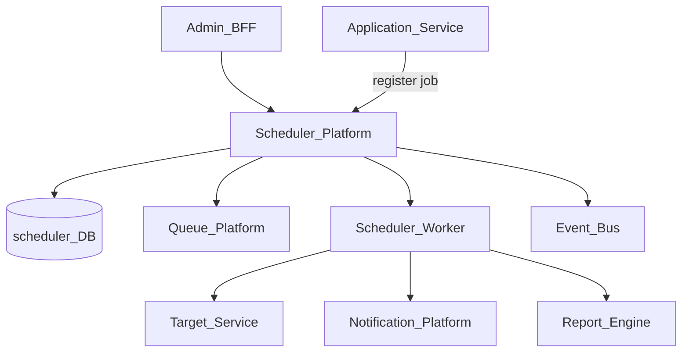
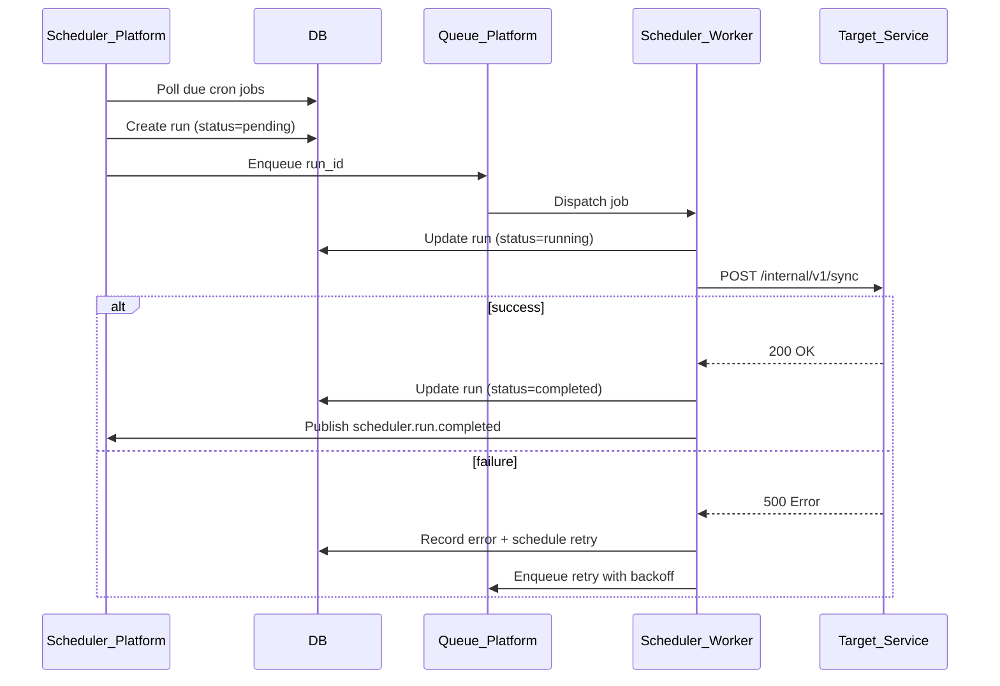
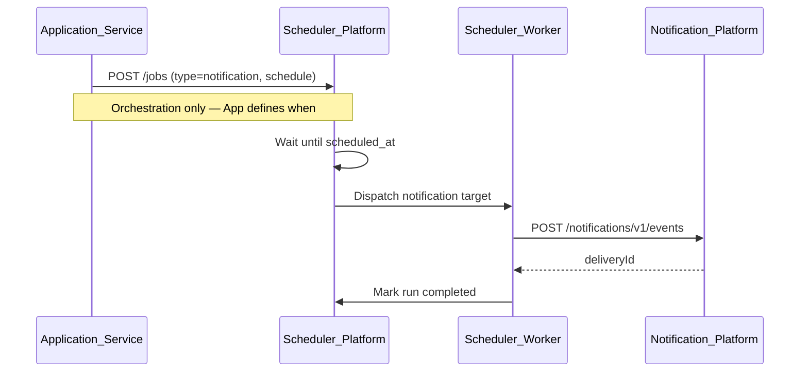

# Scheduler Platform

> **Volume:** 2 | **Chapter ID:** v2-17 | **Status:** reviewed

## Purpose

The **Scheduler** platform service is the central orchestration layer for time-based and deferred work across EPB. It registers cron jobs, dispatches queue processing, coordinates retries, and triggers scheduled reports, notifications, and maintenance tasks. **Scheduler contains orchestration only** — business processing always runs in the target application or platform service.

## Architecture



The scheduler decides *when* and *what to invoke*. Target services decide *how* to process.

## Responsibilities

### In Scope

- Cron job registration and execution (see [Scheduler Cron Jobs](47-scheduler-cron-jobs.md))
- Retry orchestration with exponential backoff (see [Scheduler Retry Processing](48-scheduler-retry-processing.md))
- Queue processing triggers — dequeue and dispatch to workers
- Scheduled report generation triggers
- Scheduled notification triggers (delegates to Notification Platform)
- Maintenance jobs: cache warming, index rebuilds, data retention
- Job run history, status tracking, and manual trigger/replay
- Dead-letter routing after max retries (via Queue Platform)

### Out of Scope

- Business logic inside job handlers (target service responsibility)
- Queue storage implementation ([Queue Platform](28-queue-platform.md))
- Report SQL and layout ([Report Engine](23-report-engine.md))
- Message template rendering ([Template Engine](16-template-engine.md))

## API Design

### Base Path

`/scheduler/v1`

### Job Definition Endpoints

| Method | Path | Description |
|--------|------|-------------|
| GET | /jobs | List job definitions (paginated) |
| GET | /jobs/{jobId} | Get job definition |
| POST | /jobs | Register new scheduled job |
| PUT | /jobs/{jobId} | Update job definition |
| PATCH | /jobs/{jobId}/status | Enable or disable job |
| DELETE | /jobs/{jobId} | Soft-delete job definition |
| POST | /jobs/{jobId}/trigger | Manual immediate execution |

### Job Run Endpoints

| Method | Path | Description |
|--------|------|-------------|
| GET | /runs | List job runs (filter by status, jobId, date range) |
| GET | /runs/{runId} | Get run detail and step log |
| POST | /runs/{runId}/retry | Retry failed run |
| POST | /runs/{runId}/cancel | Cancel in-progress run |

### Create Job Request

```json
{
  "tenantId": "tenant-uuid",
  "name": "nightly-entity-sync",
  "jobType": "cron",
  "schedule": "0 2 * * *",
  "timezone": "UTC",
  "target": {
    "type": "http",
    "service": "entity-service",
    "path": "/internal/v1/sync",
    "method": "POST"
  },
  "retryPolicy": {
    "maxAttempts": 3,
    "backoffSeconds": [60, 300, 900]
  },
  "timeoutSeconds": 3600,
  "idempotencyKey": "entity-sync-nightly"
}
```

### Job Types

| Type | Description | Example |
|------|-------------|---------|
| `cron` | Recurring schedule | Nightly aggregation |
| `one_time` | Execute at specific timestamp | Maintenance window |
| `interval` | Fixed interval repeat | Queue poll every 30s |
| `retry` | Retry wrapper for failed operations | Failed export retry |
| `maintenance` | Platform housekeeping | Session cleanup |

### Supported Target Types

| Target | Invokes |
|--------|---------|
| `http` | Internal REST endpoint on application service |
| `event` | Publishes event to Event Bus |
| `notification` | Notification Platform scheduled send |
| `report` | Report Engine generation job |
| `queue` | Queue Platform process trigger |

Follow [API Standards](../Volume-1-Foundation/18-api-standards.md).

## Database Design

| Table | Key Columns | Purpose |
|-------|-------------|---------|
| `sched_jobs` | `job_id`, `tenant_id`, `job_type`, `schedule`, `target_json`, `status` | Job definitions |
| `sched_job_runs` | `run_id`, `job_id`, `scheduled_at`, `started_at`, `finished_at`, `status` | Execution history |
| `sched_run_steps` | `run_id`, `step_order`, `target`, `status`, `error_message` | Multi-step orchestration log |
| `sched_retry_queue` | `retry_id`, `run_id`, `attempt`, `next_attempt_at`, `payload_json` | Pending retries |
| `sched_locks` | `lock_key`, `holder_id`, `expires_at` | Distributed leader election |
| `sched_audit_log` | `event_type`, `job_id`, `actor_id`, `created_at` | Admin change audit |

Run statuses: `pending`, `running`, `completed`, `failed`, `cancelled`, `dead_lettered`.

Indexes: `(next_attempt_at)` on retry queue; `(tenant_id, status)` on runs for dashboards.

## Folder Structure

```text
services/scheduler/
├── api/
├── domain/
│   ├── cron/         # Cron expression evaluation
│   ├── dispatcher/   # Target invocation
│   ├── retry/        # Backoff and retry logic
│   └── lock/         # Leader election
├── worker/           # Job execution runtime
├── persistence/
├── adapters/
│   ├── http/         # Internal HTTP caller
│   ├── event/        # Event Bus publisher
│   └── queue/        # Queue Platform integration
├── mappers/
├── events/           # scheduler.run.completed, scheduler.run.failed
└── tests/
```

## Sequence Diagrams

### Cron Job Execution



### Scheduled Notification



See also [Scheduler Flow](../Sequence-Diagrams/scheduler-flow.md).

## Extension Points

- **Custom target adapters** — invoke gRPC, message broker, or webhook endpoints
- **Tenant job quotas** — max concurrent runs and cron density limits
- **Holiday calendars** — skip execution on tenant-configured non-business days
- **Run hooks** — pre/post execution events for monitoring integrations

## Integration

- **Depends on:** Queue Platform, Configuration Service, Audit Platform, Event Bus
- **Delegates to:** Notification Platform, Report Engine, application internal APIs
- **Events published:** `scheduler.job.registered`, `scheduler.run.started`, `scheduler.run.completed`, `scheduler.run.failed`, `scheduler.run.dead_lettered`
- **Events consumed:** `tenant.provisioned` (default maintenance jobs), `application.deployed` (re-register webhooks)

## Best Practices

1. Orchestration only — never embed domain rules in scheduler workers
2. Idempotent targets — jobs may run more than once; handlers must tolerate duplicates
3. Use `idempotencyKey` on job definitions to prevent duplicate registrations
4. Set timeouts on every target invocation; do not let runs hang indefinitely
5. Route exhausted retries to dead-letter queue with alert to Monitoring Platform
6. Store correlation ID from originating request through run logs

## Anti-Patterns

| Anti-Pattern | Why It Fails | Preferred Approach |
|--------------|--------------|-------------------|
| Cron logic inside application code | No central visibility, duplicate schedulers | Register jobs with Scheduler Platform |
| Scheduler executes SQL or business rules | Violates orchestration-only boundary | HTTP/event target to owning service |
| Infinite retry without backoff | Overwhelms failing downstream | Configured max attempts + dead letter |
| Shared cron on application servers | Missed runs during deploys | Central scheduler with distributed locks |
| Synchronous long jobs in HTTP request | Blocks worker pool | Async run with status polling |

## Related Chapters

- [Previous: Template Engine](16-template-engine.md)
- [Next: Roster Platform](18-roster-platform.md)
- [Scheduler Cron Jobs](47-scheduler-cron-jobs.md)
- [Scheduler Retry Processing](48-scheduler-retry-processing.md)
- [Queue Platform](28-queue-platform.md)
- [EPB Glossary](../docs/GLOSSARY.md)

---

*Enterprise Platform Blueprint — Volume 2*
