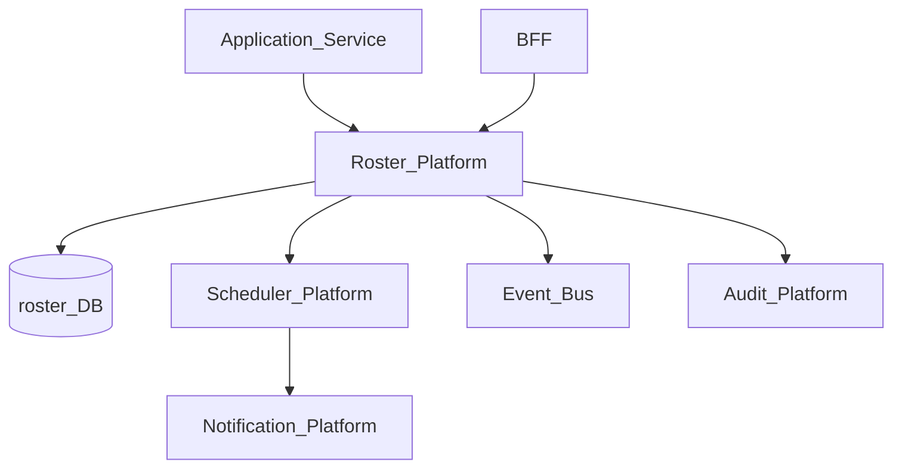
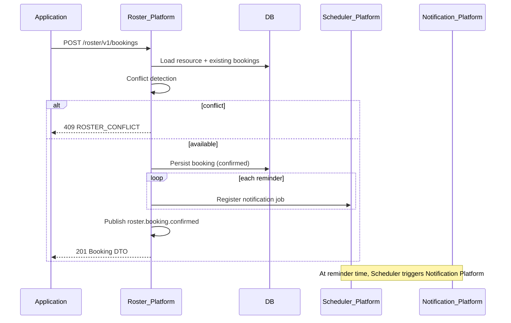
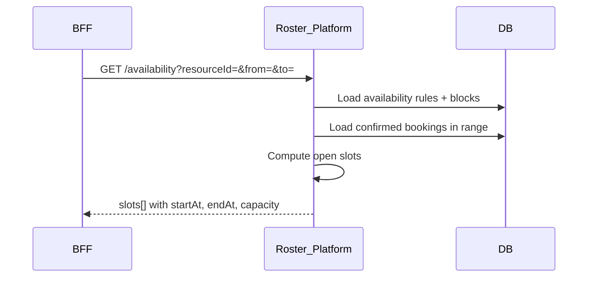

# Roster Platform

> **Volume:** 2 | **Chapter ID:** v2-18 | **Status:** reviewed

## Purpose

The **Roster** platform service is a reusable scheduling engine for time-based resource allocation across every EPB application. It manages appointments, availability windows, meetings, class sessions, shift assignments, registrations, and resource bookings on a shared calendar model with built-in conflict detection and reminder orchestration. Applications define *what* is being scheduled; Roster defines *when* resources are occupied.

## Architecture



Roster persists schedule state. Reminder delivery flows through Scheduler → Notification Platform.

## Responsibilities

### In Scope

- Calendar and slot management for people, rooms, equipment, and abstract resources
- Availability rules: working hours, blackout dates, capacity limits
- Booking lifecycle: hold, confirm, reschedule, cancel, no-show
- Conflict detection before commit (see [Roster Conflict Detection](51-roster-conflict-detection.md))
- Recurring patterns: daily, weekly, custom RRULE-style schedules
- Multi-participant meetings and class rosters with capacity
- Shift scheduling with overlap and rest-period rules
- Registration slots with waitlist promotion
- Reminder scheduling via Scheduler Platform (not direct notification send)
- Timezone-aware display and storage (UTC internally)

### Out of Scope

- Domain-specific booking rules (e.g., medical triage priority) — application layer
- Payment or billing for booked slots
- Calendar UI rendering (frontend/BFF)
- Video conferencing provider integration (application adapter)
- Message content for reminders ([Template Engine](16-template-engine.md))

## API Design

### Base Path

`/roster/v1`

### Resource and Calendar Endpoints

| Method | Path | Description |
|--------|------|-------------|
| GET | /resources | List schedulable resources |
| POST | /resources | Register schedulable resource |
| GET | /resources/{id}/calendar | Calendar view for date range |
| PUT | /resources/{id}/availability | Set availability rules |

### Booking Endpoints

| Method | Path | Description |
|--------|------|-------------|
| GET | /bookings | List bookings (filter by resource, participant, status) |
| GET | /bookings/{id} | Get booking detail |
| POST | /bookings | Create booking (with conflict check) |
| POST | /bookings/hold | Temporary hold (expires if not confirmed) |
| POST | /bookings/{id}/confirm | Confirm held slot |
| PATCH | /bookings/{id} | Reschedule or update participants |
| DELETE | /bookings/{id} | Cancel booking |
| POST | /bookings/check-conflicts | Dry-run conflict check |

### Availability Endpoints

| Method | Path | Description |
|--------|------|-------------|
| GET | /availability | Query open slots for resource(s) and date range |
| POST | /availability/blocks | Add blackout or maintenance block |
| DELETE | /availability/blocks/{id} | Remove block |

### Create Booking Request

```json
{
  "tenantId": "tenant-uuid",
  "bookingType": "appointment",
  "resourceIds": ["resource-uuid"],
  "participantIds": ["user-uuid-1", "user-uuid-2"],
  "startAt": "2026-08-15T10:00:00Z",
  "endAt": "2026-08-15T10:30:00Z",
  "timezone": "America/New_York",
  "metadata": {
    "sourceEntityId": "entity-uuid",
    "notes": "Initial consultation"
  },
  "reminders": [
    { "offsetMinutes": 1440, "channels": ["email", "push"] },
    { "offsetMinutes": 30, "channels": ["push"] }
  ]
}
```

### Booking Types

| Type | Use Case |
|------|----------|
| `appointment` | One-to-one or one-to-few time slot |
| `meeting` | Multi-participant with room resource |
| `class` | Fixed capacity session |
| `shift` | Workforce shift assignment |
| `registration` | Open enrollment slot |
| `resource_booking` | Equipment or room reservation |

### Conflict Response (409)

```json
{
  "code": "ROSTER_CONFLICT",
  "conflicts": [
    {
      "resourceId": "resource-uuid",
      "existingBookingId": "booking-uuid",
      "overlapStart": "2026-08-15T10:15:00Z",
      "overlapEnd": "2026-08-15T10:30:00Z"
    }
  ]
}
```

Follow [API Standards](../Volume-1-Foundation/18-api-standards.md).

## Database Design

| Table | Key Columns | Purpose |
|-------|-------------|---------|
| `roster_resources` | `resource_id`, `tenant_id`, `resource_type`, `capacity`, `timezone` | Schedulable entities |
| `roster_availability_rules` | `resource_id`, `day_of_week`, `start_time`, `end_time`, `effective_from` | Recurring availability |
| `roster_availability_blocks` | `resource_id`, `start_at`, `end_at`, `block_type` | Blackouts and maintenance |
| `roster_bookings` | `booking_id`, `tenant_id`, `booking_type`, `start_at`, `end_at`, `status` | Booking header |
| `roster_booking_resources` | `booking_id`, `resource_id` | Many-to-many resource assignment |
| `roster_booking_participants` | `booking_id`, `participant_id`, `role` | Attendees, hosts, waitlist |
| `roster_holds` | `hold_id`, `booking_id`, `expires_at` | Temporary reservation locks |
| `roster_reminders` | `booking_id`, `offset_minutes`, `channels_json`, `scheduler_job_id` | Reminder schedule refs |
| `roster_recurrence` | `booking_id`, `rrule`, `parent_booking_id` | Recurring series |
| `roster_audit_log` | `event_type`, `booking_id`, `actor_id`, `created_at` | Change history |

Booking statuses: `held`, `confirmed`, `cancelled`, `completed`, `no_show`.

## Folder Structure

```text
services/roster/
├── api/
├── domain/
│   ├── availability/   # Slot generation
│   ├── booking/        # Lifecycle state machine
│   ├── conflict/       # Overlap detection
│   ├── recurrence/     # Series expansion
│   └── reminder/       # Scheduler job registration
├── persistence/
├── mappers/
├── events/             # roster.booking.confirmed, roster.booking.cancelled
└── tests/
```

## Sequence Diagrams

### Book with Conflict Detection



### Availability Query



See also [Roster Flow](../Sequence-Diagrams/roster-flow.md).

## Extension Points

- **Conflict strategies** — `strict`, `allow_buffer`, `capacity_soft_limit` per booking type
- **Resource type plugins** — custom capacity and eligibility rules
- **Waitlist handler** — auto-promote on cancellation via event subscription
- **External calendar sync** — optional adapter for inbound/outbound iCal (tenant-scoped)

## Integration

- **Depends on:** Scheduler Platform (reminders), Audit Platform, Configuration Service
- **Delegates reminders to:** Scheduler → Notification Platform
- **Events published:** `roster.booking.confirmed`, `roster.booking.rescheduled`, `roster.booking.cancelled`, `roster.slot.released`
- **Events consumed:** `user.deactivated` (cancel future bookings), `resource.deleted` (archive bookings)
- **Related deep dives:** [Roster Appointments](49-roster-appointments.md), [Roster Availability](50-roster-availability.md), [Roster Conflict Detection](51-roster-conflict-detection.md)

## Best Practices

1. Store all timestamps in UTC; convert to local timezone only at presentation
2. Always call conflict check before confirm; use `/hold` for multi-step user flows
3. Register reminders through Scheduler — never call Notification Platform directly
4. Include `sourceEntityId` in metadata to link bookings to application entities
5. Use idempotency keys on booking create to prevent duplicate submissions
6. Expire holds automatically; release slots back to availability pool

## Anti-Patterns

| Anti-Pattern | Why It Fails | Preferred Approach |
|--------------|--------------|-------------------|
| Per-app calendar tables | Inconsistent conflict rules, no cross-app booking | Roster Platform APIs |
| Client-side conflict check only | Race conditions on concurrent booking | Server-side conflict detection |
| Direct reminder emails from app | Bypasses template and preference rules | Scheduler + Notification chain |
| Storing local time without timezone | DST and multi-region errors | UTC storage + IANA timezone field |
| Hard-coded slot duration in Roster | Wrong abstraction for diverse apps | Application passes start/end or duration |

## Related Chapters

- [Previous: Scheduler Platform](17-scheduler-platform.md)
- [Next: Workflow Engine](19-workflow-engine.md)
- [Notification Platform](15-notification-platform.md)
- [EPB Glossary](../docs/GLOSSARY.md)

---

*Enterprise Platform Blueprint — Volume 2*
