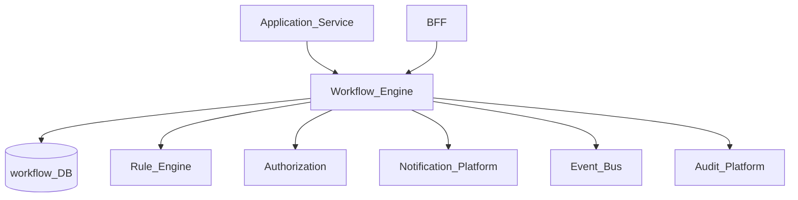
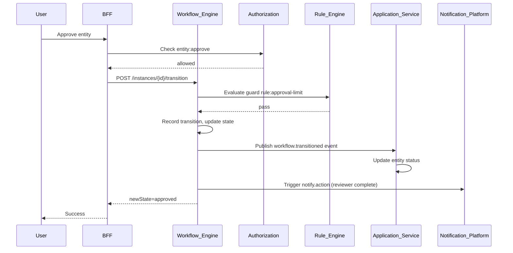
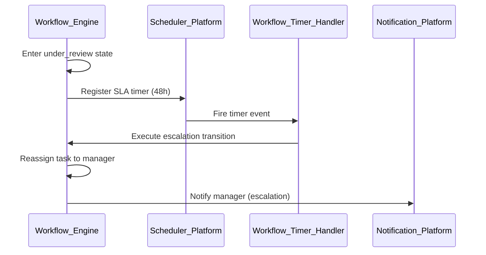

# Workflow Engine

> **Volume:** 2 | **Chapter ID:** v2-19 | **Status:** reviewed

## Purpose

The **Workflow Engine** platform service orchestrates multi-step business processes using explicit state machines. It tracks where each entity instance sits in a defined process, enforces valid transitions, assigns tasks to actors, and emits events when state changes. Applications define workflow definitions; the engine executes them consistently across every domain built on EPB.

## Architecture



Workflow governs process state. Business data remains in application services; workflow stores instance state and transition history only.

## Responsibilities

### In Scope

- Workflow definition CRUD: states, transitions, guards, actions
- Workflow instance lifecycle: start, transition, suspend, resume, terminate
- Human tasks: assign, claim, complete, delegate, escalate
- Automatic transitions triggered by events or timers
- Guard evaluation via Rule Engine integration
- Parallel branches and join gateways (fork/join patterns)
- Sub-workflow invocation
- SLA timers and escalation paths
- Full transition audit trail per instance
- Versioned definitions — running instances stay on their started version

### Out of Scope

- Entity CRUD and domain validation (application services)
- Complex business rule authoring UI ([Rule Engine](20-rule-engine.md))
- UI task inbox rendering (frontend/BFF aggregates tasks)
- Long-running batch processing ([Scheduler Platform](17-scheduler-platform.md))

## API Design

### Base Path

`/workflows/v1`

### Definition Endpoints

| Method | Path | Description |
|--------|------|-------------|
| GET | /definitions | List workflow definitions |
| GET | /definitions/{key} | Get latest published version |
| GET | /definitions/{key}/versions/{version} | Get specific version |
| POST | /definitions | Create draft definition |
| POST | /definitions/{key}/publish | Publish draft as new version |
| POST | /definitions/{key}/validate | Validate graph (no orphan states) |

### Instance Endpoints

| Method | Path | Description |
|--------|------|-------------|
| POST | /instances | Start workflow for entity |
| GET | /instances/{id} | Get instance state and history |
| GET | /instances | List instances (filter by definition, status, entity) |
| POST | /instances/{id}/transition | Execute named transition |
| POST | /instances/{id}/suspend | Pause instance |
| POST | /instances/{id}/resume | Resume suspended instance |
| POST | /instances/{id}/terminate | Force terminal state |

### Task Endpoints

| Method | Path | Description |
|--------|------|-------------|
| GET | /tasks | List open tasks for assignee |
| GET | /tasks/{id} | Get task detail |
| POST | /tasks/{id}/claim | Claim unassigned task |
| POST | /tasks/{id}/complete | Complete with outcome payload |
| POST | /tasks/{id}/delegate | Reassign to another user |

### Start Instance Request

```json
{
  "tenantId": "tenant-uuid",
  "definitionKey": "entity-approval",
  "definitionVersion": 2,
  "entityType": "entity",
  "entityId": "entity-uuid",
  "initiatorId": "user-uuid",
  "variables": {
    "amount": 15000,
    "departmentId": "org-uuid"
  },
  "idempotencyKey": "entity-uuid-approval"
}
```

### Transition Request

```json
{
  "transition": "approve",
  "actorId": "user-uuid",
  "comment": "Meets policy requirements",
  "variables": {
    "approvedAmount": 15000
  }
}
```

### Definition Model (simplified)

```json
{
  "key": "entity-approval",
  "version": 2,
  "initialState": "submitted",
  "states": [
    { "name": "submitted", "type": "active" },
    { "name": "under_review", "type": "active" },
    { "name": "approved", "type": "terminal" },
    { "name": "rejected", "type": "terminal" }
  ],
  "transitions": [
    {
      "from": "submitted",
      "to": "under_review",
      "trigger": "auto",
      "actions": ["notify.reviewer"]
    },
    {
      "from": "under_review",
      "to": "approved",
      "trigger": "manual",
      "guard": "rule:approval-limit",
      "requiredPermission": "entity:approve"
    }
  ]
}
```

Follow [API Standards](../Volume-1-Foundation/18-api-standards.md).

## Database Design

| Table | Key Columns | Purpose |
|-------|-------------|---------|
| `wf_definitions` | `definition_id`, `key`, `version`, `status`, `graph_json` | Versioned workflow graphs |
| `wf_instances` | `instance_id`, `definition_id`, `entity_type`, `entity_id`, `current_state`, `status` | Running instances |
| `wf_variables` | `instance_id`, `key`, `value_json`, `scope` | Instance variable bag |
| `wf_transitions` | `transition_id`, `instance_id`, `from_state`, `to_state`, `actor_id`, `created_at` | Immutable history |
| `wf_tasks` | `task_id`, `instance_id`, `assignee_id`, `task_type`, `status`, `due_at` | Human task queue |
| `wf_timers` | `timer_id`, `instance_id`, `fire_at`, `action`, `scheduler_job_id` | SLA and delay timers |
| `wf_audit_log` | `event_type`, `instance_id`, `metadata_json`, `created_at` | Admin and compliance audit |

Instance statuses: `active`, `suspended`, `completed`, `terminated`. Task statuses: `open`, `claimed`, `completed`, `cancelled`.

## Folder Structure

```text
services/workflow-engine/
├── api/
├── domain/
│   ├── definition/   # Graph validation and versioning
│   ├── instance/     # State machine runtime
│   ├── task/         # Human task lifecycle
│   ├── guard/        # Rule Engine integration
│   └── action/       # Side-effect dispatch (notify, event)
├── persistence/
├── mappers/
├── events/           # workflow.transitioned, workflow.task.created
└── tests/
```

## Sequence Diagrams

### Approval Transition with Guard



### Timer-Based Escalation



See also [Workflow State Machine](52-workflow-state-machine.md).

## Extension Points

- **Action handlers** — register custom actions (`webhook`, `event`, `notification`)
- **Assignment resolvers** — round-robin, load-based, or org-hierarchy assignee selection
- **Guard plugins** — beyond Rule Engine: scriptable conditions (sandboxed)
- **Form schemas** — attach input schema to human tasks for BFF-driven UI

## Integration

- **Depends on:** Rule Engine (guards), Authorization (transition permissions), Scheduler Platform (timers), Notification Platform (task alerts), Audit Platform
- **Events published:** `workflow.instance.started`, `workflow.transitioned`, `workflow.task.created`, `workflow.task.completed`, `workflow.instance.completed`
- **Events consumed:** Application domain events may trigger automatic transitions (e.g., `entity.submitted` → start workflow)
- **Consumers:** Application services (react to transitions), BFF (task inbox), Audit Platform

## Best Practices

1. Keep workflow variables minimal — reference entity ID, fetch details from application service
2. Version definitions; never mutate published graphs in place
3. Idempotent instance start via `idempotencyKey` tied to entity
4. Terminal states must have no outbound transitions
5. Use Rule Engine for guards that change frequently; keep graph structure stable
6. Log every transition with actor, comment, and correlation ID

## Anti-Patterns

| Anti-Pattern | Why It Fails | Preferred Approach |
|--------------|--------------|-------------------|
| Hard-coded status enums in app only | No audit trail, inconsistent transitions | Workflow Engine state machine |
| Storing entity payload in workflow DB | Duplication, sync drift | Entity ID + variables; app owns data |
| Skipping permission check on transition | Privilege escalation | `requiredPermission` + Authorization |
| Editing live definition affecting in-flight instances | Broken instances | Immutable versions per instance |
| Synchronous 10-step chains in one HTTP call | Timeouts, no human task support | Instance + task model with events |

## Related Chapters

- [Previous: Roster Platform](18-roster-platform.md)
- [Next: Rule Engine](20-rule-engine.md)
- [Workflow State Machine](52-workflow-state-machine.md)
- [Scheduler Platform](17-scheduler-platform.md)
- [EPB Glossary](../docs/GLOSSARY.md)

---

*Enterprise Platform Blueprint — Volume 2*
