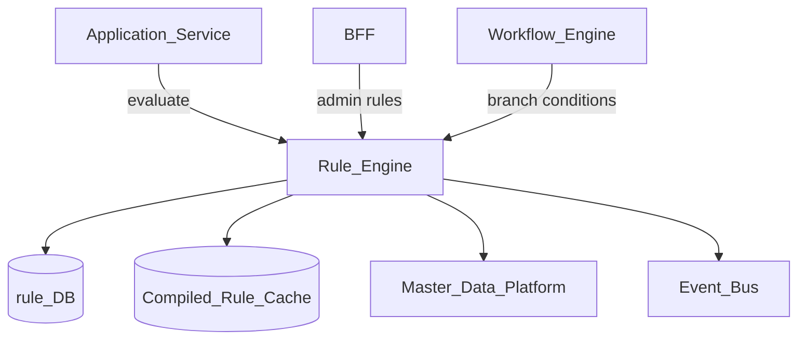
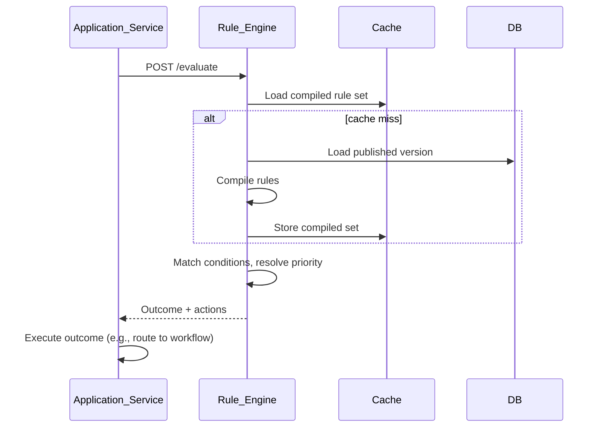
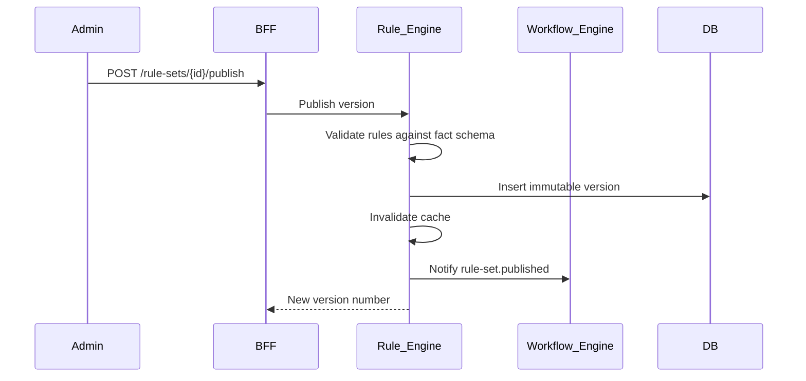

# Rule Engine

> **Volume:** 2 | **Chapter ID:** v2-20 | **Status:** reviewed

## Purpose

The **Rule Engine** evaluates declarative business rules against runtime context — eligibility, pricing tiers, approval thresholds, routing decisions. Unlike [Authorization](03-authorization.md) (who may act), rules answer *what should happen given these facts*. Applications supply facts; the engine returns decisions without embedding rule logic in application code.

## Architecture



Rules are versioned and tenant-scoped. Compiled rule sets cache in memory with invalidation on publish.

## Responsibilities

### In Scope

- Rule set CRUD: name, version, status (`draft`, `published`, `archived`)
- Declarative rule language: conditions (facts, operators) and actions (outcomes)
- Fact schema registration per rule domain
- Single and batch evaluation APIs
- Rule priority and conflict resolution (first-match, highest-priority, accumulate)
- Simulation and dry-run against sample facts
- Rule change audit trail
- Scheduled rule activation (effective date ranges)
- Integration hooks for workflow branching and notification triggers

### Out of Scope

- Identity and permission checks ([Authorization](03-authorization.md))
- Long-running process orchestration ([Workflow Engine](19-workflow-engine.md))
- Data persistence for business entities (application services)
- Complex ETL or analytics ([Report Engine](23-report-engine.md))

## API Design

### Base Path

`/rules/v1`

### Rule Administration

| Method | Path | Description |
|--------|------|-------------|
| GET | /rule-sets | List rule sets with filters |
| GET | /rule-sets/{setId} | Get rule set with rules |
| POST | /rule-sets | Create rule set |
| PUT | /rule-sets/{setId} | Update draft rules |
| POST | /rule-sets/{setId}/publish | Publish version |
| POST | /rule-sets/{setId}/simulate | Dry-run against input facts |
| GET | /rule-sets/{setId}/versions | Version history |

### Evaluation

| Method | Path | Description |
|--------|------|-------------|
| POST | /evaluate | Evaluate single rule set |
| POST | /evaluate/batch | Evaluate multiple sets in one call |
| POST | /facts/validate | Validate fact payload against schema |

### Evaluate Request

```json
{
  "tenantId": "tenant-uuid",
  "ruleSetKey": "approval-thresholds",
  "facts": {
    "entity": {
      "type": "resource",
      "amount": 15000,
      "category": "capital"
    },
    "actor": {
      "roleLevel": 3,
      "organizationId": "org-uuid"
    }
  },
  "options": {
    "trace": true
  }
}
```

### Evaluate Response

```json
{
  "outcome": "require_approval",
  "matchedRules": ["rule-capital-high"],
  "actions": [
    { "type": "assign_approver", "params": { "level": "director" } }
  ],
  "trace": ["rule-capital-high: condition matched"]
}
```

Follow [API Standards](../Volume-1-Foundation/18-api-standards.md).

## Database Design

| Table | Key Columns | Purpose |
|-------|-------------|---------|
| `rule_sets` | `set_id`, `tenant_id`, `key`, `name`, `status`, `current_version` | Rule set metadata |
| `rule_versions` | `version_id`, `set_id`, `version_number`, `rules_json`, `published_at` | Immutable published versions |
| `rule_fact_schemas` | `schema_id`, `domain_key`, `schema_json` | Input validation schemas |
| `rule_evaluation_log` | `eval_id`, `set_id`, `facts_hash`, `outcome`, `created_at` | Optional evaluation audit |
| `rule_drafts` | `set_id`, `rules_json`, `updated_by`, `updated_at` | Work-in-progress edits |

Indexes: `(tenant_id, key)` unique on rule_sets; `(set_id, version_number DESC)` on versions.

## Folder Structure

```text
services/rule-engine/
├── api/
├── domain/
│   ├── compiler/       # Parse and compile rules to executable form
│   ├── evaluator/      # Runtime evaluation engine
│   ├── conflicts/      # Priority and resolution strategies
│   └── simulation/     # Dry-run without side effects
├── persistence/
├── events/             # rule-set.published
└── tests/
```

## Sequence Diagrams

### Rule Evaluation in Application Flow



### Rule Publish



## Extension Points

- **Custom functions** — register safe built-in functions (math, date, string) per tenant
- **External fact providers** — enrich facts from Master Data Platform at evaluation time
- **Action handlers** — application-specific action types via event subscription

## Integration

- **Depends on:** Master Data Platform, Configuration Service, Audit Platform
- **Events published:** `rule-set.published`, `rule-set.archived`, `rule.evaluation.completed`
- **Events consumed:** `tenant.provisioned` (seed default rule sets), `master-data.updated` (invalidate fact cache)
- **Consumers:** Workflow Engine, application services, Notification Platform (via actions)

## Best Practices

1. Keep rules declarative — no arbitrary code in rule bodies
2. Version every publish; never mutate published versions
3. Use simulation before publishing to production tenants
4. Limit rule set complexity — split domains into separate sets
5. Log evaluation traces for disputed decisions (configurable per tenant)

## Anti-Patterns

| Anti-Pattern | Why It Fails | Preferred Approach |
|--------------|--------------|-------------------|
| Business rules in application if/else | Unchangeable without deploy | Rule Engine evaluation |
| Using Authorization for business logic | Wrong abstraction, no fact modeling | Separate rule sets |
| Mutable published rules | Audit and replay impossible | Immutable versions |
| Unbounded rule chains | Performance and debugging nightmares | Priority limits, set splitting |
| Embedding SQL in rules | Security and portability risk | Declarative fact comparisons |

## Related Chapters

- [Previous: Workflow Engine](19-workflow-engine.md)
- [Next: Search Platform](21-search-platform.md)
- [Rule Engine Evaluation](53-rule-engine-evaluation.md)
- [Workflow Engine](19-workflow-engine.md)
- [Authorization](03-authorization.md)
- [EPB Glossary](../docs/GLOSSARY.md)

---

*Enterprise Platform Blueprint — Volume 2*
