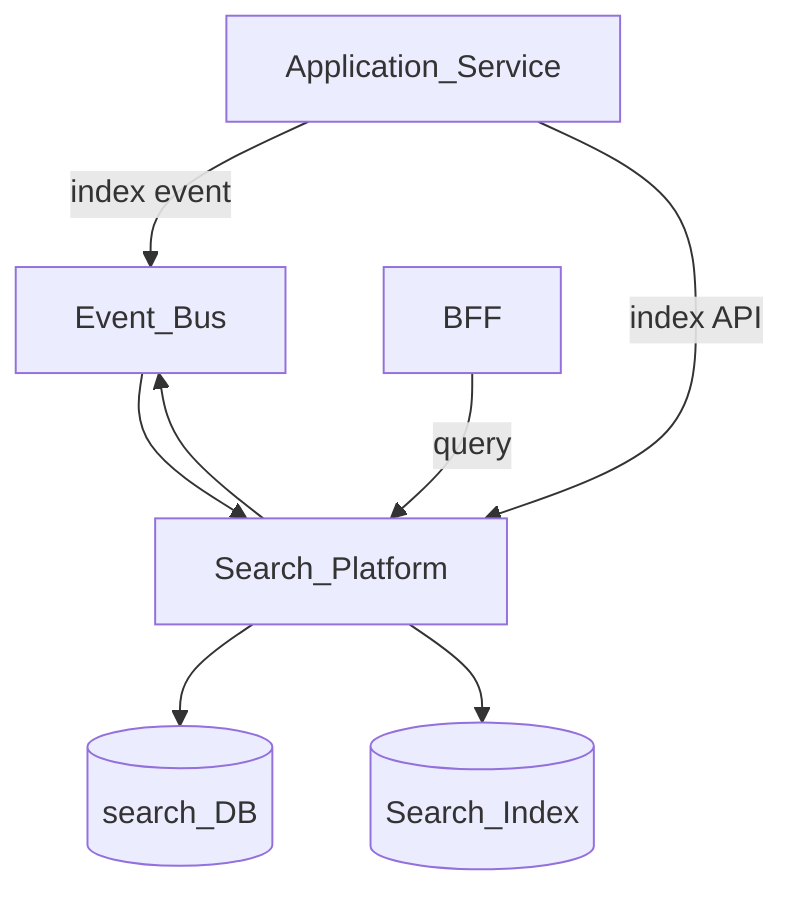
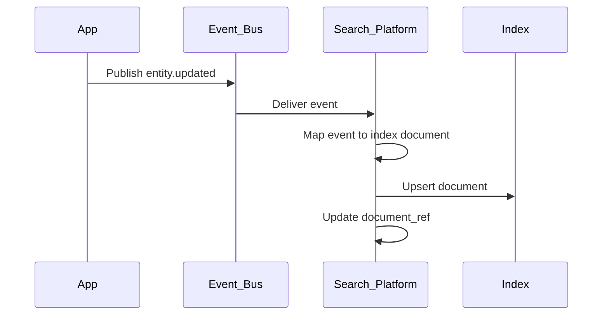
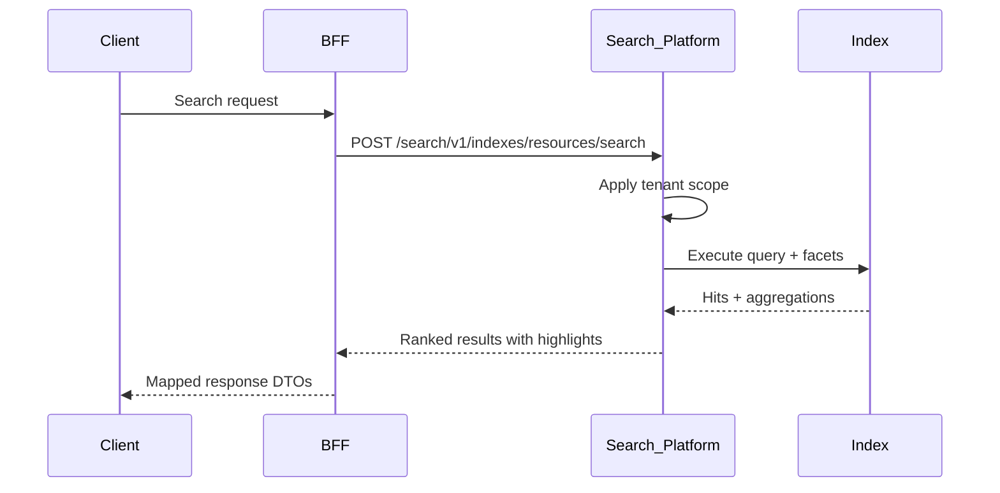

# Search Platform

> **Volume:** 2 | **Chapter ID:** v2-21 | **Status:** reviewed

## Purpose

The **Search Platform** provides full-text and faceted search across entity types registered by applications. Services publish index updates via events or API; users query through the BFF without each application deploying Elasticsearch clusters. Search indexes are tenant-isolated and schema-driven so new entity types register without platform code changes.

## Architecture



The Search Platform owns index mappings, query parsing, and result ranking. Source services remain authoritative for entity data.

## Responsibilities

### In Scope

- Index registration per entity type with field mappings
- Real-time indexing from domain events and direct API
- Full-text search with relevance scoring
- Faceted filters, sorting, and pagination
- Tenant and organization scoping on every query
- Highlighting of matched terms
- Index rebuild and backfill jobs
- Query analytics and slow-query logging

### Out of Scope

- Transactional CRUD on business entities
- Reporting aggregations across historical warehouses ([Report Engine](23-report-engine.md))
- Global cross-application search UI ([Global Search](38-global-search.md) aggregates via BFF)
- OCR or unstructured document parsing

## API Design

### Base Path

`/search/v1`

### Index Management

| Method | Path | Description |
|--------|------|-------------|
| POST | /indexes | Register index schema |
| GET | /indexes | List registered indexes |
| GET | /indexes/{indexName} | Get schema and stats |
| PATCH | /indexes/{indexName} | Update mappings (additive only) |
| POST | /indexes/{indexName}/rebuild | Trigger full reindex job |

### Document Operations

| Method | Path | Description |
|--------|------|-------------|
| POST | /indexes/{indexName}/documents | Upsert document |
| POST | /indexes/{indexName}/documents/batch | Batch upsert (max 1000) |
| DELETE | /indexes/{indexName}/documents/{docId} | Remove document |
| DELETE | /indexes/{indexName}/documents | Delete by query |

### Search

| Method | Path | Description |
|--------|------|-------------|
| POST | /indexes/{indexName}/search | Execute search query |
| POST | /search | Multi-index search |
| GET | /suggest | Autocomplete suggestions |

### Search Request

```json
{
  "tenantId": "tenant-uuid",
  "query": "resource alpha",
  "filters": {
    "status": ["active", "pending"],
    "organizationId": "org-uuid"
  },
  "facets": ["status", "category"],
  "sort": [{ "field": "updatedAt", "order": "desc" }],
  "page": 1,
  "pageSize": 20,
  "highlight": true
}
```

### Index Schema Registration

```json
{
  "indexName": "resources",
  "entityType": "resource",
  "fields": [
    { "name": "name", "type": "text", "searchable": true },
    { "name": "code", "type": "keyword", "searchable": true },
    { "name": "status", "type": "keyword", "facetable": true },
    { "name": "updatedAt", "type": "datetime", "sortable": true }
  ],
  "defaultSort": "updatedAt"
}
```

## Database Design

PostgreSQL stores metadata; Elasticsearch/OpenSearch holds inverted indexes.

| Table | Key Columns | Purpose |
|-------|-------------|---------|
| `search_index_definitions` | `index_name`, `tenant_id`, `schema_json`, `status` | Registered schemas |
| `search_index_jobs` | `job_id`, `index_name`, `job_type`, `status`, `progress` | Rebuild/backfill jobs |
| `search_query_log` | `query_text`, `index_name`, `duration_ms`, `result_count` | Analytics (no PII in query) |
| `search_document_refs` | `doc_id`, `index_name`, `source_service`, `last_indexed_at` | Cross-reference tracking |

## Folder Structure

```text
services/search/
├── api/
├── domain/
│   ├── index/        # Schema registration, mapping
│   ├── ingest/       # Event and API indexing
│   ├── query/        # Parse, execute, rank
│   └── rebuild/      # Full reindex orchestration
├── persistence/
├── adapters/
│   └── elasticsearch/  # Index engine adapter
├── mappers/
├── events/
└── tests/
```

## Sequence Diagrams

### Event-Driven Indexing



### Search Query



## Extension Points

- **Index engine adapters** — Elasticsearch, OpenSearch, Solr
- **Custom analyzers** — language-specific tokenization per index
- **Ranking plugins** — boost fields or business rules
- **Synonym dictionaries** — tenant-level synonym sets

## Integration

- **Depends on:** Event Bus, Queue Platform (rebuild jobs), Configuration Service
- **Events published:** `search.index.updated`, `search.rebuild.completed`
- **Events consumed:** Any `entity.created`, `entity.updated`, `entity.deleted` registered per index
- **Related:** [Search Indexing](54-search-indexing.md), [Global Search](38-global-search.md)

## Best Practices

1. Index only searchable fields; keep payloads lean
2. Use keyword type for exact-match filters; text for fuzzy search
3. Always include `tenantId` and `organizationId` in every document
4. Reindex via rebuild job, not manual index manipulation
5. Debounce high-frequency updates via Queue Platform for hot entities

## Anti-Patterns

| Anti-Pattern | Why It Fails | Preferred Approach |
|--------------|--------------|-------------------|
| Per-service search clusters | Cost, inconsistent query UX | Shared Search Platform |
| DB full-table scan for search | Slow at scale, blocks transactions | Dedicated search index |
| Indexing entire entity graphs | Huge documents, stale nested data | Flatten with reference IDs |
| Search as write path | Index lag causes inconsistent reads | Authoritative DB for GET by ID |

## Related Chapters

- [Previous: Rule Engine](20-rule-engine.md)
- [Next: Dashboard Engine](22-dashboard-engine.md)
- [Search Indexing](54-search-indexing.md)
- [EPB Glossary](../docs/GLOSSARY.md)

---

*Enterprise Platform Blueprint — Volume 2*
