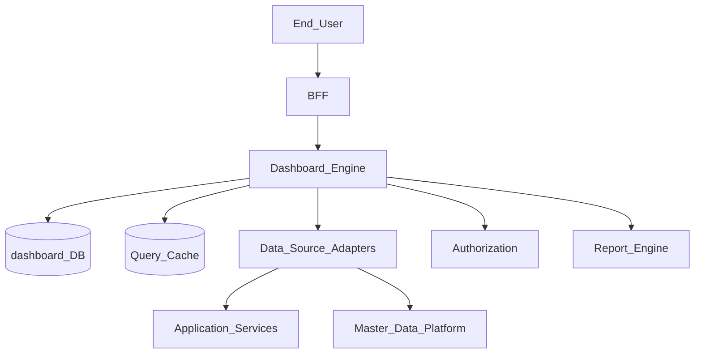
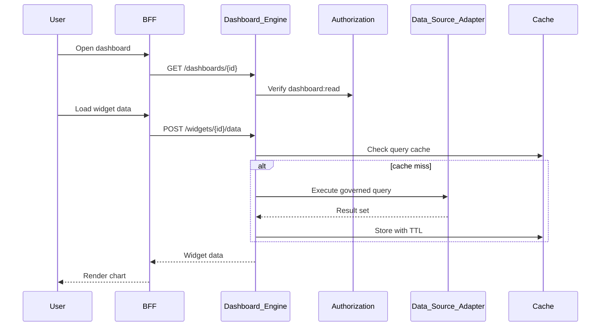
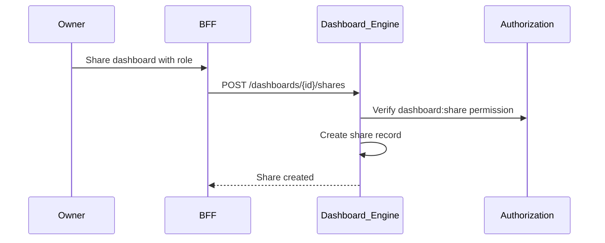

# Dashboard Engine

> **Volume:** 2 | **Chapter ID:** v2-22 | **Status:** reviewed

## Purpose

The **Dashboard Engine** delivers interactive business intelligence dashboards — KPI tiles, charts, and tables composed from registered data sources. Tenant users build and share dashboards without code; the engine handles query execution, caching, and access control. Operational service metrics belong in [Monitoring Platform](13-monitoring-platform.md), not here.

## Architecture



Dashboard definitions are metadata. Data retrieval delegates to registered adapters with tenant and organization scoping.

## Responsibilities

### In Scope

- Dashboard CRUD: layout, theme, sharing, folder organization
- Widget types: KPI, line/bar/pie chart, table, map, text
- Data source registration and query binding per widget
- Parameterized dashboards (date range, organization filter)
- Real-time refresh intervals and manual refresh
- Role-based dashboard visibility and edit permissions
- Dashboard duplication and template library
- Export snapshot to PDF/image via Report Engine
- Mobile-responsive layout grid

### Out of Scope

- Infrastructure ops metrics ([Monitoring Platform](13-monitoring-platform.md))
- Scheduled email report delivery ([Report Engine](23-report-engine.md))
- Raw SQL access for end users (queries via governed adapters only)
- Custom frontend chart code (widget catalog is platform-defined)

## API Design

### Base Path

`/dashboards/v1`

### Dashboard Management

| Method | Path | Description |
|--------|------|-------------|
| GET | /dashboards | List accessible dashboards |
| GET | /dashboards/{dashboardId} | Get dashboard definition |
| POST | /dashboards | Create dashboard |
| PUT | /dashboards/{dashboardId} | Update layout and widgets |
| DELETE | /dashboards/{dashboardId} | Soft delete |
| POST | /dashboards/{dashboardId}/duplicate | Clone dashboard |
| GET | /dashboards/templates | Platform template catalog |

### Widget Data

| Method | Path | Description |
|--------|------|-------------|
| POST | /widgets/{widgetId}/data | Execute widget query with parameters |
| POST | /dashboards/{dashboardId}/refresh | Refresh all widget data |
| GET | /data-sources | List registered data sources |
| POST | /data-sources/register | Register adapter (service admin) |

### Dashboard Definition Excerpt

```json
{
  "dashboardId": "dash-uuid",
  "tenantId": "tenant-uuid",
  "name": "Operations Overview",
  "layout": { "columns": 12, "rowHeight": 80 },
  "parameters": [
    { "key": "dateRange", "type": "dateRange", "default": "last30days" },
    { "key": "organizationId", "type": "organization", "required": false }
  ],
  "widgets": [
    {
      "widgetId": "w1",
      "type": "kpi",
      "title": "Active Entities",
      "position": { "x": 0, "y": 0, "w": 3, "h": 2 },
      "dataSource": "entity-metrics",
      "query": { "metric": "active_count", "groupBy": null }
    }
  ]
}
```

Follow [API Standards](../Volume-1-Foundation/18-api-standards.md).

## Database Design

| Table | Key Columns | Purpose |
|-------|-------------|---------|
| `dashboards` | `dashboard_id`, `tenant_id`, `name`, `owner_id`, `layout_json`, `status` | Dashboard metadata |
| `dashboard_widgets` | `widget_id`, `dashboard_id`, `type`, `config_json`, `position_json` | Widget definitions |
| `dashboard_parameters` | `dashboard_id`, `param_key`, `param_type`, `default_value` | Runtime filters |
| `dashboard_shares` | `dashboard_id`, `principal_id`, `permission` | Sharing ACL |
| `data_sources` | `source_id`, `tenant_id`, `adapter_key`, `connection_json` | Registered adapters |
| `dashboard_query_cache` | `cache_key`, `result_json`, `expires_at` | Query result cache |

Indexes: `(tenant_id, owner_id)`; `(dashboard_id)` on widgets; cache TTL index on `expires_at`.

## Folder Structure

```text
services/dashboard-engine/
├── api/
├── domain/
│   ├── layout/         # Grid validation, responsive rules
│   ├── queries/        # Parameter binding, adapter dispatch
│   └── sharing/        # ACL and visibility
├── adapters/           # Data source connector implementations
├── persistence/
└── tests/
```

## Sequence Diagrams

### Widget Data Load



### Dashboard Share



## Extension Points

- **Custom widget types** — register via plugin manifest (validated sandbox)
- **Data source adapters** — application services expose governed query endpoints
- **Dashboard templates** — industry starter packs at tenant provisioning

## Integration

- **Depends on:** Authorization, Master Data Platform, Configuration Service, Report Engine (export)
- **Events published:** `dashboard.created`, `dashboard.shared`, `dashboard.deleted`
- **Events consumed:** `data-source.registered`, `tenant.provisioned` (default templates)
- **Consumers:** BFF, Report Engine (scheduled snapshot export)

## Best Practices

1. Govern all queries through adapters — no raw database access
2. Cache widget queries with TTL appropriate to data freshness needs
3. Apply organization scope parameters automatically from user context
4. Limit widget count per dashboard for performance (platform default: 20)
5. Use templates to accelerate tenant onboarding

## Anti-Patterns

| Anti-Pattern | Why It Fails | Preferred Approach |
|--------------|--------------|-------------------|
| Embedding SQL in dashboard JSON | Injection risk, no tenant isolation | Data source adapters |
| Mixing ops metrics with business KPIs | Wrong retention and audience | Monitoring Platform for ops |
| Per-user dashboard code forks | Unmaintainable customization | Parameterized templates |
| Unbounded query refresh | Database overload | Cache TTL and rate limits |
| Skipping authorization on data queries | Data leak across organizations | Authz check per widget query |

## Related Chapters

- [Previous: Search Platform](21-search-platform.md)
- [Next: Report Engine](23-report-engine.md)
- [Dashboard Widget Model](55-dashboard-widget-model.md)
- [Monitoring Platform](13-monitoring-platform.md)
- [EPB Glossary](../docs/GLOSSARY.md)

---

*Enterprise Platform Blueprint — Volume 2*
