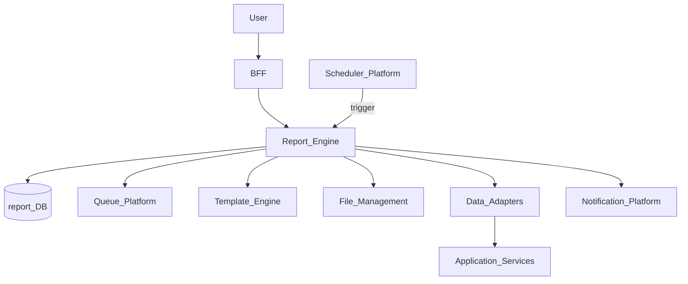
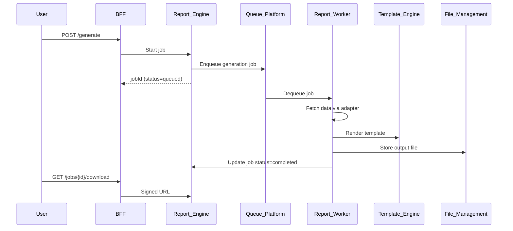
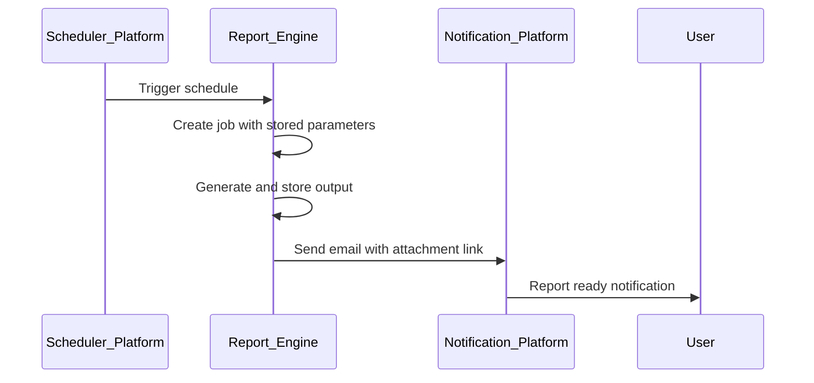

# Report Engine

> **Volume:** 2 | **Chapter ID:** v2-23 | **Status:** reviewed

## Purpose

The **Report Engine** generates formatted output documents — PDF, Excel, CSV — from templates and data queries on demand or on schedule. It separates presentation (templates) from data retrieval (adapters) so applications produce consistent reports without maintaining per-format export code. Interactive exploration remains in [Dashboard Engine](22-dashboard-engine.md).

## Architecture



Report generation is asynchronous for large outputs. Small reports may return synchronously under size threshold.

## Responsibilities

### In Scope

- Report template CRUD: layout, sections, parameters, output formats
- On-demand report generation via API
- Scheduled report jobs with cron expressions
- Multi-format rendering: PDF, XLSX, CSV, HTML
- Parameter validation (date range, organization, entity filters)
- Generation job queue with priority and retry
- Output storage via File Management with signed download URLs
- Delivery channels: email attachment, in-app notification, download link
- Report run history and regeneration from archived parameters

### Out of Scope

- Interactive dashboard rendering ([Dashboard Engine](22-dashboard-engine.md))
- Ad-hoc user analytics exploration
- Document signing and legal workflow ([Document Engine](24-document-engine.md))
- Real-time streaming exports ([Export Platform](27-export-platform.md) for bulk data)

## API Design

### Base Path

`/reports/v1`

### Template Management

| Method | Path | Description |
|--------|------|-------------|
| GET | /templates | List report templates |
| GET | /templates/{templateId} | Get template definition |
| POST | /templates | Create template |
| PUT | /templates/{templateId} | Update template |
| DELETE | /templates/{templateId} | Archive template |
| POST | /templates/{templateId}/preview | Preview with sample data |

### Generation

| Method | Path | Description |
|--------|------|-------------|
| POST | /generate | Start generation job |
| GET | /jobs/{jobId} | Get job status |
| GET | /jobs/{jobId}/download | Get signed download URL |
| GET | /runs | List historical runs |
| POST | /schedules | Create scheduled report |
| GET | /schedules | List schedules |
| DELETE | /schedules/{scheduleId} | Remove schedule |

### Generate Request

```json
{
  "tenantId": "tenant-uuid",
  "templateId": "template-uuid",
  "format": "pdf",
  "parameters": {
    "dateFrom": "2026-07-01",
    "dateTo": "2026-07-31",
    "organizationId": "org-uuid"
  },
  "delivery": {
    "mode": "email",
    "recipients": ["user@example.com"]
  }
}
```

Follow [API Standards](../Volume-1-Foundation/18-api-standards.md).

## Database Design

| Table | Key Columns | Purpose |
|-------|-------------|---------|
| `report_templates` | `template_id`, `tenant_id`, `name`, `definition_json`, `formats` | Template metadata |
| `report_jobs` | `job_id`, `template_id`, `status`, `parameters_json`, `started_at` | Generation jobs |
| `report_outputs` | `job_id`, `file_id`, `format`, `size_bytes`, `checksum` | Output references |
| `report_schedules` | `schedule_id`, `template_id`, `cron`, `parameters_json`, `delivery_json` | Scheduled runs |
| `report_runs` | `run_id`, `schedule_id`, `job_id`, `executed_at`, `status` | Schedule execution log |

Indexes: `(tenant_id, template_id)`; `(job_id, status)` for queue workers; `(schedule_id, executed_at DESC)`.

## Folder Structure

```text
services/report-engine/
├── api/
├── domain/
│   ├── templates/      # Template validation
│   ├── generation/     # Job orchestration
│   ├── rendering/      # Format-specific renderers
│   └── delivery/       # Email and notification dispatch
├── workers/            # Async job processors
├── adapters/           # Data fetch connectors
└── tests/
```

## Sequence Diagrams

### On-Demand Report Generation



### Scheduled Report Delivery



## Extension Points

- **Custom renderers** — register output format handlers
- **Data adapters** — application-specific query endpoints
- **Template partials** — shared headers/footers via Template Engine

## Integration

- **Depends on:** Template Engine, File Management, Queue Platform, Scheduler Platform, Notification Platform
- **Events published:** `report.job.completed`, `report.job.failed`, `report.schedule.executed`
- **Events consumed:** `template.updated` (invalidate compiled templates)
- **Consumers:** BFF, Dashboard Engine (PDF export), compliance workflows

## Best Practices

1. Always async for reports exceeding 1 MB or 10 seconds generation time
2. Validate parameters against template schema before queueing
3. Retain run history with parameters for audit reproducibility
4. Use signed URLs with short TTL for downloads
5. Cap concurrent jobs per tenant to prevent resource exhaustion

## Anti-Patterns

| Anti-Pattern | Why It Fails | Preferred Approach |
|--------------|--------------|-------------------|
| Synchronous large report generation | Request timeouts, poor UX | Queue-based async jobs |
| Hard-coded export logic per screen | Inconsistent formats, duplication | Central Report Engine |
| Storing report files in service DB | Blob bloat, no CDN | File Management |
| Email with unsigned permanent links | Security exposure | Short-lived signed URLs |
| Skipping parameter archival | Cannot reproduce historical reports | Store parameters per run |

## Related Chapters

- [Previous: Dashboard Engine](22-dashboard-engine.md)
- [Next: Document Engine](24-document-engine.md)
- [Report Template Model](56-report-template-model.md)
- [Template Engine](16-template-engine.md)
- [EPB Glossary](../docs/GLOSSARY.md)

---

*Enterprise Platform Blueprint — Volume 2*
