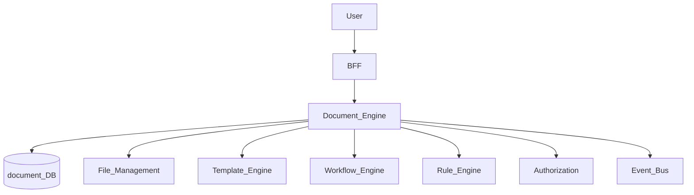
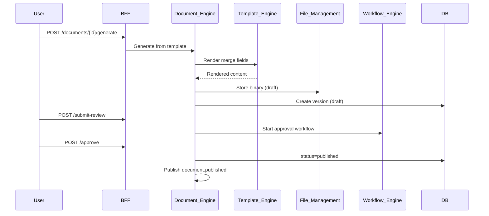
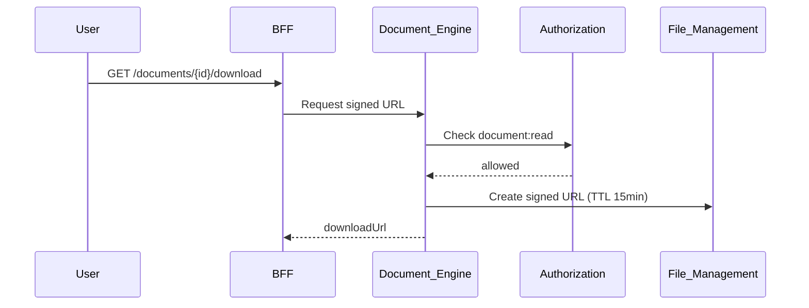

# Document Engine

> **Volume:** 2 | **Chapter ID:** v2-24 | **Status:** reviewed

## Purpose

The **Document Engine** manages the full lifecycle of structured business documents — contracts, policies, generated letters, and versioned content packages. It combines template rendering, version control, approval states, and secure storage. One-off formatted exports belong in [Report Engine](23-report-engine.md); Document Engine handles persistent, governed document records.

## Architecture



Binary content lives in File Management. Document Engine stores metadata, versions, and workflow state.

## Responsibilities

### In Scope

- Document CRUD: type, title, status, owner, organization scope
- Version management: draft, published, superseded with diff metadata
- Template binding and merge-field population from entity data
- Document generation from templates (PDF, DOCX output)
- Approval workflow integration (draft → review → approved → published)
- Electronic signature placeholder hooks (integration adapter)
- Access control per document and version
- Full-text metadata search and tagging
- Retention and legal hold flags
- Document linking to business entities (entity type + entity ID)

### Out of Scope

- Raw file upload without document metadata ([File Management](25-file-management.md))
- Scheduled tabular reports ([Report Engine](23-report-engine.md))
- Email body rendering ([Template Engine](16-template-engine.md) for notifications)
- OCR and unstructured content extraction (AI services adapter)

## API Design

### Base Path

`/documents/v1`

### Document Management

| Method | Path | Description |
|--------|------|-------------|
| GET | /documents | List documents with filters |
| GET | /documents/{documentId} | Get document metadata |
| POST | /documents | Create document shell |
| PUT | /documents/{documentId} | Update metadata |
| DELETE | /documents/{documentId} | Soft delete (policy enforced) |
| GET | /documents/{documentId}/versions | List versions |
| GET | /documents/{documentId}/versions/{versionId} | Get version detail |
| POST | /documents/{documentId}/versions | Create new draft version |
| POST | /documents/{documentId}/generate | Generate from template |
| POST | /documents/{documentId}/publish | Publish current draft |
| GET | /documents/{documentId}/download | Signed URL for current version |

### Workflow Actions

| Method | Path | Description |
|--------|------|-------------|
| POST | /documents/{documentId}/submit-review | Start approval workflow |
| POST | /documents/{documentId}/approve | Approve (authorized reviewer) |
| POST | /documents/{documentId}/reject | Reject with comment |
| PUT | /documents/{documentId}/legal-hold | Set or release legal hold |

### Generate Request

```json
{
  "tenantId": "tenant-uuid",
  "templateId": "contract-template-uuid",
  "entityRef": {
    "entityType": "agreement",
    "entityId": "entity-uuid"
  },
  "mergeData": {
    "partyName": "Acme Corp",
    "effectiveDate": "2026-08-01",
    "termMonths": 24
  },
  "outputFormat": "pdf"
}
```

Follow [API Standards](../Volume-1-Foundation/18-api-standards.md).

## Database Design

| Table | Key Columns | Purpose |
|-------|-------------|---------|
| `documents` | `document_id`, `tenant_id`, `type`, `title`, `status`, `owner_id`, `entity_ref` | Document shell |
| `document_versions` | `version_id`, `document_id`, `version_number`, `file_id`, `checksum`, `created_by` | Version history |
| `document_tags` | `document_id`, `tag` | Classification tags |
| `document_workflow_state` | `document_id`, `workflow_id`, `current_step`, `assigned_to` | Approval tracking |
| `document_retention` | `document_id`, `retain_until`, `legal_hold`, `hold_reason` | Governance flags |
| `document_audit` | `document_id`, `action`, `actor_id`, `created_at` | Immutable action log |

Indexes: `(tenant_id, entity_ref)` for entity lookups; `(tenant_id, status)`; `(document_id, version_number DESC)`.

## Folder Structure

```text
services/document-engine/
├── api/
├── domain/
│   ├── versions/       # Versioning rules, publish gates
│   ├── generation/     # Template merge and render
│   ├── workflow/       # Approval state machine
│   └── retention/      # Hold and purge policies
├── persistence/
├── events/             # document.published, document.approved
└── tests/
```

## Sequence Diagrams

### Document Generation and Publish



### Version Access Control



## Extension Points

- **Signature providers** — DocuSign, Adobe Sign via Integration Framework
- **Custom document types** — tenant type registry with required metadata schema
- **Merge data providers** — entity services supply merge fields at generation time

## Integration

- **Depends on:** Template Engine, File Management, Workflow Engine, Authorization, Audit Platform
- **Events published:** `document.created`, `document.version.created`, `document.published`, `document.approved`
- **Events consumed:** `entity.deleted` (flag linked documents), `workflow.completed`
- **Consumers:** BFF, compliance tooling, external signature adapters

## Best Practices

1. Never overwrite published versions — create new version for changes
2. Store checksums to detect tampering
3. Bind documents to entity references for traceability
4. Enforce legal hold before any purge job
5. Use workflow for documents requiring multi-party approval

## Anti-Patterns

| Anti-Pattern | Why It Fails | Preferred Approach |
|--------------|--------------|-------------------|
| Storing document blobs in relational DB | Performance and backup bloat | File Management for binaries |
| Direct publish without workflow | Compliance gaps | Workflow Engine integration |
| Mutable published versions | Audit and legal risk | Immutable version history |
| Reports stored as documents | Wrong lifecycle semantics | Report Engine for exports |
| Skipping access check on download URLs | Unauthorized file access | Authz before signed URL |

## Related Chapters

- [Previous: Report Engine](23-report-engine.md)
- [Next: File Management](25-file-management.md)
- [Document Template Pipeline](57-document-template-pipeline.md)
- [Document Generation](40-document-generation.md)
- [EPB Glossary](../docs/GLOSSARY.md)

---

*Enterprise Platform Blueprint — Volume 2*
