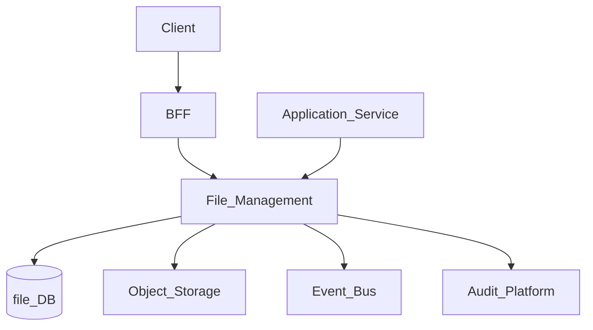
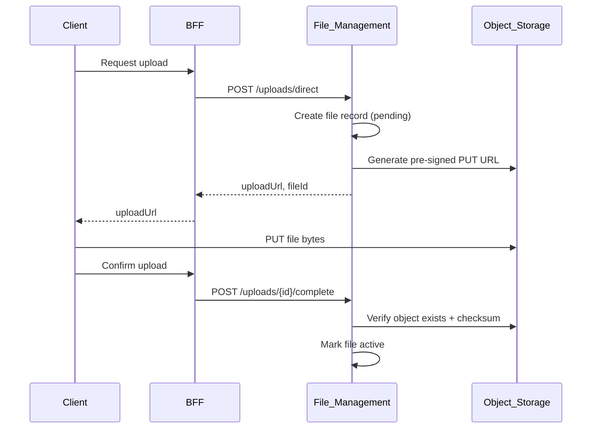
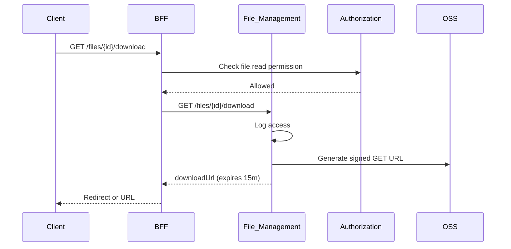

# File Management

> **Volume:** 2 | **Chapter ID:** v2-25 | **Status:** reviewed

## Purpose

The **File Management** platform service handles upload, storage, retrieval, preview, and lifecycle of binary assets across all applications. Documents, import files, export outputs, images, and attachments are stored in object storage with metadata in a service-owned database. Applications never provision S3 buckets or manage blob paths directly.

## Architecture



Object storage (S3-compatible) holds bytes; File Management owns metadata, access policies, and signed URL generation.

## Responsibilities

### In Scope

- Multipart upload for large files
- Direct upload via pre-signed URLs
- Download via time-limited signed URLs
- File metadata: name, MIME type, size, checksum, tenant, owner
- Versioning and soft delete with retention policies
- Access control integration with Authorization
- Virus scan hook (async via Queue Platform)
- Thumbnail and preview generation (async workers)
- Quota enforcement per tenant

### Out of Scope

- Document template rendering ([Document Engine](24-document-engine.md))
- Import/export job orchestration ([Import Platform](26-import-platform.md), [Export Platform](27-export-platform.md))
- Full-text indexing of file content ([Search Platform](21-search-platform.md))
- Email attachment delivery ([Notification Platform](15-notification-platform.md))

## API Design

### Base Path

`/files/v1`

### Upload

| Method | Path | Description |
|--------|------|-------------|
| POST | /uploads | Initiate upload; returns upload session |
| POST | /uploads/{uploadId}/parts | Upload part (multipart) |
| POST | /uploads/{uploadId}/complete | Finalize multipart upload |
| POST | /uploads/direct | Request pre-signed PUT URL for direct client upload |

### File Operations

| Method | Path | Description |
|--------|------|-------------|
| GET | /files | List files with pagination and filters |
| GET | /files/{fileId} | Get metadata |
| GET | /files/{fileId}/download | Get signed download URL |
| GET | /files/{fileId}/preview | Get preview URL or thumbnail |
| PATCH | /files/{fileId} | Update metadata tags |
| DELETE | /files/{fileId} | Soft delete |
| POST | /files/{fileId}/restore | Restore from soft delete |

### Versions

| Method | Path | Description |
|--------|------|-------------|
| POST | /files/{fileId}/versions | Upload new version |
| GET | /files/{fileId}/versions | List versions |
| GET | /files/{fileId}/versions/{versionId}/download | Download specific version |

### Initiate Upload Request

```json
{
  "tenantId": "tenant-uuid",
  "filename": "import-data.csv",
  "contentType": "text/csv",
  "sizeBytes": 10485760,
  "purpose": "import",
  "tags": { "importJobId": "job-uuid" },
  "checksumSha256": "abc123..."
}
```

### Initiate Upload Response

```json
{
  "uploadId": "upload-uuid",
  "fileId": "file-uuid",
  "uploadMethod": "multipart",
  "partSizeBytes": 5242880,
  "expiresAt": "2026-08-01T12:00:00Z"
}
```

## Database Design

| Table | Key Columns | Purpose |
|-------|-------------|---------|
| `file_records` | `file_id`, `tenant_id`, `filename`, `mime_type`, `size_bytes`, `storage_key`, `status` | File metadata |
| `file_versions` | `version_id`, `file_id`, `storage_key`, `checksum`, `version_number` | Version history |
| `file_upload_sessions` | `upload_id`, `file_id`, `status`, `expires_at` | In-progress uploads |
| `file_upload_parts` | `upload_id`, `part_number`, `etag`, `size_bytes` | Multipart tracking |
| `file_access_log` | `file_id`, `user_id`, `action`, `accessed_at` | Download audit trail |
| `file_quotas` | `tenant_id`, `max_bytes`, `used_bytes`, `max_file_size` | Tenant limits |

Storage key pattern: `{tenant_id}/{year}/{month}/{file_id}/{version_id}`.

## Folder Structure

```text
services/file-management/
├── api/
├── domain/
│   ├── upload/       # Multipart, pre-signed URL
│   ├── download/     # Signed URL generation
│   ├── versions/     # Version chain
│   └── quota/        # Enforcement
├── persistence/
├── adapters/
│   ├── storage/      # S3, Azure Blob, GCS
│   └── scan/         # Virus scan queue publisher
├── mappers/
├── events/
└── tests/
```

## Sequence Diagrams

### Direct Client Upload



### Download with Authorization



## Extension Points

- **Storage adapters** — S3, Azure Blob, on-prem MinIO
- **Scan pipeline** — plug virus scan before marking file active
- **Preview generators** — PDF thumbnail, image resize workers
- **Retention policies** — auto-archive or purge by purpose tag

## Integration

- **Depends on:** Authorization, Audit Platform, Queue Platform (async processing)
- **Events published:** `file.uploaded`, `file.deleted`, `file.scan.completed`
- **Events consumed:** `tenant.provisioned` (initialize quota)
- **Used by:** Import Platform, Export Platform, Document Engine, Notification Platform

## Best Practices

1. Never expose permanent object storage URLs — always use signed URLs
2. Validate MIME type and size at initiate, not only at complete
3. Store checksums; verify on upload complete
4. Tag files with purpose (`import`, `export`, `attachment`) for lifecycle rules
5. Soft delete with retention; hard delete only after policy window

## Anti-Patterns

| Anti-Pattern | Why It Fails | Preferred Approach |
|--------------|--------------|-------------------|
| App writes directly to S3 | No audit, no quota, inconsistent paths | File Management API |
| Storing files in application DB | Bloated DB, poor streaming | Object storage via platform |
| Public bucket URLs | Data exposure | Signed URLs with short TTL |
| Skipping checksum verification | Corrupt or tampered uploads | SHA-256 on complete |

## Related Chapters

- [Previous: Document Engine](24-document-engine.md)
- [Next: Import Platform](26-import-platform.md)
- [File Upload Download](58-file-upload-download.md)
- [EPB Glossary](../docs/GLOSSARY.md)

---

*Enterprise Platform Blueprint — Volume 2*
