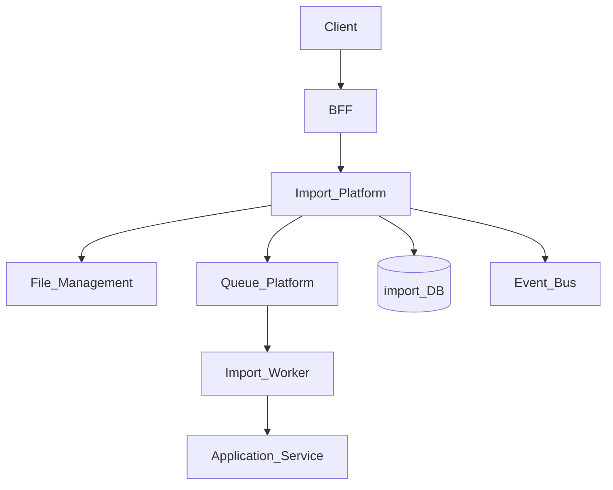
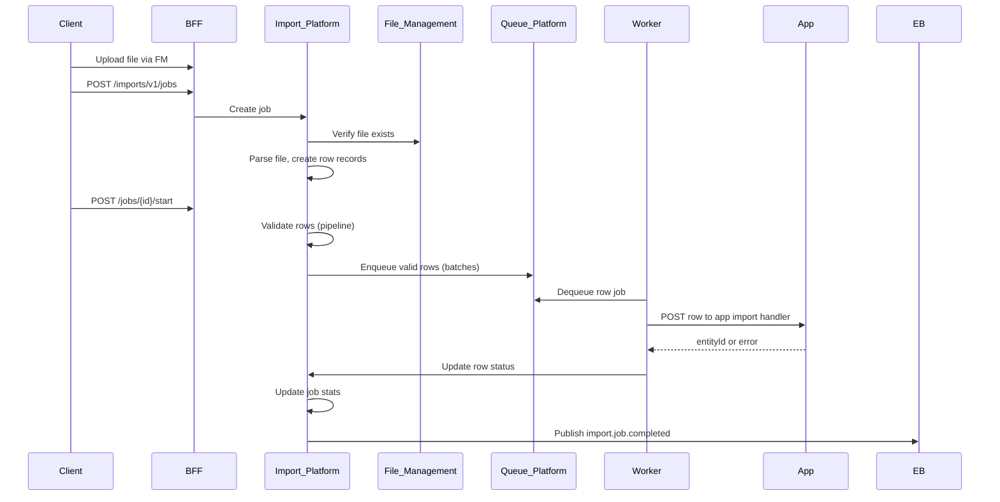

# Import Platform

> **Volume:** 2 | **Chapter ID:** v2-26 | **Status:** reviewed

## Purpose

The **Import Platform** orchestrates bulk data ingestion from files into application services. Users upload CSV, Excel, or JSON via File Management; the Import Platform validates rows, enqueues processing, tracks progress, and reports per-row outcomes. Applications define import templates and row handlers — they never build parsers, progress UIs, or retry logic from scratch.

## Architecture



Import Platform owns job state and validation pipeline. Application services own business rules for accepted rows.

## Responsibilities

### In Scope

- Import template registration (columns, types, validators)
- Job creation from uploaded file reference
- Header and row validation pipeline (see [Import Validation Pipeline](59-import-validation-pipeline.md))
- Chunked row enqueue to Queue Platform
- Per-row success, skip, and error tracking
- Job progress and completion reporting
- Dry-run mode without persisting data
- Duplicate detection via configurable keys

### Out of Scope

- File storage ([File Management](25-file-management.md))
- Export generation ([Export Platform](27-export-platform.md))
- Business entity persistence logic (application services)
- Real-time streaming ingestion (use Event Bus)

## API Design

### Base Path

`/imports/v1`

### Template Management

| Method | Path | Description |
|--------|------|-------------|
| POST | /templates | Register import template |
| GET | /templates | List templates |
| GET | /templates/{templateId} | Get template definition |
| PATCH | /templates/{templateId} | Update columns or validators |
| DELETE | /templates/{templateId} | Deactivate template |

### Job Operations

| Method | Path | Description |
|--------|------|-------------|
| POST | /jobs | Create import job |
| GET | /jobs | List jobs (paginated) |
| GET | /jobs/{jobId} | Job status and summary |
| POST | /jobs/{jobId}/start | Begin processing after upload |
| POST | /jobs/{jobId}/cancel | Cancel pending rows |
| GET | /jobs/{jobId}/rows | Row-level results (paginated) |
| GET | /jobs/{jobId}/errors | Error report download URL |

### Create Job Request

```json
{
  "tenantId": "tenant-uuid",
  "templateId": "resource-import-v1",
  "fileId": "file-uuid",
  "options": {
    "dryRun": false,
    "skipDuplicates": true,
    "batchSize": 100,
    "notifyOnComplete": true
  },
  "context": {
    "organizationId": "org-uuid",
    "initiatedBy": "user-uuid"
  }
}
```

### Job Status Response

```json
{
  "jobId": "job-uuid",
  "status": "processing",
  "totalRows": 5000,
  "processedRows": 3200,
  "successCount": 3100,
  "errorCount": 80,
  "skippedCount": 20,
  "startedAt": "2026-08-01T09:00:00Z",
  "estimatedCompletionAt": "2026-08-01T09:15:00Z"
}
```

Row statuses: `pending`, `validating`, `queued`, `processing`, `success`, `error`, `skipped`, `cancelled`.

## Database Design

| Table | Key Columns | Purpose |
|-------|-------------|---------|
| `import_templates` | `template_id`, `entity_type`, `column_defs_json`, `validator_chain` | Template definitions |
| `import_jobs` | `job_id`, `template_id`, `file_id`, `status`, `options_json` | Job header |
| `import_job_stats` | `job_id`, `total_rows`, `success_count`, `error_count` | Aggregated counters |
| `import_rows` | `row_id`, `job_id`, `row_number`, `raw_data_json`, `status` | Per-row state |
| `import_row_errors` | `row_id`, `error_code`, `error_message`, `field_name` | Validation/processing errors |
| `import_row_results` | `row_id`, `entity_id`, `processed_at` | Success references |

Indexes: `(job_id, status)` on rows; `(job_id, row_number)` unique.

## Folder Structure

```text
services/import/
├── api/
├── domain/
│   ├── templates/    # Schema registration
│   ├── jobs/         # Lifecycle orchestration
│   ├── validate/     # Pipeline stages
│   └── enqueue/      # Chunk to Queue Platform
├── persistence/
├── adapters/
│   ├── file/         # File Management reader
│   ├── queue/        # Queue Platform client
│   └── parsers/      # CSV, XLSX, JSON
├── mappers/
├── events/
└── tests/
```

## Sequence Diagrams

### Import Job Lifecycle



## Extension Points

- **Parser plugins** — CSV, XLSX, JSON, fixed-width
- **Validator chain** — required, type, regex, cross-field, custom API validator
- **Row handler routing** — map template to application endpoint
- **Post-import hooks** — trigger search reindex or notification

## Integration

- **Depends on:** File Management, Queue Platform, Event Bus, Validation Platform
- **Events published:** `import.job.started`, `import.job.completed`, `import.job.failed`, `import.row.processed`
- **Events consumed:** None required at start
- **Used by:** Master Data Platform, any application with bulk ingest

## Best Practices

1. Always support dry-run for user validation before commit
2. Use template versioning; never break in-flight jobs
3. Return row numbers in errors so users can fix source files
4. Limit batch size to balance throughput and failure blast radius
5. Idempotent row handlers using natural keys from import context

## Anti-Patterns

| Anti-Pattern | Why It Fails | Preferred Approach |
|--------------|--------------|-------------------|
| Synchronous import in API request | Timeout, no progress, memory spikes | Async job with Queue Platform |
| Parsing in application service | Duplicate parsers per app | Import Platform parsers |
| Ignoring partial failures | Silent data loss | Per-row status and error export |
| No duplicate detection | Duplicate entities on re-import | Configurable idempotency keys |

## Related Chapters

- [Previous: File Management](25-file-management.md)
- [Next: Export Platform](27-export-platform.md)
- [Import Validation Pipeline](59-import-validation-pipeline.md)
- [EPB Glossary](../docs/GLOSSARY.md)

---

*Enterprise Platform Blueprint — Volume 2*
