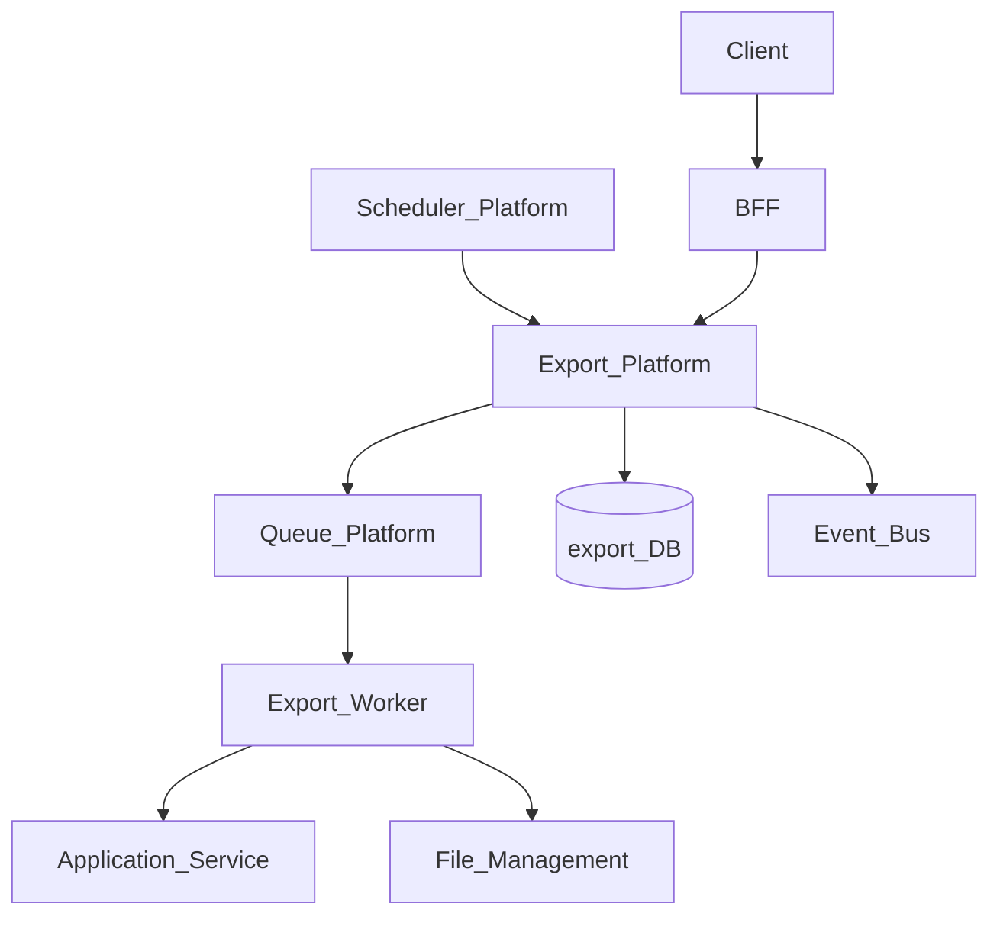
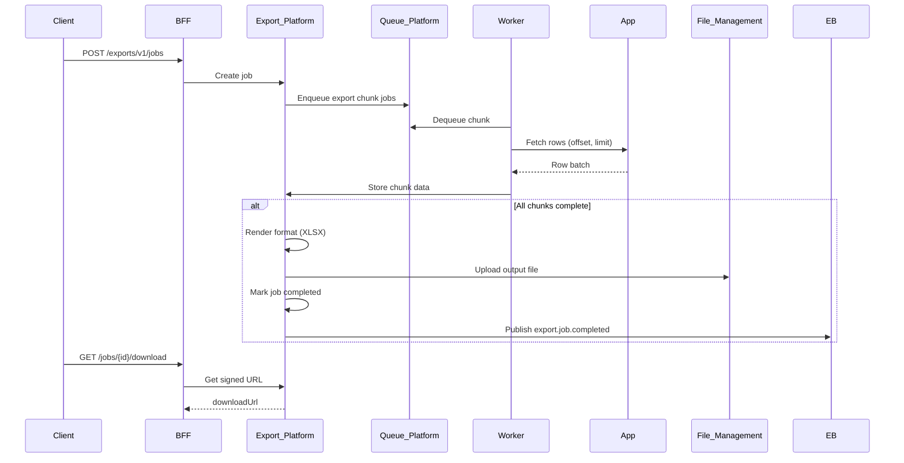

# Export Platform

> **Volume:** 2 | **Chapter ID:** v2-27 | **Status:** reviewed

## Purpose

The **Export Platform** generates bulk data extracts in CSV, Excel, JSON, or PDF formats. Applications register export definitions; users or schedulers trigger jobs that query source services, transform rows, and store output in File Management. Applications never build export UIs, format handlers, or large-result streaming from scratch.

## Architecture



Export Platform owns job orchestration and format rendering. Source services own data queries and row mapping.

## Responsibilities

### In Scope

- Export template registration (columns, filters, sort)
- Job creation with filter parameters
- Chunked data fetch from source service APIs
- Format rendering via handler plugins (see [Export Format Handlers](60-export-format-handlers.md))
- Large file streaming to object storage
- Job progress, expiry, and download link delivery
- Scheduled export triggers via Scheduler
- Row-level access check delegation to source service

### Out of Scope

- Report layout and charts ([Report Engine](23-report-engine.md))
- Import of exported files ([Import Platform](26-import-platform.md))
- Real-time data replication
- Email delivery of exports (publish event for Notification Platform)

## API Design

### Base Path

`/exports/v1`

### Template Management

| Method | Path | Description |
|--------|------|-------------|
| POST | /templates | Register export template |
| GET | /templates | List templates |
| GET | /templates/{templateId} | Get template definition |
| PATCH | /templates/{templateId} | Update columns or format |
| DELETE | /templates/{templateId} | Deactivate template |

### Job Operations

| Method | Path | Description |
|--------|------|-------------|
| POST | /jobs | Create export job |
| GET | /jobs | List jobs |
| GET | /jobs/{jobId} | Job status |
| POST | /jobs/{jobId}/cancel | Cancel in-progress job |
| GET | /jobs/{jobId}/download | Signed download URL when complete |

### Create Job Request

```json
{
  "tenantId": "tenant-uuid",
  "templateId": "resource-export-v1",
  "format": "xlsx",
  "filters": {
    "status": "active",
    "updatedAfter": "2026-01-01T00:00:00Z",
    "organizationId": "org-uuid"
  },
  "sort": [{ "field": "code", "order": "asc" }],
  "options": {
    "includeHeaders": true,
    "maxRows": 100000,
    "notifyOnComplete": true,
    "expiresAfterHours": 72
  },
  "requestedBy": "user-uuid"
}
```

Supported formats: `csv`, `xlsx`, `json`, `pdf` (tabular PDF via format handler).

### Job Status Response

```json
{
  "jobId": "job-uuid",
  "status": "completed",
  "totalRows": 12500,
  "fileId": "file-uuid",
  "downloadUrl": "https://...",
  "expiresAt": "2026-08-04T09:00:00Z",
  "completedAt": "2026-08-01T09:30:00Z"
}
```

Job statuses: `pending`, `fetching`, `rendering`, `uploading`, `completed`, `failed`, `cancelled`, `expired`.

## Database Design

| Table | Key Columns | Purpose |
|-------|-------------|---------|
| `export_templates` | `template_id`, `entity_type`, `columns_json`, `source_api_path` | Template definitions |
| `export_jobs` | `job_id`, `template_id`, `format`, `filters_json`, `status` | Job header |
| `export_job_chunks` | `chunk_id`, `job_id`, `offset`, `row_count`, `status` | Chunked fetch tracking |
| `export_job_outputs` | `job_id`, `file_id`, `row_count`, `size_bytes` | Output file reference |
| `export_schedules` | `schedule_id`, `template_id`, `cron_expression`, `status` | Scheduled export links |

Indexes: `(tenant_id, status, created_at)` on jobs.

## Folder Structure

```text
services/export/
├── api/
├── domain/
│   ├── templates/
│   ├── jobs/         # Lifecycle
│   ├── fetch/        # Chunked source queries
│   └── render/       # Format handler dispatch
├── persistence/
├── adapters/
│   ├── queue/
│   ├── file/         # File Management upload
│   └── formats/      # CSV, XLSX, JSON, PDF handlers
├── mappers/
├── events/
└── tests/
```

## Sequence Diagrams

### Export Job Execution



## Extension Points

- **Format handlers** — plug CSV, XLSX, JSON, PDF renderers
- **Source adapters** — REST pagination, cursor-based fetch
- **Column transformers** — date formatting, enum labels via Localization
- **Post-export actions** — email link, webhook via Integration Framework

## Integration

- **Depends on:** Queue Platform, File Management, Event Bus, Scheduler Platform
- **Events published:** `export.job.completed`, `export.job.failed`
- **Events consumed:** `scheduler.trigger.fire` (scheduled exports)
- **Used by:** Report Engine, Master Data Platform, admin consoles

## Best Practices

1. Cap `maxRows` per tenant to prevent runaway exports
2. Expire output files; exports are snapshots, not archives
3. Fetch in chunks; never load entire dataset in memory
4. Delegate row-level authorization to source service per chunk
5. Notify via event when complete; do not block request thread

## Anti-Patterns

| Anti-Pattern | Why It Fails | Preferred Approach |
|--------------|--------------|-------------------|
| Export via synchronous GET | Timeout, OOM on large datasets | Async export job |
| Single-query full table dump | DB load, memory exhaustion | Chunked fetch with queue |
| Permanent export file URLs | Stale data exposure | Time-limited signed URLs |
| Export without row auth check | Data leak across org boundaries | Per-chunk authorization |

## Related Chapters

- [Previous: Import Platform](26-import-platform.md)
- [Next: Queue Platform](28-queue-platform.md)
- [Export Format Handlers](60-export-format-handlers.md)
- [EPB Glossary](../docs/GLOSSARY.md)

---

*Enterprise Platform Blueprint — Volume 2*
