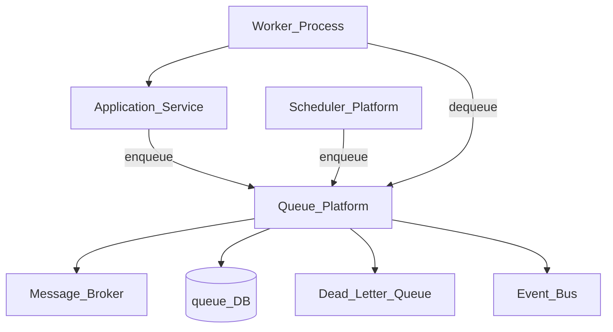
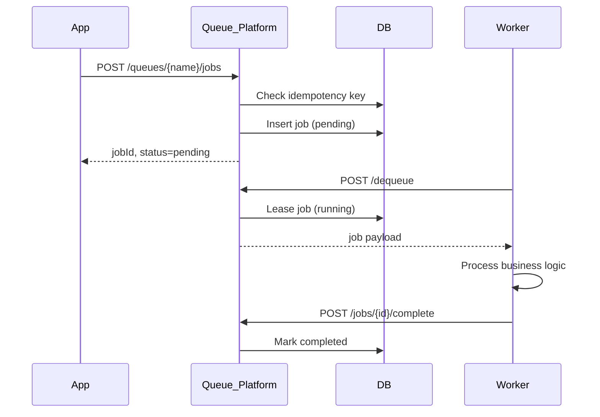
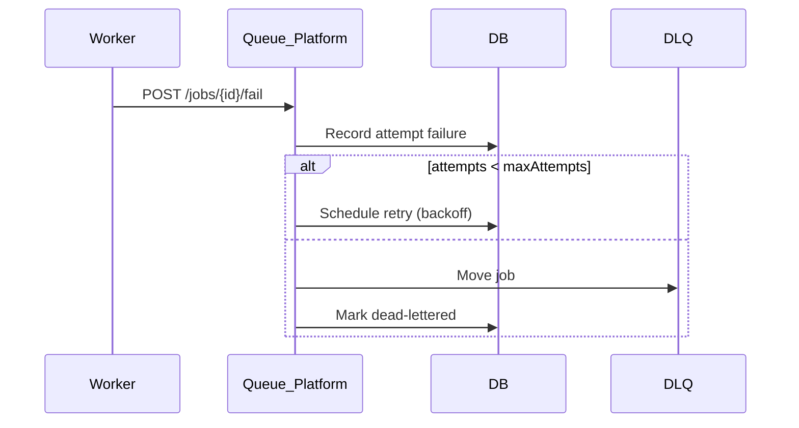

# Queue Platform

> **Volume:** 2 | **Chapter ID:** v2-28 | **Status:** reviewed

## Purpose

The **Queue Platform** provides durable work queues for background processing. Applications enqueue jobs — import rows, report generation, notification batches — without owning broker infrastructure or retry logic. The Scheduler ([Scheduler Platform](17-scheduler-platform.md)) orchestrates timing; the Queue Platform handles execution, concurrency, and failure recovery.

## Architecture



Workers may run inside application services or as dedicated worker pools. The Queue Platform owns job metadata and delivery state, not business processing logic.

## Responsibilities

### In Scope

- Job enqueue with priority, delay, and scheduled execution time
- At-least-once delivery to registered workers
- Concurrency limits per queue and per tenant
- Retry with configurable backoff and max attempts
- Dead-letter queue for exhausted retries (see [Queue Dead Letter Handling](61-queue-dead-letter-handling.md))
- Job status tracking: pending, running, completed, failed, cancelled
- Visibility timeout for long-running jobs
- Queue metrics for monitoring

### Out of Scope

- Cron scheduling and calendar triggers ([Scheduler Platform](17-scheduler-platform.md))
- Domain event pub/sub ([Event Bus](30-event-bus.md))
- Business validation of job payload content
- UI for job monitoring (BFF may expose admin views)

## API Design

### Base Path

`/queues/v1`

### Queue Management

| Method | Path | Description |
|--------|------|-------------|
| POST | /queues | Create queue with config |
| GET | /queues | List queues |
| GET | /queues/{queueName} | Get queue config and stats |
| PATCH | /queues/{queueName} | Update concurrency, retry policy |
| DELETE | /queues/{queueName} | Soft-delete queue (drain first) |

### Job Operations

| Method | Path | Description |
|--------|------|-------------|
| POST | /queues/{queueName}/jobs | Enqueue job |
| POST | /queues/{queueName}/jobs/batch | Enqueue up to 500 jobs |
| GET | /jobs/{jobId} | Get job status and result |
| POST | /jobs/{jobId}/cancel | Cancel pending or running job |
| GET | /queues/{queueName}/jobs | List jobs with filters |

### Worker Operations

| Method | Path | Description |
|--------|------|-------------|
| POST | /queues/{queueName}/dequeue | Long-poll for next job (worker) |
| POST | /jobs/{jobId}/heartbeat | Extend visibility timeout |
| POST | /jobs/{jobId}/complete | Mark success with optional result |
| POST | /jobs/{jobId}/fail | Mark failure; triggers retry or DLQ |

### Enqueue Payload

```json
{
  "tenantId": "tenant-uuid",
  "jobType": "import.row.process",
  "payload": {
    "importJobId": "job-uuid",
    "rowNumber": 42,
    "rowData": { "code": "RES-001", "name": "Resource A" }
  },
  "priority": 5,
  "delaySeconds": 0,
  "scheduledAt": null,
  "idempotencyKey": "import-job-uuid-row-42",
  "maxAttempts": 5
}
```

### Queue Configuration

| Field | Description |
|-------|-------------|
| `maxConcurrency` | Max simultaneous jobs per tenant |
| `defaultMaxAttempts` | Retry limit before DLQ |
| `visibilityTimeoutSeconds` | Heartbeat window for running jobs |
| `retryBackoff` | `fixed`, `linear`, or `exponential` |
| `dlqEnabled` | Move to dead letter on exhaustion |

## Database Design

| Table | Key Columns | Purpose |
|-------|-------------|---------|
| `queue_definitions` | `queue_name`, `tenant_id`, `config_json`, `status` | Queue metadata and policies |
| `queue_jobs` | `job_id`, `queue_name`, `job_type`, `payload_json`, `status`, `priority` | Job records |
| `queue_job_attempts` | `attempt_id`, `job_id`, `started_at`, `ended_at`, `error_message` | Per-attempt history |
| `queue_dead_letters` | `job_id`, `original_queue`, `failure_reason`, `moved_at` | Exhausted retry archive |
| `queue_worker_leases` | `lease_id`, `job_id`, `worker_id`, `expires_at` | Visibility timeout tracking |

Indexes: `(queue_name, status, priority, scheduled_at)` for dequeue; unique `(tenant_id, idempotency_key)` where not null.

## Folder Structure

```text
services/queue/
├── api/
├── domain/
│   ├── enqueue/      # Validation, idempotency, scheduling
│   ├── dequeue/      # Lease management, long-poll
│   ├── retry/        # Backoff calculation
│   └── dlq/          # Dead letter moves
├── persistence/
├── adapters/
│   └── broker/       # Redis, RabbitMQ, SQS
├── mappers/
├── events/
└── tests/
```

## Sequence Diagrams

### Enqueue and Process



### Failure and Retry



## Extension Points

- **Broker adapters** — plug Redis Streams, RabbitMQ, or cloud queues
- **Priority bands** — tenant-specific priority overrides
- **Job type handlers** — workers register supported `jobType` values
- **Poison message policies** — auto-quarantine after repeated identical failures

## Integration

- **Depends on:** Configuration Service, Event Bus, Monitoring Platform
- **Events published:** `queue.job.enqueued`, `queue.job.completed`, `queue.job.failed`, `queue.job.dead-lettered`
- **Events consumed:** `scheduler.trigger.fire` (enqueue from Scheduler)
- **Used by:** Import Platform, Export Platform, Notification Platform, Scheduler Platform

## Best Practices

1. Always set `idempotencyKey` for jobs that may be re-enqueued
2. Heartbeat long jobs before visibility timeout expires
3. Keep payloads small; store blobs in File Management, pass references
4. Separate queues by SLA (real-time vs batch) not by tenant alone
5. Monitor DLQ depth; alert before backlog affects operations

## Anti-Patterns

| Anti-Pattern | Why It Fails | Preferred Approach |
|--------------|--------------|-------------------|
| In-process background threads in API handlers | Lost on crash, no retry, blocks scaling | Enqueue to Queue Platform |
| One giant queue for all job types | No independent scaling or SLA tuning | Dedicated queues per workload |
| Infinite retries on bad data | Blocks workers, fills DLQ silently | Max attempts + DLQ with alerting |
| Polling without long-poll | Wastes CPU and API quota | Long-poll dequeue with backoff |

## Related Chapters

- [Previous: Export Platform](27-export-platform.md)
- [Next: Cache Platform](29-cache-platform.md)
- [Queue Dead Letter Handling](61-queue-dead-letter-handling.md)
- [EPB Glossary](../docs/GLOSSARY.md)

---

*Enterprise Platform Blueprint — Volume 2*
