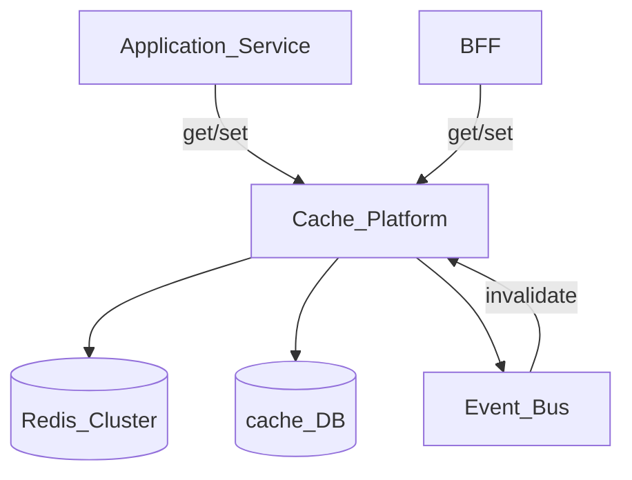
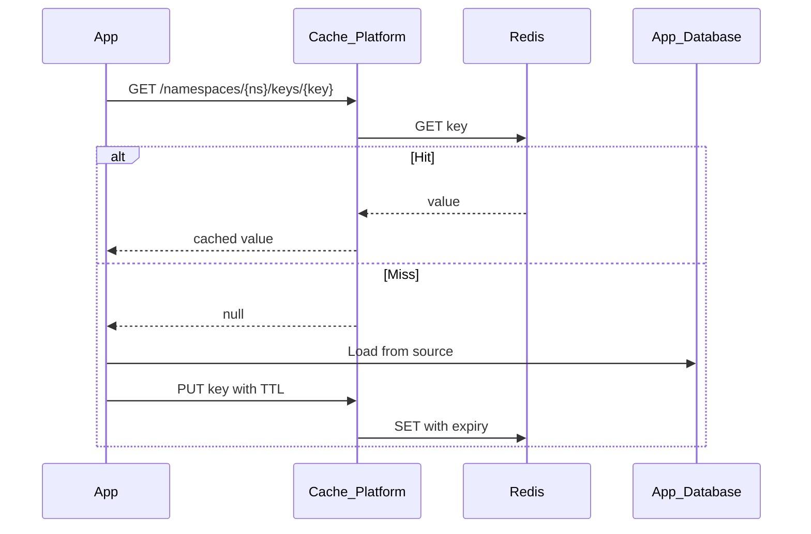
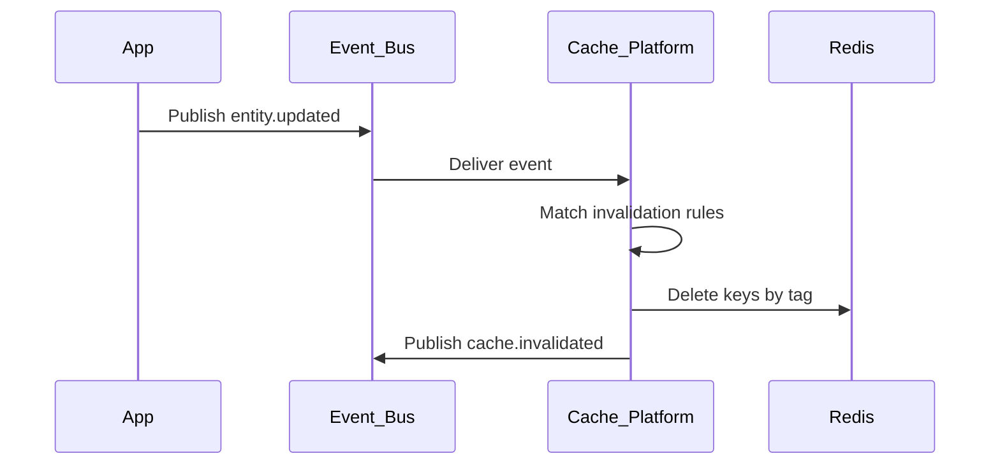

# Cache Platform

> **Volume:** 2 | **Chapter ID:** v2-29 | **Status:** reviewed

## Purpose

The **Cache Platform** centralizes distributed caching across all EPB services. Applications cache configuration snapshots, authorization decisions, master data lookups, and computed aggregates without deploying Redis clusters per service. The platform enforces tenant isolation, TTL policies, and coordinated invalidation so stale data never silently corrupts business state.

## Architecture



The Cache Platform exposes a uniform API over Redis (or compatible stores). Metadata for namespaces, policies, and invalidation rules lives in its own database.

## Responsibilities

### In Scope

- Key-value get, set, delete, and batch operations
- Namespace isolation per tenant and service
- TTL management with default and max limits
- Tag-based and pattern-based invalidation
- Cache-aside and read-through helper patterns (SDK)
- Distributed locking for short-lived mutual exclusion
- Hit/miss metrics and memory usage per namespace
- Event-driven invalidation from domain changes

### Out of Scope

- Persistent primary data storage (application databases)
- Full-text search indexes ([Search Platform](21-search-platform.md))
- Session token storage (Authentication service owns session cache)
- Long-term audit or historical data

## API Design

### Base Path

`/cache/v1`

Internal services call directly; BFF may cache aggregated read models.

### Key Operations

| Method | Path | Description |
|--------|------|-------------|
| GET | /namespaces/{ns}/keys/{key} | Get value; returns null if missing |
| PUT | /namespaces/{ns}/keys/{key} | Set value with optional TTL |
| DELETE | /namespaces/{ns}/keys/{key} | Delete single key |
| POST | /namespaces/{ns}/keys/batch-get | Get multiple keys |
| POST | /namespaces/{ns}/keys/batch-set | Set multiple keys atomically per namespace |
| DELETE | /namespaces/{ns}/keys | Delete by prefix or tag |

### Namespace Management

| Method | Path | Description |
|--------|------|-------------|
| POST | /namespaces | Register namespace with policy |
| GET | /namespaces/{ns} | Get namespace config and stats |
| PATCH | /namespaces/{ns} | Update TTL defaults, max size |

### Invalidation

| Method | Path | Description |
|--------|------|-------------|
| POST | /invalidate/tags | Invalidate all keys with given tags |
| POST | /invalidate/prefix | Invalidate keys matching prefix |
| POST | /invalidate/namespace | Flush entire namespace (admin) |

### Locking

| Method | Path | Description |
|--------|------|-------------|
| POST | /locks | Acquire lock with TTL |
| DELETE | /locks/{lockId} | Release lock |
| GET | /locks/{lockId} | Check lock status |

### Set Request

```json
{
  "tenantId": "tenant-uuid",
  "value": { "permissions": ["read", "write"], "resolvedAt": "2026-08-01T10:00:00Z" },
  "ttlSeconds": 300,
  "tags": ["authz", "user-uuid"],
  "contentType": "json"
}
```

Namespace convention: `{service}.{purpose}` (e.g., `authz.user-permissions`, `config.tenant-snapshot`).

## Database Design

Redis holds values; PostgreSQL holds configuration and invalidation audit.

| Table | Key Columns | Purpose |
|-------|-------------|---------|
| `cache_namespaces` | `namespace`, `tenant_id`, `default_ttl`, `max_ttl`, `max_key_size` | Namespace policies |
| `cache_invalidation_rules` | `rule_id`, `event_type`, `namespace`, `tag_pattern` | Event-to-tag mapping |
| `cache_invalidation_log` | `rule_id`, `keys_affected`, `triggered_at` | Invalidation audit |
| `cache_locks` | `lock_id`, `namespace`, `key`, `holder_id`, `expires_at` | Lock metadata (Redis holds lease) |

## Folder Structure

```text
services/cache/
├── api/
├── domain/
│   ├── keys/         # Get, set, delete, batch
│   ├── namespaces/   # Policy enforcement
│   ├── invalidate/   # Tag, prefix, event-driven
│   └── locks/        # Distributed lock manager
├── persistence/
├── adapters/
│   └── redis/        # Redis cluster client
├── sdk/              # Client library for services
├── events/           # cache.invalidated publishers
└── tests/
```

## Sequence Diagrams

### Cache-Aside Read



### Event-Driven Invalidation



## Extension Points

- **Store adapters** — Redis, Memcached, or in-memory for dev
- **Serialization** — JSON default; optional compression for large values
- **Invalidation rules** — map any event type to tag patterns (see [Cache Invalidation Strategy](62-cache-invalidation-strategy.md))
- **Tenant quotas** — max memory and key count per tenant

## Integration

- **Depends on:** Configuration Service, Event Bus
- **Events published:** `cache.invalidated`, `cache.namespace.flushed`
- **Events consumed:** Any domain event registered in invalidation rules (e.g., `entity.updated`, `config.updated`, `master-data.record.changed`)
- **Used by:** Authentication, Authorization, Master Data Platform, Configuration Service

## Best Practices

1. Always set TTL — no infinite caches except explicitly approved namespaces
2. Tag keys for any data that can change via events
3. Never cache sensitive secrets; encrypt or avoid caching PII
4. Use namespaces to prevent cross-service key collisions
5. Size values appropriately; split large lists into keyed chunks

## Anti-Patterns

| Anti-Pattern | Why It Fails | Preferred Approach |
|--------------|--------------|-------------------|
| Per-service Redis instances | Ops overhead, inconsistent policies | Shared Cache Platform |
| Manual key deletion in app code | Missed invalidation paths | Tag-based event invalidation |
| Caching without TTL | Memory exhaustion, stale forever | Default TTL per namespace |
| Cache as source of truth | Data loss on flush, no durability | Cache-aside from authoritative DB |

## Related Chapters

- [Previous: Queue Platform](28-queue-platform.md)
- [Next: Event Bus](30-event-bus.md)
- [Cache Invalidation Strategy](62-cache-invalidation-strategy.md)
- [EPB Glossary](../docs/GLOSSARY.md)

---

*Enterprise Platform Blueprint — Volume 2*
