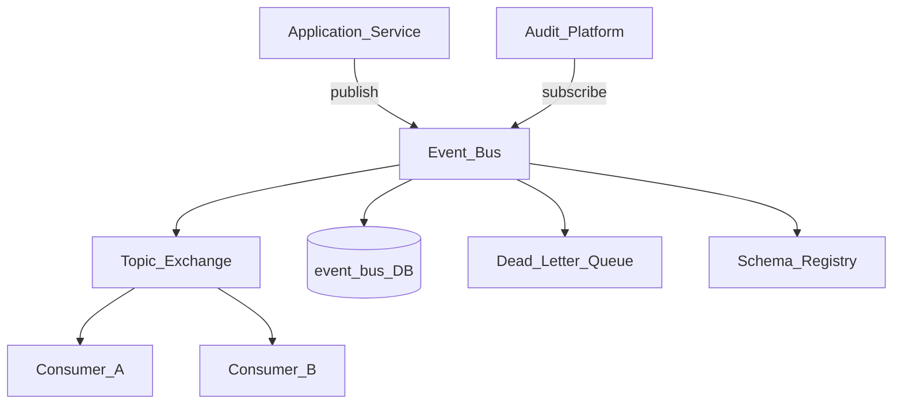
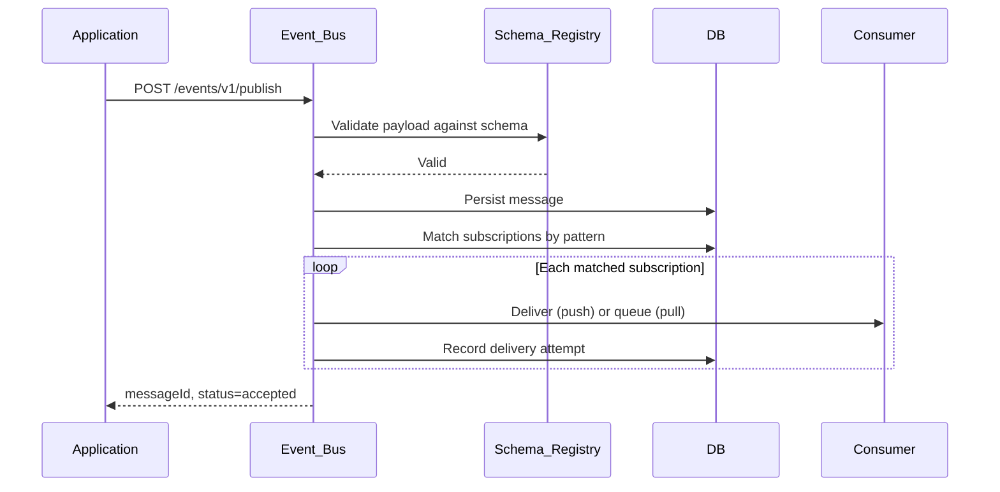
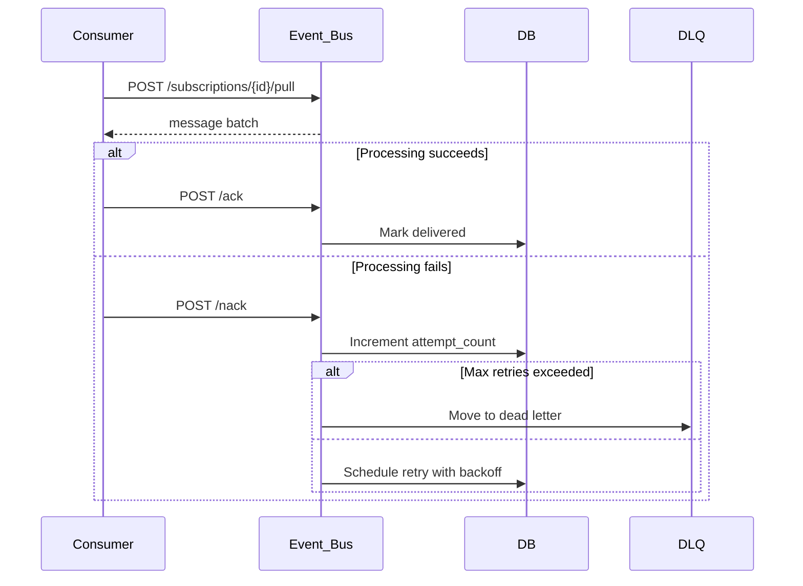

# Event Bus

> **Volume:** 2 | **Chapter ID:** v2-30 | **Status:** reviewed

## Purpose

The **Event Bus** is the platform's asynchronous messaging backbone. Services publish domain events without knowing subscribers; consumers subscribe by event type and process messages independently. Applications never wire direct HTTP callbacks between services for cross-domain notifications — they publish to the bus and let the platform handle routing, durability, and delivery guarantees.

## Architecture



The Event Bus owns message metadata, subscriptions, and delivery state. It does not execute business logic on behalf of publishers or consumers.

## Responsibilities

### In Scope

- Publish/subscribe messaging with at-least-once delivery
- Topic and queue routing by event type pattern
- Message persistence until acknowledged or expired
- Schema validation against registered event schemas
- Dead-letter handling for poison messages
- Subscription registration and lifecycle management
- Replay of historical events for recovery or backfill
- Correlation and causation ID propagation across messages

### Out of Scope

- Synchronous request/response between services (use direct API or BFF aggregation)
- Business rule evaluation on message content ([Rule Engine](20-rule-engine.md))
- Guaranteed exactly-once processing (consumers must be idempotent)
- Cross-tenant event delivery without explicit tenant context

## API Design

### Base Path

`/events/v1`

Follow [API Standards](../Volume-1-Foundation/18-api-standards.md) and [Error Handling](../Volume-1-Foundation/19-error-handling.md).

### Publishing

| Method | Path | Description |
|--------|------|-------------|
| POST | /publish | Publish single event |
| POST | /publish/batch | Publish up to 100 events atomically per tenant |
| GET | /messages/{messageId} | Retrieve message metadata and delivery status |

### Subscriptions

| Method | Path | Description |
|--------|------|-------------|
| POST | /subscriptions | Register consumer subscription |
| GET | /subscriptions | List subscriptions (paginated) |
| GET | /subscriptions/{id} | Get subscription details |
| PATCH | /subscriptions/{id} | Update filter, endpoint, or status |
| DELETE | /subscriptions/{id} | Deactivate subscription |

### Consumption

| Method | Path | Description |
|--------|------|-------------|
| POST | /subscriptions/{id}/pull | Pull pending messages (polling consumers) |
| POST | /subscriptions/{id}/ack | Acknowledge processed message |
| POST | /subscriptions/{id}/nack | Negative acknowledge; retry or DLQ |
| POST | /replay | Replay events by time range and event type |

### Schema Registry

| Method | Path | Description |
|--------|------|-------------|
| POST | /schemas | Register event schema (JSON Schema) |
| GET | /schemas/{eventType} | Get current schema version |
| GET | /schemas/{eventType}/versions | List schema versions |

### Publish Payload

```json
{
  "eventType": "entity.updated",
  "tenantId": "tenant-uuid",
  "correlationId": "corr-uuid",
  "causationId": "parent-msg-uuid",
  "payload": {
    "entityId": "entity-uuid",
    "entityType": "resource",
    "changedFields": ["status", "name"]
  },
  "metadata": {
    "sourceService": "resource-service",
    "schemaVersion": "1.0"
  }
}
```

Event type naming convention: `{domain}.{action}` (e.g., `tenant.provisioned`, `import.job.completed`).

## Database Design

All tables include `tenant_id`. Messages are partitioned by tenant and date for retention policies.

| Table | Key Columns | Purpose |
|-------|-------------|---------|
| `event_messages` | `message_id`, `event_type`, `payload_json`, `status`, `published_at` | Persisted message store |
| `event_subscriptions` | `subscription_id`, `consumer_service`, `event_pattern`, `delivery_mode`, `status` | Consumer registration |
| `event_deliveries` | `delivery_id`, `message_id`, `subscription_id`, `attempt_count`, `delivered_at` | Per-subscriber delivery tracking |
| `event_dead_letters` | `message_id`, `subscription_id`, `failure_reason`, `moved_at` | Poison message archive |
| `event_schemas` | `event_type`, `version`, `schema_json`, `is_active` | Schema registry |
| `event_replay_jobs` | `job_id`, `from_time`, `to_time`, `event_types`, `status` | Replay orchestration |

Indexes: `(tenant_id, event_type, published_at)` on messages; `(subscription_id, status)` on deliveries. TTL job archives messages past retention window.

## Folder Structure

```text
services/event-bus/
├── api/              # REST controllers
├── domain/
│   ├── publish/      # Validation, routing, persistence
│   ├── consume/      # Pull, ack, nack handlers
│   ├── subscriptions/# Registration and filtering
│   └── replay/       # Historical replay jobs
├── persistence/      # Entities, repositories
├── adapters/
│   ├── broker/       # Kafka/RabbitMQ/SQS adapter
│   └── schema/       # JSON Schema validator
├── mappers/
├── events/           # event-bus.* lifecycle events
└── tests/
```

## Sequence Diagrams

### Publish and Deliver



### Consumer Ack with Retry



## Extension Points

- **Broker adapters** — swap Kafka, RabbitMQ, or cloud-native queues without changing publisher API
- **Custom filters** — subscription-level JSONPath or header filters
- **Transform hooks** — optional payload enrichment before delivery (see [Event Bus Schema Registry](63-event-bus-schema-registry.md))
- **Tenant routing rules** — isolate high-volume tenants to dedicated topics

## Integration

- **Depends on:** Configuration Service (retention, retry policies), Audit Platform (compliance trail)
- **Events published:** `event-bus.message.published`, `event-bus.delivery.failed`, `event-bus.dead-letter.created`
- **Events consumed:** None required; all services publish and subscribe through this bus
- **Used by:** Notification Platform, Import/Export Platform, Audit Platform, Integration Framework

## Best Practices

1. Design consumers to be idempotent — use `messageId` or business key for deduplication
2. Include `correlationId` on every publish to trace distributed workflows
3. Register schemas before publishing new event types in production
4. Keep payloads small; reference large data via IDs (fetch from owning service)
5. Prefer events for cross-service notifications; reserve synchronous APIs for read paths

## Anti-Patterns

| Anti-Pattern | Why It Fails | Preferred Approach |
|--------------|--------------|-------------------|
| Direct HTTP callbacks between services | Tight coupling, no retry, outage cascades | Publish domain events |
| Fat events with full entity snapshots | Stale data, large messages, schema churn | Event carries IDs and changed fields only |
| No schema versioning | Breaking changes break all consumers | Schema registry with versioned contracts |
| Synchronous event chains | Latency stacks; failures block callers | Choreography with compensating events |

## Related Chapters

- [Previous: Cache Platform](29-cache-platform.md)
- [Next: Integration Framework](31-integration-framework.md)
- [Event Bus Schema Registry](63-event-bus-schema-registry.md)
- [EPB Glossary](../docs/GLOSSARY.md)

---

*Enterprise Platform Blueprint — Volume 2*
