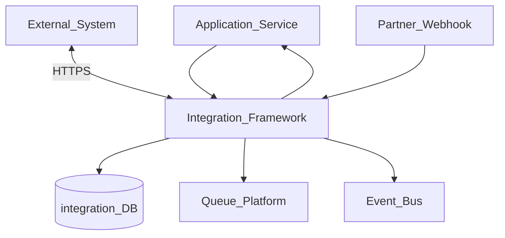
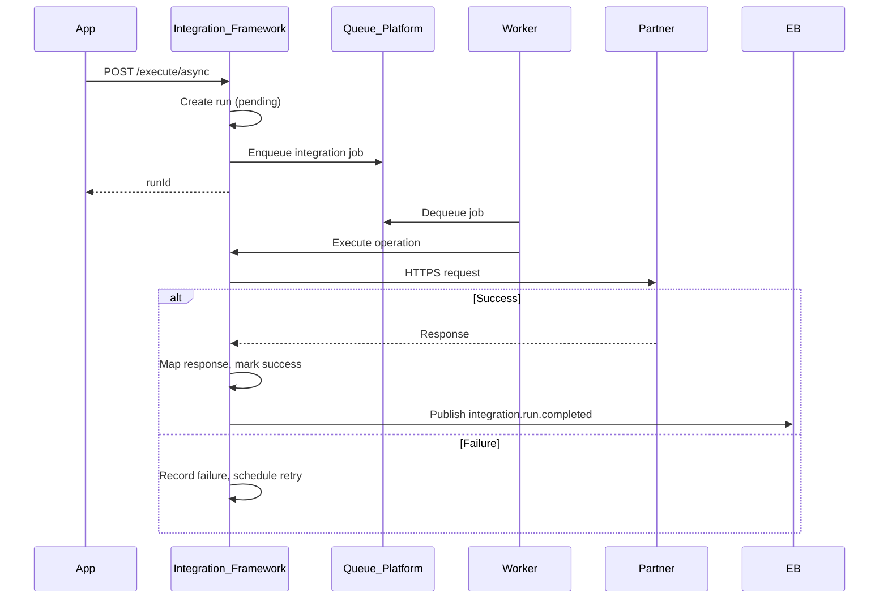
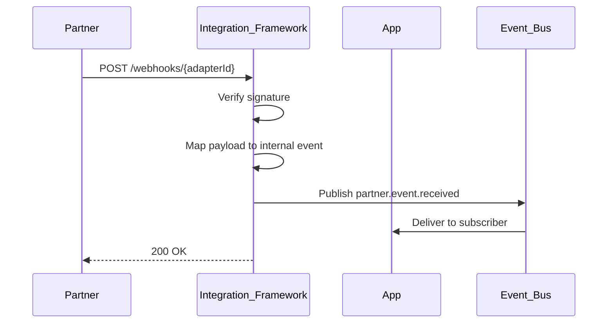

# Integration Framework

> **Volume:** 2 | **Chapter ID:** v2-31 | **Status:** reviewed

## Purpose

The **Integration Framework** connects EPB to external systems: payment gateways, identity providers, ERP connectors, and partner APIs. It provides adapter registration, credential management, request/response mapping, retry policies, and webhook ingress. Applications declare integration endpoints — they never embed HTTP clients with hardcoded partner URLs across services.

## Architecture



The framework owns connectivity, auth to partners, and delivery guarantees. Application services own business mapping of partner payloads.

## Responsibilities

### In Scope

- Integration adapter registration (REST, SOAP, webhook)
- Secure credential storage (encrypted, tenant-scoped)
- Outbound request execution with retry and circuit breaker
- Request/response transformation via mapping templates
- Webhook ingress with signature verification
- Async outbound via Queue Platform for reliability
- Integration run logging and correlation
- Rate limiting per partner and tenant

### Out of Scope

- Internal service-to-service calls (standard platform APIs)
- Event bus messaging ([Event Bus](30-event-bus.md))
- Business workflow orchestration ([Workflow Engine](19-workflow-engine.md))
- Partner contract negotiation

## API Design

### Base Path

`/integrations/v1`

### Adapter Management

| Method | Path | Description |
|--------|------|-------------|
| POST | /adapters | Register adapter definition |
| GET | /adapters | List adapters |
| GET | /adapters/{adapterId} | Get adapter config |
| PATCH | /adapters/{adapterId} | Update mappings or policies |
| DELETE | /adapters/{adapterId} | Deactivate adapter |

### Credentials

| Method | Path | Description |
|--------|------|-------------|
| POST | /credentials | Store encrypted credentials |
| GET | /credentials/{credentialId} | Get metadata (never secret values) |
| DELETE | /credentials/{credentialId} | Revoke credentials |

### Outbound Execution

| Method | Path | Description |
|--------|------|-------------|
| POST | /execute | Synchronous outbound call |
| POST | /execute/async | Queue async outbound job |
| GET | /runs/{runId} | Get execution status and response |
| GET | /runs | List runs with filters |

### Webhook Ingress

| Method | Path | Description |
|--------|------|-------------|
| POST | /webhooks/{adapterId} | Partner webhook entry (public) |
| POST | /webhooks/{adapterId}/verify | Challenge verification (some providers) |

### Execute Request

```json
{
  "tenantId": "tenant-uuid",
  "adapterId": "payment-gateway-v1",
  "operation": "createTransaction",
  "correlationId": "corr-uuid",
  "payload": {
    "amount": 100.00,
    "currency": "USD",
    "referenceId": "txn-uuid"
  },
  "options": {
    "async": false,
    "timeoutMs": 30000,
    "idempotencyKey": "txn-uuid"
  }
}
```

### Execute Response

```json
{
  "runId": "run-uuid",
  "status": "success",
  "partnerStatusCode": 200,
  "mappedResponse": {
    "transactionId": "partner-txn-123",
    "status": "authorized"
  },
  "durationMs": 245
}
```

Run statuses: `pending`, `running`, `success`, `failed`, `timeout`, `circuit_open`.

## Database Design

| Table | Key Columns | Purpose |
|-------|-------------|---------|
| `integration_adapters` | `adapter_id`, `partner_name`, `protocol`, `config_json`, `status` | Adapter definitions |
| `integration_operations` | `operation`, `adapter_id`, `http_method`, `path_template`, `mapping_id` | Operation catalog |
| `integration_mappings` | `mapping_id`, `request_template`, `response_template` | Transform templates |
| `integration_credentials` | `credential_id`, `tenant_id`, `adapter_id`, `secret_ref` | Credential references (secrets in vault) |
| `integration_runs` | `run_id`, `adapter_id`, `status`, `correlation_id`, `duration_ms` | Execution log |
| `integration_run_payloads` | `run_id`, `request_json`, `response_json` | Payload archive (PII-redacted) |
| `integration_circuit_state` | `adapter_id`, `state`, `failure_count`, `opened_at` | Circuit breaker |

Indexes: `(tenant_id, adapter_id, created_at)` on runs; `(correlation_id)` for tracing.

## Folder Structure

```text
services/integration/
├── api/
├── domain/
│   ├── adapters/     # Registration, validation
│   ├── execute/      # Sync and async dispatch
│   ├── webhook/      # Ingress, signature verify
│   ├── mapping/      # Template transform
│   └── circuit/      # Breaker state
├── persistence/
├── adapters/
│   ├── http/         # REST client
│   ├── soap/         # SOAP client
│   └── vault/        # Secret retrieval
├── mappers/
├── events/
└── tests/
```

## Sequence Diagrams

### Async Outbound with Retry



### Webhook Ingress



## Extension Points

- **Adapter plugins** — implement transport protocol (see [Integration Adapter Pattern](64-integration-adapter-pattern.md))
- **Mapping engines** — JSONata, Mustache, or custom transforms
- **Auth providers** — OAuth2 client, API key, mutual TLS
- **Webhook routers** — route by payload type to different event types

## Integration

- **Depends on:** Queue Platform, Event Bus, Configuration Service, Audit Platform
- **Events published:** `integration.run.completed`, `integration.run.failed`, `integration.webhook.received`
- **Events consumed:** Application-triggered via API (no mandatory subscriptions)
- **Used by:** Authentication (IdP), Notification Platform (SMS/email providers), payment flows

## Best Practices

1. Never store partner secrets in application code or config files
2. Always use `correlationId` linking to business transaction
3. Redact PII in stored run payloads; retain only what support needs
4. Circuit breakers per adapter to protect platform from partner outages
5. Idempotent outbound calls using business-level idempotency keys

## Anti-Patterns

| Anti-Pattern | Why It Fails | Preferred Approach |
|--------------|--------------|-------------------|
| HTTP client per service to same partner | Duplicate auth, inconsistent retry | Integration Framework adapter |
| Secrets in environment variables per app | Rotation nightmare, leak risk | Vault-backed credential store |
| Synchronous partner calls in user request | Latency, cascading failures | Async execute with status polling |
| Unverified webhook ingress | Forged events, security breach | Signature verification mandatory |

## Related Chapters

- [Previous: Event Bus](30-event-bus.md)
- [Next: Master Data Platform](32-master-data-platform.md)
- [Integration Adapter Pattern](64-integration-adapter-pattern.md)
- [EPB Glossary](../docs/GLOSSARY.md)

---

*Enterprise Platform Blueprint — Volume 2*
