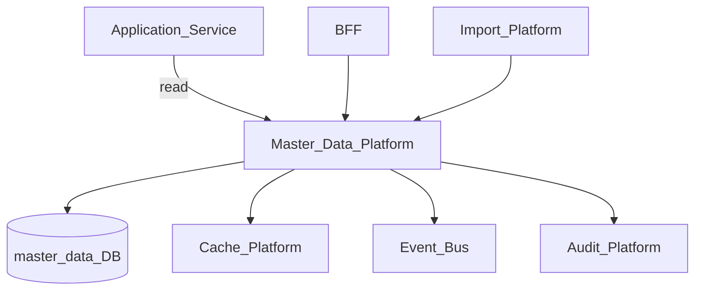
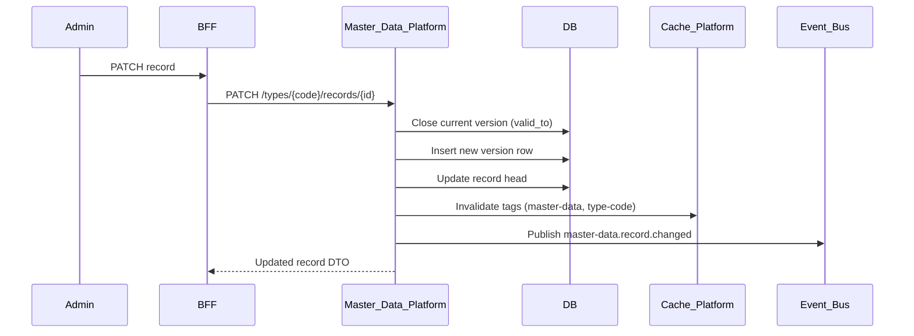
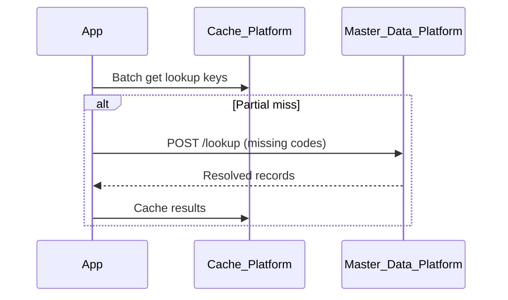

# Master Data Platform

> **Volume:** 2 | **Chapter ID:** v2-32 | **Status:** reviewed

## Purpose

The **Master Data Platform** manages shared reference entities used across applications: countries, currencies, units of measure, categories, status codes, and tenant-configurable lookup tables. Applications consume master data via API or cache — they never duplicate reference tables in every service. Changes propagate through events so downstream caches and indexes stay consistent.

## Architecture



Master Data Platform is authoritative for reference data. Application services store foreign keys only, not denormalized labels.

## Responsibilities

### In Scope

- Master data type registration (schema per reference entity)
- CRUD for reference records with versioning
- Hierarchical data (parent-child trees)
- Effective dating (valid from / valid to)
- Tenant overrides on platform defaults
- Bulk import/export via Import/Export Platform
- Cache-friendly read APIs and snapshot endpoints
- Change history and version comparison

### Out of Scope

- Transactional business entities (orders, resources with workflow state)
- Workflow approval of master data changes ([Workflow Engine](19-workflow-engine.md))
- Full-text search UI ([Search Platform](21-search-platform.md) indexes master data)
- Geographic boundary calculations

## API Design

### Base Path

`/master-data/v1`

### Type Management

| Method | Path | Description |
|--------|------|-------------|
| POST | /types | Register master data type |
| GET | /types | List types |
| GET | /types/{typeCode} | Get type schema |
| PATCH | /types/{typeCode} | Update schema (additive fields) |

### Record Operations

| Method | Path | Description |
|--------|------|-------------|
| GET | /types/{typeCode}/records | List records (paginated, filterable) |
| GET | /types/{typeCode}/records/{recordId} | Get single record |
| POST | /types/{typeCode}/records | Create record |
| PUT | /types/{typeCode}/records/{recordId} | Full update (creates new version) |
| PATCH | /types/{typeCode}/records/{recordId} | Partial update |
| DELETE | /types/{typeCode}/records/{recordId} | Deactivate (soft delete) |
| GET | /types/{typeCode}/records/{recordId}/versions | Version history |
| GET | /types/{typeCode}/tree | Hierarchical tree view |
| GET | /types/{typeCode}/snapshot | Full snapshot for cache warm |

### Lookup (optimized read)

| Method | Path | Description |
|--------|------|-------------|
| POST | /lookup | Resolve codes to records (batch) |
| GET | /lookup/{typeCode}/{code} | Resolve single code |

### Create Record Request

```json
{
  "tenantId": "tenant-uuid",
  "code": "USD",
  "name": "US Dollar",
  "attributes": {
    "symbol": "$",
    "decimalPlaces": 2
  },
  "parentCode": null,
  "validFrom": "2026-01-01",
  "validTo": null,
  "status": "active"
}
```

Code is immutable after creation; changes create new versions (see [Master Data Versioning](65-master-data-versioning.md)).

## Database Design

| Table | Key Columns | Purpose |
|-------|-------------|---------|
| `md_types` | `type_code`, `schema_json`, `hierarchy_enabled`, `status` | Type definitions |
| `md_records` | `record_id`, `type_code`, `tenant_id`, `code`, `status` | Current record head |
| `md_record_versions` | `version_id`, `record_id`, `version_number`, `data_json`, `valid_from`, `valid_to` | Immutable versions |
| `md_record_hierarchy` | `record_id`, `parent_record_id`, `path` | Tree structure |
| `md_tenant_overrides` | `tenant_id`, `type_code`, `record_id`, `override_json` | Tenant-specific labels |
| `md_change_log` | `record_id`, `change_type`, `changed_by`, `changed_at` | Audit trail |

Unique: `(tenant_id, type_code, code)` on records. Index `(type_code, status)` for list queries.

## Folder Structure

```text
services/master-data/
├── api/
├── domain/
│   ├── types/        # Schema registration
│   ├── records/      # CRUD, versioning
│   ├── hierarchy/    # Tree operations
│   └── snapshot/     # Cache warm exports
├── persistence/
├── adapters/
│   ├── cache/        # Cache Platform invalidation
│   └── import/       # Import Platform templates
├── mappers/
├── events/
└── tests/
```

## Sequence Diagrams

### Record Update with Versioning



### Batch Lookup with Cache



## Extension Points

- **Custom validators** — per-type attribute validation rules
- **Approval workflow** — optional Workflow Engine hook before activate
- **Localization** — translated labels via Localization Platform
- **Import templates** — auto-registered for bulk maintenance

## Integration

- **Depends on:** Cache Platform, Event Bus, Audit Platform, Import/Export Platform
- **Events published:** `master-data.record.created`, `master-data.record.changed`, `master-data.record.deactivated`
- **Events consumed:** `tenant.provisioned` (seed tenant overrides)
- **Related:** [Master Data Versioning](65-master-data-versioning.md)

## Best Practices

1. Never denormalize master data labels into transactional tables long-term
2. Use `code` as stable foreign key; `name` may change across versions
3. Warm caches via snapshot endpoint on service startup
4. Subscribe to change events for local cache invalidation
5. Effective dating for regulatory reference data (tax rates, compliance codes)

## Anti-Patterns

| Anti-Pattern | Why It Fails | Preferred Approach |
|--------------|--------------|-------------------|
| Duplicate country/currency tables per service | Inconsistent labels, sync nightmares | Master Data Platform |
| Hardcoded enums in code | Requires deploy to add values | Configurable master data types |
| Updating records in place without versioning | Audit gaps, broken historical reports | Versioned records |
| Skipping cache invalidation on change | Stale labels in UI for hours | Event-driven cache invalidation |

## Related Chapters

- [Previous: Integration Framework](31-integration-framework.md)
- [Next: Localization Platform](33-localization-platform.md)
- [Master Data Versioning](65-master-data-versioning.md)
- [EPB Glossary](../docs/GLOSSARY.md)

---

*Enterprise Platform Blueprint — Volume 2*
