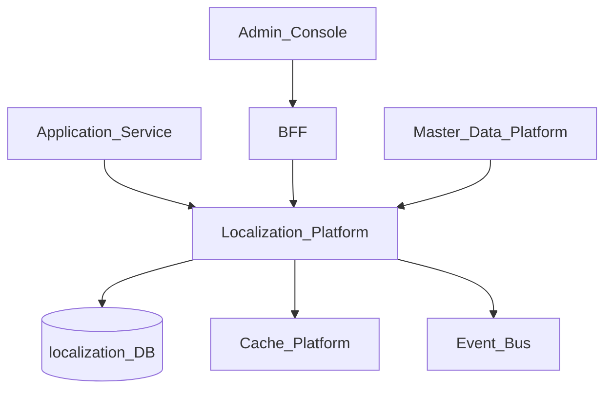
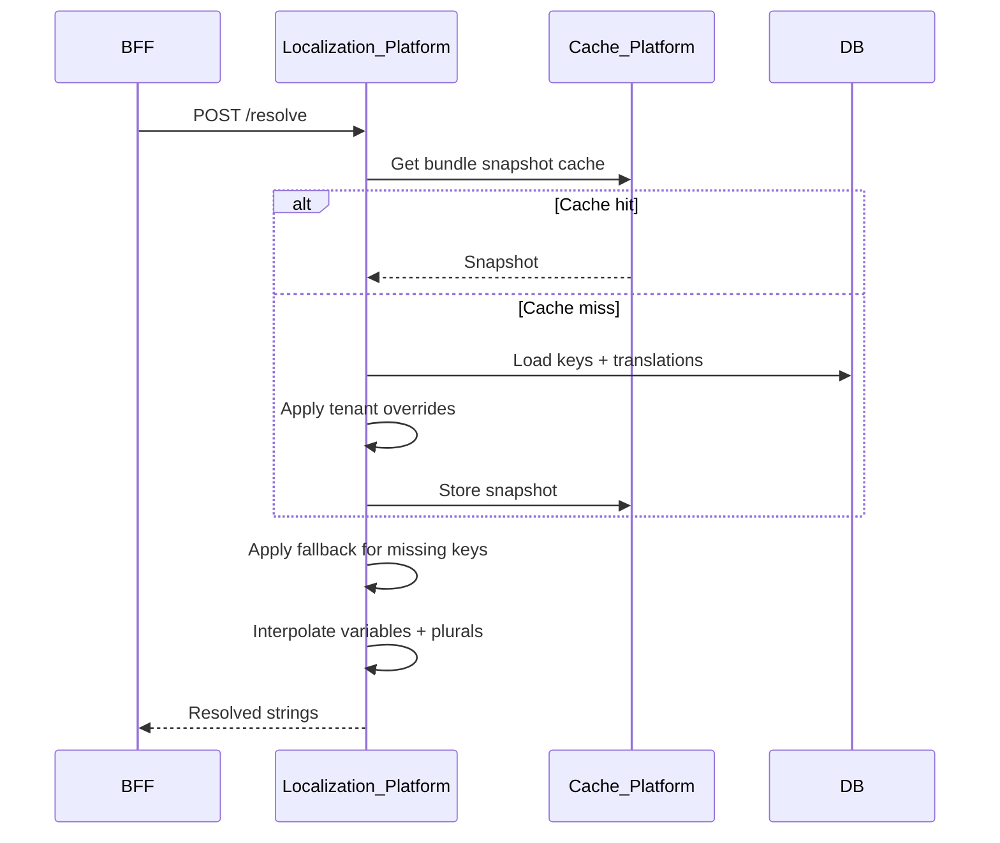
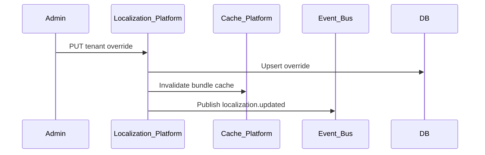

# Localization Platform

> **Volume:** 2 | **Chapter ID:** v2-33 | **Status:** reviewed

## Purpose

The **Localization Platform** manages translated strings, locale-specific formats, and resource bundles for every EPB application. Users see labels, messages, and formatted dates in their preferred locale. Applications resolve translations via API or SDK — they never embed locale files in every service or duplicate format logic.

## Architecture



The platform owns translation storage, fallback chains, and format rules. Applications own which keys they reference.

## Responsibilities

### In Scope

- Resource bundle registration per application
- Translation key CRUD with locale variants
- Fallback chain: user locale → tenant default → platform default
- Tenant overrides on platform translations
- Date, time, number, and currency formatting rules
- Pluralization and gender-aware message forms
- Bulk import/export of translations (via Import/Export Platform)
- Cache-optimized bundle resolution

### Out of Scope

- User locale preference storage ([User Management](04-user-management.md))
- Master data label storage ([Master Data Platform](32-master-data-platform.md))
- Email template content ([Template Engine](16-template-engine.md))
- RTL layout CSS (frontend responsibility)

## API Design

### Base Path

`/localization/v1`

### Bundle Management

| Method | Path | Description |
|--------|------|-------------|
| POST | /bundles | Register resource bundle |
| GET | /bundles | List bundles |
| GET | /bundles/{bundleId} | Get bundle metadata |
| DELETE | /bundles/{bundleId} | Deactivate bundle |

### Translation Keys

| Method | Path | Description |
|--------|------|-------------|
| POST | /bundles/{bundleId}/keys | Create translation key |
| GET | /bundles/{bundleId}/keys | List keys |
| GET | /bundles/{bundleId}/keys/{key} | Get key with all locales |
| PUT | /bundles/{bundleId}/keys/{key} | Update translations |
| DELETE | /bundles/{bundleId}/keys/{key} | Remove key |

### Resolution (runtime)

| Method | Path | Description |
|--------|------|-------------|
| POST | /resolve | Resolve keys to translated strings |
| GET | /bundles/{bundleId}/snapshot/{locale} | Full bundle for locale (cache warm) |
| POST | /format/date | Format date per locale rules |
| POST | /format/number | Format number per locale rules |
| POST | /format/currency | Format currency with locale + code |

### Resolve Request

```json
{
  "tenantId": "tenant-uuid",
  "bundleId": "resource-app-ui",
  "locale": "fr-FR",
  "fallbackLocale": "en-US",
  "keys": [
    "entity.status.active",
    "entity.list.title",
    "validation.required"
  ],
  "variables": {
    "entity.list.title": { "count": 5 }
  }
}
```

### Resolve Response

```json
{
  "locale": "fr-FR",
  "resolvedLocale": "fr-FR",
  "translations": {
    "entity.status.active": "Actif",
    "entity.list.title": "5 ressources",
    "validation.required": "Ce champ est obligatoire"
  },
  "missingKeys": []
}
```

Locale format: ISO 639-1 language + ISO 3166-1 region (e.g., `en-US`, `ar-SA`, `zh-CN`).

## Database Design

| Table | Key Columns | Purpose |
|-------|-------------|---------|
| `l10n_bundles` | `bundle_id`, `application_id`, `name`, `status` | Bundle registry |
| `l10n_keys` | `key_id`, `bundle_id`, `key_name`, `description` | Translation keys |
| `l10n_translations` | `key_id`, `locale`, `value`, `plural_forms_json` | Locale strings |
| `l10n_tenant_overrides` | `tenant_id`, `key_id`, `locale`, `value` | Tenant custom labels |
| `l10n_locale_formats` | `locale`, `date_format`, `time_format`, `number_format` | Format rules |
| `l10n_fallback_chains` | `tenant_id`, `locale`, `fallback_locale` | Custom fallback |

Unique: `(bundle_id, key_name)` on keys; `(key_id, locale)` on translations.

## Folder Structure

```text
services/localization/
├── api/
├── domain/
│   ├── bundles/      # Registration
│   ├── keys/         # CRUD translations
│   ├── resolve/      # Fallback + pluralization
│   └── format/       # Date, number, currency
├── persistence/
├── adapters/
│   ├── cache/        # Bundle snapshot cache
│   └── import/       # Bulk translation import
├── mappers/
├── events/
└── tests/
```

## Sequence Diagrams

### Translation Resolution



### Tenant Override Update



## Extension Points

- **Plural rule plugins** — CLDR plural rules per locale
- **RTL metadata** — flag locales requiring RTL (for frontend)
- **Translation workflow** — optional approval before publish
- **Machine translation hook** — suggest translations via Integration Framework

## Integration

- **Depends on:** Cache Platform, Event Bus, Import/Export Platform
- **Events published:** `localization.key.updated`, `localization.bundle.published`
- **Events consumed:** `tenant.provisioned` (default locale setup)
- **Related:** [Localization Resource Bundles](66-localization-resource-bundles.md)

## Best Practices

1. Use hierarchical key names: `{module}.{screen}.{element}`
2. Never concatenate translated strings — use single keys with variables
3. Ship platform default bundles; tenants override only what differs
4. Warm bundle snapshots on BFF startup for hot locales
5. Log `missingKeys` in development; alert on production missing keys

## Anti-Patterns

| Anti-Pattern | Why It Fails | Preferred Approach |
|--------------|--------------|-------------------|
| Hardcoded strings in code | No translation without deploy | Localization keys |
| Per-service JSON locale files | Drift, duplicate keys | Central bundles |
| English as inline fallback in code | Inconsistent partial translations | Platform fallback chain |
| Formatting dates in frontend only | Inconsistent API/export formats | Localization format API |

## Related Chapters

- [Previous: Master Data Platform](32-master-data-platform.md)
- [Next: Validation Platform](34-validation-platform.md)
- [Localization Resource Bundles](66-localization-resource-bundles.md)
- [EPB Glossary](../docs/GLOSSARY.md)

---

*Enterprise Platform Blueprint — Volume 2*
