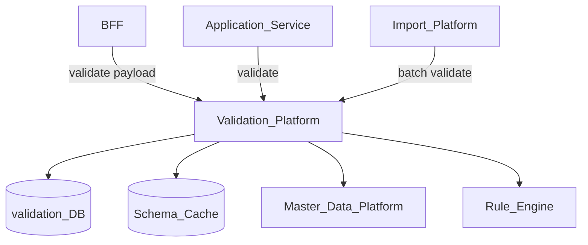
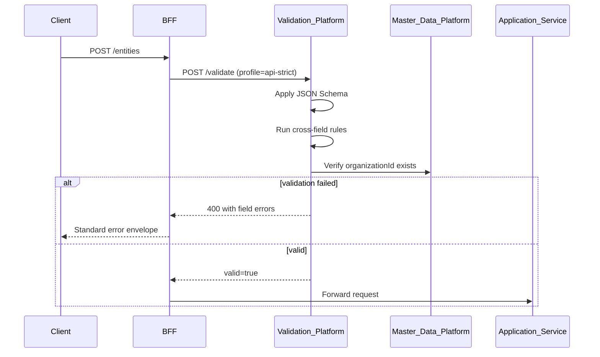
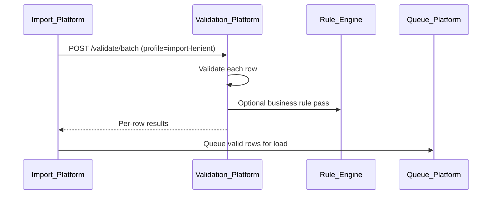

# Validation Platform

> **Volume:** 2 | **Chapter ID:** v2-34 | **Status:** reviewed

## Purpose

The **Validation Platform** centralizes input validation rules, schema definitions, and cross-field constraints shared across EPB services. Applications declare what valid data looks like; the platform provides consistent validation execution, error formatting, and rule versioning. Field-level checks in a single service are insufficient when the same entity shape appears in import, API, and UI channels.

## Architecture



Validation schemas are tenant-extensible. Platform base schemas ship with each entity type; tenants add custom fields via metadata.

## Responsibilities

### In Scope

- JSON Schema and custom constraint rule registration per entity type
- Synchronous validation API for request payloads
- Batch validation for import pipelines
- Cross-field rules (e.g., end date after start date)
- Reference integrity checks against Master Data Platform
- Conditional validation (fields required based on other field values)
- Localized error message templates
- Schema versioning with backward compatibility checks
- Validation profile selection (strict for API, lenient for import preview)

### Out of Scope

- Authorization and permission checks ([Authorization](03-authorization.md))
- Business outcome rules ([Rule Engine](20-rule-engine.md))
- Database constraint enforcement (complement, not replace, DB constraints)
- UI form rendering ([Form Builder](69-form-builder.md))

## API Design

### Base Path

`/validation/v1`

### Schema Management

| Method | Path | Description |
|--------|------|-------------|
| GET | /schemas | List registered schemas |
| GET | /schemas/{entityType} | Get current schema for entity type |
| POST | /schemas/register | Register or update schema (service admin) |
| GET | /schemas/{entityType}/versions | Schema version history |
| POST | /schemas/{entityType}/validate-compatibility | Check new schema against prior version |

### Validation Execution

| Method | Path | Description |
|--------|------|-------------|
| POST | /validate | Validate single payload |
| POST | /validate/batch | Validate up to 1000 payloads |
| POST | /validate/partial | Validate subset of fields (form step) |

### Validate Request

```json
{
  "tenantId": "tenant-uuid",
  "entityType": "resource",
  "schemaVersion": "2.1",
  "profile": "api-strict",
  "payload": {
    "name": "Primary Resource",
    "code": "RES-001",
    "startDate": "2026-08-01",
    "endDate": "2026-07-01",
    "organizationId": "org-uuid"
  },
  "options": {
    "checkReferences": true,
    "locale": "en-US"
  }
}
```

### Validate Response

```json
{
  "valid": false,
  "errors": [
    {
      "field": "endDate",
      "code": "date.range.invalid",
      "message": "End date must be after start date",
      "severity": "error"
    },
    {
      "field": "code",
      "code": "pattern.mismatch",
      "message": "Code must match pattern RES-[0-9]{3}",
      "severity": "error"
    }
  ]
}
```

Follow [API Standards](../Volume-1-Foundation/18-api-standards.md).

## Database Design

| Table | Key Columns | Purpose |
|-------|-------------|---------|
| `validation_schemas` | `schema_id`, `entity_type`, `version`, `schema_json`, `status` | Schema definitions |
| `validation_rules` | `rule_id`, `entity_type`, `rule_type`, `expression`, `message_key` | Custom constraints |
| `validation_profiles` | `profile_key`, `entity_type`, `rule_overrides_json` | Strict/lenient profiles |
| `validation_messages` | `message_key`, `locale`, `template` | Localized error text |
| `tenant_schema_extensions` | `tenant_id`, `entity_type`, `extension_json` | Tenant custom fields |

Indexes: `(entity_type, version DESC)`; `(tenant_id, entity_type)` on extensions.

## Folder Structure

```text
services/validation-platform/
├── api/
├── domain/
│   ├── schemas/        # Registration, compatibility checks
│   ├── engine/         # JSON Schema + custom rule execution
│   ├── references/     # Master data lookup validation
│   └── i18n/           # Message resolution
├── persistence/
└── tests/
```

## Sequence Diagrams

### API Request Validation



### Import Batch Validation



## Extension Points

- **Custom validators** — register typed validator functions (regex, range, lookup)
- **Tenant schema extensions** — via Metadata Engine field definitions
- **Rule Engine bridge** — complex business validation delegated to rules

## Integration

- **Depends on:** Master Data Platform, Configuration Service, Localization Platform
- **Events published:** `schema.registered`, `schema.deprecated`
- **Events consumed:** `master-data.updated` (invalidate reference cache), `metadata.field.added`
- **Consumers:** BFF, Import Platform, application services, Form Builder

## Best Practices

1. Validate at system boundary (BFF) before application service processing
2. Return field-level errors with stable error codes for UI mapping
3. Version schemas; never break existing payloads without migration window
4. Complement — not replace — database constraints for integrity
5. Use profiles: strict for API, lenient with warnings for import preview

## Anti-Patterns

| Anti-Pattern | Why It Fails | Preferred Approach |
|--------------|--------------|-------------------|
| Duplicated validation per service | Inconsistent rules, drift | Central Validation Platform |
| Generic "invalid input" errors | Poor UX, hard to fix | Field-level coded errors |
| Validation only in frontend | Bypass via direct API calls | Server-side validation at BFF |
| Mixing authorization in validation | Wrong error type and semantics | Separate Authorization check |
| Unversioned schema changes | Silent client breaks | Schema versioning and compatibility API |

## Related Chapters

- [Previous: Localization Platform](33-localization-platform.md)
- [Next: Exception Handling](35-exception-handling.md)
- [Import Validation Pipeline](59-import-validation-pipeline.md)
- [Rule Engine](20-rule-engine.md)
- [Form Builder](69-form-builder.md)
- [EPB Glossary](../docs/GLOSSARY.md)

---

*Enterprise Platform Blueprint — Volume 2*
