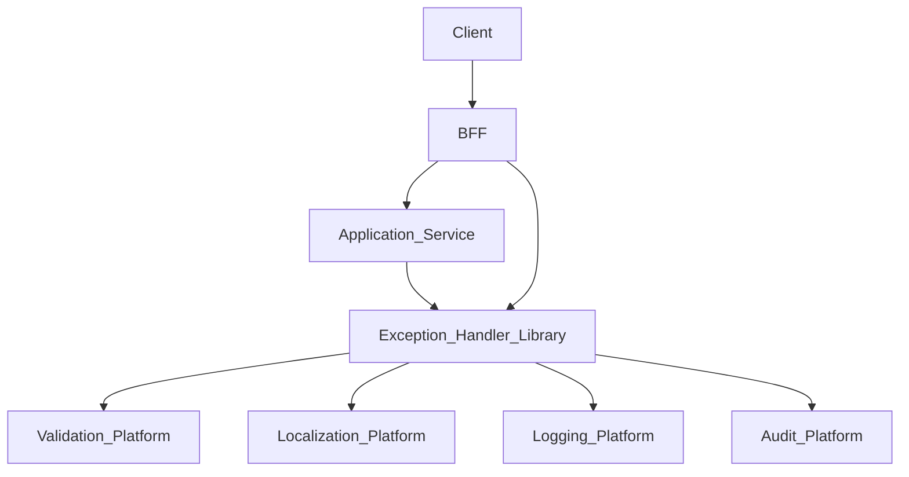
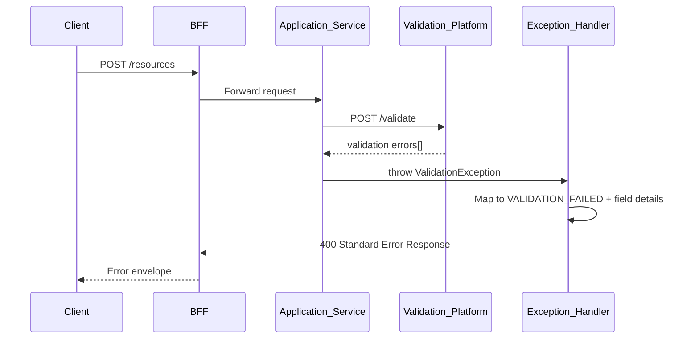
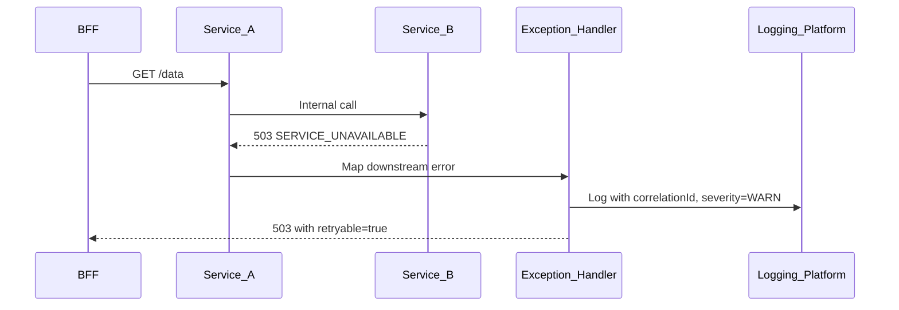

# Exception Handling

> **Volume:** 2 | **Chapter ID:** v2-35 | **Status:** reviewed

## Purpose

The **Exception Handling** platform capability defines how errors propagate, transform, and surface across EPB services. It standardizes error codes, HTTP status mapping, localized messages, correlation IDs, and safe detail exposure so every API consumer receives predictable failure responses. Application services throw domain exceptions; shared libraries map them to [Standard Response](../Volume-1-Foundation/19-error-handling.md) envelopes — they never invent ad-hoc error JSON per endpoint.

## Architecture



Exception handling is implemented as a shared library consumed by every service and the BFF, not a standalone network service. The platform publishes schemas, codes, and mapping rules that all services must follow.

## Responsibilities

### In Scope

- Canonical error code registry (`VALIDATION_FAILED`, `RESOURCE_NOT_FOUND`, `CONFLICT`, etc.)
- HTTP status code mapping per error category
- Standard error response envelope: `code`, `message`, `details`, `correlationId`, `timestamp`
- Field-level validation error aggregation from Validation Platform
- Safe error detail filtering — no stack traces or internal paths in client responses
- Localization of user-facing messages via Localization Platform
- Structured logging of exceptions with severity classification
- Retryability hints (`retryable: true`) for transient failures
- BFF error aggregation when multiple downstream calls fail

### Out of Scope

- Business rule outcome messages ([Rule Engine](20-rule-engine.md))
- Authorization denial specifics beyond `FORBIDDEN` ([Authorization](03-authorization.md))
- Infrastructure alerting rules ([Monitoring Platform](13-monitoring-platform.md))
- Client-side error UI rendering

## API Design

Exception handling does not expose REST endpoints. It defines the contract every service returns on failure.

### Standard Error Response

```json
{
  "success": false,
  "error": {
    "code": "VALIDATION_FAILED",
    "message": "One or more fields failed validation.",
    "correlationId": "corr-uuid",
    "timestamp": "2026-08-01T10:00:00Z",
    "retryable": false,
    "details": [
      {
        "field": "startDate",
        "code": "DATE_RANGE_INVALID",
        "message": "End date must be after start date."
      }
    ]
  }
}
```

### HTTP Status Mapping

| Error Category | HTTP Status | Example Code |
|----------------|-------------|--------------|
| Validation | 400 | `VALIDATION_FAILED` |
| Authentication | 401 | `UNAUTHENTICATED` |
| Authorization | 403 | `FORBIDDEN` |
| Not found | 404 | `RESOURCE_NOT_FOUND` |
| Conflict | 409 | `CONFLICT`, `ROSTER_CONFLICT` |
| Precondition failed | 412 | `VERSION_MISMATCH` |
| Rate limit | 429 | `RATE_LIMIT_EXCEEDED` |
| Internal | 500 | `INTERNAL_ERROR` |
| Unavailable | 503 | `SERVICE_UNAVAILABLE` |

### Error Code Registration

| Method | Path | Description |
|--------|------|-------------|
| GET | /error-codes/v1/catalog | List platform error codes |
| POST | /error-codes/v1/register | Register application-specific codes |

Application codes must be namespaced: `inventory.INSUFFICIENT_STOCK`.

### BFF Aggregation Response (partial failure)

```json
{
  "success": false,
  "error": {
    "code": "PARTIAL_FAILURE",
    "message": "One or more operations failed.",
    "correlationId": "corr-uuid",
    "details": {
      "failedOperations": [
        { "operation": "updateResource", "code": "CONFLICT" },
        { "operation": "notifyUser", "code": "SERVICE_UNAVAILABLE", "retryable": true }
      ]
    }
  }
}
```

Follow [API Standards](../Volume-1-Foundation/18-api-standards.md) and [Error Handling](../Volume-1-Foundation/19-error-handling.md).

## Database Design

Error code catalog is persisted for documentation and SDK generation.

| Table | Key Columns | Purpose |
|-------|-------------|---------|
| `error_codes` | `code`, `http_status`, `category`, `default_message_key` | Canonical registry |
| `error_code_translations` | `code`, `locale`, `message_template` | Localized templates |
| `error_code_owners` | `code`, `application_id`, `deprecated_at` | Ownership and lifecycle |

Runtime exception handling does not require a database per request — the catalog is read at startup and cached.

## Folder Structure

```text
libs/exception-handling/
├── core/
│   ├── exceptions/       # Base exception types
│   ├── mapper/           # Exception → HTTP response
│   └── filter/           # Middleware/filters per framework
├── codes/                # Generated code constants
├── localization/         # Localization Platform adapter
├── logging/              # Structured error log formatter
└── tests/

services/error-code-registry/
├── api/                  # Catalog registration API
├── persistence/
└── tests/
```

## Sequence Diagrams

### Validation Failure



### Downstream Service Failure



## Extension Points

- **Custom exception types** — extend base classes; register mapping in service bootstrap
- **Error detail sanitizers** — strip PII before client response
- **Webhook error payloads** — alternate envelope for async integrations
- **Sampling** — optional error fingerprinting for Monitoring Platform

## Integration

- **Depends on:** Localization Platform, Logging Platform, Validation Platform
- **Used by:** Every service, BFF, Import/Export pipelines
- **Events published:** None (errors logged, not evented by default)
- **Publishes to:** Audit Platform for security-related errors (auth failures)

## Best Practices

1. Never expose stack traces, SQL, or internal hostnames to clients
2. Always include `correlationId` matching the request trace
3. Use specific error codes — avoid generic `BAD_REQUEST` when a catalog code exists
4. Set `retryable: true` only for transient infrastructure failures
5. Aggregate field errors in a single 400 response, not multiple round-trips
6. Log full exception detail server-side at appropriate severity

## Anti-Patterns

| Anti-Pattern | Why It Fails | Preferred Approach |
|--------------|--------------|-------------------|
| Different error JSON per endpoint | Client SDK cannot parse uniformly | Standard envelope |
| Returning 200 with error in body | Breaks HTTP semantics and caches | Correct status code |
| Leaking exception messages to client | Security information disclosure | Sanitized messages |
| String matching on error text | Fragile client logic | Stable error codes |
| Swallowing downstream errors | Lost correlation, opaque failures | Map and propagate with correlationId |

## Related Chapters

- [Previous: Validation Platform](34-validation-platform.md)
- [Next: Response Formatting](36-response-formatting.md)
- [Error Handling Standards](../Volume-1-Foundation/19-error-handling.md)
- [Logging Platform](11-logging-platform.md)
- [EPB Glossary](../docs/GLOSSARY.md)

---

*Enterprise Platform Blueprint — Volume 2*
