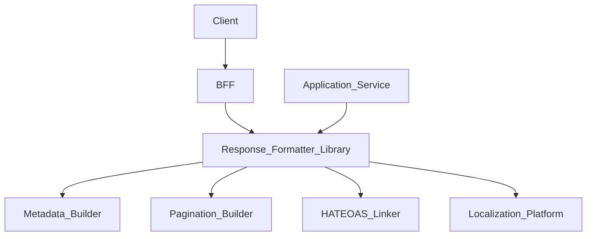
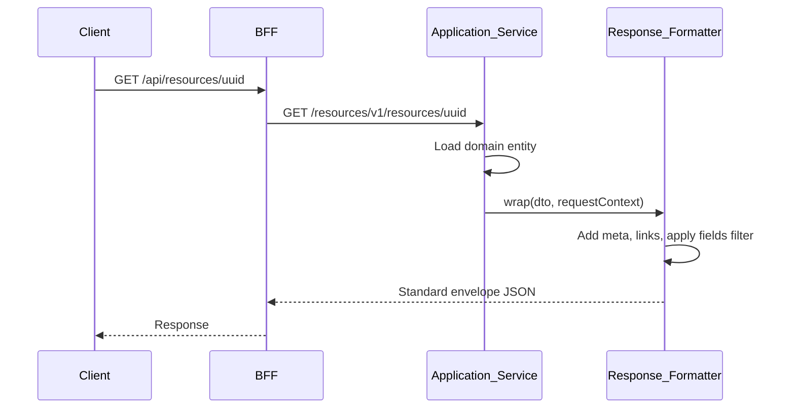
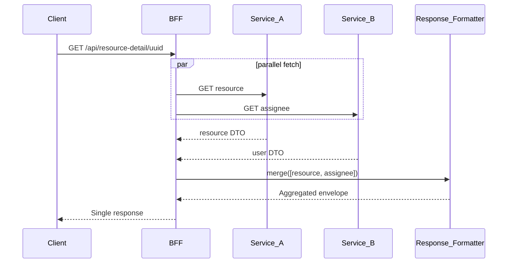

# Response Formatting

> **Volume:** 2 | **Chapter ID:** v2-36 | **Status:** reviewed

## Purpose

The **Response Formatting** platform capability standardizes how successful API responses are structured across EPB. Every service returns data through a consistent envelope — metadata, pagination blocks, hypermedia links, and typed payloads — so BFF aggregation and client SDKs parse responses uniformly. Services focus on domain DTOs; shared formatters wrap them in the canonical shape defined by [API Standards](../Volume-1-Foundation/18-api-standards.md).

## Architecture



Response formatting is a shared library, not a network service. The BFF applies additional shaping for client-specific field selection and nested aggregation.

## Responsibilities

### In Scope

- Standard success envelope: `success`, `data`, `meta`, `links`
- Pagination metadata block (see [Pagination, Sorting, and Filtering](37-pagination-sorting-filtering.md))
- Hypermedia links for discoverable next actions (`self`, `next`, `prev`, `related`)
- Field selection and sparse fieldsets via `fields` query parameter
- Null handling policy — omit vs explicit null per API version contract
- Date/time serialization in ISO-8601 UTC
- Enum and code value serialization consistency
- BFF response merging when aggregating multiple service calls
- Content negotiation headers (`Accept`, `Content-Type: application/json`)

### Out of Scope

- Error response formatting ([Exception Handling](35-exception-handling.md))
- GraphQL response shaping (separate contract if adopted)
- Binary file streaming ([File Upload and Download](58-file-upload-download.md))
- UI-specific view models (BFF responsibility)

## API Design

### Standard Success Envelope

```json
{
  "success": true,
  "data": {
    "id": "resource-uuid",
    "name": "Primary Resource",
    "status": "active"
  },
  "meta": {
    "correlationId": "corr-uuid",
    "timestamp": "2026-08-01T10:00:00Z",
    "version": "v1"
  },
  "links": {
    "self": "/resources/v1/resources/resource-uuid"
  }
}
```

### List Response with Pagination

```json
{
  "success": true,
  "data": [
    { "id": "uuid-1", "name": "Resource A" },
    { "id": "uuid-2", "name": "Resource B" }
  ],
  "meta": {
    "correlationId": "corr-uuid",
    "pagination": {
      "page": 1,
      "pageSize": 20,
      "totalItems": 145,
      "totalPages": 8,
      "hasNext": true,
      "hasPrevious": false
    }
  },
  "links": {
    "self": "/resources/v1/resources?page=1&pageSize=20",
    "next": "/resources/v1/resources?page=2&pageSize=20"
  }
}
```

### Field Selection

Request: `GET /resources/uuid?fields=id,name,status`

Response contains only requested fields in `data`. Nested field selection: `fields=id,name,organization.id,organization.name`.

### BFF Aggregated Response

```json
{
  "success": true,
  "data": {
    "resource": { "id": "uuid", "name": "Resource A" },
    "assignee": { "id": "user-uuid", "displayName": "Alex Chen" },
    "permissions": ["resource.read", "resource.write"]
  },
  "meta": {
    "correlationId": "corr-uuid",
    "sources": ["inventory-service", "user-management", "authorization"]
  }
}
```

### Response Headers

| Header | Description |
|--------|-------------|
| `X-Correlation-Id` | Echo request correlation ID |
| `X-Request-Id` | Unique request identifier |
| `ETag` | Entity version for conditional requests |
| `Cache-Control` | Caching directive per endpoint policy |
| `X-RateLimit-Remaining` | Rate limit state when applicable |

## Database Design

Response formatting is stateless. Configuration for formatting policies is stored in Configuration Service.

| Config Key | Purpose |
|------------|---------|
| `api.response.dateFormat` | Override date display format in meta |
| `api.response.omitNullFields` | Global null omission policy |
| `api.response.maxPageSize` | Upper bound for pagination |
| `api.response.enableHateoas` | Toggle link generation per tenant |

No dedicated database tables — policies are configuration values.

## Folder Structure

```text
libs/response-formatting/
├── envelope/           # Success wrapper builder
├── pagination/         # Pagination meta builder
├── links/              # HATEOAS link generator
├── fields/             # Sparse fieldset filter
├── serializers/        # Date, enum, decimal formatting
├── bff/                # Multi-source aggregation helper
└── tests/
```

## Sequence Diagrams

### Single Resource Response



### BFF Aggregation



## Extension Points

- **Custom meta blocks** — application-specific metadata under `meta.extensions`
- **Alternate serializers** — CSV, XML via content negotiation adapters
- **Response transformers** — BFF plugins for client version compatibility
- **ETag strategies** — hash-based vs version-column-based

## Integration

- **Depends on:** Configuration Service, Localization Platform (for formatted labels in meta)
- **Used by:** All services, BFF, Import/Export result reporting
- **Works with:** [Pagination, Sorting, and Filtering](37-pagination-sorting-filtering.md), [Exception Handling](35-exception-handling.md)

## Best Practices

1. Always wrap single entities and lists in the same envelope shape
2. Include `correlationId` in every response meta block
3. Generate pagination links server-side — clients should not construct page URLs
4. Use sparse fieldsets to reduce payload size on list endpoints
5. Serialize all timestamps as ISO-8601 UTC with `Z` suffix
6. Version breaking envelope changes — never silently change structure

## Anti-Patterns

| Anti-Pattern | Why It Fails | Preferred Approach |
|--------------|--------------|-------------------|
| Raw entity JSON without envelope | Inconsistent client parsing | Standard wrapper |
| Different list shapes per service | SDK proliferation | Uniform pagination block |
| Returning internal IDs in links only | Clients cannot navigate | Full path links |
| Mixing error and success shapes | Parser complexity | Separate error envelope |
| BFF returning unmerged parallel errors | Partial data without indication | Aggregated envelope with sources |

## Related Chapters

- [Previous: Exception Handling](35-exception-handling.md)
- [Next: Pagination, Sorting, and Filtering](37-pagination-sorting-filtering.md)
- [API Standards](../Volume-1-Foundation/18-api-standards.md)
- [EPB Glossary](../docs/GLOSSARY.md)

---

*Enterprise Platform Blueprint — Volume 2*
