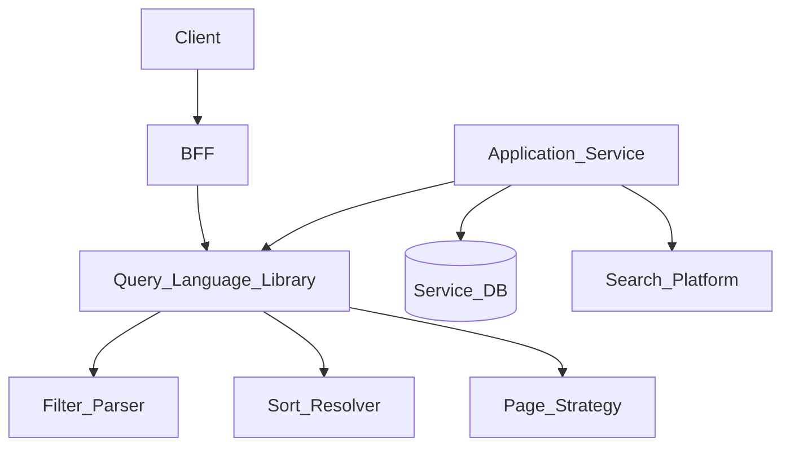
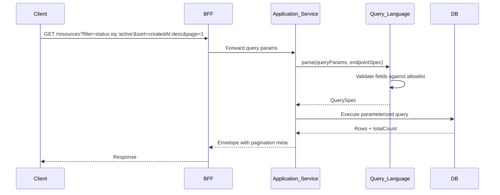
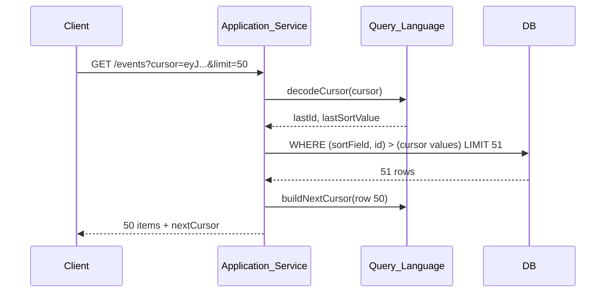

# Pagination, Sorting, and Filtering

> **Volume:** 2 | **Chapter ID:** v2-37 | **Status:** reviewed

## Purpose

The **Pagination, Sorting, and Filtering** platform capability defines the query contract every EPB list endpoint must implement. It standardizes cursor and offset pagination, multi-field sorting, filter expressions, and search-within-list semantics so clients and BFF aggregators interact with any service using the same query parameters. Services implement the parsing library and apply constraints to their persistence layer — they never invent custom `?page=` variants per endpoint.

## Architecture



The query language library parses standard parameters into a structured `QuerySpec` object that repositories translate to SQL, NoSQL, or search engine queries.

## Responsibilities

### In Scope

- Offset pagination: `page`, `pageSize` with total count
- Cursor pagination: `cursor`, `limit` for large datasets
- Multi-field sorting: `sort=field:asc,field2:desc`
- Filter expressions: equality, range, in-list, null checks, text contains
- Full-text search within list context via Search Platform integration
- Field allowlists — only indexed/filterable fields accepted
- Default sort and page size per endpoint registration
- Maximum page size enforcement from Configuration Service
- Query parameter validation with structured error responses

### Out of Scope

- Global cross-entity search ([Global Search](38-global-search.md))
- Authorization filtering (applied before query execution by service)
- Report aggregation queries ([Report Engine](23-report-engine.md))
- Export of full datasets ([Export Platform](27-export-platform.md))

## API Design

### Standard Query Parameters

| Parameter | Description | Example |
|-----------|-------------|---------|
| `page` | Page number (1-based) | `page=2` |
| `pageSize` | Items per page (max enforced) | `pageSize=50` |
| `cursor` | Opaque cursor for next page | `cursor=eyJpZCI6...` |
| `limit` | Items per cursor page | `limit=50` |
| `sort` | Comma-separated field:direction | `sort=createdAt:desc,name:asc` |
| `filter` | Structured filter expression | See below |
| `q` | Full-text search within list | `q=primary` |
| `fields` | Sparse fieldset | `fields=id,name,status` |

### Filter Expression Syntax

```text
filter=status eq 'active' and createdAt gte '2026-01-01'
filter=category in ('A','B','C')
filter=name contains 'resource'
filter=assignedTo eq null
```

Supported operators: `eq`, `ne`, `gt`, `gte`, `lt`, `lte`, `in`, `notIn`, `contains`, `startsWith`, `isNull`, `isNotNull`. Logical: `and`, `or`. Parentheses for grouping.

### Offset Pagination Response Meta

```json
{
  "pagination": {
    "strategy": "offset",
    "page": 2,
    "pageSize": 20,
    "totalItems": 145,
    "totalPages": 8,
    "hasNext": true,
    "hasPrevious": true
  }
}
```

### Cursor Pagination Response Meta

```json
{
  "pagination": {
    "strategy": "cursor",
    "limit": 50,
    "nextCursor": "eyJpZCI6InV1aWQifQ==",
    "hasNext": true
  }
}
```

### Endpoint Registration

| Method | Path | Description |
|--------|------|-------------|
| POST | /query-spec/v1/register | Register filterable/sortable fields for endpoint |
| GET | /query-spec/v1/endpoints/{service}/{path} | Get allowed fields and defaults |

### QuerySpec Internal Object

```json
{
  "pagination": { "strategy": "offset", "page": 1, "pageSize": 20 },
  "sort": [{ "field": "createdAt", "direction": "desc" }],
  "filters": [
    { "field": "status", "operator": "eq", "value": "active" }
  ],
  "search": "primary",
  "fields": ["id", "name", "status"]
}
```

Follow [API Standards](../Volume-1-Foundation/18-api-standards.md).

## Database Design

Field registration catalog for query validation:

| Table | Key Columns | Purpose |
|-------|-------------|---------|
| `query_endpoint_specs` | `service`, `path`, `default_sort`, `default_page_size` | Endpoint defaults |
| `query_field_specs` | `endpoint_id`, `field`, `filterable`, `sortable`, `data_type` | Allowlist |
| `query_field_indexes` | `endpoint_id`, `field`, `index_name` | Index mapping hints |

Services own entity data tables. The query spec catalog is a platform registry preventing unindexed filter fields from being exposed.

Recommended indexes on service tables: composite indexes matching common `sort` + `filter` combinations registered in specs.

## Folder Structure

```text
libs/query-language/
├── parser/             # Filter expression parser
├── pagination/
│   ├── offset/         # Page/pageSize strategy
│   └── cursor/         # Cursor encode/decode
├── sort/               # Multi-field sort resolver
├── validation/         # Field allowlist enforcement
├── adapters/
│   ├── sql/            # QuerySpec → SQL builder
│   └── search/         # QuerySpec → Search Platform
└── tests/

services/query-spec-registry/
├── api/
├── persistence/
└── tests/
```

## Sequence Diagrams

### Filtered List Query



### Cursor Pagination



## Extension Points

- **Custom operators** — register domain-specific operators with SQL translators
- **Computed sort fields** — virtual fields mapped to expressions
- **Filter presets** — named filters (`filterPreset=recentlyUpdated`) for common queries
- **Search boost** — relevance-weighted sort when `q` parameter present

## Integration

- **Depends on:** Configuration Service (max page size), Search Platform (full-text within list)
- **Used by:** All list endpoints, BFF, Dashboard widgets, Report parameters
- **Works with:** [Response Formatting](36-response-formatting.md), [Global Search](38-global-search.md)

## Best Practices

1. Register filterable fields explicitly — reject unknown fields with `VALIDATION_FAILED`
2. Use cursor pagination for event logs and audit trails; offset for admin UIs
3. Enforce max `pageSize` server-side regardless of client request
4. Index every registered filterable and sortable field
5. Use parameterized queries — never concatenate filter values into SQL
6. Return total count only on offset pagination when performance allows

## Anti-Patterns

| Anti-Pattern | Why It Fails | Preferred Approach |
|--------------|--------------|-------------------|
| Unbounded list endpoints | Memory exhaustion, timeouts | Required pagination |
| Custom query params per service | Client SDK cannot generalize | Standard parameter set |
| Filtering unindexed columns | Full table scans | Register only indexed fields |
| Offset pagination on millions of rows | Slow deep pages | Cursor strategy |
| Client-side filtering of full lists | Wasted bandwidth | Server-side filter expression |

## Related Chapters

- [Previous: Response Formatting](36-response-formatting.md)
- [Next: Global Search](38-global-search.md)
- [Search Platform](21-search-platform.md)
- [EPB Glossary](../docs/GLOSSARY.md)

---

*Enterprise Platform Blueprint — Volume 2*
