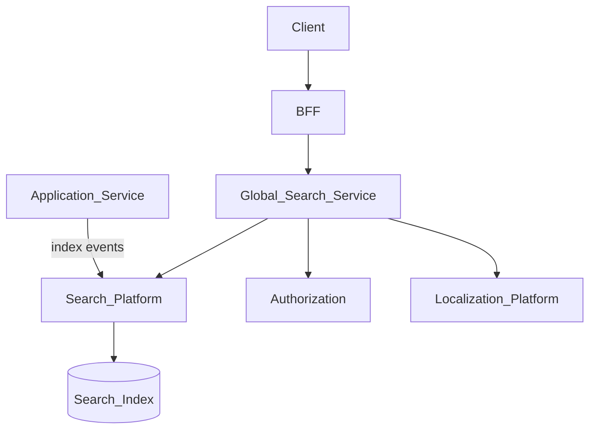
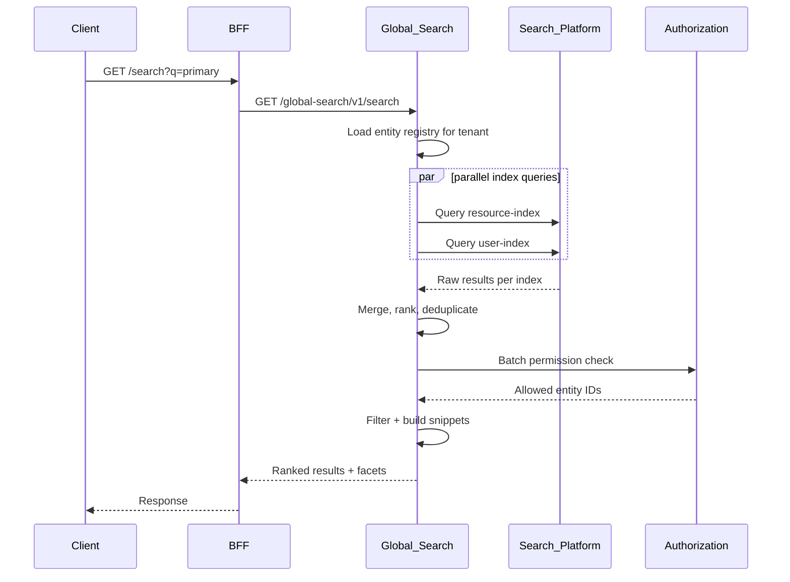
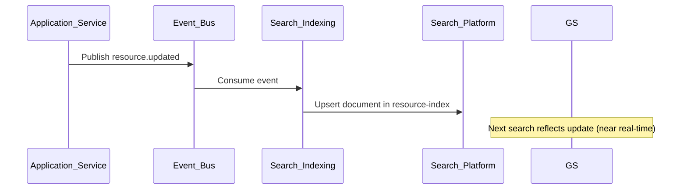

# Global Search

> **Volume:** 2 | **Chapter ID:** v2-38 | **Status:** reviewed

## Purpose

**Global Search** provides a unified search experience across all entity types registered in EPB. Users enter a single query and receive ranked results from resources, users, documents, and application-specific entities — scoped by tenant, organization, and permissions. Applications index entities through [Search Platform](21-search-platform.md); Global Search orchestrates multi-index queries, result merging, and permission filtering at the BFF layer.

## Architecture



Global Search is a thin orchestration service. Index storage, analyzers, and per-entity indexing live in Search Platform and [Search Indexing](54-search-indexing.md).

## Responsibilities

### In Scope

- Federated query across multiple registered entity indexes
- Permission-aware result filtering before response
- Result ranking with configurable boost per entity type
- Faceted navigation: entity type, date range, status, tags
- Search suggestions and autocomplete from prefix index
- Recent searches per user (optional, tenant-configurable)
- Highlighting of matched terms in result snippets
- Scoped search: tenant, organization, or global-within-tenant
- Search analytics events for Monitoring Platform

### Out of Scope

- Per-entity list filtering ([Pagination, Sorting, and Filtering](37-pagination-sorting-filtering.md))
- Index pipeline implementation ([Search Indexing](54-search-indexing.md))
- Full report generation ([Report Engine](23-report-engine.md))
- Semantic/vector search (see [AI Services Overview](67-ai-services-overview.md) for optional enhancement)

## API Design

### Base Path

`/global-search/v1`

| Method | Path | Description |
|--------|------|-------------|
| GET | /search | Execute global search query |
| GET | /suggest | Autocomplete suggestions |
| GET | /facets | Available facet values for query |
| GET | /recent | User's recent searches |
| DELETE | /recent | Clear recent search history |

### Search Request

```http
GET /global-search/v1/search?q=primary+resource&entityTypes=resource,user&page=1&pageSize=20&facet=status
```

### Search Response

```json
{
  "success": true,
  "data": {
    "query": "primary resource",
    "tookMs": 42,
    "results": [
      {
        "entityType": "resource",
        "entityId": "uuid-1",
        "title": "Primary Resource",
        "snippet": "The <em>primary</em> resource for organization Alpha",
        "score": 12.5,
        "url": "/resources/uuid-1",
        "metadata": { "status": "active", "updatedAt": "2026-07-28T14:00:00Z" }
      },
      {
        "entityType": "user",
        "entityId": "uuid-2",
        "title": "Alex Chen",
        "snippet": "Assigned to <em>primary</em> resource team",
        "score": 8.2,
        "url": "/users/uuid-2",
        "metadata": { "status": "active" }
      }
    ],
    "facets": {
      "entityType": [
        { "value": "resource", "count": 15 },
        { "value": "user", "count": 3 }
      ],
      "status": [
        { "value": "active", "count": 17 }
      ]
    }
  },
  "meta": {
    "pagination": { "page": 1, "pageSize": 20, "totalItems": 18 }
  }
}
```

### Entity Type Registration

Applications register searchable entity types at deploy:

```json
{
  "entityType": "resource",
  "indexName": "resource-index",
  "titleField": "name",
  "snippetFields": ["description", "code"],
  "urlTemplate": "/resources/{entityId}",
  "permissionKey": "inventory.resource.read",
  "boost": 1.0
}
```

Follow [API Standards](../Volume-1-Foundation/18-api-standards.md).

## Database Design

| Table | Key Columns | Purpose |
|-------|-------------|---------|
| `gs_entity_registry` | `entity_type`, `index_name`, `permission_key`, `boost` | Searchable type catalog |
| `gs_recent_searches` | `user_id`, `tenant_id`, `query`, `searched_at` | Per-user history |
| `gs_search_analytics` | `tenant_id`, `query_hash`, `result_count`, `took_ms` | Aggregated metrics |
| `gs_synonyms` | `tenant_id`, `term`, `synonyms_json` | Tenant synonym dictionary |

Search indexes themselves are managed by Search Platform — not in this schema.

## Folder Structure

```text
services/global-search/
├── api/
├── domain/
│   ├── federate/       # Multi-index query orchestration
│   ├── rank/           # Score merging and boosting
│   ├── facets/         # Facet aggregation
│   ├── suggest/        # Prefix completion
│   └── filter/         # Post-query permission filter
├── persistence/
├── adapters/
│   ├── search/         # Search Platform client
│   └── authz/          # Authorization batch check
├── mappers/
├── events/
└── tests/
```

## Sequence Diagrams

### Federated Search



### Index Update Flow



## Extension Points

- **Boost rules** — tenant-configurable entity type weights
- **Synonym dictionaries** — industry terms per tenant
- **Custom snippet builders** — application-provided highlight templates
- **AI reranking** — optional second-stage ranker from AI Services

## Integration

- **Depends on:** Search Platform, Search Indexing, Authorization, Localization Platform
- **Events consumed:** Entity lifecycle events for index freshness monitoring
- **Events published:** `search.executed` (analytics sampling)
- **Used by:** BFF global search bar, mobile universal search

## Best Practices

1. Index only fields needed for search and display — not full entity payloads
2. Always filter results by permission — never rely on index-level security alone
3. Register entity types at deploy; unregister on application retirement
4. Use query hashing for analytics — do not store raw PII queries in shared analytics
5. Set reasonable `pageSize` limits; global search is for discovery, not data export
6. Keep snippets short (150 characters) with safe HTML escaping for highlights

## Anti-Patterns

| Anti-Pattern | Why It Fails | Preferred Approach |
|--------------|--------------|-------------------|
| Per-app search endpoints only | Fragmented UX, duplicate indexes | Global Search federation |
| Skipping permission filter | Data leakage across roles | Post-query authorization |
| Indexing unauthorized fields | Sensitive data in search results | Field allowlist per entity type |
| Synchronous full reindex on every write | Write amplification | Event-driven incremental indexing |
| Deep pagination in global search | Poor relevance on page 50 | Refine query or use entity-specific list |

## Related Chapters

- [Previous: Pagination, Sorting, and Filtering](37-pagination-sorting-filtering.md)
- [Next: Bulk Operations](39-bulk-operations.md)
- [Search Platform](21-search-platform.md)
- [Search Indexing](54-search-indexing.md)
- [EPB Glossary](../docs/GLOSSARY.md)

---

*Enterprise Platform Blueprint — Volume 2*
