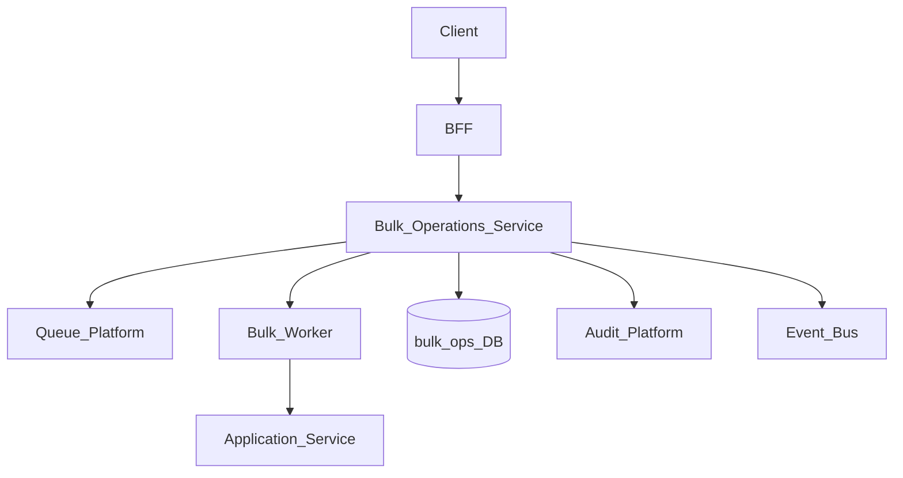
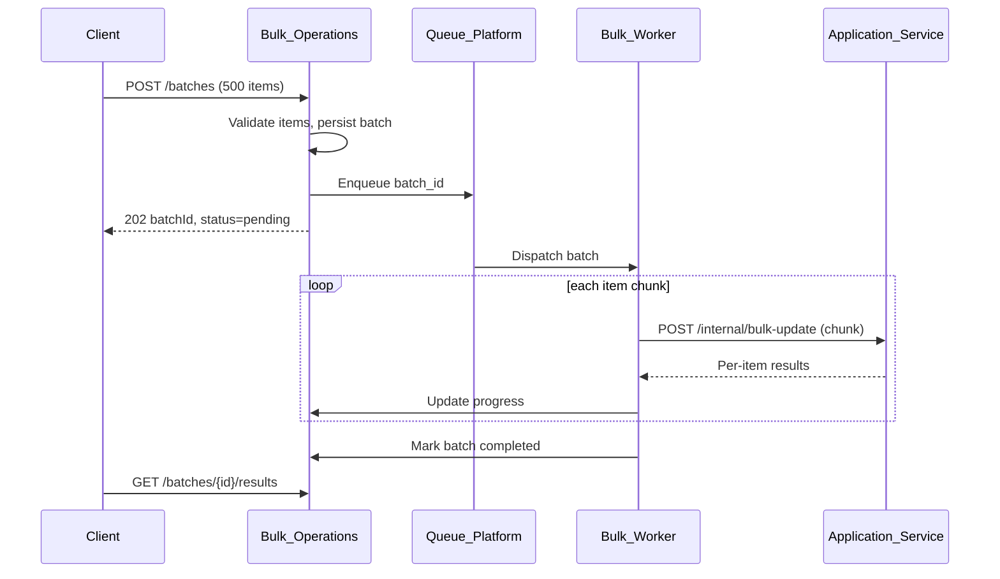
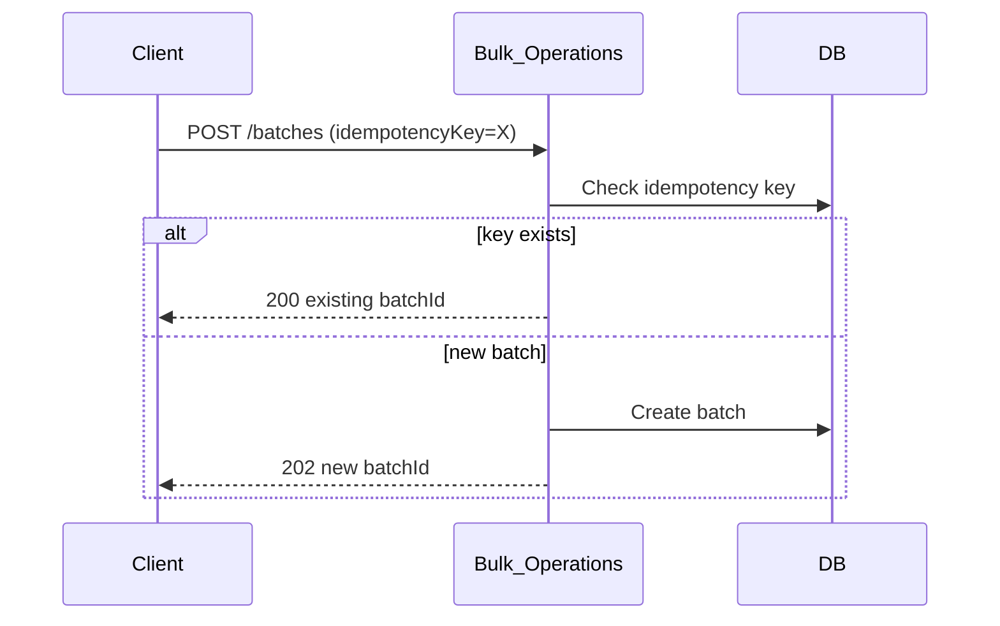

# Bulk Operations

> **Volume:** 2 | **Chapter ID:** v2-39 | **Status:** reviewed

## Purpose

The **Bulk Operations** platform capability enables applications to create, update, delete, or transition state on many entities in a single API call with partial-success semantics, progress tracking, and audit trails. Instead of N sequential HTTP requests, clients submit a batch job that executes asynchronously or synchronously depending on size. Applications define entity-specific handlers; the platform provides orchestration, idempotency, rate limiting, and result reporting.

## Architecture



Small batches (under configurable threshold) execute synchronously. Larger batches enqueue to Queue Platform for background processing with status polling.

## Responsibilities

### In Scope

- Batch create, update, delete, and custom action operations
- Partial success reporting — per-item success/failure in result set
- Idempotency via client-supplied batch key
- Progress tracking for async batches (percent complete, ETA)
- Concurrency control and tenant rate limits
- Validation of each item via Validation Platform before processing
- Rollback strategies: none, compensating actions, all-or-nothing (transactional batches)
- Result export for failed items (retry input file)
- Audit log of batch initiation and completion

### Out of Scope

- File-based import ([Import Platform](26-import-platform.md))
- Scheduled bulk jobs ([Scheduler Platform](17-scheduler-platform.md))
- Entity-specific business rules (application handler responsibility)
- Mass notification send ([Notification Platform](15-notification-platform.md))

## API Design

### Base Path

`/bulk-operations/v1`

| Method | Path | Description |
|--------|------|-------------|
| POST | /batches | Submit new bulk operation |
| GET | /batches/{batchId} | Get batch status and summary |
| GET | /batches/{batchId}/results | Paginated per-item results |
| POST | /batches/{batchId}/cancel | Cancel in-progress batch |
| POST | /batches/{batchId}/retry-failed | Retry only failed items |

### Submit Batch Request

```json
{
  "tenantId": "tenant-uuid",
  "operation": "update",
  "entityType": "resource",
  "targetService": "inventory-service",
  "targetPath": "/internal/v1/resources/bulk-update",
  "idempotencyKey": "batch-2026-08-01-001",
  "strategy": "partial_success",
  "items": [
    { "id": "uuid-1", "payload": { "status": "archived" } },
    { "id": "uuid-2", "payload": { "status": "archived" } }
  ]
}
```

### Batch Status Response

```json
{
  "batchId": "batch-uuid",
  "status": "completed",
  "summary": {
    "total": 500,
    "succeeded": 487,
    "failed": 13,
    "skipped": 0
  },
  "startedAt": "2026-08-01T10:00:00Z",
  "completedAt": "2026-08-01T10:02:15Z"
}
```

### Per-Item Result

```json
{
  "itemIndex": 42,
  "entityId": "uuid-43",
  "status": "failed",
  "error": {
    "code": "CONFLICT",
    "message": "Resource is locked by another process."
  }
}
```

### Operation Strategies

| Strategy | Behavior |
|----------|----------|
| `partial_success` | Process all items; report individual failures |
| `all_or_nothing` | Abort on first failure; rollback completed items |
| `best_effort` | Continue on failure; no rollback |

Follow [API Standards](../Volume-1-Foundation/18-api-standards.md).

## Database Design

| Table | Key Columns | Purpose |
|-------|-------------|---------|
| `bulk_batches` | `batch_id`, `tenant_id`, `operation`, `entity_type`, `status`, `strategy` | Batch header |
| `bulk_batch_items` | `batch_id`, `item_index`, `entity_id`, `payload_json`, `status` | Per-item state |
| `bulk_batch_results` | `batch_id`, `item_index`, `result_json`, `error_json` | Outcome detail |
| `bulk_idempotency` | `idempotency_key`, `batch_id`, `created_at` | Duplicate prevention |
| `bulk_audit_log` | `batch_id`, `event_type`, `actor_id`, `created_at` | Audit trail |

Batch statuses: `pending`, `running`, `completed`, `failed`, `cancelled`, `partial`.

Indexes: `(tenant_id, status)` for dashboards; `(batch_id, item_index)` for result pagination.

## Folder Structure

```text
services/bulk-operations/
├── api/
├── domain/
│   ├── submit/         # Validation and routing
│   ├── execute/        # Sync and async dispatch
│   ├── progress/       # Status tracking
│   └── retry/          # Failed item retry
├── worker/
├── persistence/
├── adapters/
│   ├── queue/
│   ├── validation/
│   └── http/           # Target service caller
├── mappers/
├── events/
└── tests/
```

## Sequence Diagrams

### Async Bulk Update



### Idempotent Resubmit



## Extension Points

- **Custom chunk sizes** — per entity type throughput tuning
- **Pre/post hooks** — validation or notification on batch completion
- **Compensating actions** — register rollback handler for all-or-nothing
- **Priority queues** — tenant tier-based processing order

## Integration

- **Depends on:** Queue Platform, Validation Platform, Audit Platform, Event Bus
- **Delegates processing to:** Application internal bulk endpoints
- **Events published:** `bulk.batch.started`, `bulk.batch.completed`, `bulk.batch.failed`
- **Used by:** Admin consoles, data migration tools, mass status transitions

## Best Practices

1. Use idempotency keys on every batch submission
2. Implement idempotent item handlers in application services
3. Choose `partial_success` unless business requires atomic batches
4. Paginate result retrieval — never return 10,000 items in one response
5. Set tenant quotas on concurrent batches and items per hour
6. Export failed items for client retry rather than re-submitting entire batch

## Anti-Patterns

| Anti-Pattern | Why It Fails | Preferred Approach |
|--------------|--------------|-------------------|
| Client loops 1000 HTTP calls | Rate limits, no progress tracking | Bulk Operations API |
| Synchronous 10k item batch | Gateway timeout | Async with polling |
| No per-item error detail | Operator cannot fix failures | Item-level result records |
| Ignoring idempotency | Duplicate processing on retry | Idempotency key |
| Bulk without authorization check | Mass unauthorized changes | BFF permission gate before submit |

## Related Chapters

- [Previous: Global Search](38-global-search.md)
- [Next: Document Generation](40-document-generation.md)
- [Import Platform](26-import-platform.md)
- [Queue Platform](28-queue-platform.md)
- [EPB Glossary](../docs/GLOSSARY.md)

---

*Enterprise Platform Blueprint — Volume 2*
