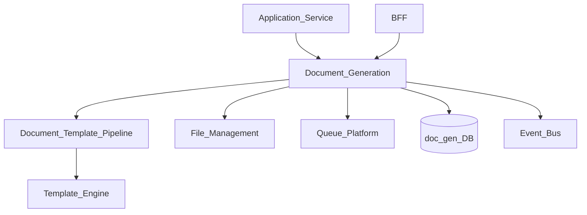
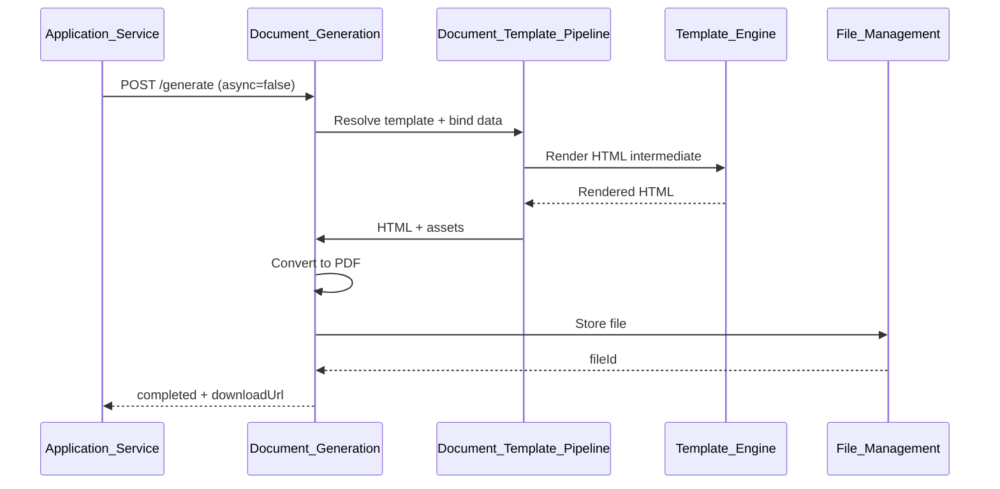
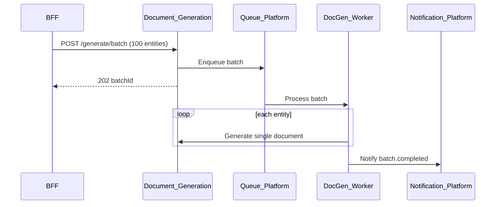

# Document Generation

> **Volume:** 2 | **Chapter ID:** v2-40 | **Status:** reviewed

## Purpose

**Document Generation** produces rendered output documents — PDF, HTML, DOCX, XLSX — from templates and structured data. Applications supply entity data and template references; the platform handles layout rendering, asset embedding, storage, and delivery. This capability sits above [Document Engine](24-document-engine.md) and [Document Template Pipeline](57-document-template-pipeline.md), providing the orchestration API that business workflows invoke when a printable or downloadable artifact is required.

## Architecture



Synchronous generation applies to small documents. Large reports and batch generation enqueue asynchronously.

## Responsibilities

### In Scope

- On-demand document generation from template + data payload
- Async generation with status polling and webhook callback
- Output format selection: PDF, HTML, DOCX, XLSX, plain text
- Variable binding and nested data object resolution
- Header/footer, page numbers, watermarks per tenant branding
- Digital signature placeholder regions (integration hook)
- Generated file storage via File Management with retention policy
- Generation history and re-download of prior outputs
- Batch document generation from entity ID lists

### Out of Scope

- Template authoring UI ([Screen Builder](70-screen-builder.md) may host editor)
- Template storage and versioning ([Document Engine](24-document-engine.md))
- Email delivery of documents ([Notification Platform](15-notification-platform.md))
- Legal e-signature provider integration (application adapter)

## API Design

### Base Path

`/document-generation/v1`

| Method | Path | Description |
|--------|------|-------------|
| POST | /generate | Generate document (sync or async) |
| GET | /jobs/{jobId} | Async job status |
| GET | /jobs/{jobId}/download | Download generated file |
| GET | /history | List generation history for entity |
| POST | /generate/batch | Batch generate for entity list |
| POST | /preview | Render preview without persisting |

### Generate Request

```json
{
  "tenantId": "tenant-uuid",
  "templateId": "invoice-standard-v3",
  "outputFormat": "pdf",
  "data": {
    "entity": {
      "id": "entity-uuid",
      "number": "INV-2026-0042",
      "issuedAt": "2026-08-01",
      "lineItems": [
        { "description": "Service fee", "amount": 1500.00 }
      ]
    },
    "organization": {
      "name": "Acme Corp",
      "logoUrl": "https://cdn/logo.png"
    }
  },
  "options": {
    "watermark": "DRAFT",
    "locale": "en-US",
    "async": false
  },
  "metadata": {
    "sourceEntityType": "invoice",
    "sourceEntityId": "entity-uuid"
  }
}
```

### Generate Response (sync)

```json
{
  "jobId": "job-uuid",
  "status": "completed",
  "fileId": "file-uuid",
  "downloadUrl": "/files/v1/files/file-uuid/download",
  "pageCount": 2,
  "generatedAt": "2026-08-01T10:00:05Z"
}
```

### Async Response

```json
{
  "jobId": "job-uuid",
  "status": "pending",
  "pollUrl": "/document-generation/v1/jobs/job-uuid"
}
```

Follow [API Standards](../Volume-1-Foundation/18-api-standards.md).

## Database Design

| Table | Key Columns | Purpose |
|-------|-------------|---------|
| `docgen_jobs` | `job_id`, `tenant_id`, `template_id`, `format`, `status` | Generation jobs |
| `docgen_job_data` | `job_id`, `data_json` | Input payload snapshot |
| `docgen_outputs` | `job_id`, `file_id`, `page_count`, `file_size_bytes` | Output references |
| `docgen_history` | `source_entity_type`, `source_entity_id`, `job_id`, `generated_at` | Entity linkage |
| `docgen_batch` | `batch_id`, `job_ids_json`, `status` | Batch tracking |

Job statuses: `pending`, `rendering`, `completed`, `failed`.

## Folder Structure

```text
services/document-generation/
├── api/
├── domain/
│   ├── render/         # Orchestrate template pipeline
│   ├── format/         # PDF, DOCX converters
│   ├── batch/          # Multi-entity generation
│   └── preview/        # Ephemeral render
├── worker/             # Async job processor
├── persistence/
├── adapters/
│   ├── template/       # Document Template Pipeline
│   ├── files/          # File Management
│   └── queue/
├── mappers/
├── events/
└── tests/
```

## Sequence Diagrams

### Synchronous PDF Generation



### Async Batch Generation



## Extension Points

- **Custom renderers** — register output format handlers
- **Post-render hooks** — watermark, encryption, compression
- **Branding packs** — tenant logo, colors, font sets
- **Webhook callbacks** — notify application on job completion

## Integration

- **Depends on:** Document Template Pipeline, Template Engine, File Management, Queue Platform
- **Events published:** `document.generated`, `document.generation.failed`
- **Used by:** Workflows, export flows, customer-facing portals via BFF

## Best Practices

1. Store input data snapshot with job for reproducible re-generation
2. Use async mode for documents exceeding 5MB or 50 pages
3. Link generations to source entity for audit and history
4. Apply tenant branding from Configuration Service, not hardcoded assets
5. Set retention policies on generated files via File Management
6. Preview endpoint for template validation before production generate

## Anti-Patterns

| Anti-Pattern | Why It Fails | Preferred Approach |
|--------------|--------------|-------------------|
| Per-app PDF libraries | Inconsistent output, no branding | Document Generation API |
| Embedding templates in code | No tenant override | Document Template Pipeline |
| Synchronous 500-page report | Timeout | Async job + notification |
| Storing PDFs in app database | Blob bloat | File Management storage |
| Regenerating without history | Lost audit trail | docgen_history linkage |

## Related Chapters

- [Previous: Bulk Operations](39-bulk-operations.md)
- [Next: Developer Utilities](41-developer-utilities.md)
- [Document Engine](24-document-engine.md)
- [Document Template Pipeline](57-document-template-pipeline.md)
- [EPB Glossary](../docs/GLOSSARY.md)

---

*Enterprise Platform Blueprint — Volume 2*
