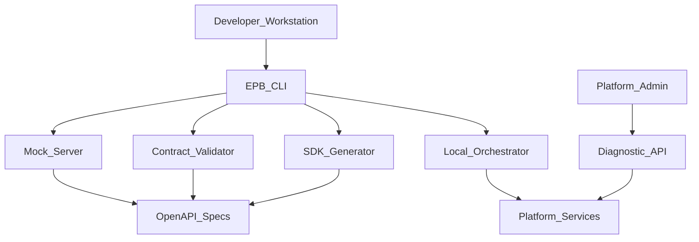
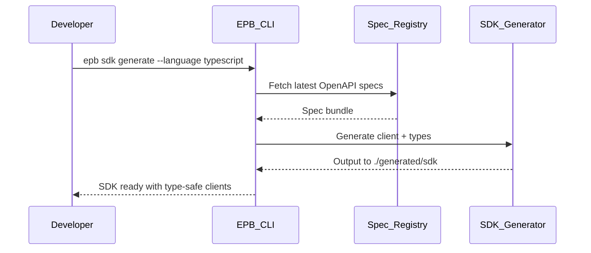
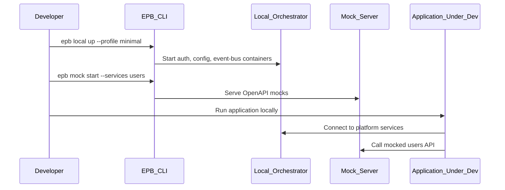

# Developer Utilities

> **Volume:** 2 | **Chapter ID:** v2-41 | **Status:** reviewed

## Purpose

**Developer Utilities** is a platform toolkit that accelerates EPB service development, local testing, and operational debugging. It provides SDK generators, mock servers, contract validators, local service orchestration profiles, and diagnostic endpoints — all governed by environment policy so production tenants never expose debug surfaces. Application teams use these utilities to build against stable platform contracts without reimplementing cross-cutting infrastructure scaffolding.

## Architecture



Developer Utilities ships as CLI tools, libraries, and optionally hosted diagnostic APIs in non-production environments. It is not a runtime dependency of production application code paths.

## Responsibilities

### In Scope

- OpenAPI spec aggregation from all platform services
- Client SDK generation (TypeScript, C#, Java, Python) from specs
- Local development orchestration: Docker Compose profiles for platform dependencies
- Mock server generation from OpenAPI for offline development
- Contract testing: validate service responses against published schemas
- API explorer and request replay for staging environments
- Correlation ID trace lookup across services (dev/staging only)
- Seed data generators for tenant, user, and entity fixtures
- Service health dashboard for local and integration environments
- Platform version compatibility matrix

### Out of Scope

- Production monitoring ([Monitoring Platform](13-monitoring-platform.md))
- Production log aggregation ([Logging Platform](11-logging-platform.md))
- CI/CD pipeline configuration (organization DevOps responsibility)
- Application business logic testing frameworks

## API Design

### Diagnostic API Base Path (non-production only)

`/dev-utils/v1`

| Method | Path | Description |
|--------|------|-------------|
| GET | /specs | List all registered OpenAPI specs |
| GET | /specs/{service} | Download service OpenAPI JSON |
| POST | /validate/response | Validate response body against schema |
| GET | /trace/{correlationId} | Cross-service trace for correlation ID |
| POST | /seed/tenant | Generate test tenant with defaults |
| POST | /seed/entities | Generate fixture entities for entity type |
| GET | /compatibility | Platform version compatibility report |
| GET | /health/all | Aggregated health of local platform stack |

### CLI Commands

```bash
epb sdk generate --language typescript --service inventory-service
epb mock start --services auth,users,config --port 4010
epb contract test --spec ./openapi.yaml --target http://localhost:8080
epb local up --profile minimal
epb trace lookup --correlation-id corr-uuid --env staging
epb seed tenant --name "Dev Tenant Alpha"
```

### Contract Validation Request

```json
{
  "service": "inventory-service",
  "endpoint": "GET /resources/v1/resources/{id}",
  "statusCode": 200,
  "responseBody": { "success": true, "data": { "id": "uuid" } }
}
```

### Seed Tenant Response

```json
{
  "tenantId": "tenant-uuid",
  "adminUser": { "userId": "user-uuid", "email": "admin@dev.local" },
  "defaultRoles": ["tenant-admin", "user"],
  "configKeysSeeded": 42
}
```

Access to diagnostic APIs requires `platform.devutils.access` permission and is blocked in production by environment gate.

## Database Design

Developer Utilities is primarily stateless. Seed and trace data uses ephemeral or staging-scoped storage.

| Table | Key Columns | Purpose |
|-------|-------------|---------|
| `dev_spec_registry` | `service`, `version`, `spec_url`, `published_at` | OpenAPI catalog |
| `dev_seed_templates` | `template_id`, `entity_type`, `fixture_json` | Reusable seed patterns |
| `dev_trace_cache` | `correlation_id`, `spans_json`, `expires_at` | Staging trace lookup cache |
| `dev_compat_matrix` | `platform_version`, `service`, `min_version`, `max_version` | Compatibility data |

Production databases are never written by developer utilities.

## Folder Structure

```text
tools/developer-utilities/
├── cli/                  # epb command entrypoint
├── sdk-generator/
│   ├── templates/        # Per-language templates
│   └── openapi-parser/
├── mock-server/
├── contract-validator/
├── local-orchestrator/
│   └── profiles/         # minimal, full, iam-only
├── seed/
├── diagnostic-api/       # Non-prod HTTP service
└── tests/

libs/dev-fixtures/        # Shared test data builders for services
```

## Sequence Diagrams

### SDK Generation Pipeline



### Local Development Stack



## Extension Points

- **Custom seed templates** — application-specific fixture generators
- **Plugin mock behaviors** — dynamic responses based on request state
- **CI contract test action** — GitHub Actions / pipeline integration
- **IDE extensions** — VS Code snippet and spec browser plugins

## Integration

- **Reads from:** All platform service OpenAPI specs, Logging Platform (trace lookup)
- **Used by:** Application developers, platform engineers, QA automation
- **Environment policy:** Diagnostic API disabled when `ENV=production`

## Best Practices

1. Generate SDKs from published specs — never hand-write HTTP clients for platform APIs
2. Run contract tests in CI against staging before production deploy
3. Use `minimal` local profile unless full platform stack is required
4. Never enable diagnostic APIs in production — enforce at gateway and service level
5. Pin SDK version to platform release compatibility matrix
6. Use correlation ID trace lookup for debugging cross-service failures in staging

## Anti-Patterns

| Anti-Pattern | Why It Fails | Preferred Approach |
|--------------|--------------|-------------------|
| Hand-written API clients | Drift from spec, type errors | SDK generator |
| Production debug endpoints | Security vulnerability | Environment-gated diagnostic API |
| Testing against production data | Data leak, instability | Seed templates in dev/staging |
| Skipping contract tests | Breaking changes undetected | CI contract validation |
| Full platform stack for every dev | Slow laptops, resource waste | Profile-based local orchestration |

## Related Chapters

- [Previous: Document Generation](40-document-generation.md)
- [Next: Notification Email Channel](42-notification-email-channel.md)
- [API Standards](../Volume-1-Foundation/18-api-standards.md)
- [Health Checks](14-health-checks.md)
- [EPB Glossary](../docs/GLOSSARY.md)

---

*Enterprise Platform Blueprint — Volume 2*
