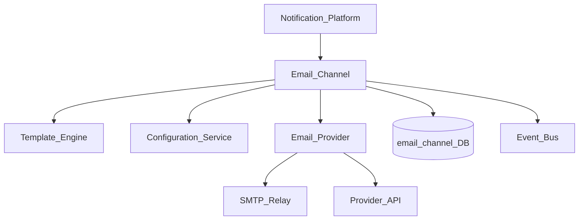
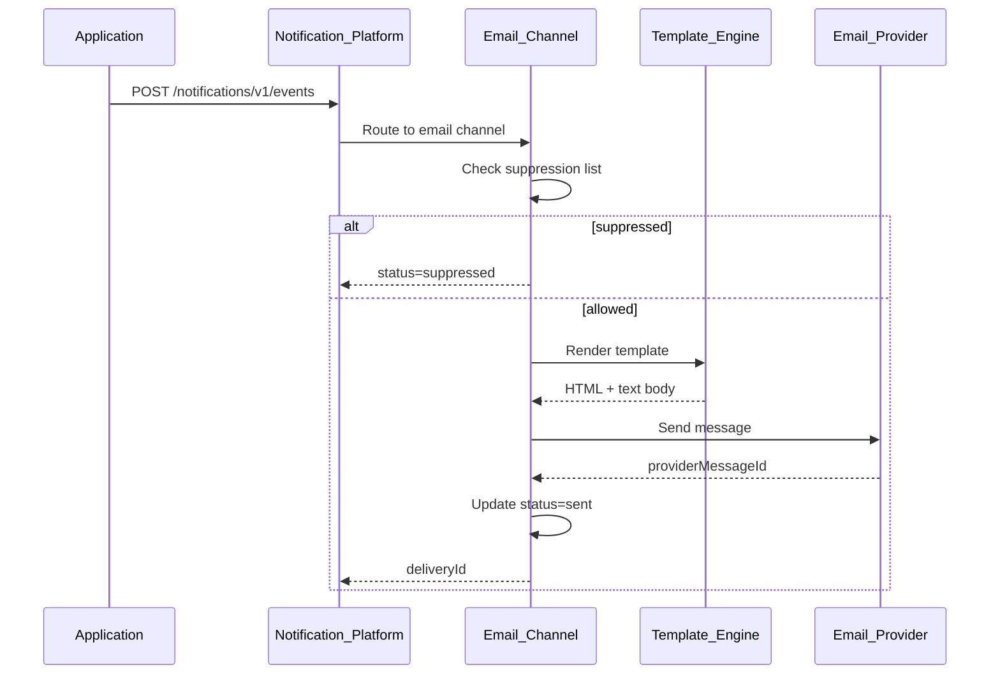
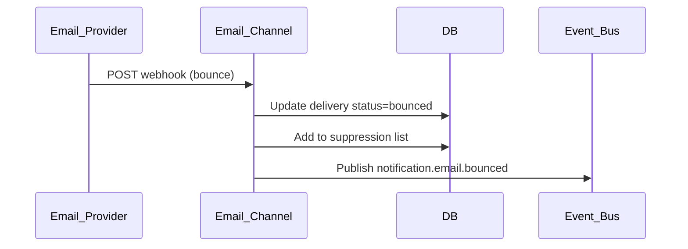

# Notification Email Channel

> **Volume:** 2 | **Chapter ID:** v2-42 | **Status:** reviewed

## Purpose

The **Email Channel** is the delivery adapter within [Notification Platform](15-notification-platform.md) responsible for rendering and sending email messages. It resolves templates, applies tenant branding, manages provider credentials, handles bounce and complaint feedback, and tracks per-message delivery status. Applications publish notification events — they never call SMTP servers or email APIs directly.

## Architecture



The email channel supports multiple provider backends (SendGrid, SES, SMTP relay) selected per tenant via Configuration Service.

## Responsibilities

### In Scope

- HTML and plain-text email rendering from templates
- Subject line resolution with variable substitution
- From address, reply-to, and display name per tenant
- Attachment embedding via File Management references
- Provider credential management (encrypted per tenant)
- Delivery status: queued, sent, delivered, bounced, complained, failed
- Bounce and complaint webhook processing with suppression list
- Rate limiting and daily send quotas per tenant
- DKIM/SPF configuration guidance (DNS records exposed to tenant admin)
- Unsubscribe link injection for marketing-class messages

### Out of Scope

- Deciding when to send email (application business logic)
- Template content authoring ([Template Engine](16-template-engine.md))
- SMS, push, or other channels (sibling channel chapters)
- Inbox UI for reading messages

## API Design

Email channel is invoked internally by Notification Platform. External consumers use Notification Platform APIs.

### Internal Channel Interface

| Method | Path | Description |
|--------|------|-------------|
| POST | /internal/email/send | Send single email (called by Notification Platform) |
| POST | /internal/email/webhook/{provider} | Provider delivery/bounce webhook |
| GET | /email/v1/config | Get tenant email configuration |
| PUT | /email/v1/config | Update provider credentials and from-address |
| GET | /email/v1/suppressions | List suppressed addresses |
| DELETE | /email/v1/suppressions/{email} | Remove address from suppression list |

### Send Payload (internal)

```json
{
  "deliveryId": "delivery-uuid",
  "tenantId": "tenant-uuid",
  "recipientEmail": "user@example.com",
  "templateId": "order-shipped",
  "variables": {
    "orderNumber": "ORD-12345",
    "trackingUrl": "https://track.example.com/abc"
  },
  "attachments": [
    { "fileId": "file-uuid", "filename": "invoice.pdf" }
  ],
  "messageClass": "transactional"
}
```

Message classes: `transactional` (no unsubscribe required), `marketing` (unsubscribe required), `system` (platform-generated).

### Delivery Status Webhook Processing

```json
{
  "provider": "sendgrid",
  "event": "bounce",
  "email": "user@example.com",
  "reason": "mailbox_full",
  "deliveryId": "delivery-uuid"
}
```

Follow [API Standards](../Volume-1-Foundation/18-api-standards.md).

## Database Design

| Table | Key Columns | Purpose |
|-------|-------------|---------|
| `email_deliveries` | `delivery_id`, `tenant_id`, `recipient`, `status`, `provider` | Per-message tracking |
| `email_delivery_events` | `delivery_id`, `event_type`, `provider_payload`, `occurred_at` | Status timeline |
| `email_tenant_config` | `tenant_id`, `provider`, `from_address`, `credentials_ref` | Provider settings |
| `email_suppressions` | `tenant_id`, `email`, `reason`, `suppressed_at` | Bounce/complaint blocklist |
| `email_send_quota` | `tenant_id`, `date`, `sent_count` | Daily quota tracking |

Delivery statuses: `queued`, `rendering`, `sent`, `delivered`, `bounced`, `complained`, `failed`, `suppressed`.

## Folder Structure

```text
services/notification-platform/
└── channels/
    └── email/
        ├── renderer/       # Template → HTML/text
        ├── sender/         # Provider dispatch
        ├── webhook/        # Bounce/complaint handlers
        ├── suppression/    # Blocklist management
        ├── adapters/
        │   ├── sendgrid/
        │   ├── ses/
        │   └── smtp/
        └── tests/
```

## Sequence Diagrams

### Email Send Flow



### Bounce Handling



## Extension Points

- **Provider adapters** — plug in new email service providers
- **Custom headers** — tenant-specific X-headers for tracking
- **Inline CSS inliner** — email client compatibility preprocessing
- **A/B subject lines** — optional experiment variant selection

## Integration

- **Invoked by:** Notification Platform event router
- **Depends on:** Template Engine, Configuration Service, File Management
- **Events published:** `notification.email.sent`, `notification.email.bounced`, `notification.email.failed`
- **Related channels:** [SMS](43-notification-sms-channel.md), [Push](44-notification-push-channel.md), [In-App](45-notification-in-app-channel.md), [WhatsApp](46-notification-whatsapp-channel.md)

## Best Practices

1. Always send both HTML and plain-text parts
2. Check suppression list before every send attempt
3. Use transactional class for password resets and security alerts
4. Store provider message ID for delivery correlation
5. Rotate provider credentials through Configuration Service secrets
6. Process bounces within minutes — do not retry to hard-bounced addresses

## Anti-Patterns

| Anti-Pattern | Why It Fails | Preferred Approach |
|--------------|--------------|-------------------|
| Direct SMTP from application | No template, audit, or bounce handling | Notification Platform events |
| Ignoring bounce webhooks | Reputation damage, provider suspension | Suppression list |
| Hardcoded from-address | SPF/DKIM failures per tenant | Tenant email config |
| Embedding large attachments inline | Provider size limits | File Management links |
| Marketing email without unsubscribe | Compliance violations | Message class + unsubscribe injection |

## Related Chapters

- [Previous: Developer Utilities](41-developer-utilities.md)
- [Next: Notification SMS Channel](43-notification-sms-channel.md)
- [Notification Platform](15-notification-platform.md)
- [Template Engine](16-template-engine.md)
- [EPB Glossary](../docs/GLOSSARY.md)

---

*Enterprise Platform Blueprint — Volume 2*
