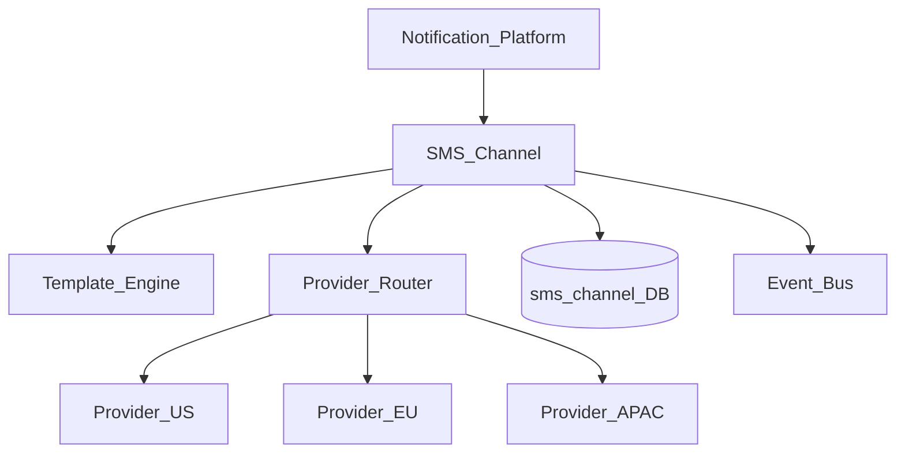
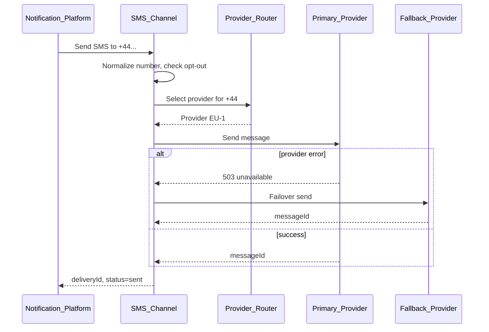
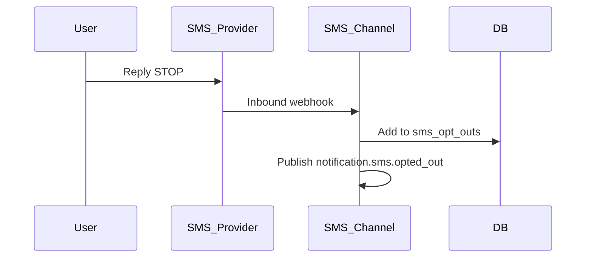

# Notification SMS Channel

> **Volume:** 2 | **Chapter ID:** v2-43 | **Status:** reviewed

## Purpose

The **SMS Channel** delivers short text messages through [Notification Platform](15-notification-platform.md) to mobile devices worldwide. It handles template rendering within character limits, international number formatting, provider routing by region, delivery receipts, and opt-out compliance. Applications trigger SMS through notification events — they never integrate with Twilio, SNS, or regional SMS gateways directly.

## Architecture



Provider routing selects the optimal gateway based on recipient country code, tenant configuration, and cost policy.

## Responsibilities

### In Scope

- E.164 phone number validation and normalization
- Template rendering with GSM-7 / UCS-2 segment counting
- Multi-segment message handling and cost estimation
- Provider failover when primary gateway returns errors
- Delivery receipt processing (delivered, failed, undeliverable)
- Opt-out (STOP) keyword processing and suppression list
- Sender ID and long-code / short-code configuration per tenant
- Rate limiting and per-tenant SMS quotas
- OTP and transactional message prioritization
- Unicode and concatenated SMS support

### Out of Scope

- Phone number ownership verification (application or separate KYC flow)
- Rich messaging (MMS) — use WhatsApp channel for rich content
- Marketing campaign segmentation
- Voice calls

## API Design

SMS channel is invoked internally by Notification Platform.

### Internal Channel Interface

| Method | Path | Description |
|--------|------|-------------|
| POST | /internal/sms/send | Send single SMS |
| POST | /internal/sms/webhook/{provider} | Delivery receipt webhook |
| GET | /sms/v1/config | Tenant SMS provider configuration |
| PUT | /sms/v1/config | Update provider and sender settings |
| GET | /sms/v1/opt-outs | List opted-out phone numbers |
| POST | /sms/v1/validate-number | Validate and format phone number |

### Send Payload (internal)

```json
{
  "deliveryId": "delivery-uuid",
  "tenantId": "tenant-uuid",
  "recipientPhone": "+14155551234",
  "templateId": "otp-verification",
  "variables": {
    "code": "847291",
    "expiryMinutes": "10"
  },
  "priority": "high",
  "messageClass": "transactional"
}
```

### Segment Calculation Response

```json
{
  "renderedBody": "Your verification code is 847291. Expires in 10 minutes.",
  "encoding": "GSM-7",
  "segmentCount": 1,
  "estimatedCost": 0.0075
}
```

### Opt-Out Webhook

```json
{
  "provider": "twilio",
  "from": "+14155551234",
  "body": "STOP",
  "receivedAt": "2026-08-01T10:00:00Z"
}
```

Follow [API Standards](../Volume-1-Foundation/18-api-standards.md).

## Database Design

| Table | Key Columns | Purpose |
|-------|-------------|---------|
| `sms_deliveries` | `delivery_id`, `tenant_id`, `phone_e164`, `status`, `segments` | Message tracking |
| `sms_delivery_events` | `delivery_id`, `event_type`, `provider_status`, `occurred_at` | Receipt timeline |
| `sms_tenant_config` | `tenant_id`, `primary_provider`, `sender_id`, `credentials_ref` | Provider config |
| `sms_opt_outs` | `tenant_id`, `phone_e164`, `opted_out_at`, `keyword` | STOP suppression |
| `sms_routing_rules` | `tenant_id`, `country_code`, `provider`, `priority` | Regional routing |
| `sms_send_quota` | `tenant_id`, `date`, `segment_count` | Quota tracking |

## Folder Structure

```text
services/notification-platform/
└── channels/
    └── sms/
        ├── renderer/       # Template + segment calculator
        ├── router/         # Country-based provider selection
        ├── sender/
        ├── optout/         # STOP keyword handler
        ├── adapters/
        │   ├── twilio/
        │   ├── sns/
        │   └── regional/
        └── tests/
```

## Sequence Diagrams

### SMS Send with Failover



### STOP Opt-Out



## Extension Points

- **Regional provider adapters** — country-specific gateways
- **Custom sender ID rules** — alphanumeric vs numeric per region regulation
- **Cost caps** — tenant daily spend limits
- **Link shortener integration** — optional URL shortening for long links

## Integration

- **Invoked by:** Notification Platform
- **Depends on:** Template Engine, Configuration Service
- **Events published:** `notification.sms.sent`, `notification.sms.failed`, `notification.sms.opted_out`
- **Related:** [Email Channel](42-notification-email-channel.md), [WhatsApp Channel](46-notification-whatsapp-channel.md)

## Best Practices

1. Validate phone numbers to E.164 before send
2. Keep OTP messages under 160 GSM-7 characters (single segment)
3. Honor opt-out immediately — check list on every outbound send
4. Use high priority for transactional OTP; normal for alerts
5. Log segment count for cost attribution per tenant
6. Configure regional routing to comply with local sender ID regulations

## Anti-Patterns

| Anti-Pattern | Why It Fails | Preferred Approach |
|--------------|--------------|-------------------|
| Direct Twilio SDK in app | No audit, template, or opt-out | Notification Platform |
| Ignoring STOP replies | Regulatory fines | Opt-out webhook handler |
| Long URLs in SMS body | Multi-segment cost explosion | Link shortener or separate channel |
| Same provider globally | Delivery failures in some regions | Country-based routing |
| Marketing SMS without consent | TCPA/GDPR violations | Opt-in tracking per tenant |

## Related Chapters

- [Previous: Notification Email Channel](42-notification-email-channel.md)
- [Next: Notification Push Channel](44-notification-push-channel.md)
- [Notification Platform](15-notification-platform.md)
- [EPB Glossary](../docs/GLOSSARY.md)

---

*Enterprise Platform Blueprint — Volume 2*
