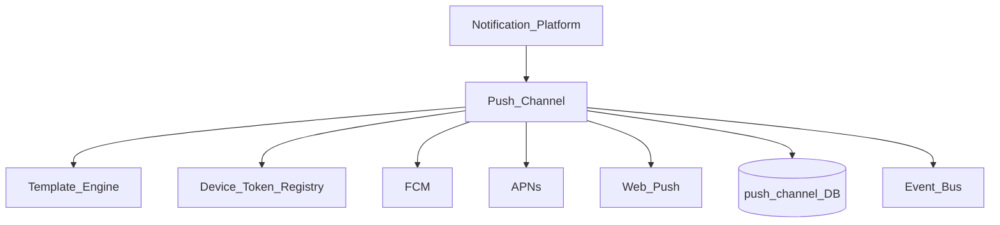
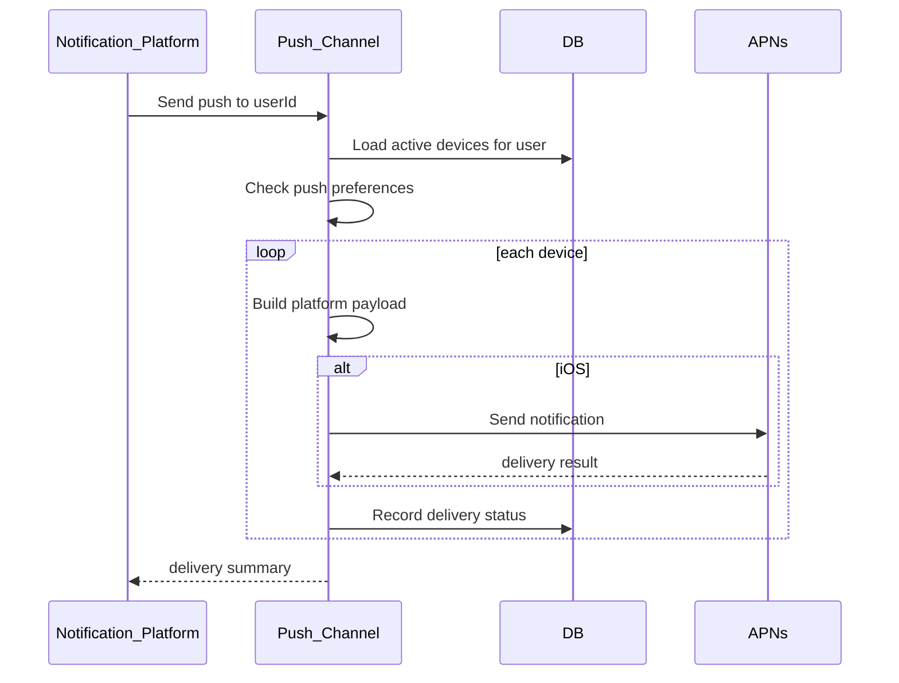
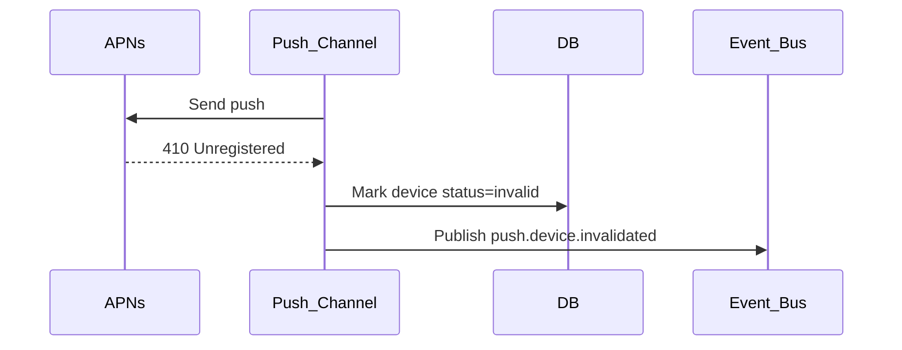

# Notification Push Channel

> **Volume:** 2 | **Chapter ID:** v2-44 | **Status:** reviewed

## Purpose

The **Push Channel** delivers mobile and web push notifications through [Notification Platform](15-notification-platform.md) via FCM (Firebase Cloud Messaging), APNs (Apple Push Notification service), and Web Push protocols. It manages device token registration, platform-specific payload formatting, silent data pushes, badge counts, and delivery tracking. Applications publish notification events with channel `push` — they never hold FCM or APNs credentials.

## Architecture



Device tokens are registered by client apps through the BFF and stored per user, per device, per platform.

## Responsibilities

### In Scope

- Device token registration, refresh, and invalidation
- iOS (APNs), Android (FCM), and Web Push payload construction
- Notification title, body, image, and action buttons
- Silent/data-only pushes for background sync triggers
- Badge count management for iOS
- Topic-based broadcast (tenant announcements) with subscription management
- Delivery failure handling — invalidate stale tokens
- User notification preference respect (push enabled/disabled per category)
- Deep link URL embedding in payload
- Collapse key / thread ID for notification grouping

### Out of Scope

- In-app notification inbox ([In-App Channel](45-notification-in-app-channel.md))
- Mobile app SDK implementation (client responsibility)
- Email or SMS fallback (Notification Platform routes to other channels)
- Push notification UI rendering on device

## API Design

### Device Registration (via BFF)

| Method | Path | Description |
|--------|------|-------------|
| POST | /push/v1/devices | Register device token |
| DELETE | /push/v1/devices/{deviceId} | Unregister device |
| GET | /push/v1/devices | List user's registered devices |
| PUT | /push/v1/preferences | Update push category preferences |

### Internal Send Interface

| Method | Path | Description |
|--------|------|-------------|
| POST | /internal/push/send | Send push to user devices |
| POST | /internal/push/topic | Broadcast to topic subscribers |

### Register Device Request

```json
{
  "userId": "user-uuid",
  "tenantId": "tenant-uuid",
  "platform": "ios",
  "deviceToken": "apns-device-token-string",
  "appBundleId": "com.example.app",
  "deviceName": "iPhone 15"
}
```

Platforms: `ios`, `android`, `web`.

### Push Payload (internal)

```json
{
  "deliveryId": "delivery-uuid",
  "userId": "user-uuid",
  "templateId": "booking-reminder",
  "variables": {
    "title": "Upcoming appointment",
    "body": "Your session starts in 30 minutes.",
    "deepLink": "/bookings/uuid"
  },
  "options": {
    "badge": 3,
    "sound": "default",
    "collapseKey": "booking-reminders",
    "priority": "high"
  }
}
```

### APNs Payload Structure (generated)

```json
{
  "aps": {
    "alert": { "title": "Upcoming appointment", "body": "Your session starts in 30 minutes." },
    "badge": 3,
    "sound": "default"
  },
  "deepLink": "/bookings/uuid",
  "deliveryId": "delivery-uuid"
}
```

Follow [API Standards](../Volume-1-Foundation/18-api-standards.md).

## Database Design

| Table | Key Columns | Purpose |
|-------|-------------|---------|
| `push_devices` | `device_id`, `user_id`, `tenant_id`, `platform`, `token`, `status` | Registered devices |
| `push_deliveries` | `delivery_id`, `user_id`, `device_id`, `status`, `provider` | Per-device delivery |
| `push_topics` | `topic_id`, `tenant_id`, `topic_name` | Broadcast topics |
| `push_topic_subscriptions` | `topic_id`, `user_id`, `subscribed_at` | Topic membership |
| `push_preferences` | `user_id`, `category`, `enabled` | Per-category opt-in |
| `push_tenant_config` | `tenant_id`, `fcm_credentials_ref`, `apns_credentials_ref` | Provider credentials |

Device statuses: `active`, `invalid`, `unregistered`.

## Folder Structure

```text
services/notification-platform/
└── channels/
    └── push/
        ├── registry/       # Device token CRUD
        ├── builder/        # Platform-specific payloads
        ├── sender/
        │   ├── fcm/
        │   ├── apns/
        │   └── webpush/
        ├── topics/         # Broadcast management
        ├── preferences/
        └── tests/
```

## Sequence Diagrams

### Push to User Devices



### Invalid Token Cleanup



## Extension Points

- **Rich notification templates** — images, action buttons per platform
- **Geofence triggers** — optional location-based push (client SDK)
- **Silent push handlers** — data-only payload for background sync
- **Custom sound files** — tenant-branded notification sounds

## Integration

- **Invoked by:** Notification Platform
- **Depends on:** Template Engine, Configuration Service, User Management
- **Events published:** `notification.push.sent`, `notification.push.failed`, `push.device.registered`, `push.device.invalidated`
- **Pairs with:** [In-App Channel](45-notification-in-app-channel.md) for full notification UX

## Best Practices

1. Register device tokens on every app launch — tokens rotate
2. Remove invalid tokens immediately on provider 410/NotRegistered
3. Respect user push preferences per notification category
4. Use collapse keys to prevent notification spam for same event type
5. Keep payload under 4KB — use deep links for detail, not full content
6. Store APNs and FCM credentials in encrypted Configuration Service secrets

## Anti-Patterns

| Anti-Pattern | Why It Fails | Preferred Approach |
|--------------|--------------|-------------------|
| FCM SDK in backend monolith | Credential sprawl, no audit | Push Channel via Notification Platform |
| Sending to stale tokens | Provider rate penalties | Invalid token cleanup |
| Push without preference check | User disables, still receives | Preference gate |
| Full entity JSON in push payload | Size limits, data exposure | Deep link to fetch detail |
| Ignoring platform payload differences | Broken notifications on iOS/Android | Platform-specific builders |

## Related Chapters

- [Previous: Notification SMS Channel](43-notification-sms-channel.md)
- [Next: Notification In-App Channel](45-notification-in-app-channel.md)
- [Notification Platform](15-notification-platform.md)
- [EPB Glossary](../docs/GLOSSARY.md)

---

*Enterprise Platform Blueprint — Volume 2*
