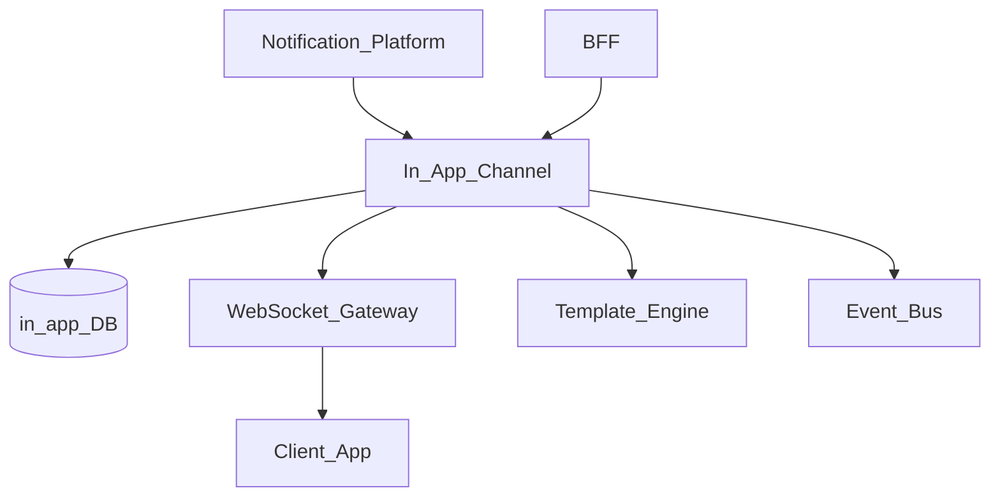
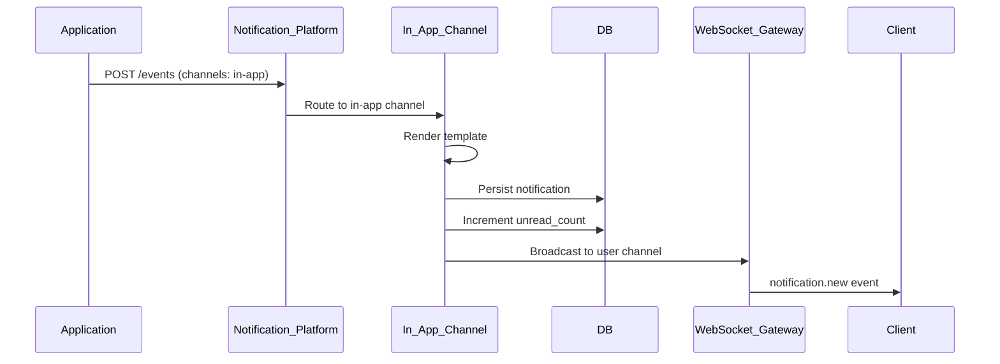
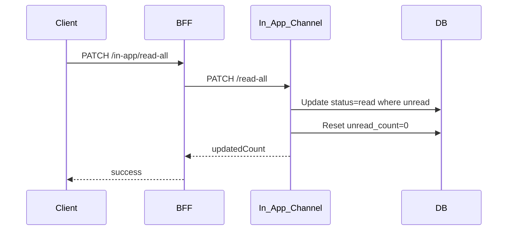

# Notification In-App Channel

> **Volume:** 2 | **Chapter ID:** v2-45 | **Status:** reviewed

## Purpose

The **In-App Channel** stores and delivers notifications visible inside EPB applications — notification bell, inbox panel, and activity feed. Unlike push or email, in-app messages persist until read or dismissed, support rich content, and power real-time UI updates via WebSocket or SSE. Applications publish events to [Notification Platform](15-notification-platform.md); this channel writes to the user's inbox and broadcasts to connected clients.

## Architecture



The BFF reads in-app notifications for the current user. Real-time delivery uses WebSocket Gateway with tenant-scoped channels.

## Responsibilities

### In Scope

- Persistent notification inbox per user per tenant
- Read, unread, and archived status lifecycle
- Rich content: title, body, icon, action links, metadata
- Real-time delivery to connected clients via WebSocket/SSE
- Notification categories and filtering in inbox API
- Bulk mark-as-read and dismiss operations
- Notification grouping by source entity or thread
- Expiration and auto-archive of stale notifications
- Unread count badge for BFF aggregation
- Priority levels: low, normal, high, urgent

### Out of Scope

- Push to device when app is closed ([Push Channel](44-notification-push-channel.md))
- Email digest of unread notifications (separate scheduled job)
- Chat or messaging between users (application feature)
- Notification template authoring UI

## API Design

### Base Path

`/notifications/v1/in-app`

| Method | Path | Description |
|--------|------|-------------|
| GET | / | List notifications (paginated, filterable) |
| GET | /unread-count | Unread notification count |
| GET | /{id} | Get single notification |
| PATCH | /{id}/read | Mark as read |
| PATCH | /read-all | Mark all as read |
| DELETE | /{id} | Dismiss notification |
| DELETE | /archive | Archive read notifications older than N days |

### List Query Parameters

```http
GET /notifications/v1/in-app?status=unread&category=booking&page=1&pageSize=20
```

### Notification Object

```json
{
  "id": "notif-uuid",
  "category": "booking",
  "priority": "normal",
  "status": "unread",
  "title": "Booking confirmed",
  "body": "Your session on Aug 15 at 10:00 AM is confirmed.",
  "icon": "calendar-check",
  "actionUrl": "/bookings/booking-uuid",
  "metadata": {
    "sourceEntityType": "booking",
    "sourceEntityId": "booking-uuid"
  },
  "createdAt": "2026-08-01T10:00:00Z",
  "readAt": null,
  "expiresAt": "2026-09-01T10:00:00Z"
}
```

### WebSocket Event (real-time)

```json
{
  "type": "notification.new",
  "payload": {
    "id": "notif-uuid",
    "title": "Booking confirmed",
    "unreadCount": 5
  }
}
```

### Internal Create (from Notification Platform)

```json
{
  "deliveryId": "delivery-uuid",
  "userId": "user-uuid",
  "tenantId": "tenant-uuid",
  "templateId": "booking-confirmed",
  "variables": { "bookingDate": "Aug 15", "bookingTime": "10:00 AM" },
  "category": "booking",
  "priority": "normal",
  "actionUrl": "/bookings/booking-uuid"
}
```

Follow [API Standards](../Volume-1-Foundation/18-api-standards.md).

## Database Design

| Table | Key Columns | Purpose |
|-------|-------------|---------|
| `in_app_notifications` | `id`, `user_id`, `tenant_id`, `category`, `status`, `priority` | Notification records |
| `in_app_content` | `notification_id`, `title`, `body`, `icon`, `action_url` | Display content |
| `in_app_metadata` | `notification_id`, `source_entity_type`, `source_entity_id` | Entity linkage |
| `in_app_delivery_log` | `delivery_id`, `notification_id`, `delivered_at` | Delivery audit |
| `in_app_user_state` | `user_id`, `tenant_id`, `unread_count`, `last_read_at` | Cached counts |

Statuses: `unread`, `read`, `archived`, `dismissed`.

Indexes: `(user_id, tenant_id, status, created_at DESC)` for inbox queries.

## Folder Structure

```text
services/notification-platform/
└── channels/
    └── in-app/
        ├── inbox/          # CRUD and status transitions
        ├── realtime/       # WebSocket broadcast
        ├── renderer/       # Template → notification content
        ├── grouping/       # Thread aggregation
        ├── cleanup/        # Expiration job
        └── tests/
```

## Sequence Diagrams

### Create and Real-Time Deliver



### Mark All Read



## Extension Points

- **Category icons and colors** — tenant branding configuration
- **Action button arrays** — multiple actions per notification
- **Snooze** — reschedule notification visibility
- **Digest mode** — batch low-priority into daily summary

## Integration

- **Invoked by:** Notification Platform
- **Depends on:** Template Engine, WebSocket Gateway, User Management
- **Events published:** `notification.in-app.created`, `notification.in-app.read`
- **Used by:** BFF notification bell, mobile app inbox

## Best Practices

1. Always set `actionUrl` for actionable notifications
2. Include `sourceEntityType` and `sourceEntityId` for deep linking and grouping
3. Set `expiresAt` on time-sensitive notifications
4. Broadcast real-time events after DB commit — not before
5. Cache unread count in `in_app_user_state` for fast badge queries
6. Run cleanup job to archive notifications past expiration

## Anti-Patterns

| Anti-Pattern | Why It Fails | Preferred Approach |
|--------------|--------------|-------------------|
| Storing notifications in app database | No cross-app inbox | In-App Channel |
| Polling every second for new notifications | Server load | WebSocket real-time |
| Unbounded inbox growth | Storage and UX degradation | Expiration + archive |
| Duplicate notifications per event | Notification fatigue | Idempotent deliveryId |
| Missing unread count cache | Slow badge on every page load | Denormalized count table |

## Related Chapters

- [Previous: Notification Push Channel](44-notification-push-channel.md)
- [Next: Notification WhatsApp Channel](46-notification-whatsapp-channel.md)
- [Notification Platform](15-notification-platform.md)
- [EPB Glossary](../docs/GLOSSARY.md)

---

*Enterprise Platform Blueprint — Volume 2*
