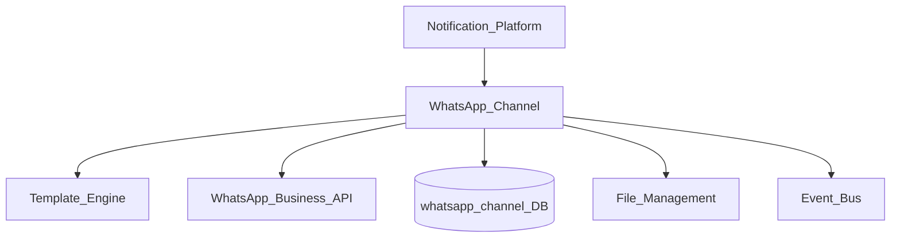
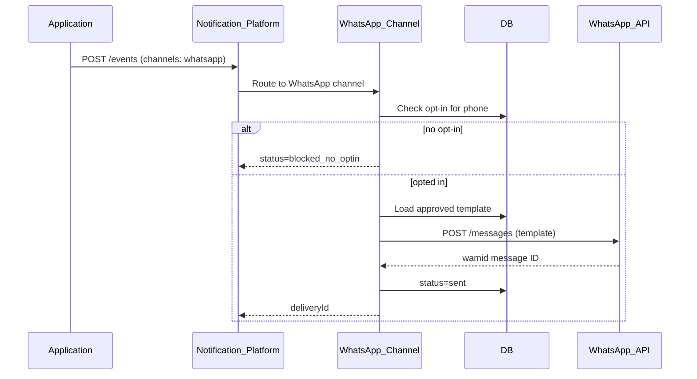
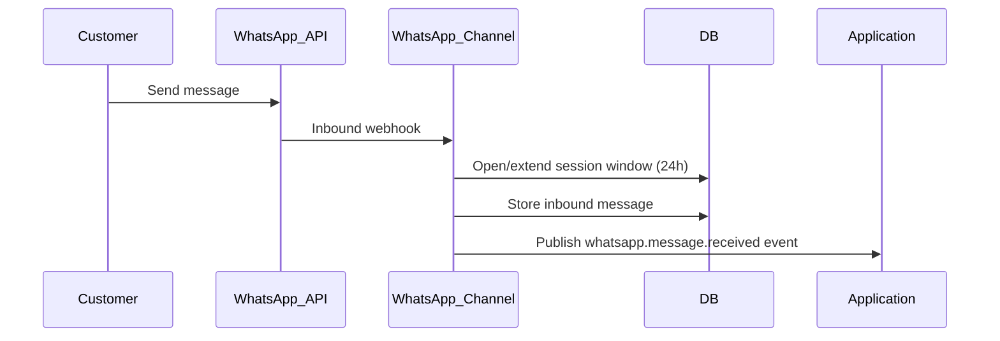

# Notification WhatsApp Channel

> **Volume:** 2 | **Chapter ID:** v2-46 | **Status:** reviewed

## Purpose

The **WhatsApp Channel** delivers messages through [Notification Platform](15-notification-platform.md) via the WhatsApp Business API. It supports approved template messages (required for business-initiated conversations), session messages within 24-hour customer service windows, media attachments, and interactive buttons. Applications trigger WhatsApp sends through notification events — they never integrate with Meta's API directly.

## Architecture



WhatsApp requires pre-approved message templates for outbound business-initiated messages. Session messages are permitted only within an active 24-hour customer window.

## Responsibilities

### In Scope

- WhatsApp Business API integration (Cloud API or BSP partner)
- Approved template message submission and status tracking
- Template variable binding (header, body, footer, buttons)
- Session window tracking — 24-hour customer care window
- Inbound message webhook processing (customer replies)
- Media message delivery: images, documents, video via File Management
- Interactive messages: reply buttons, call-to-action URLs
- Opt-in verification before first business-initiated message
- Delivery and read receipt tracking
- Per-tenant WhatsApp Business Account (WABA) configuration

### Out of Scope

- WhatsApp template approval workflow with Meta (operational process)
- Chatbot conversation flows (application layer on inbound webhooks)
- SMS fallback ([SMS Channel](43-notification-sms-channel.md))
- Personal WhatsApp — business API only

## API Design

### Tenant Configuration

| Method | Path | Description |
|--------|------|-------------|
| GET | /whatsapp/v1/config | WABA and phone number configuration |
| PUT | /whatsapp/v1/config | Update credentials and phone number ID |
| GET | /whatsapp/v1/templates | List approved templates |
| POST | /whatsapp/v1/templates/sync | Sync template status from Meta |

### Internal Send Interface

| Method | Path | Description |
|--------|------|-------------|
| POST | /internal/whatsapp/send | Send template or session message |
| POST | /internal/whatsapp/webhook | Meta inbound and status webhook |

### Template Message Send

```json
{
  "deliveryId": "delivery-uuid",
  "tenantId": "tenant-uuid",
  "recipientPhone": "+14155551234",
  "templateName": "order_shipped",
  "languageCode": "en",
  "components": [
    {
      "type": "body",
      "parameters": [
        { "type": "text", "text": "ORD-12345" },
        { "type": "text", "text": "Aug 5" }
      ]
    },
    {
      "type": "button",
      "sub_type": "url",
      "index": 0,
      "parameters": [
        { "type": "text", "text": "track/abc123" }
      ]
    }
  ]
}
```

### Session Message (within 24h window)

```json
{
  "deliveryId": "delivery-uuid",
  "recipientPhone": "+14155551234",
  "messageType": "text",
  "body": "Your support ticket #4521 has been updated.",
  "sessionWindowId": "window-uuid"
}
```

### Inbound Webhook (customer reply)

```json
{
  "from": "+14155551234",
  "messageId": "wamid.xxx",
  "timestamp": "2026-08-01T10:00:00Z",
  "type": "text",
  "text": { "body": "Thank you" }
}
```

Follow [API Standards](../Volume-1-Foundation/18-api-standards.md).

## Database Design

| Table | Key Columns | Purpose |
|-------|-------------|---------|
| `wa_deliveries` | `delivery_id`, `tenant_id`, `phone_e164`, `template_name`, `status` | Outbound tracking |
| `wa_delivery_events` | `delivery_id`, `event_type`, `meta_status`, `occurred_at` | Sent/delivered/read |
| `wa_tenant_config` | `tenant_id`, `waba_id`, `phone_number_id`, `credentials_ref` | Account config |
| `wa_templates` | `tenant_id`, `template_name`, `language`, `status`, `components_json` | Approved templates cache |
| `wa_session_windows` | `phone_e164`, `tenant_id`, `opened_at`, `expires_at` | 24h window tracking |
| `wa_opt_ins` | `tenant_id`, `phone_e164`, `opted_in_at`, `source` | Consent records |
| `wa_inbound_messages` | `message_id`, `phone_e164`, `payload_json`, `received_at` | Inbound log |

## Folder Structure

```text
services/notification-platform/
└── channels/
    └── whatsapp/
        ├── templates/      # Template sync and binding
        ├── session/        # 24h window tracker
        ├── sender/
        ├── inbound/        # Webhook handler
        ├── media/          # File Management adapter
        ├── optin/
        └── tests/
```

## Sequence Diagrams

### Template Message Send



### Customer Reply Opens Session Window



## Extension Points

- **BSP provider adapters** — Twilio, MessageBird, direct Cloud API
- **Interactive list messages** — menu selection for chatbot flows
- **Location and contact sharing** — structured message types
- **Template auto-sync** — scheduled job to refresh approval status from Meta

## Integration

- **Invoked by:** Notification Platform
- **Depends on:** Template Engine, File Management, Configuration Service
- **Events published:** `notification.whatsapp.sent`, `notification.whatsapp.delivered`, `notification.whatsapp.read`, `whatsapp.message.received`
- **Related:** [SMS Channel](43-notification-sms-channel.md) for text-only fallback

## Best Practices

1. Verify opt-in before any business-initiated template message
2. Sync template approval status regularly — do not send unapproved templates
3. Track session windows — use session messages only within 24h of customer contact
4. Map template variables exactly to approved template structure
5. Process delivery/read receipts to update notification status
6. Store inbound messages for customer service context

## Anti-Patterns

| Anti-Pattern | Why It Fails | Preferred Approach |
|--------------|--------------|-------------------|
| Sending without approved template | Meta API rejection | Template sync + approved only |
| Ignoring opt-in requirements | Account suspension | Opt-in verification |
| Session message outside 24h window | API error 470 | Check session window |
| Free-form marketing text as template | Template rejection | Pre-approved template submission |
| Direct Meta API in application | No audit, multi-tenant credential risk | WhatsApp Channel |

## Related Chapters

- [Previous: Notification In-App Channel](45-notification-in-app-channel.md)
- [Next: Scheduler Cron Jobs](47-scheduler-cron-jobs.md)
- [Notification Platform](15-notification-platform.md)
- [Template Engine](16-template-engine.md)
- [EPB Glossary](../docs/GLOSSARY.md)

---

*Enterprise Platform Blueprint — Volume 2*
