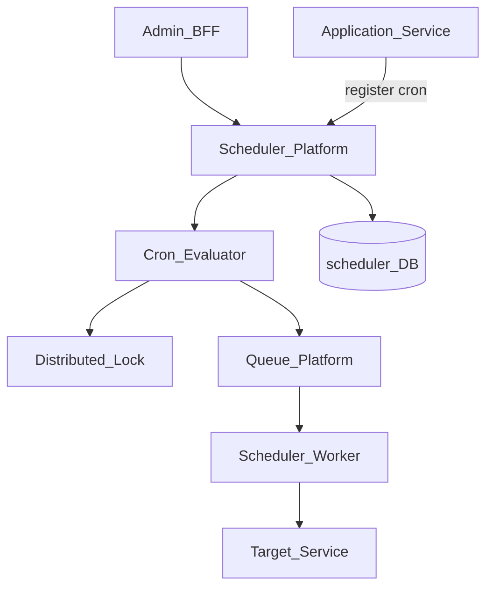
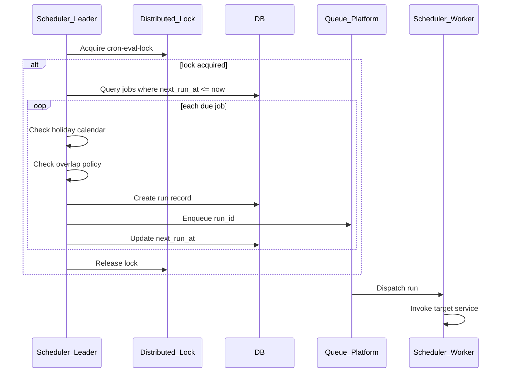
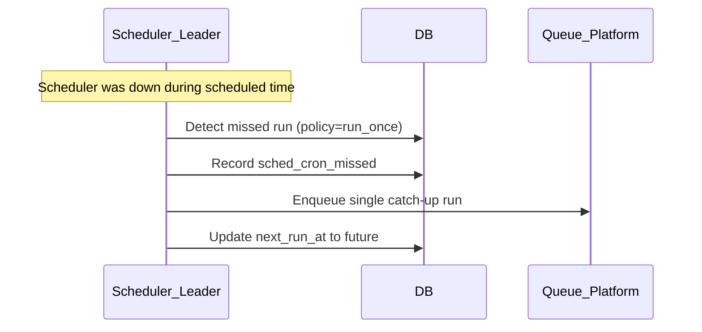

# Scheduler Cron Jobs

> **Volume:** 2 | **Chapter ID:** v2-47 | **Status:** reviewed

## Purpose

**Scheduler Cron Jobs** defines how recurring time-based work is registered, evaluated, and dispatched within [Scheduler Platform](17-scheduler-platform.md). Cron expressions, timezone handling, missed-run policies, and distributed leader election ensure exactly-once scheduling intent across a cluster of scheduler workers. Applications register jobs with cron schedules — they never run internal `setInterval` or OS crontab for platform-orchestrated work.

## Architecture



Only the leader scheduler instance evaluates cron expressions each tick. Job execution is dispatched to workers via Queue Platform.

## Responsibilities

### In Scope

- Standard cron expression parsing (minute, hour, day, month, weekday)
- Extended syntax: `@daily`, `@hourly`, `@weekly`, last-day-of-month
- Timezone-aware scheduling — evaluate in job's configured IANA timezone
- Missed run policy: `skip`, `run_once`, `run_all` (catch up)
- Overlap policy: `allow`, `skip`, `cancel_previous`
- Cron job enable/disable without deletion
- Next-run preview API for admin validation
- Holiday calendar integration — skip runs on tenant non-business days
- Maximum concurrent runs per job definition
- Cron job change audit trail

### Out of Scope

- One-time scheduled jobs (Scheduler Platform `one_time` type)
- Retry backoff logic ([Scheduler Retry Processing](48-scheduler-retry-processing.md))
- Business logic in job handlers (target service responsibility)
- Interval-based polling jobs (use `interval` job type on parent platform)

## API Design

### Base Path

`/scheduler/v1/cron`

| Method | Path | Description |
|--------|------|-------------|
| POST | /jobs | Register cron job |
| GET | /jobs | List cron jobs |
| GET | /jobs/{jobId} | Get cron job detail |
| PUT | /jobs/{jobId} | Update schedule or target |
| PATCH | /jobs/{jobId}/status | Enable or disable |
| DELETE | /jobs/{jobId} | Soft-delete |
| POST | /jobs/{jobId}/trigger | Manual immediate run |
| GET | /jobs/{jobId}/next-runs | Preview next N execution times |
| POST | /validate | Validate cron expression |

### Register Cron Job

```json
{
  "tenantId": "tenant-uuid",
  "name": "nightly-aggregation",
  "schedule": "0 2 * * *",
  "timezone": "America/New_York",
  "target": {
    "type": "http",
    "service": "analytics-service",
    "path": "/internal/v1/aggregate",
    "method": "POST"
  },
  "policies": {
    "missedRun": "run_once",
    "overlap": "skip",
    "maxConcurrent": 1
  },
  "retryPolicy": {
    "maxAttempts": 3,
    "backoffSeconds": [60, 300, 900]
  },
  "holidayCalendarId": "tenant-holidays-2026"
}
```

### Validate Cron Expression

Request: `{ "schedule": "0 2 * * *", "timezone": "UTC" }`

Response:

```json
{
  "valid": true,
  "humanReadable": "At 02:00 every day",
  "nextRuns": [
    "2026-08-02T02:00:00Z",
    "2026-08-03T02:00:00Z",
    "2026-08-04T02:00:00Z"
  ]
}
```

Follow [API Standards](../Volume-1-Foundation/18-api-standards.md).

## Database Design

Extends [Scheduler Platform](17-scheduler-platform.md) schema with cron-specific columns:

| Table | Key Columns | Purpose |
|-------|-------------|---------|
| `sched_cron_jobs` | `job_id`, `schedule`, `timezone`, `missed_run_policy`, `overlap_policy` | Cron-specific config |
| `sched_cron_eval_log` | `evaluated_at`, `leader_id`, `due_jobs_count` | Leader evaluation audit |
| `sched_cron_missed` | `job_id`, `scheduled_at`, `policy_action`, `resolved_at` | Missed run tracking |
| `sched_holiday_calendars` | `calendar_id`, `tenant_id`, `dates_json` | Skip dates |
| `sched_cron_locks` | `lock_key`, `holder_id`, `expires_at` | Leader election |

Indexes: `(next_run_at)` on cron jobs for efficient due-job polling.

## Folder Structure

```text
services/scheduler/
├── domain/
│   └── cron/
│       ├── parser/         # Cron expression engine
│       ├── evaluator/      # Due job detection
│       ├── timezone/       # IANA timezone conversion
│       ├── missed/         # Missed run resolver
│       ├── overlap/        # Concurrent run policy
│       └── holiday/        # Calendar skip logic
├── worker/
└── tests/
```

## Sequence Diagrams

### Cron Tick Evaluation



### Missed Run Catch-Up



## Extension Points

- **Custom cron fields** — seconds precision for sub-minute schedules
- **Dependency chains** — job B runs only after job A completes
- **Dynamic schedule** — schedule read from Configuration Service at eval time
- **Maintenance windows** — global pause of non-critical cron jobs

## Integration

- **Part of:** [Scheduler Platform](17-scheduler-platform.md)
- **Depends on:** Queue Platform, Distributed Lock, Configuration Service
- **Works with:** [Scheduler Retry Processing](48-scheduler-retry-processing.md)
- **Events published:** `scheduler.cron.triggered`, `scheduler.cron.missed`, `scheduler.cron.skipped_overlap`

## Best Practices

1. Always specify timezone — never assume UTC for business schedules
2. Use `overlap: skip` for non-idempotent jobs
3. Preview next runs before enabling new cron jobs in production
4. Set `maxConcurrent: 1` for aggregation and ETL jobs
5. Register holiday calendars for tenant-specific non-business days
6. Use descriptive job names and idempotency keys

## Anti-Patterns

| Anti-Pattern | Why It Fails | Preferred Approach |
|--------------|--------------|-------------------|
| OS crontab per application server | Missed during deploys, no visibility | Scheduler Platform cron jobs |
| UTC-only scheduling for local business jobs | Runs at wrong local time | IANA timezone per job |
| Allow overlap on aggregation jobs | Duplicate processing | overlap: skip |
| No missed run policy | Silent skip or duplicate catch-up | Explicit missedRun policy |
| Sub-minute cron for heavy jobs | Worker pool exhaustion | interval type or queue-based |

## Related Chapters

- [Previous: Notification WhatsApp Channel](46-notification-whatsapp-channel.md)
- [Next: Scheduler Retry Processing](48-scheduler-retry-processing.md)
- [Scheduler Platform](17-scheduler-platform.md)
- [Queue Platform](28-queue-platform.md)
- [EPB Glossary](../docs/GLOSSARY.md)

---

*Enterprise Platform Blueprint — Volume 2*
