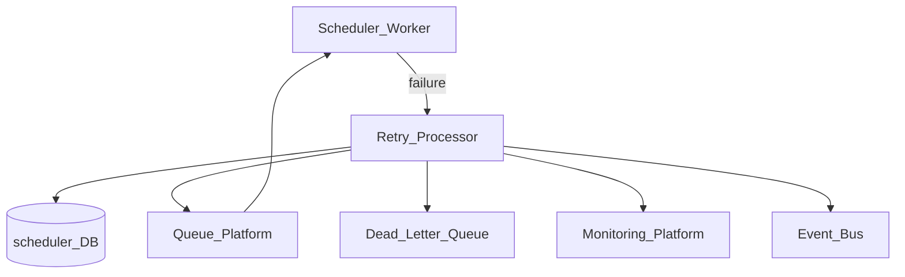
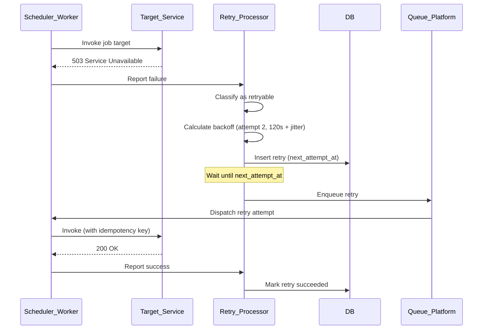
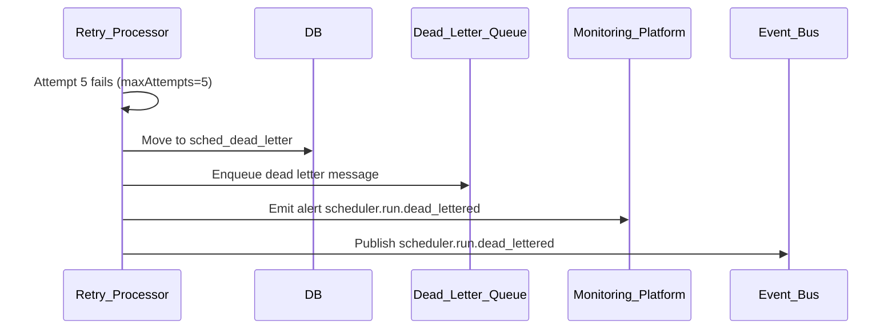

# Scheduler Retry Processing

> **Volume:** 2 | **Chapter ID:** v2-48 | **Status:** reviewed

## Purpose

**Scheduler Retry Processing** orchestrates automatic retry of failed job runs, HTTP target invocations, and asynchronous operations within [Scheduler Platform](17-scheduler-platform.md). It implements exponential backoff, jitter, maximum attempt limits, dead-letter routing, and manual replay — ensuring transient failures recover without human intervention while permanent failures surface clearly.

## Architecture



Failed runs enter the retry queue with computed `next_attempt_at`. Exhausted retries route to dead-letter queue via [Queue Dead Letter Handling](61-queue-dead-letter-handling.md).

## Responsibilities

### In Scope

- Configurable retry policies per job: max attempts, backoff intervals, jitter
- Retryable vs non-retryable error classification
- Exponential backoff with optional cap and jitter
- Retry queue polling and dispatch at `next_attempt_at`
- Dead-letter routing after max attempts exhausted
- Manual retry and replay of failed runs
- Retry attempt history with error messages per attempt
- Circuit breaker — pause retries when target service is unhealthy
- Idempotency enforcement on retried invocations
- Alert emission to Monitoring Platform on dead-letter

### Out of Scope

- Initial job scheduling ([Scheduler Cron Jobs](47-scheduler-cron-jobs.md))
- Queue message retry for non-scheduler queues (Queue Platform concern)
- Business compensation logic (application handler responsibility)
- Infinite retry without policy

## API Design

### Base Path

`/scheduler/v1/retries`

| Method | Path | Description |
|--------|------|-------------|
| GET | /pending | List pending retries (admin) |
| GET | /{retryId} | Get retry detail and attempt history |
| POST | /{retryId}/retry-now | Force immediate retry |
| POST | /runs/{runId}/retry | Retry failed run from beginning |
| DELETE | /{retryId} | Cancel pending retry |
| GET | /dead-letter | List dead-lettered runs |
| POST | /dead-letter/{runId}/replay | Replay from dead letter |

### Retry Policy Configuration (on job definition)

```json
{
  "retryPolicy": {
    "maxAttempts": 5,
    "backoffStrategy": "exponential",
    "initialDelaySeconds": 60,
    "maxDelaySeconds": 3600,
    "multiplier": 2.0,
    "jitterPercent": 20,
    "retryableStatusCodes": [408, 429, 500, 502, 503, 504],
    "nonRetryableErrorCodes": ["VALIDATION_FAILED", "FORBIDDEN", "NOT_FOUND"]
  }
}
```

### Retry Record

```json
{
  "retryId": "retry-uuid",
  "runId": "run-uuid",
  "jobId": "job-uuid",
  "attempt": 3,
  "maxAttempts": 5,
  "status": "pending",
  "nextAttemptAt": "2026-08-01T10:05:00Z",
  "lastError": {
    "code": "SERVICE_UNAVAILABLE",
    "message": "Target returned 503",
    "retryable": true
  },
  "attemptHistory": [
    { "attempt": 1, "failedAt": "2026-08-01T09:00:00Z", "error": "503" },
    { "attempt": 2, "failedAt": "2026-08-01T09:02:00Z", "error": "503" }
  ]
}
```

Follow [API Standards](../Volume-1-Foundation/18-api-standards.md).

## Database Design

| Table | Key Columns | Purpose |
|-------|-------------|---------|
| `sched_retry_queue` | `retry_id`, `run_id`, `attempt`, `next_attempt_at`, `status` | Pending retries |
| `sched_retry_attempts` | `retry_id`, `attempt`, `started_at`, `finished_at`, `error_json` | Attempt log |
| `sched_retry_policies` | `job_id`, `policy_json` | Per-job policy |
| `sched_dead_letter` | `run_id`, `job_id`, `final_error`, `dead_lettered_at` | Exhausted retries |
| `sched_circuit_breaker` | `target_key`, `state`, `failure_count`, `opened_at` | Target health |

Retry statuses: `pending`, `in_progress`, `succeeded`, `dead_lettered`, `cancelled`.

Index: `(next_attempt_at, status)` for retry poller.

## Folder Structure

```text
services/scheduler/
├── domain/
│   └── retry/
│       ├── classifier/     # Retryable vs permanent
│       ├── backoff/        # Delay calculation + jitter
│       ├── dispatcher/     # Retry queue poller
│       ├── deadletter/     # DLQ routing
│       └── circuit/        # Circuit breaker
├── worker/
└── tests/
```

## Sequence Diagrams

### Failed Run Retry with Backoff



### Dead Letter After Max Attempts



## Extension Points

- **Custom classifiers** — application-specific retryable error codes
- **Retry budgets** — max retries per tenant per hour
- **Escalation chains** — notify on attempt 3, dead-letter on attempt 5
- **Replay transformers** — modify payload before dead-letter replay

## Integration

- **Part of:** [Scheduler Platform](17-scheduler-platform.md)
- **Depends on:** Queue Platform, [Queue Dead Letter Handling](61-queue-dead-letter-handling.md), Monitoring Platform
- **Events published:** `scheduler.retry.scheduled`, `scheduler.retry.succeeded`, `scheduler.run.dead_lettered`
- **Works with:** [Scheduler Cron Jobs](47-scheduler-cron-jobs.md)

## Best Practices

1. Classify errors explicitly — never retry validation or authorization failures
2. Add jitter to backoff — prevent thundering herd on recovery
3. Pass idempotency key on every retried target invocation
4. Set reasonable maxAttempts — default 3-5 for most jobs
5. Alert on dead-letter — silent failure is worse than noisy alert
6. Use circuit breaker when target service has sustained outage

## Anti-Patterns

| Anti-Pattern | Why It Fails | Preferred Approach |
|--------------|--------------|-------------------|
| Immediate infinite retry | Overwhelms failing service | Backoff + max attempts |
| Retrying 400 validation errors | Wastes resources, never succeeds | Non-retryable classifier |
| No jitter on backoff | Synchronized retry storms | jitterPercent config |
| Dead letter without alert | Failures go unnoticed | Monitoring integration |
| Retry without idempotency | Duplicate side effects | Idempotency key on target |

## Related Chapters

- [Previous: Scheduler Cron Jobs](47-scheduler-cron-jobs.md)
- [Next: Roster Appointments](49-roster-appointments.md)
- [Scheduler Platform](17-scheduler-platform.md)
- [Queue Dead Letter Handling](61-queue-dead-letter-handling.md)
- [EPB Glossary](../docs/GLOSSARY.md)

---

*Enterprise Platform Blueprint — Volume 2*
