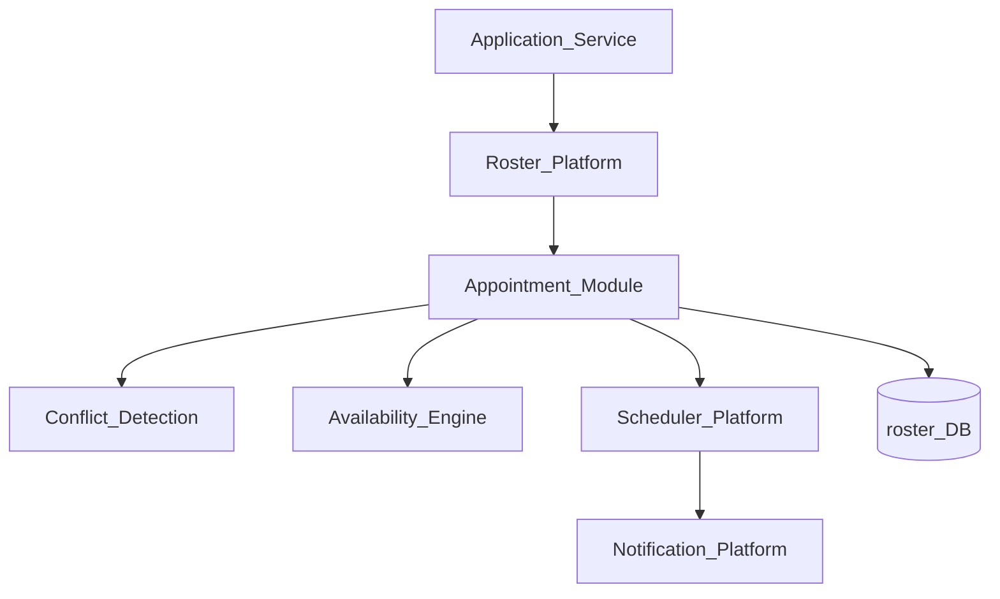
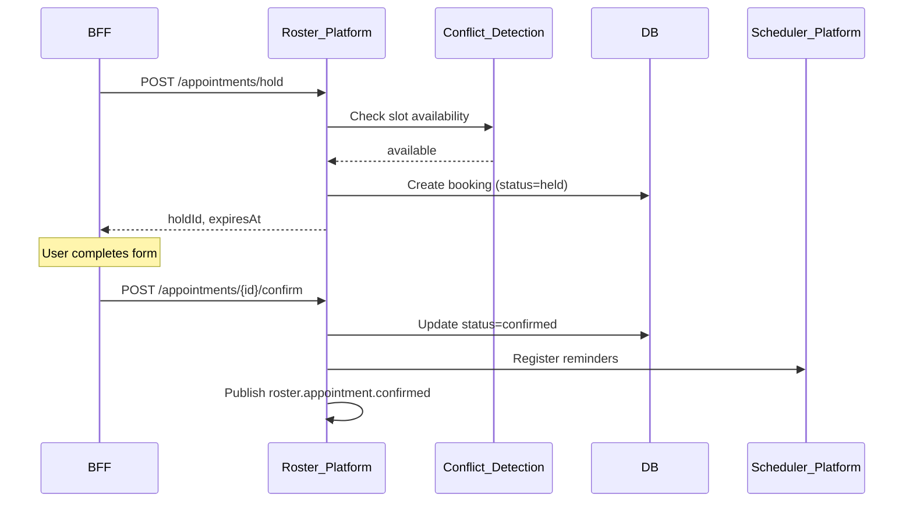
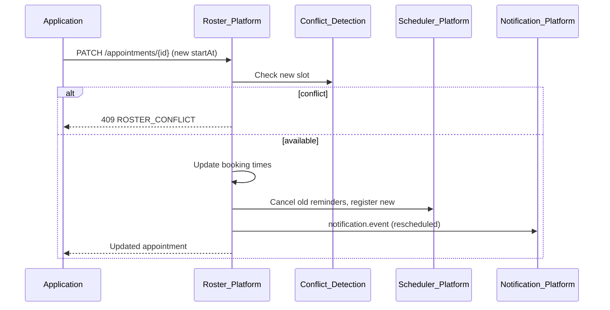

# Roster Appointments

> **Volume:** 2 | **Chapter ID:** v2-49 | **Status:** reviewed

## Purpose

**Roster Appointments** is the booking type within [Roster Platform](18-roster-platform.md) for one-to-one and one-to-few time slots between a resource (person, room, equipment) and one or more participants. It covers the full appointment lifecycle — hold, confirm, reschedule, cancel, no-show — with reminder scheduling and application entity linkage. Applications create appointments through Roster APIs; they never maintain parallel calendar tables.

## Architecture



Appointments are a `bookingType: appointment` specialization with hold semantics and participant roles.

## Responsibilities

### In Scope

- Appointment creation with immediate confirm or two-phase hold→confirm
- Participant roles: host, attendee, optional, observer
- Resource assignment: primary resource + optional secondary (room, equipment)
- Duration and buffer time between consecutive appointments
- Reschedule with conflict re-check and participant notification
- Cancellation with reason codes and slot release
- No-show marking with configurable grace period
- Reminder registration via Scheduler Platform
- Link to application entity via metadata (`sourceEntityId`)
- Appointment status history and audit trail

### Out of Scope

- Multi-participant meetings with complex agendas (use `meeting` booking type)
- Class sessions with capacity ([Roster Platform](18-roster-platform.md) `class` type)
- Payment for appointment slots
- Video conferencing link generation (application adapter)

## API Design

### Base Path

`/roster/v1/appointments`

| Method | Path | Description |
|--------|------|-------------|
| GET | / | List appointments (filter by resource, participant, date range) |
| GET | /{id} | Get appointment detail |
| POST | / | Create and confirm appointment |
| POST | /hold | Create temporary hold (expires in N minutes) |
| POST | /{id}/confirm | Confirm held appointment |
| PATCH | /{id} | Reschedule or update participants |
| DELETE | /{id} | Cancel appointment |
| POST | /{id}/no-show | Mark as no-show |
| GET | /{id}/history | Status change history |

### Create Appointment

```json
{
  "tenantId": "tenant-uuid",
  "resourceIds": ["provider-uuid"],
  "participantIds": [
    { "userId": "user-uuid", "role": "attendee" }
  ],
  "startAt": "2026-08-15T10:00:00Z",
  "endAt": "2026-08-15T10:30:00Z",
  "timezone": "America/New_York",
  "bufferBeforeMinutes": 0,
  "bufferAfterMinutes": 15,
  "metadata": {
    "sourceEntityType": "consultation",
    "sourceEntityId": "entity-uuid",
    "notes": "Initial session"
  },
  "reminders": [
    { "offsetMinutes": 1440, "channels": ["email"] },
    { "offsetMinutes": 30, "channels": ["push", "in-app"] }
  ]
}
```

### Hold Request

```json
{
  "resourceIds": ["provider-uuid"],
  "startAt": "2026-08-15T10:00:00Z",
  "endAt": "2026-08-15T10:30:00Z",
  "holdDurationMinutes": 15
}
```

Hold expires automatically; slot returns to availability if not confirmed.

### Appointment Statuses

| Status | Description |
|--------|-------------|
| `held` | Temporary reservation, not yet confirmed |
| `confirmed` | Active appointment |
| `rescheduled` | Transitional during reschedule |
| `cancelled` | Cancelled by host or attendee |
| `completed` | Past appointment, attended |
| `no_show` | Participant did not attend |

Follow [API Standards](../Volume-1-Foundation/18-api-standards.md).

## Database Design

Uses [Roster Platform](18-roster-platform.md) tables with appointment-specific extensions:

| Table | Key Columns | Purpose |
|-------|-------------|---------|
| `roster_bookings` | `booking_id`, `booking_type=appointment`, `status`, `start_at`, `end_at` | Appointment header |
| `roster_booking_participants` | `booking_id`, `participant_id`, `role` | Attendees and host |
| `roster_booking_resources` | `booking_id`, `resource_id`, `is_primary` | Assigned resources |
| `roster_holds` | `hold_id`, `booking_id`, `expires_at` | Hold expiration |
| `roster_appointment_buffers` | `booking_id`, `buffer_before_min`, `buffer_after_min` | Gap between slots |
| `roster_booking_history` | `booking_id`, `from_status`, `to_status`, `reason`, `changed_at` | Lifecycle audit |

## Folder Structure

```text
services/roster/
├── domain/
│   └── appointment/
│       ├── create/         # Create and confirm
│       ├── hold/           # Two-phase booking
│       ├── reschedule/     # Move with conflict check
│       ├── cancel/         # Release slot
│       ├── noshow/         # Grace period logic
│       └── reminder/       # Scheduler job registration
└── tests/
```

## Sequence Diagrams

### Hold and Confirm Flow



### Reschedule with Notification



## Extension Points

- **Custom cancellation reasons** — tenant-configurable reason code list
- **No-show grace period** — minutes after start before auto no-show eligible
- **Waitlist on cancel** — promote next waitlisted participant via event
- **Recurring appointments** — RRULE series via roster_recurrence table

## Integration

- **Part of:** [Roster Platform](18-roster-platform.md)
- **Depends on:** [Roster Availability](50-roster-availability.md), [Roster Conflict Detection](51-roster-conflict-detection.md), Scheduler Platform
- **Events published:** `roster.appointment.confirmed`, `roster.appointment.rescheduled`, `roster.appointment.cancelled`, `roster.appointment.no_show`

## Best Practices

1. Use hold→confirm for multi-step booking UIs
2. Include buffer time for resources that need prep between appointments
3. Link every appointment to `sourceEntityId` for application traceability
4. Register reminders only after confirm — not on hold
5. Use idempotency keys on create to prevent duplicate bookings
6. Mark no-show only after configurable grace period past start time

## Anti-Patterns

| Anti-Pattern | Why It Fails | Preferred Approach |
|--------------|--------------|-------------------|
| App-owned appointment table | No conflict with other apps | Roster appointment APIs |
| Confirm without conflict check | Double-booked resources | Server-side conflict detection |
| Direct reminder emails | Bypasses preferences | Scheduler + Notification chain |
| Infinite holds | Blocks availability | holdDurationMinutes with auto-expire |
| Reschedule without canceling old reminders | Duplicate notifications | Reminder replacement on reschedule |

## Related Chapters

- [Previous: Scheduler Retry Processing](48-scheduler-retry-processing.md)
- [Next: Roster Availability](50-roster-availability.md)
- [Roster Platform](18-roster-platform.md)
- [Roster Conflict Detection](51-roster-conflict-detection.md)
- [EPB Glossary](../docs/GLOSSARY.md)

---

*Enterprise Platform Blueprint — Volume 2*
