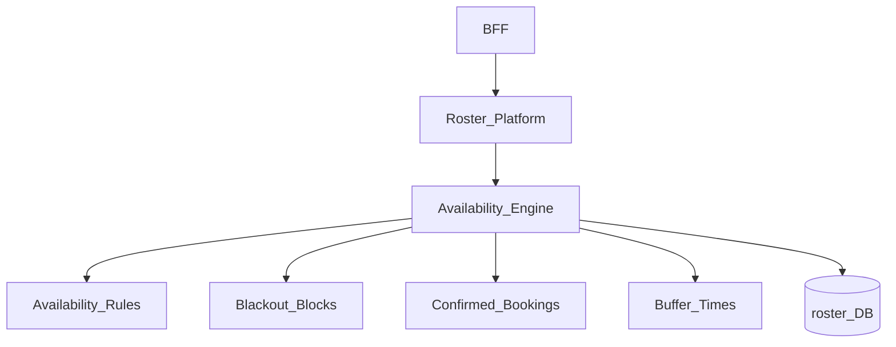
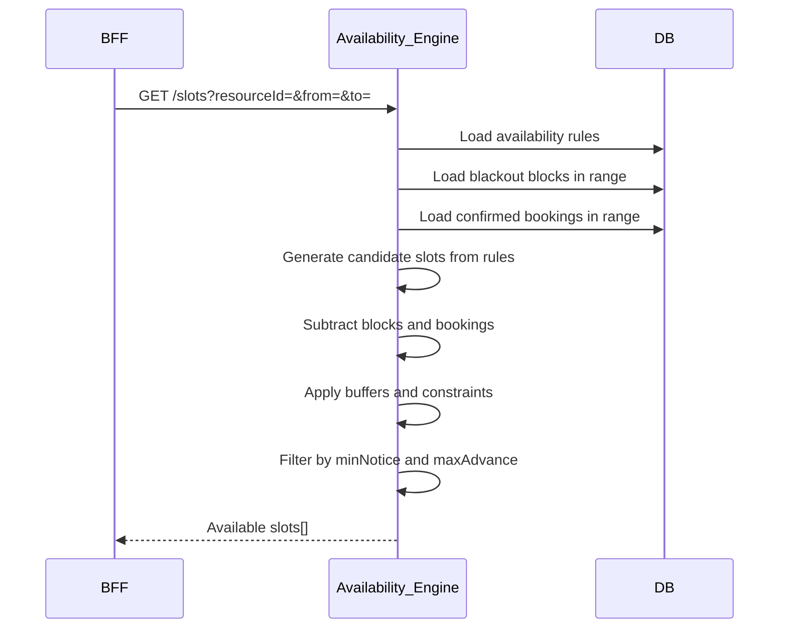
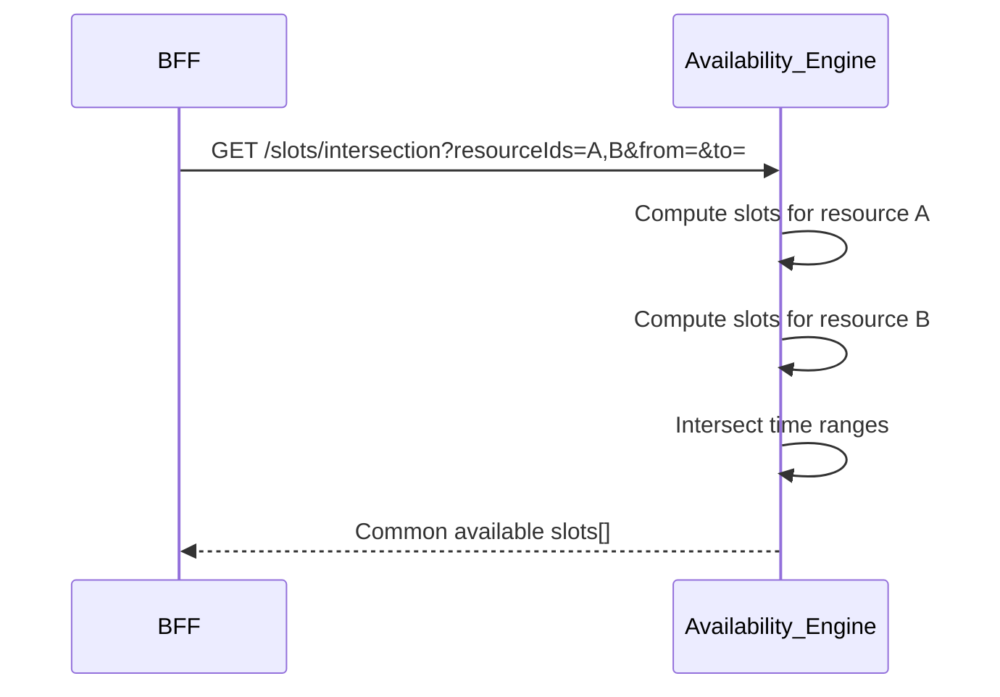

# Roster Availability

> **Volume:** 2 | **Chapter ID:** v2-50 | **Status:** reviewed

## Purpose

**Roster Availability** computes when schedulable resources are open for booking within [Roster Platform](18-roster-platform.md). It combines recurring availability rules, blackout blocks, existing bookings, buffer times, and capacity limits to generate bookable time slots. Applications query availability before presenting slot pickers — they never calculate open times from raw schedule data.

## Architecture



The availability engine is read-heavy and cache-friendly. Slot computation runs on each query with optional short-TTL cache per resource-date range.

## Responsibilities

### In Scope

- Recurring weekly availability rules per resource (e.g., Mon-Fri 9:00-17:00)
- Effective date ranges on rules — seasonal schedule changes
- Blackout blocks: maintenance, holidays, personal time off
- Slot generation at configurable granularity (15, 30, 60 minutes)
- Capacity-aware slots — resources with capacity > 1
- Buffer time subtraction around existing bookings
- Multi-resource availability intersection (find times when A and B are both free)
- Timezone conversion for display — store UTC, query with local context
- Minimum notice period — no slots within N hours of now
- Maximum advance booking window

### Out of Scope

- Booking creation ([Roster Appointments](49-roster-appointments.md))
- Conflict detection on write ([Roster Conflict Detection](51-roster-conflict-detection.md))
- External calendar sync (optional adapter, not core)
- AI-optimized slot suggestions

## API Design

### Base Path

`/roster/v1/availability`

| Method | Path | Description |
|--------|------|-------------|
| GET | /slots | Query open slots for resource(s) and date range |
| GET | /slots/intersection | Slots when all specified resources are available |
| PUT | /resources/{id}/rules | Set recurring availability rules |
| GET | /resources/{id}/rules | Get current rules |
| POST | /blocks | Create blackout block |
| DELETE | /blocks/{id} | Remove blackout block |
| GET | /blocks | List blocks for resource and date range |
| POST | /preview | Preview slot generation with hypothetical booking |

### Slot Query

```http
GET /roster/v1/availability/slots?resourceIds=uuid-1&from=2026-08-15&to=2026-08-22&slotDurationMinutes=30&timezone=America/New_York
```

### Slot Response

```json
{
  "resourceId": "uuid-1",
  "slots": [
    {
      "startAt": "2026-08-15T13:00:00Z",
      "endAt": "2026-08-15T13:30:00Z",
      "localStart": "2026-08-15T09:00:00-04:00",
      "capacityRemaining": 1
    },
    {
      "startAt": "2026-08-15T13:30:00Z",
      "endAt": "2026-08-15T14:00:00Z",
      "localStart": "2026-08-15T09:30:00-04:00",
      "capacityRemaining": 1
    }
  ],
  "computedAt": "2026-08-01T10:00:00Z"
}
```

### Availability Rules Request

```json
{
  "resourceId": "uuid-1",
  "timezone": "America/New_York",
  "effectiveFrom": "2026-01-01",
  "effectiveTo": null,
  "rules": [
    { "dayOfWeek": 1, "startTime": "09:00", "endTime": "17:00" },
    { "dayOfWeek": 2, "startTime": "09:00", "endTime": "17:00" },
    { "dayOfWeek": 3, "startTime": "09:00", "endTime": "12:00" }
  ],
  "constraints": {
    "minNoticeHours": 2,
    "maxAdvanceDays": 90,
    "slotDurationMinutes": 30,
    "bufferBetweenMinutes": 15
  }
}
```

Follow [API Standards](../Volume-1-Foundation/18-api-standards.md).

## Database Design

| Table | Key Columns | Purpose |
|-------|-------------|---------|
| `roster_availability_rules` | `resource_id`, `day_of_week`, `start_time`, `end_time`, `effective_from` | Recurring windows |
| `roster_availability_blocks` | `resource_id`, `start_at`, `end_at`, `block_type`, `reason` | Blackouts |
| `roster_availability_constraints` | `resource_id`, `min_notice_hours`, `max_advance_days`, `slot_duration` | Booking constraints |
| `roster_resource_capacity` | `resource_id`, `max_capacity`, `current_default` | Capacity limits |

Block types: `maintenance`, `holiday`, `time_off`, `custom`.

Slot computation reads from `roster_bookings` (confirmed) — see Roster Platform schema.

## Folder Structure

```text
services/roster/
├── domain/
│   └── availability/
│       ├── rules/          # Rule CRUD and validation
│       ├── blocks/         # Blackout management
│       ├── generator/      # Slot computation algorithm
│       ├── intersection/   # Multi-resource merge
│       ├── constraints/    # Notice and advance limits
│       └── cache/          # Short-TTL slot cache
└── tests/
```

## Sequence Diagrams

### Slot Generation



### Multi-Resource Intersection



## Extension Points

- **Custom slot durations** — per booking type override
- **Capacity pools** — shared capacity across resource group
- **External calendar blocks** — import busy times from iCal adapter
- **Slot scoring** — rank slots by preference (morning first, etc.)

## Integration

- **Part of:** [Roster Platform](18-roster-platform.md)
- **Used by:** [Roster Appointments](49-roster-appointments.md), [Roster Conflict Detection](51-roster-conflict-detection.md)
- **Depends on:** Configuration Service (default slot duration per tenant)
- **Events consumed:** `roster.booking.confirmed`, `roster.booking.cancelled` (cache invalidation)

## Best Practices

1. Store rules in resource local timezone; convert at query boundary
2. Invalidate slot cache on booking confirm/cancel
3. Apply buffer times during generation, not just on conflict check
4. Set `minNoticeHours` to prevent last-minute unprepareable bookings
5. Use intersection API for multi-resource bookings (provider + room)
6. Return `capacityRemaining` for resources with capacity > 1

## Anti-Patterns

| Anti-Pattern | Why It Fails | Preferred Approach |
|--------------|--------------|-------------------|
| Client-side slot calculation | Wrong timezone, stale bookings | Availability API |
| Ignoring buffer times in slot list | User selects slot that conflicts | Include buffers in generation |
| No max advance limit | Bookings years ahead | maxAdvanceDays constraint |
| Caching slots too long | Shows booked slots as available | Short TTL + event invalidation |
| Rules without effective dates | Cannot handle schedule changes | effectiveFrom/effectiveTo |

## Related Chapters

- [Previous: Roster Appointments](49-roster-appointments.md)
- [Next: Roster Conflict Detection](51-roster-conflict-detection.md)
- [Roster Platform](18-roster-platform.md)
- [EPB Glossary](../docs/GLOSSARY.md)

---

*Enterprise Platform Blueprint — Volume 2*
