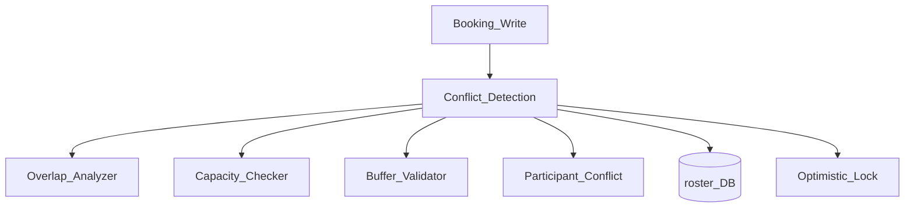
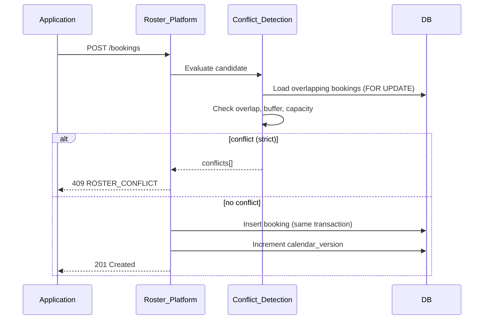
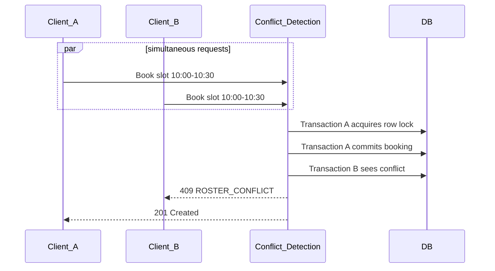

# Roster Conflict Detection

> **Volume:** 2 | **Chapter ID:** v2-51 | **Status:** reviewed

## Purpose

**Roster Conflict Detection** is the write-path gatekeeper within [Roster Platform](18-roster-platform.md) that prevents double-booking, capacity overflow, and buffer violations before any booking is committed. It evaluates temporal overlap, resource exclusivity, participant conflicts, and configurable conflict strategies. Applications call conflict check APIs before confirm and rely on server-side enforcement on every write — client-side checks alone are insufficient.

## Architecture



Conflict detection runs inside the same database transaction as booking persistence to prevent race conditions.

## Responsibilities

### In Scope

- Temporal overlap detection between candidate and existing bookings
- Resource exclusivity — one booking per resource per time (unless capacity > 1)
- Capacity counting — partial capacity consumption per slot
- Buffer time enforcement before and after existing bookings
- Participant double-booking detection across resources
- Dry-run conflict check API without persistence
- Configurable conflict strategies per booking type
- Optimistic locking on resource calendar version
- Conflict detail in structured 409 response
- Recurring series conflict check — entire series or single occurrence

### Out of Scope

- Availability slot generation ([Roster Availability](50-roster-availability.md))
- Business priority rules (e.g., VIP override) — application layer with explicit force flag
- External calendar conflict import
- Automatic conflict resolution suggestions (optional future enhancement)

## API Design

### Base Path

`/roster/v1/conflicts`

| Method | Path | Description |
|--------|------|-------------|
| POST | /check | Dry-run conflict check |
| POST | /check/batch | Check multiple candidate bookings |
| GET | /strategies | List conflict strategies for booking type |
| PUT | /strategies/{bookingType} | Configure strategy per tenant |

### Conflict Check Request

```json
{
  "tenantId": "tenant-uuid",
  "bookingType": "appointment",
  "resourceIds": ["resource-uuid"],
  "participantIds": ["user-uuid"],
  "startAt": "2026-08-15T10:00:00Z",
  "endAt": "2026-08-15T10:30:00Z",
  "bufferBeforeMinutes": 0,
  "bufferAfterMinutes": 15,
  "excludeBookingId": null,
  "strategy": "strict"
}
```

`excludeBookingId` is used during reschedule to exclude the booking being moved.

### Conflict Response (409)

```json
{
  "code": "ROSTER_CONFLICT",
  "message": "Requested slot conflicts with existing bookings.",
  "conflicts": [
    {
      "conflictType": "resource_overlap",
      "resourceId": "resource-uuid",
      "existingBookingId": "booking-uuid",
      "existingStartAt": "2026-08-15T10:00:00Z",
      "existingEndAt": "2026-08-15T10:45:00Z",
      "overlapStart": "2026-08-15T10:00:00Z",
      "overlapEnd": "2026-08-15T10:30:00Z"
    },
    {
      "conflictType": "buffer_violation",
      "resourceId": "resource-uuid",
      "existingBookingId": "booking-uuid-2",
      "requiredBufferMinutes": 15,
      "actualGapMinutes": 0
    }
  ]
}
```

### Conflict Strategies

| Strategy | Behavior |
|----------|----------|
| `strict` | Reject on any overlap or buffer violation |
| `allow_buffer` | Allow if only buffer overlap, not core time |
| `capacity_soft` | Warn but allow if capacity not exceeded (returns warning, not 409) |
| `force` | Admin override — skip check (requires elevated permission) |

Conflict types: `resource_overlap`, `capacity_exceeded`, `buffer_violation`, `participant_overlap`.

Follow [API Standards](../Volume-1-Foundation/18-api-standards.md).

## Database Design

| Table | Key Columns | Purpose |
|-------|-------------|---------|
| `roster_conflict_strategies` | `tenant_id`, `booking_type`, `strategy`, `config_json` | Per-type policy |
| `roster_calendar_versions` | `resource_id`, `version`, `updated_at` | Optimistic lock |
| `roster_conflict_log` | `booking_id`, `check_at`, `result`, `conflicts_json` | Audit of checks |

Conflict queries use indexed range scans on `roster_bookings`:

```sql
-- Conceptual: bookings overlapping candidate range
WHERE resource_id = ? AND status IN ('held','confirmed')
  AND start_at < ?candidate_end AND end_at > ?candidate_start
```

Composite index: `(resource_id, start_at, end_at, status)`.

## Folder Structure

```text
services/roster/
├── domain/
│   └── conflict/
│       ├── overlap/        # Interval intersection
│       ├── capacity/       # Count-based check
│       ├── buffer/         # Gap validation
│       ├── participant/    # Cross-resource user check
│       ├── strategy/       # Strategy resolver
│       └── lock/           # Optimistic concurrency
└── tests/
```

## Sequence Diagrams

### Conflict Check on Create



### Concurrent Booking Race



## Extension Points

- **Custom conflict rules** — plugin per resource type
- **Conflict suggestions** — return nearest available slots on 409
- **Soft warnings** — capacity_soft strategy returns 200 with warnings array
- **Series conflict scope** — check all occurrences or single instance

## Integration

- **Part of:** [Roster Platform](18-roster-platform.md)
- **Invoked by:** All booking write operations, [Roster Appointments](49-roster-appointments.md)
- **Works with:** [Roster Availability](50-roster-availability.md) (read path vs write path)
- **Events published:** `roster.conflict.detected` (optional audit sampling)

## Best Practices

1. Always run conflict check in the same transaction as booking insert
2. Use `FOR UPDATE` or equivalent row lock on resource calendar
3. Call dry-run `/conflicts/check` in UI before submit — but never rely on it alone
4. Set `excludeBookingId` on reschedule to avoid self-conflict
5. Default to `strict` strategy; use `force` only with admin permission
6. Include buffer times in overlap calculation, not just core slot

## Anti-Patterns

| Anti-Pattern | Why It Fails | Preferred Approach |
|--------------|--------------|-------------------|
| Client-only conflict check | Race conditions | Server-side transactional check |
| Check-then-act in separate transactions | TOCTOU double booking | Single transaction with lock |
| Ignoring buffer violations | Back-to-back bookings without prep time | Buffer validator |
| force strategy for all users | Double booking in production | Admin-only force override |
| No conflict detail in 409 | User cannot choose alternate slot | Structured conflicts array |

## Related Chapters

- [Previous: Roster Availability](50-roster-availability.md)
- [Next: Workflow State Machine](52-workflow-state-machine.md)
- [Roster Platform](18-roster-platform.md)
- [Roster Appointments](49-roster-appointments.md)
- [EPB Glossary](../docs/GLOSSARY.md)

---

*Enterprise Platform Blueprint — Volume 2*
