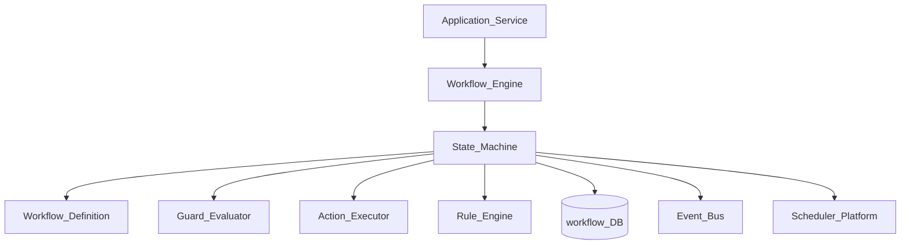
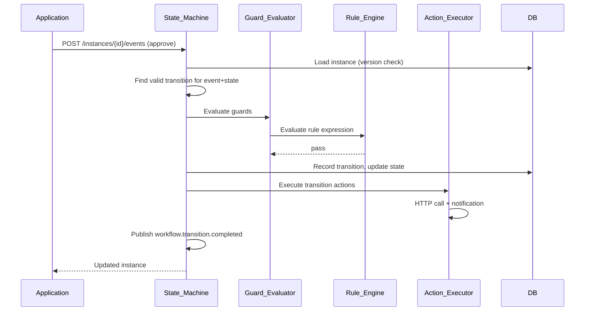
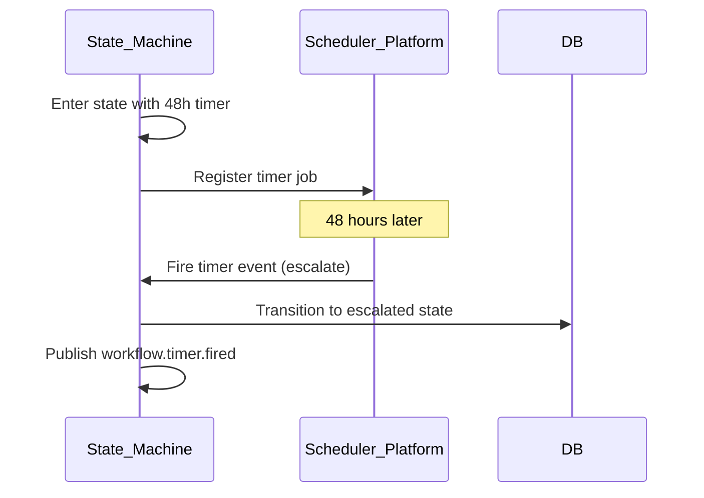

# Workflow State Machine

> **Volume:** 2 | **Chapter ID:** v2-52 | **Status:** reviewed

## Purpose

The **Workflow State Machine** is the execution engine within [Workflow Engine](19-workflow-engine.md) that drives entity lifecycle transitions through defined states, guards, and actions. It enforces valid transitions, records history, triggers side effects, and supports parallel branches and timers. Applications define workflow definitions; the state machine executes transitions — they never implement ad-hoc `status` field mutations without workflow validation.

## Architecture



Workflow definitions are versioned JSON documents. Running instances reference a specific definition version.

## Responsibilities

### In Scope

- State definitions: initial, intermediate, terminal (success, failure, cancelled)
- Transition definitions: from-state, to-state, trigger event, guard conditions
- Guard evaluation via Rule Engine or inline expressions
- Entry, exit, and transition actions (HTTP call, event publish, notification)
- Transition history with actor, timestamp, and payload
- Parallel state branches and join semantics
- Timer transitions — auto-advance after duration (via Scheduler)
- Sub-workflow invocation and completion callback
- Instance variables — typed context passed through workflow
- Optimistic concurrency on instance version

### Out of Scope

- Workflow definition authoring UI ([Screen Builder](70-screen-builder.md) may host designer)
- Business entity CRUD (application updates entity after workflow signals completion)
- Long-running human task inbox UI (BFF presents task list from workflow API)
- BPMN import/export (optional adapter)

## API Design

### Base Path

`/workflow/v1`

| Method | Path | Description |
|--------|------|-------------|
| POST | /definitions | Register workflow definition |
| GET | /definitions/{key} | Get definition by key and version |
| POST | /instances | Start workflow instance |
| GET | /instances/{id} | Get instance state and variables |
| POST | /instances/{id}/events | Fire transition event |
| GET | /instances/{id}/history | Transition history |
| POST | /instances/{id}/cancel | Cancel instance |
| GET | /tasks | List pending human tasks for user |

### Workflow Definition (excerpt)

```json
{
  "workflowKey": "entity-approval",
  "version": 3,
  "initialState": "draft",
  "states": {
    "draft": { "type": "initial" },
    "pending_review": { "type": "intermediate" },
    "approved": { "type": "terminal", "category": "success" },
    "rejected": { "type": "terminal", "category": "failure" }
  },
  "transitions": [
    {
      "from": "draft",
      "to": "pending_review",
      "event": "submit",
      "guards": [{ "expression": "entity.amount < 10000" }],
      "actions": [{ "type": "event", "eventType": "entity.submitted" }]
    },
    {
      "from": "pending_review",
      "to": "approved",
      "event": "approve",
      "guards": [{ "type": "permission", "permissionKey": "entity.approve" }],
      "actions": [
        { "type": "http", "service": "entity-service", "path": "/internal/activate" },
        { "type": "notification", "templateId": "entity-approved" }
      ]
    }
  ]
}
```

### Fire Event Request

```json
{
  "event": "approve",
  "actorId": "user-uuid",
  "payload": {
    "comment": "Approved per policy section 4.2"
  }
}
```

### Instance Response

```json
{
  "instanceId": "instance-uuid",
  "workflowKey": "entity-approval",
  "definitionVersion": 3,
  "currentState": "approved",
  "variables": {
    "entityId": "entity-uuid",
    "amount": 5000
  },
  "startedAt": "2026-08-01T09:00:00Z",
  "completedAt": "2026-08-01T10:30:00Z"
}
```

Follow [API Standards](../Volume-1-Foundation/18-api-standards.md).

## Database Design

| Table | Key Columns | Purpose |
|-------|-------------|---------|
| `wf_definitions` | `workflow_key`, `version`, `definition_json`, `status` | Versioned definitions |
| `wf_instances` | `instance_id`, `workflow_key`, `version`, `current_state`, `variables_json` | Running instances |
| `wf_transitions` | `transition_id`, `instance_id`, `from_state`, `to_state`, `event`, `actor_id` | History log |
| `wf_tasks` | `task_id`, `instance_id`, `assignee_id`, `state`, `due_at` | Human tasks |
| `wf_timers` | `timer_id`, `instance_id`, `fire_at`, `target_event`, `scheduler_job_id` | Scheduled transitions |
| `wf_action_log` | `transition_id`, `action_type`, `status`, `result_json` | Action execution audit |

Instance statuses: `running`, `completed`, `cancelled`, `failed`.

## Folder Structure

```text
services/workflow-engine/
├── domain/
│   └── state-machine/
│       ├── definition/     # Parse and validate definitions
│       ├── instance/       # Lifecycle management
│       ├── transition/     # Event processing
│       ├── guard/          # Condition evaluation
│       ├── action/         # Side effect execution
│       ├── timer/          # Scheduler integration
│       └── parallel/       # Branch and join
├── persistence/
└── tests/
```

## Sequence Diagrams

### Transition with Guard and Action



### Timer-Based Auto Transition



## Extension Points

- **Custom action types** — register new action executors
- **Dynamic assignee resolution** — rule-based task assignment
- **Compensation transitions** — rollback actions on cancel
- **Definition migration** — move running instances to new definition version

## Integration

- **Part of:** [Workflow Engine](19-workflow-engine.md)
- **Depends on:** [Rule Engine Evaluation](53-rule-engine-evaluation.md), Scheduler Platform, Event Bus, Notification Platform
- **Events published:** `workflow.instance.started`, `workflow.transition.completed`, `workflow.instance.completed`
- **Used by:** All applications with approval, onboarding, or lifecycle flows

## Best Practices

1. Version workflow definitions — never mutate in-use definitions
2. Keep instance variables minimal — reference entity by ID, not full payload
3. Make transition actions idempotent — retries may occur
4. Use permission guards for human transitions, not hardcoded user lists
5. Record full transition history for audit and debugging
6. Register timers through Scheduler — not in-memory setTimeout

## Anti-Patterns

| Anti-Pattern | Why It Fails | Preferred Approach |
|--------------|--------------|-------------------|
| Direct status field updates in app | Invalid transitions, no audit | Workflow event API |
| Mutable workflow definitions | Running instances break | Versioned definitions |
| Synchronous long actions in transition | Blocks state machine | Async action with callback |
| Guards in application only | Bypass via direct API | Server-side guard evaluation |
| Unbounded instance variables | Storage bloat, slow loads | Entity ID references |

## Related Chapters

- [Previous: Roster Conflict Detection](51-roster-conflict-detection.md)
- [Next: Rule Engine Evaluation](53-rule-engine-evaluation.md)
- [Workflow Engine](19-workflow-engine.md)
- [Rule Engine](20-rule-engine.md)
- [EPB Glossary](../docs/GLOSSARY.md)

---

*Enterprise Platform Blueprint — Volume 2*
